# 实验四 对抗生成网络（GAN）与 MNIST 手写数字

## 理论基础

### 基本介绍

**对抗生成网络**（Generative Adversarial Network, GAN）是非监督式学习的一种方法，通过两个神经网络相互博弈的方式进行学习。其中生成对抗网络由一个生成网络（**生成器**，Generator）与一个判别网络（**判别器**，Discriminator）组成。生成网络从潜在空间中随机取样作为输入，其输出结果需要尽量模仿训练集中的真实样本。判别网络的输入则为真实样本或生成网络的输出，其目的是将生成网络的输出从真实样本中尽可能分辨出来。而生成网络则要尽可能地欺骗判别网络。两个网络相互对抗、不断调整参数，最终目的是使判别网络无法判断生成网络的输出结果是否真实。

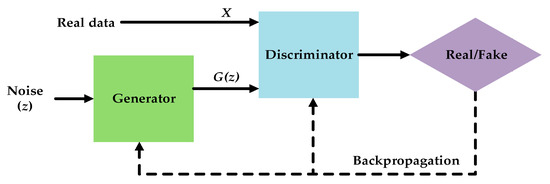

<center>图1 生成对抗网络概念图</center>

### 数学解释

原始论文中 GAN 的数学定义如下：

$$
\min_G \max_D V(D, G) = 
\mathbb{E}_{x \sim p_{\text{data}}} [\log D(x)] +
\mathbb{E}_{z \sim p_z} [\log(1 - D(G(z)))]
$$

- $p_{data}$ 表示真是数据分布；

- $p_z$ 表示潜在空间中的先验噪声分布；

- $D(x)$ 是判别器对输入 $x$ 为真实样本的概率估计；

- $G(z)$ 是生成器根据噪声 $z$ 生成的假样本。 

其中判别器的损失函数：

$$
\mathcal{L}_D = -\mathbb{E}_{x \sim p_{\text{data}}} [\log D(x)]
- \mathbb{E}_{z \sim p_z} [\log(1 - D(G(z)))]
$$

生成器的损失函数：

$$
\mathcal{L}_G = \mathbb{E}_{z \sim p_z} [\log(1 - D(G(z)))]
$$

## 实验内容

### 基础

实验环境为 Ubuntu 24.04 LTS 并使用 Miniconda 搭建 Python 环境。主要利用 PyTorch 实现机器学习部分。IDE 直接利用 Visual Studio Code 的 py 插件，利用 Jupyter Notebook 进行编写和整理材料。

部分代码参考了 Kaggle 和 Github 上的公开笔记本，整理后的代码仓库地址为 `https://github.com/UJS-IoT2023/UJS-ArtificialIntelligence`。

### 准备

导入数据集，这里直接使用 torch 的 api 提供的数据集。下载到本地，可以指定目录

```python
transform = transforms.Compose([
    transforms.ToTensor(),
    transforms.Normalize((0.5,), (0.5,))
])

dataset = datasets.MNIST(root="~/Workspace/Dataset/MNIST", train=True, download=False, transform=transform)
dataloader = DataLoader(dataset, batch_size=batch_size, shuffle=True, num_workers=2)
```

### 模型定义

生成器定义，MNIST 数据集是 28*28 的手写数字，所以可以做一个比较简单的定义即可

```python
class Generator(nn.Module):
    def __init__(self):
        super().__init__()
        self.model = nn.Sequential(
            nn.Linear(100, 256),
            nn.ReLU(),
            nn.Linear(256, 512),
            nn.ReLU(),
            nn.Linear(512, 1024),
            nn.ReLU(),
            nn.Linear(1024, 784),
            nn.Tanh(),
        )

    def forward(self, x):
        output = self.model(x)
        output = output.view(x.size(0), 1, 28, 28)
        return output
```

利用 torchviz 可以可视化计算过程


<center>图2 生成器计算图</center>

判别器定义

```python
class Discriminator(nn.Module):
    def __init__(self):
        super().__init__()
        self.model = nn.Sequential(
            nn.Linear(784, 1024),
            nn.ReLU(),
            nn.Dropout(0.3),
            nn.Linear(1024, 512),
            nn.ReLU(),
            nn.Dropout(0.3),
            nn.Linear(512, 256),
            nn.ReLU(),
            nn.Dropout(0.3),
            nn.Linear(256, 1),
            nn.Sigmoid(),
        )

    def forward(self, x):
        x = x.view(x.size(0), 784)
        output = self.model(x)
        return output
```

计算过程

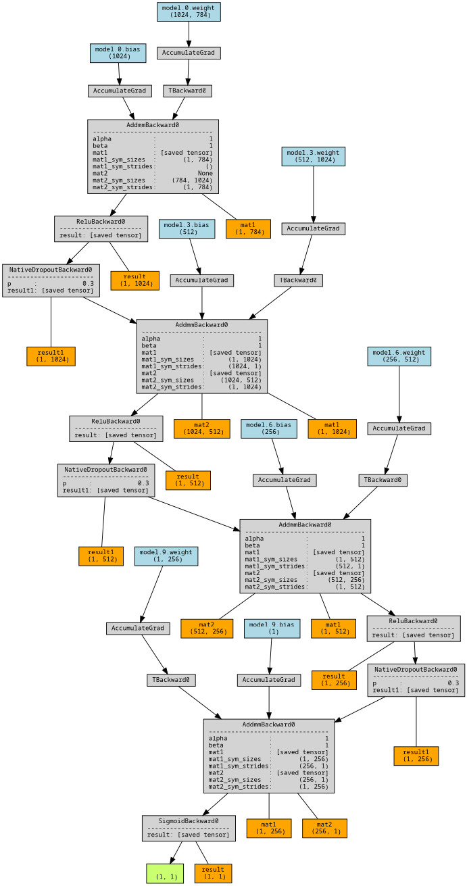 

<center>图3 判别器计算图</center>

### 模型编译

参数设置

```python
batch_size = 128
z_dim = 100
lr = 2e-4
beta1 = 0.5
num_epochs = 100
```

初始化网络

```python
def weights_init(m):
    if isinstance(m, (nn.Conv2d, nn.ConvTranspose2d, nn.Linear)):
        nn.init.normal_(m.weight.data, 0.0, 0.02)
    if isinstance(m, nn.BatchNorm2d):
        nn.init.normal_(m.weight.data, 1.0, 0.02)
        nn.init.constant_(m.bias.data, 0)
```

损失函数与优化器

```python
criterion = nn.BCELoss()
optimizerD = optim.Adam(D.parameters(), lr=lr, betas=(beta1, 0.999))
optimizerG = optim.Adam(G.parameters(), lr=lr, betas=(beta1, 0.999))
```

### 训练与结果

初始化训练记录

```python
losses_D = []
losses_G = []
fixed_noise = torch.randn(64, 100, device=device)  # shape (64,100)
```

训练循环

```python
for epoch in range(1, num_epochs+1):
    for i, (real_images, _) in enumerate(dataloader):
        real_images = real_images.to(device)
        b_size = real_images.size(0)

        # -------- 更新 D --------        D.zero_grad()
        label_real = torch.ones(b_size, 1, device=device)
        label_fake = torch.zeros(b_size, 1, device=device)

        output_real = D(real_images)
        lossD_real = criterion(output_real, label_real)

        noise = torch.randn(b_size, 100, device=device)  # shape (b_size,100)
        fake_images = G(noise)

        output_fake = D(fake_images.detach())
        lossD_fake = criterion(output_fake, label_fake)

        lossD = lossD_real + lossD_fake
        lossD.backward()
        optimizerD.step()

        # -------- 更新 G --------
        G.zero_grad()
        output = D(fake_images)
        lossG = criterion(output, label_real)
        lossG.backward()
        optimizerG.step()

    # 记录每个 epoch 的损失
    losses_D.append(lossD.item())
    losses_G.append(lossG.item())
```

| 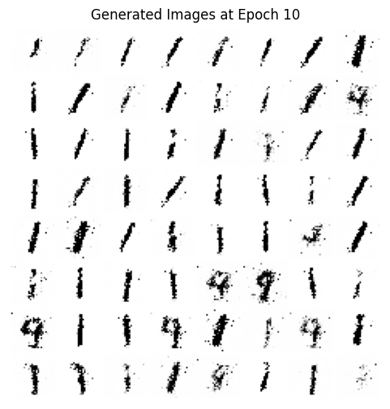 | 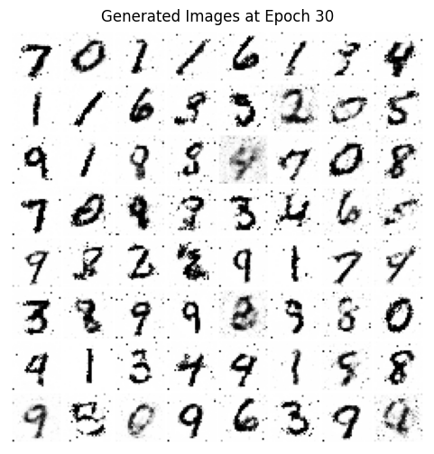 | 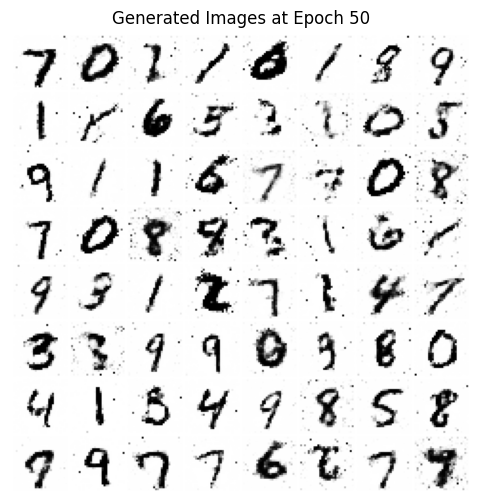 | 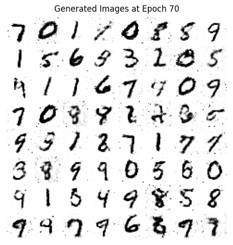 | 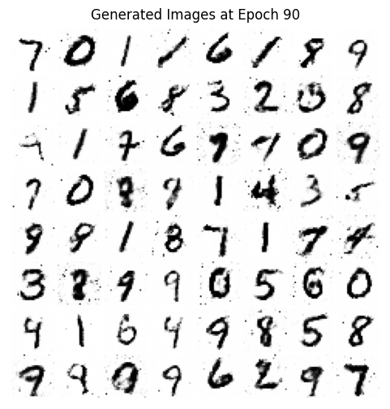 |
| ----------------------------------------------- | ----------------------------------------------- | ----------------------------------------------- | ----------------------------------------------- | ----------------------------------------------- |
| 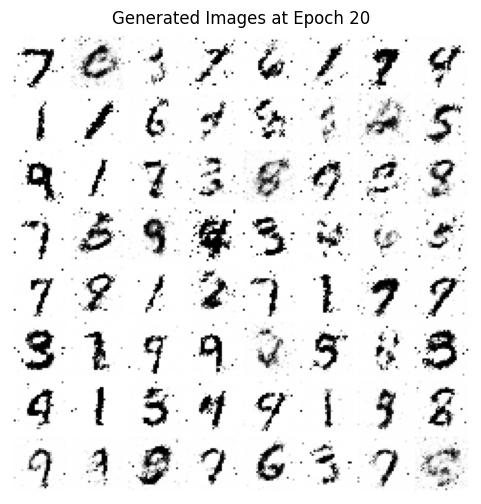 | 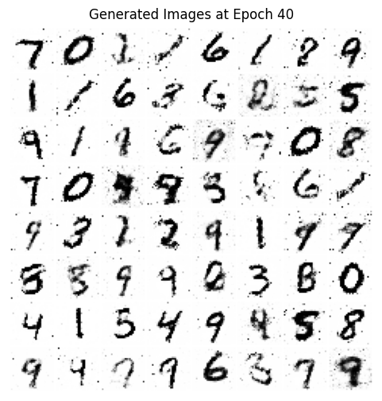 | 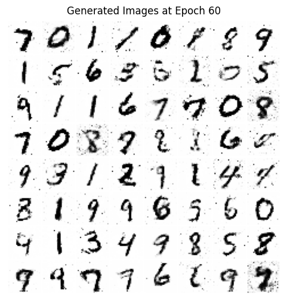 | 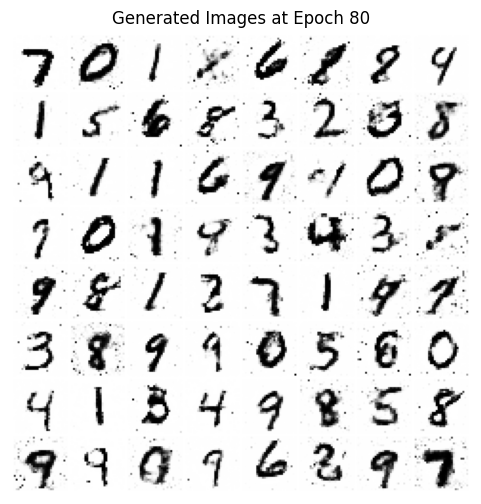 | 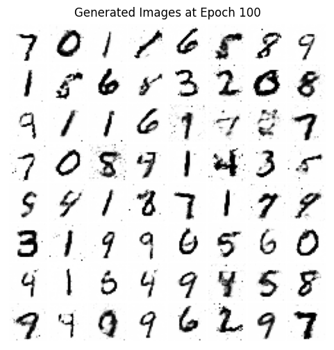 |

<center>图4 训练过程中绘制的手写数字</center>

将记录的损失通过 `matplotlib` 打印出来，可以看到模型收敛，生成器损失降低，而判别器的损失相比最初上升。

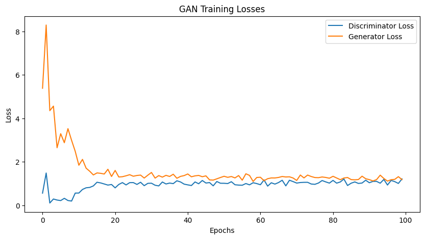

<center>图5 训练后最终结果</center>

GAN 的理想终点是任何一方单独改变策略都无法获得更好的结果，在该平衡点中 $p_g = p_{data}$ ， $D*(x) = 0.5$ 对所有 $x$ 成立。

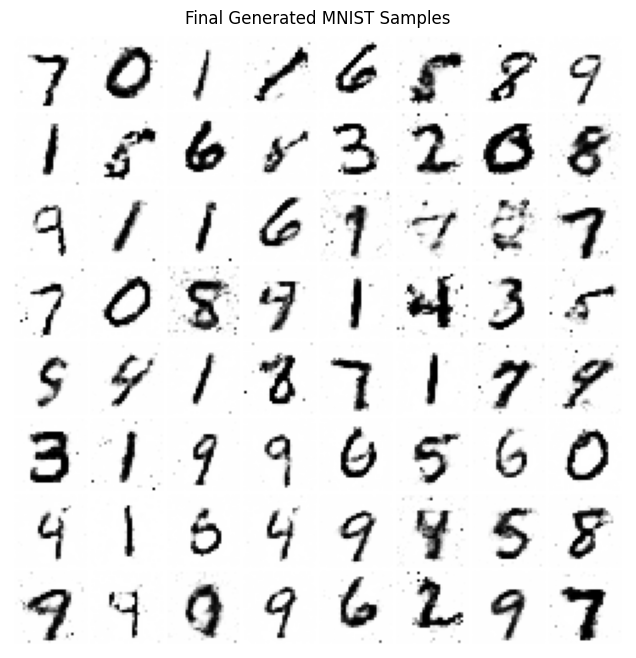

<center>图6 生成器与判别器的训练过程</center>

## 实验总结

在之前，我也使用了 DCGAN 模型来生成 MNIST 数字

```python
# Generator
class DCGenerator(nn.Module):
    def __init__(self, noise_dim=100):
        super().__init__()
        self.model = nn.Sequential(
            nn.Linear(noise_dim, 128*7*7),
            nn.BatchNorm1d(128*7*7),
            nn.ReLU(True),
        )
        self.conv_blocks = nn.Sequential(
            nn.ConvTranspose2d(128, 64, 4, stride=2, padding=1), # 7x7 -> 14x14
            nn.BatchNorm2d(64),
            nn.ReLU(True),
            nn.ConvTranspose2d(64, 1, 4, stride=2, padding=1),   # 14x14 -> 28x28
            nn.Tanh()
        )

    def forward(self, z):
        out = self.model(z)
        out = out.view(-1, 128, 7, 7)
        return self.conv_blocks(out)
```

但是生成的效果并不是特别好，效果如图

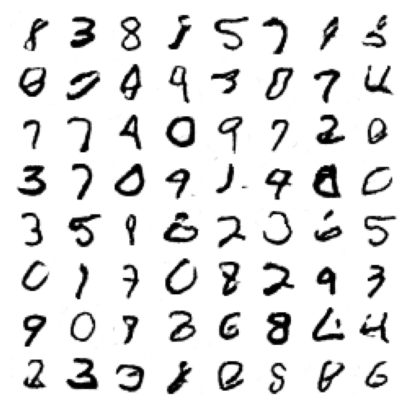

<center>图7 DCGAN生成的手写数字</center>

可以看到，DCGAN 生成的数字相比与原来 MLP 结构的模型来说，笔画非常流畅，也没有奇怪的噪点，但是整体非常扭曲和奇怪，总的来说不如前面的实验结果。可能的原因在于 MNIST 数据集过于简单，作为一个 28*28 的灰度图，DCGAN 的强归纳偏置成了负担。卷积神经网络试图在没有局部多样性的数据上提取复杂纹理。 

其次，模式崩塌在 DCGAN 上更加明显，CNN 结构限制了模型了解全局空间，生成器卡在了某个局部最优解。虽然 MLP 也容易崩塌，但是因为参数多，数据集简单，崩塌后仍然能够输出多种模糊但是像数字的样本。

**参考文献**

[1] Goodfellow, I. J., Pouget-Abadie, J., Mirza, M., Xu, B., Warde-Farley, D., Ozair, S., ... & Bengio, Y. (2014). Generative adversarial nets. *Advances in neural information processing systems*, *27*.

[2] Arjovsky, M., Chintala, S., & Bottou, L. (2017, July). Wasserstein generative adversarial networks. In *International conference on machine learning* (pp. 214-223). PMLR.

[3] Gulrajani, I., Ahmed, F., Arjo

vsky, M., Dumoulin, V., & Courville, A. C. (2017). Improved training of wasserstein gans. *Advances in neural information processing systems*, *30*.

[4] Brock, A., Donahue, J., & Simonyan, K. (2018). Large scale GAN training for high fidelity natural image synthesis. *arXiv preprint arXiv:1809.11096*.

[5] Sarı, N., Elewi, A., & Acı, M. (2024, September). Image Generation Performance Analysis: A Comparative Study of GAN Models on MNIST Dataset. In *2024 8th International Artificial Intelligence and Data Processing Symposium (IDAP)* (pp. 1-7). IEEE.
