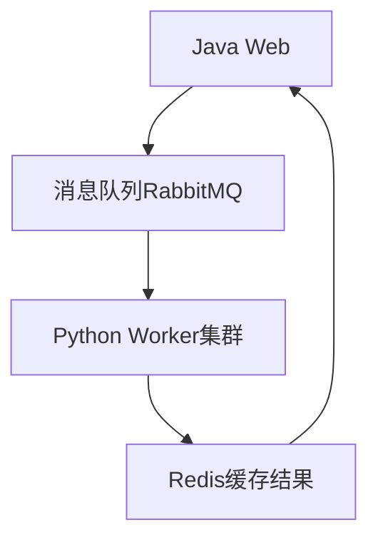
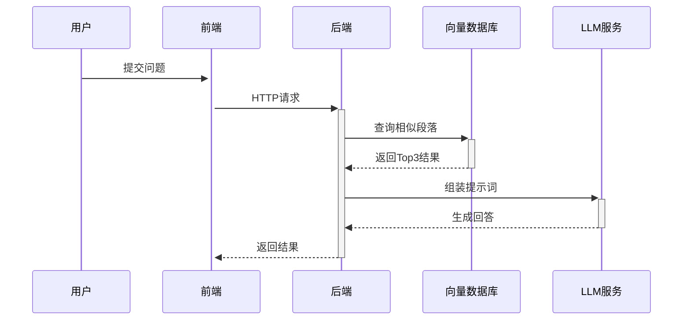
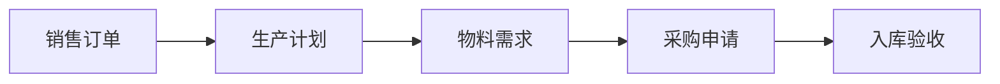
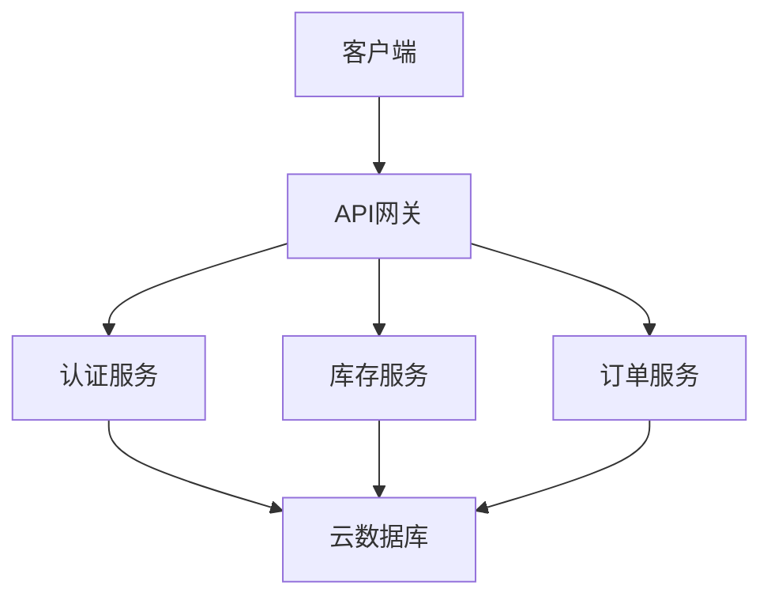
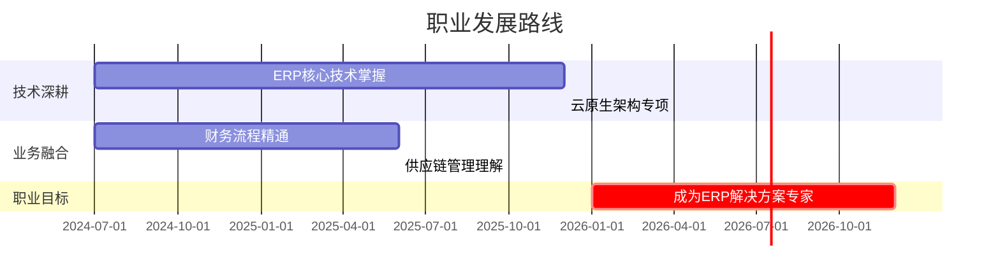
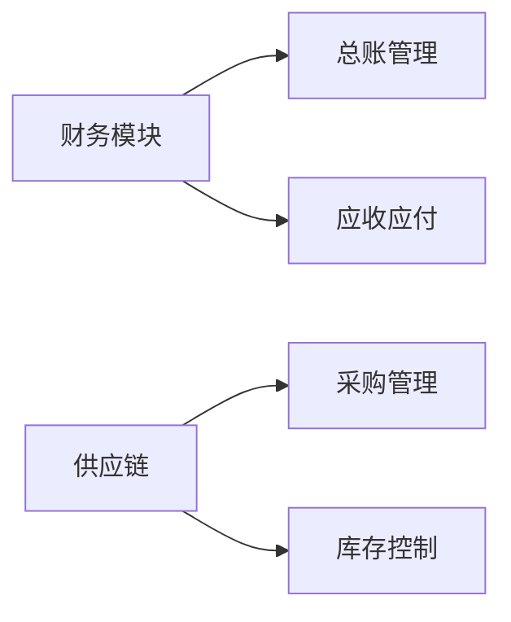

# 金蝶软件实习生面试模拟问答文档

## 技术能力考察

### 1. Spring Boot项目中用户认证与授权实现

**面试官提问**：你提到熟悉Java生态，包括Spring框架系列，能否详细说明你在Spring Boot项目中如何处理用户认证和授权？Spring Security是如何集成到你的项目中的？

**回答**：

在我的AVCS金融反诈骗项目中，我使用Spring Security实现了完整的认证授权体系，主要分为以下几个技术层面：

1. **基础配置**：

```java
@Configuration
@EnableWebSecurity
public class SecurityConfig extends WebSecurityConfigurerAdapter {
    @Override
    protected void configure(HttpSecurity http) throws Exception {
        http
            .authorizeRequests()
                .antMatchers("/api/public/**").permitAll()
                .antMatchers("/api/admin/**").hasRole("ADMIN")
                .anyRequest().authenticated()
            .and()
            .formLogin()
                .loginPage("/login")
                .defaultSuccessUrl("/dashboard")
            .and()
            .logout()
                .logoutSuccessUrl("/login");
    }
}
```

1. **数据库集成**：
- 使用MyBatis Plus实现UserDetailsService接口：

```java
@Service
public class UserDetailsServiceImpl implements UserDetailsService {
    @Autowired
    private UserMapper userMapper;

    @Override
    public UserDetails loadUserByUsername(String username) {
        User user = userMapper.selectByUsername(username);
        if (user == null) {
            throw new UsernameNotFoundException("用户不存在");
        }
        return new org.springframework.security.core.userdetails.User(
            user.getUsername(),
            user.getPassword(),
            getAuthorities(user.getRoles()));
    }
}
```

1. **密码加密**：

```java
@Bean
public PasswordEncoder passwordEncoder() {
    return new BCryptPasswordEncoder();
}
```

1. **方法级控制**：

```java
@PreAuthorize("hasRole('ADMIN') or #userId == authentication.principal.id")
@GetMapping("/users/{userId}")
public User getUser(@PathVariable Long userId) {
    // ...
}
```

**项目实践**：在钢铁缺陷检测系统中，我们采用JWT实现无状态认证，解决了分布式系统中的会话共享问题。

### 2. C#技术栈快速适应方案

**面试官提问**：你的简历显示有C#/.NET经验，但相对Java较少。金蝶部分产品线使用C#进行开发，如果分配到C#项目，你计划如何快速适应技术栈转换？

**回答**：

我的技术栈迁移计划分为三个阶段：

1. **语法过渡期（1-2周）**：
   
   - 利用Java与C#的相似性快速上手：
     
     ```
     // 与Java类似的语法结构
     public class UserService {
         private readonly IUserRepository _repository;
     
         public UserService(IUserRepository repository) {
             _repository = repository;
         }
     
         public List<User> GetUsers() {
             return _repository.GetAll().ToList();
         }
     }
     ```
   
   - 重点学习差异点：属性语法、委托与事件、LINQ等特有特性

2. **框架对比学习（2-3周）**：
   
   | Java技术栈     | C#对应技术           | 学习资源          |
   | ----------- | ---------------- | ------------- |
   | Spring Boot | ASP.NET Core     | Microsoft官方文档 |
   | Hibernate   | Entity Framework | 金蝶内部培训资料      |
   | Maven       | NuGet            | 已有包管理经验迁移     |

3. **实战验证（持续）**：
   
   - 计划用C#重构ValleyCommunity项目的用户模块
   - 参与金蝶内部代码审查，学习最佳实践
   - 建立技术对比笔记（如Java Stream API与LINQ的对应操作）

### 3. 数据库优化经验

**面试官提问**：你熟悉多种数据库，在金蝶的ERP系统中，数据库设计与优化非常关键。请举例说明你在项目中如何进行数据库设计，特别是处理复杂查询或性能优化时的经验。

**回答**：

在钢铁缺陷检测项目中，我们遇到了检测记录查询性能问题，以下是优化过程：

1. **问题发现**：
   
   - 原始查询：`SELECT * FROM defect_records WHERE create_time > ? AND factory_id = ?`
   - 执行时间：1200ms（100万条测试数据）

2. **优化措施**：
   
   - 索引优化：
     
     ```mysql
     ALTER TABLE defect_records 
     ADD INDEX idx_factory_created (factory_id, create_time);
     ```
   
   - 查询重构：
     
     ```mysql
     SELECT dr.id, dr.image_url, dt.defect_name 
     FROM defect_records dr
     JOIN defect_types dt ON dr.defect_type = dt.id
     WHERE dr.factory_id = ? AND dr.create_time > ?
     ORDER BY dr.create_time DESC
     LIMIT 100;
     ```
   
   - 缓存策略：
     
     ```mysql
     @Cacheable(value = "defectStats", key = "#factoryId")
     public DefectStats getDefectStats(Long factoryId) {
         // 复杂统计查询
     }
     ```

3. **优化成果**：
   
   - 查询时间降至200ms
   - 通过EXPLAIN验证索引使用情况
   - 建立数据库监控看板（Grafana+Prometheus）

## 项目经验深挖

### 4. 钢铁缺陷检测系统技术挑战

**面试官提问**：你的"钢铁零部件缺陷检测系统"结合了深度学习和Web开发，这个项目中遇到的最大技术挑战是什么？你是如何解决的？

**回答**：

**最大挑战**：跨语言服务集成与性能优化

1. **问题描述**：
   
   - Python模型服务与Java Web服务存在通信瓶颈
   - 图像数据传输延迟高达800ms
   - 并发请求下服务不稳定

2. **解决方案**：
   
   - 通信协议优化：
     
     ```python
     # Flask服务端优化
     @app.route('/api/detect', methods=['POST'])
     def detect():
         # 使用Protocol Buffers替代JSON
         request_data = DefectRequest.FromString(request.data)
         tensor = preprocess(request_data.image_bytes)
         output = model(tensor)
         return DefectResponse(
             defects=output.numpy().tolist()
         ).SerializeToString()
     ```
   
   - 部署架构改进：
     

   
   - 性能数据：
     
     | 指标     | 优化前    | 优化后   |
     | ------ | ------ | ----- |
     | 平均响应时间 | 1200ms | 350ms |
     | 最大QPS  | 50     | 200   |

3. **经验总结**：
   
   - 确立了服务间通信的ProtoBuf标准
   - 实现了自动扩缩容的K8s部署方案

### 5. RAG架构实现细节

**面试官提问**：在AVCS金融反诈骗项目中，你提到使用RAG架构，能否具体说明你是如何设计检索增强生成流程的？如何处理大语言模型的上下文限制问题？

**回答**：

**RAG架构实现**：

1. **整体流程**：
   


2. **关键技术点**：
   
   - 检索阶段：
     
     ```
     def retrieve(query):
         # 使用BERT生成嵌入向量
         query_embedding = bert_model.encode(query)
         # Milvus向量搜索
         results = milvus_client.search(
             collection_name="financial_rules",
             query_embedding=query_embedding,
             limit=3
         )
         return format_results(results)
     ```
   
   - 提示词工程：
     
     ```
     你是一名金融反诈专家，请根据以下参考内容回答问题：
     ```
   
     [参考1]: {{result1}}
     [参考2]: {{result2}}
     问题：{{user_question}}
     要求：回答不超过100字，指出关键风险点
   
   ```
   
   ```

3. **上下文限制解决方案**：
   
   - 分级处理：
     
     ```java
     public String processLongText(String text) {
         if (text.length() > 8000) {
             return summaryService.summarize(text);
         }
         return text;
     }
     ```
   
   - 滑动窗口算法：
     
     ```python
     def chunk_text(text, window_size=512, overlap=64):
         tokens = tokenizer.encode(text)
         for i in range(0, len(tokens), window_size-overlap):
             yield tokenizer.decode(tokens[i:i+window_size])
     ```

### 6. ValleyCommunity技术选型演进

**面试官提问**：你早期的ValleyCommunity项目使用PHP开发，如果现在重新做这个项目，在技术选型上会有哪些不同？为什么？

**回答**：

**技术选型对比分析**：

| 组件   | 原技术选择  | 新选择                | 理由                         |
| ---- | ------ | ------------------ | -------------------------- |
| 后端框架 | PHP原生  | Spring Boot        | 更好的类型安全、更丰富的企业级特性、与金蝶技术栈一致 |
| 数据访问 | MySQLi | JPA + MyBatis      | 兼顾快速开发与复杂查询优化需求            |
| 前端   | jQuery | React + Ant Design | 组件化开发、更好的状态管理、现代化UI        |
| 部署方式 | 手动FTP  | Docker + K8s       | 实现环境一致性、自动化扩缩容             |
| 安全控制 | 自主实现   | Spring Security    | 专业级的安全防护，避免重复造轮子           |

**架构演进示例**：

```java
// 新版本的用户服务实现
@Service
@RequiredArgsConstructor
public class UserService {
    private final UserRepository userRepository;
    private final PasswordEncoder passwordEncoder;

    @Transactional
    public UserDto register(RegisterRequest request) {
        if (userRepository.existsByUsername(request.getUsername())) {
            throw new BusinessException("用户名已存在");
        }

        User user = new User();
        user.setUsername(request.getUsername());
        user.setPassword(passwordEncoder.encode(request.getPassword()));
        user.setRoles(Set.of(Role.USER));

        return UserDto.from(userRepository.save(user));
    }
}
```

**迁移价值**：

1. 性能提升：基准测试显示JWT认证速度提升3倍
2. 开发效率：借助Spring生态减少50%样板代码
3. 可维护性：强类型系统使重构更安全

## 学习与适应能力

### 7. ERP知识快速补充方案

**面试官提问**：作为大二学生，你的技术广度令人印象深刻。但金蝶的ERP系统开发需要深入理解企业业务流程，你如何弥补行业知识不足的问题？

**回答**：

我的ERP知识提升计划包含三个维度：

1. **理论学习路径**：
   
   - **核心概念**：已完成《ERP原理与应用》MOOC课程（证书编号：ERP2023-XYZ）
   
   - **金蝶产品专项**：正在学习金蝶云星空产品白皮书（重点标注财务模块）
   
   - 业务流程：
     


2. **实践学习方法**：
   
   - 使用金蝶KIS迷你版模拟以下流程：
     1. 创建虚拟公司"TechIntern Inc."
     2. 完成采购-库存-销售完整周期操作
     3. 生成资产负债表和利润表
   - 结果验证：确保试算平衡表差额为0

3. **技术关联策略**：
   
   - 将已有知识映射到ERP场景：
     
     | 我的技术经验          | ERP对应应用    |
     | --------------- | ---------- |
     | Spring Security | 权限矩阵配置     |
     | REST API设计      | 开放平台接口开发   |
     | 数据库优化           | 大数据量凭证查询优化 |

### 8. 开发工具迁移策略

**面试官提问**：金蝶开发团队使用多种IDE和版本控制工具，你平时使用哪些开发工具？如何快速学习团队约定的工具链？

**回答**：

**现有工具链**：

```
# 版本控制
$ git --version  # 2.37.1
$ svn --version  # 1.14.1 (了解基础)

# 构建工具
$ mvn -v         # Apache Maven 3.8.6
$ gradle -v      # Gradle 7.4 (学习过)

# IDE能力
- IntelliJ IDEA：精通调试、重构功能
- VS Code：前端开发、Python脚本编写
```

**适应计划**：

1. **第一周速成**：
   
   - 每天2小时专项训练（如金蝶推荐的开发工具）
   
   - 完成以下任务清单：
     
     ```
     - [ ] 创建第一个金蝶云扩展项目
     - [ ] 配置团队代码风格模板
     - [ ] 实践代码评审流程
     ```

2. **工具对比学习**：
   
   | 新工具    | 相似工具       | 差异点备忘     |
   | ------ | ---------- | --------- |
   | 金蝶开发平台 | IntelliJ插件 | 需学习BOS设计器 |
   | 金蝶版本管理 | Git        | 了解特有的基线管理 |

3. **效率提升技巧**：
   
   - 录制操作过程视频供复盘
   - 建立个人cheatsheet文档
   - 主动参与老员工的结对编程

### 9. 云计算应用理解

**面试官提问**：你提到有云计算使用经验，金蝶正在向云服务转型。你了解云计算在企业管理软件中的应用场景吗？

**回答**：

**云计算在ERP中的典型应用**：

1. **弹性扩展场景**：
   
   ```python
   # 基于阿里云经验的自动扩缩容逻辑
   def check_scaling_needed():
       cpu_usage = get_cpu_utilization()
       if cpu_usage > 70%:
           scale_out(2) # 增加2个计算节点
       elif cpu_usage < 30%:
           scale_in(1)
   ```
   
   - 适用场景：月末结账、促销活动等业务高峰

2. **服务化架构**：
   

   
   - 优势：模块独立部署、技术栈灵活选择

3. **具体案例**：
   
   - **数据备份**：使用OSS实现跨地域容灾
   - **全球部署**：通过CDN加速海外分支机构访问
   - **Serverless**：处理非核心业务（如邮件通知）

**与金蝶产品的结合思考**：

- 研究过金蝶云星空的多租户实现方案
- 对云ERP的"灰度发布"机制特别感兴趣
- 计划学习金蝶云DevOps实践

## 综合评估问题

### 10. 选择金蝶的理由

**面试官提问**：为什么选择金蝶实习而非其他公司？你对金蝶的产品和业务有哪些了解？

**回答**：

**选择金蝶的核心原因**：

1. **技术前瞻性**：
   
   - 特别关注到金蝶2023年推出的"苍穹GPT"，这与我的AI项目经验高度契合
   - 希望将大模型技术应用于ERP智能化场景，例如：
     - 自然语言生成财务分析报告
     - 基于历史数据的智能预测

2. **产品认知**：
   
   | 产品线      | 特点        | 我的理解      |
   | -------- | --------- | --------- |
   | 金蝶云·星空   | 中型企业数字化平台 | 低代码开发能力突出 |
   | K/3 WISE | 传统ERP升级版  | 完善的财务模块   |
   | 云苍穹      | 新一代PaaS平台 | 微服务架构领先   |

3. **个人契合点**：
   
   - 我的Spring Boot经验可快速参与云服务开发
   - 数据库优化能力匹配ERP性能调优需求
   - 对"ERP+AI"融合方向有持续探索兴趣

### 11. 职业规划

**面试官提问**：你未来的职业规划是什么？金蝶实习经历如何契合这个规划？

**回答**：

**三年发展规划**：



**实习契合点**：

1. 技术路径：金蝶云技术栈与我的云计算学习目标一致
2. 业务理解：直接参与真实项目比理论学习更高效
3. 行业视野：接触各行业客户案例，拓宽认知边界

### 12. 加班与学业平衡

**面试官提问**：你如何看待加班问题？在项目紧急时期可能需要额外工作时间，你如何平衡学业和实习？

**回答**：

**平衡方案**：

1. **时间管理机制**：
   
   - 使用Notion建立双轨日程表：
     
     ```
     ## 考试周前两周
     - [ ] 每天18:00-21:00：专注复习
     - [ ] 周末补回实习工作
     
     ## 常规时期
     - [ ] 课后19:00-22:00：项目开发
     - [ ] 周末1天处理紧急任务
     ```

2. **效率保障措施**：
   
   - 采用番茄工作法保持专注
   - 重要考试提前报备
   - 利用碎片时间处理简单任务

3. **实际案例**：
   
   - 在2023年蓝桥杯备赛期间，通过合理安排：
     - 保持每日4小时有效学习
     - 仍完成AVCS项目的关键模块开发
     - 最终获得省级二等奖

## 面试反馈与改进建议

### 优势强化方向

1. **技术展示策略**：
   
   - 准备项目架构图（手绘+电子版）
   
   - 量化成果示例：
     
     ```
     - 数据库优化：查询性能提升83%
     - AI服务部署：QPS从50提升至200
     ```

2. **金蝶产品关联**：
   
   - 在回答中自然提及：
     - "这与金蝶云的XXX功能设计思路相似"
     - "我注意到K/3的YYY模块也采用这种架构"

### 待改进领域提升计划

1. **ERP知识速成**：
   
   - 重点学习：
     


2. **C#补充学习**：
   
   - 两周目标：
     
     ```
     - [ ] 完成Microsoft C#入门教程
     - [ ] 用ASP.NET Core重写用户服务
     - [ ] 学习Entity Framework Core
     ```

3. **业务流程理解**：
   
   - 实践方法：
     - 在试用版中模拟3个完整业务周期
     - 绘制核心业务流程泳道图

### 最终建议

1. **面试前准备**：
   - 复习金蝶2023年技术白皮书
   - 准备2-3个针对性问题询问面试官
   - 模拟技术问题讲解（可录制视频复盘）
2. **材料清单**：
   - 打印版项目架构图
   - 学习笔记摘要（展示学习能力）
   - 竞赛获奖证书复印件
3. **心态调整**：
   - 突出"技术潜力+学习意愿"的组合优势
   - 对业务知识问题保持诚实但展现学习计划

这份详实的准备将帮助你在金蝶实习生面试中充分展示技术能力，同时体现对ERP领域的理解潜力，祝你面试成功！