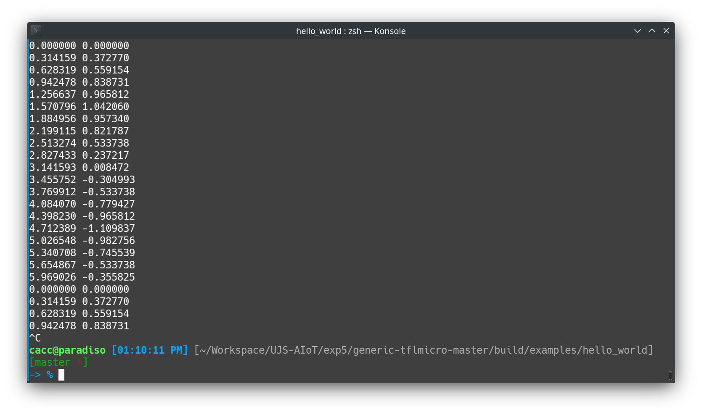

# 实验五 模型优化

## 5.1 实验介绍

***TensorFlow Lite Micro (TFLM)** 是专门为**微控制器（MCU）等资源受限设备**设计的轻量级推理框架。由于这些设备通常只有几十到几百 KB 的 RAM 和 Flash，因此“模型优化”是实现高性能与低功耗的关键环节。

## 5.2 实验内容

1. 使用 MNIST fashion 数据集训练模型并使用量化、剪枝、权重聚类。

2. 基于 CIFIA - 10 数据集进行模型训练，使用 TFLM 进行 Python 推理。

3. 基于 tflite-micro x86 工程项目实现 sin 波函数预测。

## 5.3 实验步骤

### 5.3.1 TensorFlow Lite with MNIST-Fashion

首先通过 tensorflow keras 提供的数据集 API 引出 fashion_mnist 并打印出几个样本来检查数据集。


然后进行数据预处理，包括将原来 0-255 范围的像素灰度转换成 0-1 的浮点数并归一化。同时调整输入形状，灰度图通道为一。

```python
num_class = 10
X_train = X_train.astype('float32')   # change integers to 32-bit floating point numbers
X_test = X_test.astype('float32')

X_train /= 255                        # normalize the input
X_test /= 255

X_train = X_train.reshape(-1, X_train.shape[1], X_train.shape[2], 1)
X_test = X_test.reshape(-1, X_test.shape[1], X_test.shape[2], 1)

y_train = to_categorical(y_train, num_class)
y_test = to_categorical(y_test, num_class)
```

定义一个基线模型

```python
model = Sequential()      
model.add(Conv2D(32, kernel_size=(3, 3), activation="relu", input_shape = (28,28,1)))
model.add(MaxPooling2D(pool_size=(2, 2)))
model.add(Conv2D(64, kernel_size=(3, 3), activation="relu"))
model.add(MaxPooling2D(pool_size=(2, 2)))
model.add(Flatten())
model.add(Dropout(0.5))
model.add(Dense(100, activation = "relu"))
model.add(Dense(num_class, activation="softmax"))
```


设置并训练基线模型

```python
opt = Adam(0.002)
model.compile(loss="categorical_crossentropy", optimizer = opt, metrics=["accuracy"])
model.fit(X_train, y_train, batch_size=128, epochs=15)
```

最后进行测试


**加载并转换成 TFLite 模型**

```python
converter = tf.lite.TFLiteConverter.from_keras_model(baseline_model)
tflite_model = converter.convert()
```


随后，就可以使用转换出的 TFLite 模型来进行预测

```python
tflite_model_file = 'tflite_models/model.tflite'          
interpreter = tf.lite.Interpreter(model_path=tflite_model_file)
interpreter.allocate_tensors()

input_index = interpreter.get_input_details()[0]["index"]
output_index = interpreter.get_output_details()[0]["index"]

pred_list = []
for images in X_test:
  input_data = np.array(images, dtype=np.float32)

  input_data = input_data.reshape(1, input_data.shape[0], input_data.shape[1], 1)

  interpreter.set_tensor(input_index, input_data)
  interpreter.invoke()
  prediction = interpreter.get_tensor(output_index)
  prediction = np.argmax(prediction)
  pred_list.append(prediction)

accurate_count = 0
for index in range(len(pred_list)):
  if pred_list[index] == np.argmax(y_test[index]):
      accurate_count += 1
accuracy = accurate_count * 1.0 / len(pred_list)

print('accuracy = ', accuracy)
```

最后准确度为 0.93

**训练后量化**

```python
converter = tf.lite.TFLiteConverter.from_keras_model(baseline_model)
converter.optimizations = [tf.lite.Optimize.DEFAULT]
tflite_model_ptq = converter.convert()
```


同样地对量化后的模型进行测试，准确率为 0.9128

**使用 TensorFlow 模型优化器**

```bash
pip install -q tensorflow-model-optimization
```

```python
import tensorflow_model_optimization as tfmot

baseline_model = load_model('baseline_model.h5')

quantized_model = tfmot.quantization.keras.quantize_model

# q_aware stands for for quantization aware.
q_aware_model = quantized_model(baseline_model)

# `quantize_model` requires a recompile.
q_aware_model.compile(optimizer='adam',
              loss=tf.keras.losses.CategoricalCrossentropy(from_logits=True),
              metrics=['accuracy'])

q_aware_model.summary()

q_aware_model.fit(X_train, y_train,
                  batch_size=500, epochs=2, validation_split=0.1)
```

训练，转换并保存为 TFLite 模型

```python
converter = tf.lite.TFLiteConverter.from_keras_model(q_aware_model)
converter.optimizations = [tf.lite.Optimize.DEFAULT]
tflite_model_qat = converter.convert()

tflite_models_dir = pathlib.Path("./tflite_models/")
tflite_models_dir.mkdir(exist_ok=True, parents=True)
tflite_model_file = tflite_models_dir/"model_qat.tflite"
tflite_model_file.write_bytes(tflite_model_qat)
```


同样在测试集上测试得到结果为 0.9215

同时我们也可以只对模型的全连接层（Dense layers）进行量化。

```python
baseline_model = load_model('baseline_model.h5')

def apply_quantization(layer):
      if isinstance(layer, tf.keras.layers.Dense):
        return tfmot.quantization.keras.quantize_annotate_layer(layer)
      return layer
annotated_model = tf.keras.models.clone_model(baseline_model,clone_function=apply_quantization,)
q_aware_model_dense = tfmot.quantization.keras.quantize_apply(annotated_model)
q_aware_model_dense.summary()
q_aware_model_dense.compile(optimizer='adam',
              loss=tf.keras.losses.CategoricalCrossentropy(from_logits=True),
              metrics=['accuracy'])

q_aware_model_dense.fit(X_train, y_train,
                  batch_size=500, epochs=2, validation_split=0.1)
```

```
Model: "sequential"
_________________________________________________________________
 Layer (type)                Output Shape              Param #   
=================================================================
 conv2d (Conv2D)             (None, 26, 26, 32)        320       

 max_pooling2d (MaxPooling2  (None, 13, 13, 32)        0         
 D)                                                              

 conv2d_1 (Conv2D)           (None, 11, 11, 64)        18496     

 max_pooling2d_1 (MaxPoolin  (None, 5, 5, 64)          0         
 g2D)                                                            

 flatten (Flatten)           (None, 1600)              0         

 dropout (Dropout)           (None, 1600)              0         

 prune_low_magnitude_dense   (None, 100)               320102    
 (PruneLowMagnitude)                                             

 prune_low_magnitude_dense_  (None, 10)                2012      
 1 (PruneLowMagnitude)                                           

=================================================================
Total params: 340930 (1.30 MB)
Trainable params: 179926 (702.84 KB)
Non-trainable params: 161004 (628.93 KB)
_________________________________________________________________
```

随后我们查看压缩模型的大小

```
baseline_model = load_model('baseline_model.h5')
def apply_pruning(layer):
  if isinstance(layer, tf.keras.layers.Dense):
    return tfmot.sparsity.keras.prune_low_magnitude(layer)
  return layer

model_for_pruning = tf.keras.models.clone_model(
    baseline_model,
    clone_function=apply_pruning)

model_for_pruning.summary()
```

查看在只有全链接层被修剪之后模型的表现，准确率为 0.9207

**使用权重聚类**

```python
baseline_model = load_model('baseline_model.h5')

cluster_weights = tfmot.clustering.keras.cluster_weights
CentroidInitialization = tfmot.clustering.keras.CentroidInitialization

clustering_params = {
  'number_of_clusters': 16,
  'cluster_centroids_init': CentroidInitialization.KMEANS_PLUS_PLUS
}

# Cluster a whole model
clustered_model = cluster_weights(baseline_model, **clustering_params)

# Use smaller learning rate for fine-tuning clustered model
opt = tf.keras.optimizers.Adam(learning_rate=1e-5)

clustered_model.compile(
  loss=tf.keras.losses.CategoricalCrossentropy(from_logits=True),
  optimizer=opt,
  metrics=['accuracy'])

clustered_model.summary()
```

```
Model: "sequential"
_________________________________________________________________
 Layer (type)                Output Shape              Param #   
=================================================================
 cluster_conv2d (ClusterWei  (None, 26, 26, 32)        624       
 ghts)                                                           

 cluster_max_pooling2d (Clu  (None, 13, 13, 32)        0         
 sterWeights)                                                    

 cluster_conv2d_1 (ClusterW  (None, 11, 11, 64)        36944     
 eights)                                                         

 cluster_max_pooling2d_1 (C  (None, 5, 5, 64)          0         
 lusterWeights)                                                  

 cluster_flatten (ClusterWe  (None, 1600)              0         
 ights)                                                          

 cluster_dropout (ClusterWe  (None, 1600)              0         
 ights)                                                          

 cluster_dense (ClusterWeig  (None, 100)               320116    
 hts)                                                            

...
Total params: 359710 (2.06 MB)
Trainable params: 179990 (703.09 KB)
Non-trainable params: 179720 (1.37 MB)
_________________________________________________________________
```

训练后测试得到准确度为 0.917

**协同量化**

首先进行权重剪枝和重新训练

```python
import tensorflow_model_optimization as tfmot

baseline_model = load_model('baseline_model.h5')

prune_low_magnitude = tfmot.sparsity.keras.prune_low_magnitude

pruning_params = {
      'pruning_schedule': tfmot.sparsity.keras.ConstantSparsity(0.5, begin_step=0, frequency=100)
  }

callbacks = [
  tfmot.sparsity.keras.UpdatePruningStep()
]

pruned_model = prune_low_magnitude(baseline_model, **pruning_params)
pruned_model.summary()
```

```
Model: "sequential"
_________________________________________________________________
 Layer (type)                Output Shape              Param #   
=================================================================
 prune_low_magnitude_conv2d  (None, 26, 26, 32)        610       
  (PruneLowMagnitude)                                            

 prune_low_magnitude_max_po  (None, 13, 13, 32)        1         
 oling2d (PruneLowMagnitude                                      
 )                                                               

 prune_low_magnitude_conv2d  (None, 11, 11, 64)        36930     
 _1 (PruneLowMagnitude)                                          

 prune_low_magnitude_max_po  (None, 5, 5, 64)          1         
 oling2d_1 (PruneLowMagnitu                                      
 de)                                                             

 prune_low_magnitude_flatte  (None, 1600)              1         
 n (PruneLowMagnitude)                                           

 prune_low_magnitude_dropou  (None, 1600)              1         
 t (PruneLowMagnitude)                                           

 prune_low_magnitude_dense   (None, 100)               320102    
...
Total params: 359658 (1.37 MB)
Trainable params: 179926 (702.84 KB)
Non-trainable params: 179732 (702.11 KB)
_________________________________________________________________
```

保持稀疏性的聚类

```python
from tensorflow_model_optimization.python.core.clustering.keras.experimental import (
    cluster,
)

cluster_weights = tfmot.clustering.keras.cluster_weights
CentroidInitialization = tfmot.clustering.keras.CentroidInitialization.KMEANS_PLUS_PLUS

cluster_weights = cluster.cluster_weights

clustering_params = {
  'number_of_clusters': 8,
  'cluster_centroids_init': CentroidInitialization.KMEANS_PLUS_PLUS,
  'preserve_sparsity': True
}

sparsity_clustered_model = cluster_weights(stripped_pruned_model_copy, **clustering_params)

sparsity_clustered_model.compile(optimizer='adam',
              loss=tf.keras.losses.CategoricalCrossentropy(from_logits=True),
              metrics=['accuracy'])

sparsity_clustered_model.fit(X_train, y_train, batch_size=128, epochs=3, validation_split=0.1)
```

最后测试模型表现得到结果 0.9129，此时再查看压缩后的模型大小：

```
Size of zipped sparsity preserved clustered TFlite model: 59090.00 bytes
```

### 5.3.2 利用 tflmicro 输出正弦波函数

首先解压文件到目录中，并编译项目。

首先下载编译相关软件，包括编译器和 cmake

```bash
sudo apt update
sudo apt install build-essential cmake
```

然后进入 build 目录使用 cmake 进行编译


```cpp
// The name of this function is important for Arduino compatibility.
void loop() {
  // Calculate an x value to feed into the model. We compare the current
  // inference_count to the number of inferences per cycle to determine
  // our position within the range of possible x values the model was
  // trained on, and use this to calculate a value.
  float position = static_cast<float>(inference_count) /
                   static_cast<float>(kInferencesPerCycle);
  float x = position * kXrange;

  // Quantize the input from floating-point to integer
  int8_t x_quantized = x / input->params.scale + input->params.zero_point;
  // Place the quantized input in the model's input tensor
  input->data.int8[0] = x_quantized;

  // Run inference, and report any error
  TfLiteStatus invoke_status = interpreter->Invoke();
  if (invoke_status != kTfLiteOk) {
    TF_LITE_REPORT_ERROR(error_reporter, "Invoke failed on x: %f\n",
                         static_cast<double>(x));
    return;
  }

  // Obtain the quantized output from model's output tensor
  int8_t y_quantized = output->data.int8[0];
  // Dequantize the output from integer to floating-point
  float y = (y_quantized - output->params.zero_point) * output->params.scale;

  // Output the results. A custom HandleOutput function can be implemented
  // for each supported hardware target.
  HandleOutput(error_reporter, x, y);

  // Increment the inference_counter, and reset it if we have reached
  // the total number per cycle
  inference_count += 1;
  if (inference_count >= kInferencesPerCycle) inference_count = 0;
}
```

最后运行编译出来的 hello_world/hello 发现循环输出了正弦波的模拟


