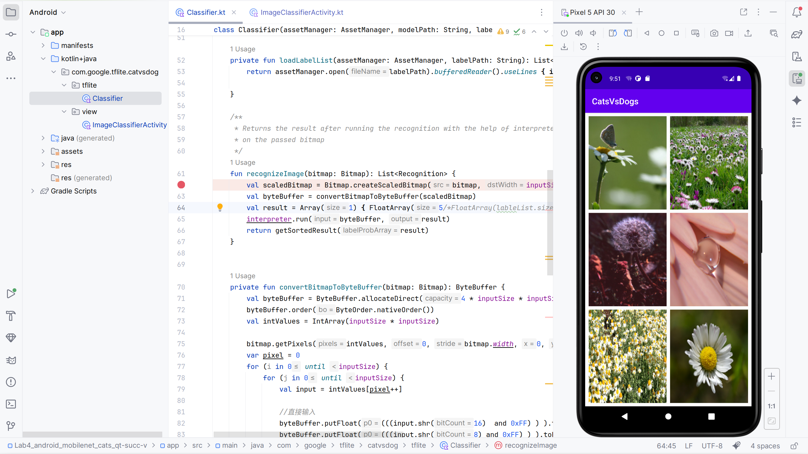

# 实验四 迁移学习

## 4.1 实验介绍

迁移学习是指使用预训练模型针对给定任务自定义模型。预训练模型十一个之前基于大型数据集（通常是大型图像分类任务）训练的已保存网络，该模型可以有效地充当视觉世界的通用模型，随后可以利用模型学习到的特征映射，而不必通过基于大型数据集训练大型模型而从头开始。

## 4.2 实验内容

1. 特征提取：使用先前网络学习的表示从新样本中提取有意义的特征，这样只需要在与训练模型上添加一个将从头开始训练的新分类器，这样便可以重复利用先前针对数据集学习的特征映射。

2. 微调：解冻已冻结模型库的一些顶层，并共同训练新添加的分类器层和基础模型的最后基层。这样我们便能微调基础模型中的高阶特征表示，以使其与特定任务更相关。

## 4.3 实验步骤

通过 Tensorflow 提供的数据集 API 下载包含猫狗图像分类数据集。

```python
_URL = 'https://storage.googleapis.com/mledu-datasets/cats_and_dogs_filtered.zip'
path_to_zip = tf.keras.utils.get_file('cats_and_dogs.zip', origin=_URL, extract=True)
PATH = os.path.join(os.path.dirname(path_to_zip), 'cats_and_dogs_filtered')
```

显示训练集中的前九个图像与标签

```python
class_names = train_dataset.class_names

plt.figure(figsize=(10, 10))
for images, labels in train_dataset.take(1):
  for i in range(9):
    ax = plt.subplot(3, 3, i + 1)
    plt.imshow(images[i].numpy().astype("uint8"))
    plt.title(class_names[labels[i]])
    plt.axis("off")
```


**配置数据集以提高性能**

使用缓冲预提取从磁盘加载图像，以免造成IO阻塞。

```python
AUTOTUNE = tf.data.AUTOTUNE

train_dataset = train_dataset.prefetch(buffer_size=AUTOTUNE)
validation_dataset = validation_dataset.prefetch(buffer_size=AUTOTUNE)
test_dataset = test_dataset.prefetch(buffer_size=AUTOTUNE)
```

**使用数据扩充**

在没有较大的图像数据集时，最好将随机但显示的转换应用于训练图像，来认为引入样本多样性，这样有助于使模型暴露于训练数据的不同方面并减少过拟合。

```python
data_augmentation = tf.keras.Sequential([
  tf.keras.layers.RandomFlip('horizontal'),
  tf.keras.layers.RandomRotation(0.2),
])
```

将这些重复应用于同一个图像然后查看结果：


**重新缩放像素值**

将 MobileNetV2 作为基础模型，此模型期望的像素值处于 $[-1, 1]$ 范围内，但此时，图像中的像素值处于 $[0, 255]$ 范围内。需要重新缩放这些像素值。

```python
preprocess_input = tf.keras.applications.mobilenet_v2.preprocess_input
```

### 4.3.1 从预训练卷积网络创建基础模型

根据谷歌开发的 MoblieNet V2 模型创建基础模型，此模型已经基于 ImageNet 数据集进行预训练。首先选择将 MobileNet V2 的哪一层用于特征提取，最后的分类层不是很有用。相反，将按照常见做法依赖于展平操作之前的最后一层，此层被称为瓶颈层。

首先实例化一个已预加载基于 ImageNet 训练的权重的 MobileNet V2 模型，通过指定 `include_top=False` 参数，可以加载不包括顶部分类层的网络，这对于特征提取十分理想。

```python
# Create the base model from the pre-trained model MobileNet V2
IMG_SHAPE = IMG_SIZE + (3,)
base_model = tf.keras.applications.MobileNetV2(input_shape=IMG_SHAPE,
                                               include_top=False,
                                               weights='imagenet')
```

此特征提取程序将每个 `160x160x3` 图像转换为 `5x5x1280` 的特征块。

**特征提取**

在此步骤中，将冻结在上一步中创建的卷积基，并用作特征提取程序。此外，您还可以在其顶部添加分类器以及训练顶级分类器。

在编译和训练模型之前，冻结卷积基至关重要。冻结可避免在训练期间更新给定层中的权重。MobileNet V2 具有许多层，因此将整个模型的 `trainable` 标记设置为 False 会冻结所有这些层。

```python
base_model.trainable = False
```

可以查看关于模型的结构信息

```python
base_model.summary()
```

**添加分类头**

要从特征块生成预测，请使用 `tf.keras.layers.GlobalAveragePooling2D`层在 `5x5` 空间位置内取平均值，以将特征转换成每个图像一个向量（包含 1280 个元素）。

```python
global_average_layer = tf.keras.layers.GlobalAveragePooling2D()
feature_batch_average = global_average_layer(feature_batch)
print(feature_batch_average.shape)
```

应用 `tf.keras.layers.Dense` 层将这些特征转换成每个图像一个预测。您在此处不需要激活函数，因为此预测将被视为 `logit` 或原始预测值。正数预测 1 类，负数预测 0 类。

```python
prediction_layer = tf.keras.layers.Dense(1)
prediction_batch = prediction_layer(feature_batch_average)
print(prediction_batch.shape)
```

通过使用 Keras 函数 API 将数据扩充、重新缩放、base_model 和特征提取程序层链接在一起来构建模型。

```python
inputs = tf.keras.Input(shape=(160, 160, 3))
x = data_augmentation(inputs)
x = preprocess_input(x)
x = base_model(x, training=False)
x = global_average_layer(x)
x = tf.keras.layers.Dropout(0.2)(x)
outputs = prediction_layer(x)
model = tf.keras.Model(inputs, outputs)
```

**编译模型**

```python
base_learning_rate = 0.0001
model.compile(optimizer=tf.keras.optimizers.Adam(learning_rate=base_learning_rate),
              loss=tf.keras.losses.BinaryCrossentropy(from_logits=True),
              metrics=['accuracy'])
```

**训练模型**

```python
initial_epochs = 10
loss0, accuracy0 = model.evaluate(validation_dataset)
history = model.fit(train_dataset,
                    epochs=initial_epochs,
                    validation_data=validation_dataset)
```

**学习曲线**

通过对学习过程的记录，可以看一下使用 MobileNet V2 基础模型作为固定特征提取程序使训练和验证准确率/损失的学习曲线。


### 4.3.2 微调

在特征提取中，仅在 MoblieNet V2 基础模型的顶部训练了一些层，但预训练网络的权重在训练过程中未更新。

进一步提高性能的一种方式是在训练预训练模型顶层的权重的同时，另外训练您添加的分类器。训练过程将强制权重从通用特征映射调整为专门与数据集相关联的特征。

**解冻模型顶层**

解冻 base_model 并将底层设置未不可训练。随后重新编译模型，然后恢复训练。

```python
base_model.trainable = True
# Let's take a look to see how many layers are in the base model
print("Number of layers in the base model: ", len(base_model.layers))

# Fine-tune from this layer onwards
fine_tune_at = 100

# Freeze all the layers before the `fine_tune_at` layer
for layer in base_model.layers[:fine_tune_at]:
  layer.trainable = False


model.compile(loss=tf.keras.losses.BinaryCrossentropy(from_logits=True),
              optimizer = tf.keras.optimizers.RMSprop(learning_rate=base_learning_rate/10),
              metrics=['accuracy'])
```

**继续训练模型**

```python
fine_tune_epochs = 10
total_epochs =  initial_epochs + fine_tune_epochs

history_fine = model.fit(train_dataset,
                         epochs=total_epochs,
                         initial_epoch=history.epoch[-1],
                         validation_data=validation_dataset)
```

在微调 MobileNet V2 基础模型的最后基层并在这些层上训练分类器时，可以看到训练和验证的准确率和损失的学习曲线。验证损失比训练损失高得多，因此可能存在一些过拟合。

当新的训练集相对较小且与原始 MobileNet V2 数据集相似时，也可能存在一些过拟合。


### 4.3.3 总结

**使用预训练模型进行特征提取**：使用小型数据集时，常见做法时利用基于相同域中的较大数据集训练的模型所学习的特征。为此，需要实例化训练模型并在顶部添加一个全链接分类器。预训练模型处于冻结状态，训练过程中仅更新分类器的权重。在这种情况下，卷积基提取了与每个图像关联的所有特征。

**微调预训练模型**：为了进一步提高性能，可能需要通过微调将预训练模型的顶层重新用于新的数据集，在本例中调整权重以使模型学习特定与数据集的高级特征。当训练数据集较大且与训练预训练模型所实用的原始数据集非常相似时，通常建议使用这种技术。

## 4.4* 安卓上的图片识别

原 App 使用 tflite 迁移到 Android 应用中实现对图片的识别，并使用的是猫狗数据集训练的模型。在新的要求中使用花朵数据集实现花朵分类，对五种花朵标签分类任务训练并量化模型导出。其中导入后发现出现异常。


定位错误，发现在这个函数中存在问题

```kotlin
    fun recognizeImage(bitmap: Bitmap): List<Recognition> {
        val scaledBitmap = Bitmap.createScaledBitmap(bitmap, inputSize, inputSize, false)
        val byteBuffer = convertBitmapToByteBuffer(scaledBitmap)
        val result = Array(1) { FloatArray(5/*FloatArray(lableList.size*/) }
        interpreter.run(byteBuffer, result)
        return getSortedResult(result)
    }
```

由于花朵分类结果有五个标签，所以结果数组由 1 改为 5。



最后运行成功。
