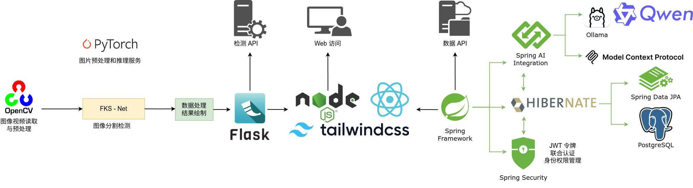

# 成果展示

## API 开发

本项目采用微服务的方式分开部署图像检测功能与数据分析功能，前端交互系统基于Electron框架构建，实现跨平台的高性能可视化界面。在用户确定图像输入源后首先经过OpenCV读取和预处理，并传递给双模型进行结果分析，推理服务通过Flask REST API实现微服务化部署。

数据分析子系统采用Spring Cloud微服务架构。持久层采用 MyBatis 框架实现动态 SQL 构建和类型安全查询。并特别设计了模型上下文协议工具，通过 Stdio 传输模式为 LLM 提供结构化数据接口，支持包括缺陷模式分析等智能决策功能。

