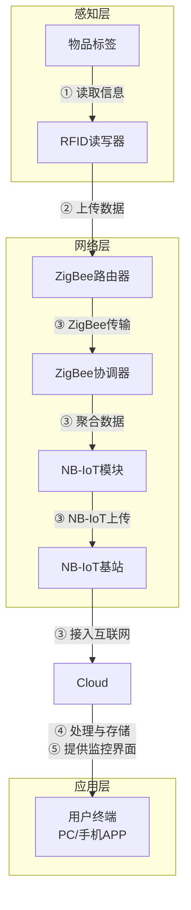

**结合物联网定义，设计智能家居的概念网络结构。**

物联网的定义是通过信息传感设备，按约定的协议，将任何物品与互联网相连接，进行信息交换和通信，以实现智能化识别、定位、跟踪、监控和管理的一种网络。基于此，智能家居的概念网络结构可设计如下：

- 感知层：包括各种传感器和执行器，如温度传感器、湿度传感器、光照传感器、智能门锁、智能灯具等，用于采集环境数据和执行控制命令。
- 网络层：负责数据传输，包括家庭内部网络（如Wi-Fi、ZigBee、蓝牙）和外部网络（如互联网接入）。家庭网关作为核心设备，连接感知层和云平台，实现协议转换和数据转发。
- 平台层：云平台或本地服务器，提供数据存储、处理和分析服务，支持智能决策和用户管理。
- 应用层：用户界面（如手机APP、网页）和智能服务（如语音助手、自动化场景），实现远程监控和控制。

整体结构呈分层架构，确保设备互联、数据互通和智能控制。

**结合OSI 模型，描述智能家居的通信网络协议结构及其功能。**

OSI（开放系统互联）模型包含七层，智能家居的通信网络协议可映射如下：

- 物理层：定义物理介质和信号传输，如Wi-Fi的无线电波、ZigBee的2.4GHz频段、以太网电缆。功能：传输原始比特流，确保设备物理连接。
- 数据链路层：处理帧传输和错误检测，如IEEE 802.11（Wi-Fi）、IEEE 802.15.4（ZigBee）。功能：组帧、寻址（MAC地址）、流量控制和差错控制。
- 网络层：负责路由和寻址，如IP协议（IPv4/IPv6）。功能：数据包转发、路径选择，实现设备间跨网络通信。
- 传输层：确保端到端可靠传输，如TCP（可靠连接）和UDP（高效传输）。功能：分段、流量控制、错误恢复，适用于视频流或传感器数据。
- 会话层：管理对话控制，如SSH或TLS会话。功能：建立、维护和终止会话，支持设备间持续交互。
- 表示层：处理数据格式转换和加密，如JSON、XML数据格式。功能：数据压缩、加密，确保兼容性和安全性。
- 应用层：提供用户服务和接口，如HTTP、MQTT、CoAP协议。功能：实现具体应用，如远程控制、数据查询，通过APP或云服务交互。

在智能家居中，这些协议协同工作，实现设备发现、数据交换和智能控制。

**ZigBee 可以组成哪些类型的网络？从日常生活中找出适合这些类型的实际案例。**

ZigBee支持三种主要网络拓扑：

- **星型网络（Star）**：所有设备直接与协调器（Coordinator）通信。适合简单、低功耗场景。
**实际案例**：智能家居中的单个房间控制，如一个ZigBee协调器连接多个智能灯泡或传感器，用户通过手机APP统一控制。

- **网状网络（Mesh）**：设备间可以多跳通信，通过路由节点扩展覆盖范围，具有自组网和自愈合能力。
**实际案例**：大型智能家居系统，如整个家庭的安防系统，其中传感器（门窗传感器、运动探测器）通过Mesh网络将数据中继到协调器，确保信号覆盖无死角。

- **簇状树网络（Cluster Tree）**：分层结构，协调器作为根节点，路由器管理子设备，适合大规模部署。
**实际案例**：工业物联网中的仓库管理，ZigBee协调器连接多个区域的路由器，每个路由器管理货架上的传感器，监控库存和环境条件。

这些网络类型提供了灵活性，适应不同应用场景的覆盖、可靠性和功耗需求。

**某物联网采用 RFID 读取流水线上的物品信息，采用 ZigBee 完成不同分拣口读取信息的收集，采用 NB-IoT 接入因特网。设计出该物联网络的整体结构，标出关键设备的名称，并简述该物联网络的功能和工作流程。**

**整体结构设计：**
- **感知层**：RFID读写器和标签——RFID读写器安装在流水线上，标签附着于物品上，用于唯一标识和读取物品信息（如ID、类型）。
- **网络层**：
  - ZigBee网络——ZigBee协调器作为中心节点，ZigBee路由器部署在各个分拣口，收集RFID数据并传输到协调器。
  - NB-IoT模块——连接ZigBee协调器，将聚合后的数据通过NB-IoT网络发送到云平台。
- **平台层**：云服务器或物联网平台，接收和处理数据，提供存储、分析和决策支持。
- **应用层**：监控终端（如PC或手机APP），用于实时查看流水线状态、管理分拣流程。

**工作流程：**
1. 物品进入流水线，RFID读写器读取标签信息（如物品ID）。
2. ZigBee路由器在分拣口收集RFID数据，并通过ZigBee网络传输到ZigBee协调器。
3. ZigBee协调器聚合所有分拣口数据，并通过NB-IoT模块将数据发送到云平台。
4. 云平台处理数据（如验证物品信息、更新库存），并触发分拣动作或告警。
5. 用户通过终端实时查看数据，监控流程，并可远程控制或调整分拣策略。
