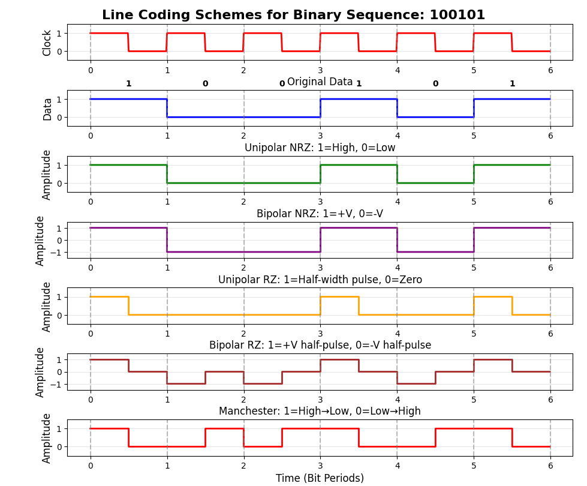
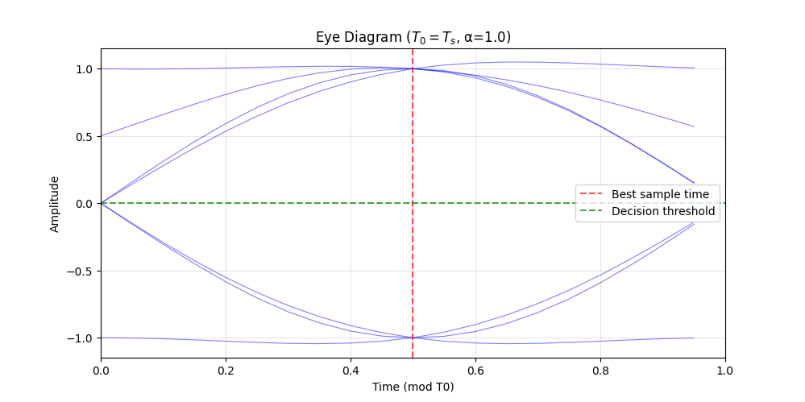
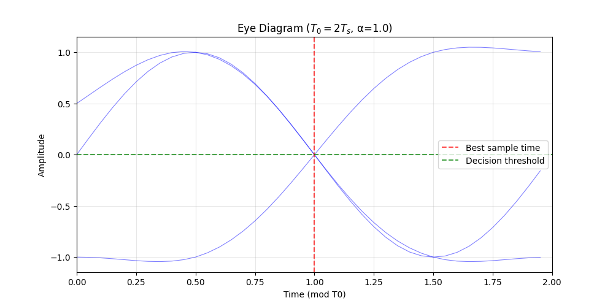

**设计某二进制符号序列为 100101，以矩形脉冲为例，分别画出相应的单极性不归零、双极性不归零、单极性归零、双极性归零、曼彻斯特码波形。**

**一个随机二进制序列为 1010011，“1” 码对应的基带波形是峰值为1的升余弦波形，持续时间为 $T_s$，“0” 码对应的基带波形与 “1” 码的极性相反。当示波器的扫描周期分别为 $T_0 = T_s$ 、 $T_0 = 2T_s$ 时，画出眼图，比较两种眼图的最佳抽样判决时刻、判决门限电平和噪声容限值。**

    
    

| 参数       | T_0 = T_s（单眼图） | T_0 = sT_s（双眼图）          |
| -------- | -------------- | ------------------------ |
| 最佳抽样判决时刻 | ${T_s}/{2}$    | ${T_s}/{2}$、${3T_s}/{2}$ |
| 判决门限电平   | 0              | 0                        |
| 噪声容限值    | 1V             | 1V                       |

**已知信道中在传输四个码组 "11000101" "10001011" "00010111" 和 "00101111" 该码组的最小码距是多少？可检测几位错码？可纠正几位错码？**

$$
d(C_1, C_2) = 4 \\
d(C_1, C_3) = 4 \\
d(C_1, C_4) = 5 \\
d(C_2, C_3) = 4 \\
d(C_2, C_4) = 4 \\
d(C_3, C_4) = 3
$$

所以 $d_{\min} = 3$。

可检测错位数：

$$
e_d \le d_{\min} - 1 = 2
$$

可纠正错位数：

$$
e_c \le [\frac{d_{\min}-1}{2}] = 1
$$

**码长为31的汉明码，其校验元应为多少位？面码效率是多少？**

汉明码满足 (n, k) 的线性分码组，其中 n 为码长，k 为信息位长度，r 为校验位长度，对于能纠正 1 位错误的汉明码，校验位长度 r 必须满足汉明界：

$$
2^r \ge n+1
$$

其中 $2^r$ 是校验子的可能取值数。汉明码是完备码时取等号 $r = 5$。所以校验元为 5 位。面码效率为 $\frac{31 - 5}{31} \times 100\% \approx 83.87\%$

**$(15， 7)$ 循环码由生成多项式 $g(x) = x^8 + x^7 + x^6 + x^4 + 1$ 生成。接收码组 $R(x) = x^{14} + x^5 + x^4 + 1$，该码组在传输中是否会发生错误，为什么？**

**已知一个 $(2, 1, 3)$ 卷积码编码器的输出 c_1、c_2 和输入 m_i 的关系为：**

$$
\begin{align}
c_1 &= m_{i-1} + m_{i-2} \\
c_2 &= m_i + m_{i-1}
\end{align}
$$

**请画出该编码器的电路方框图和网格图。**

**某数字传输系统采用连贯式插入法实现帧同步，插入的巴克码为 11101。请画出该马克码自相关函数 $R(j)$ 的曲线和识别器的原理图。**
