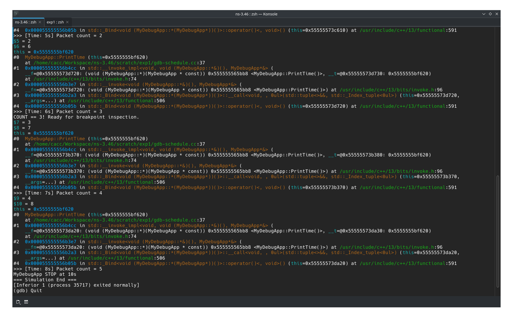

# 网络仿真技术 实验一

## 任务步骤

### 任务 1：环境准备与第一次运行

1. 打开终端，进入ns3主目录（如：~/ns3-workspace/ns-allinone-3.44/ns-3.44）。

2. 运行以下命令，编译并运行<u><a href="https://first.cc/">first.cc</a></u>：

```bash
./ns3 run scratch/first
```

3. 观察运行结果，记录输出信息。

在实验中，可能是不同版本结构问题，无法在 scratch 文件夹中无法找到 first.cc 这个文件，因此在文件夹找了一会后发现。

```
cacc@paradiso [04:26:57 AM] [~/Workspace/ns-3.46] 
-> % ls scratch | grep first
cacc@paradiso [04:31:28 AM] [~/Workspace/ns-3.46] 
-> % find . -name 'first.cc'
./examples/tutorial/first.cc
```

随后运行示例

```
cacc@paradiso [04:31:48 AM] [~/Workspace/ns-3.46] 
-> % ./ns3 run examples/tutorial/first.cc
At time +2s client sent 1024 bytes to 10.1.1.2 port 9
At time +2.00369s server received 1024 bytes from 10.1.1.1 port 49153
At time +2.00369s server sent 1024 bytes to 10.1.1.1 port 49153
At time +2.00737s client received 1024 bytes from 10.1.1.2 port 9
```

### 任务 2：阅读与理解first.cc源代码

1. 使用文本编辑器打开scratch/first.cc。

2. 阅读代码，回答以下问题：
   
   - 程序包含了哪些头文件？这些头文件的作用是什么？
   
   - 主函数中做了哪些事情？请按步骤说明。
   
   - 代码中使用了哪些ns3的命名空间？
   
   - 解释NS_LOG_COMPONENT_DEFINE宏的作用。
   
   - 说明LogComponentEnable的作用。
   
   - 打开 ns-3 Documentation在线文档，

*https://www.nsnam.org/docs/release/3.44/doxygen/index.html* ，试查询LogComponentEnableAll函数，并了解其功能。

```
cacc@paradiso [04:36:09 AM] [~/Workspace/ns-3.46] 
-> % cat examples/tutorial/first.cc | grep include 
#include "ns3/applications-module.h"
#include "ns3/core-module.h"
#include "ns3/internet-module.h"
#include "ns3/network-module.h"
#include "ns3/point-to-point-module.h"
```

- **ns3/applications-module.h**：提供应用层协议和行为的类，例如 UdpEchoServerHelper 和 UdpEchoClientHelper，用于模拟应用层流量（如本代码中的 UDP 回显客户端和服务器）。
- **ns3/core-module.h**：包含 ns-3 的核心功能，如模拟时间管理（Time、Seconds）、模拟器控制（Simulator）、日志记录和命令行解析（CommandLine）。
- **ns3/internet-module.h**：提供互联网协议相关的组件，如 TCP/IP 协议栈，支持 IP 寻址和路由（InternetStackHelper、Ipv4AddressHelper）。
- **ns3/network-module.h**：提供基础网络组件，如节点（NodeContainer）、网络设备（NetDeviceContainer）和数据包处理。
- **ns3/point-to-point-module.h**：提供配置点对点连接的类，如 PointToPointHelper，用于建立两个节点之间的直接连接，并设置数据速率和延迟等属性。

通读文件， main 函数按以下步骤设置并运行了网络模拟

1. 解析命令行参数并初始化，在本例中没有用到。

2. 设置时间分辨率和启用日志
   
   ```cpp
   Time::SetResolution(Time::NS);
   LogComponentEnable("UdpEchoClientApplication", LOG_LEVEL_INFO);
   LogComponentEnable("UdpEchoServerApplication", LOG_LEVEL_INFO);
   ```
   
   时间分辨率设置为纳秒，同时为上面两个组件设置等级为 INFO 的日志

3. 创建节点
   
   ```c
   NodeContainer nodes;
   nodes.Create(2);
   ```

4. 配置点对点链路
   
   ```cpp
   PointToPointHelper pointToPoint;
   pointToPoint.SetDeviceAttribute("DataRate", StringValue("5Mbps"));
   pointToPoint.SetChannelAttribute("Delay", StringValue("2ms"));
   NetDeviceContainer devices;
   devices = pointToPoint.Install(nodes);
   ```
   
   使用 PointToPointHelper 创建并配置两个节点之间的点对点链路，设置速率为 5Mbps，信道延迟 2ms。在节点上安装点对点设备，并存储在 NetDeviceContainer 中。

5. 安装互联网协议栈
   
   ```cpp
   InternetStackHelper stack;
   stack.Install(nodes);
   ```
   
   在两个节点上安装互联网协议栈，以启用通信功能

6. 分配 IP 地址

7. 设置 UDP 回显服务器：
   
   ```cpp
   UdpEchoServerHelper echoServer(9);
   ApplicationContainer serverApps = echoServer.Install(nodes.Get(1));
   serverApps.Start(Seconds(1));
   serverApps.Stop(Seconds(10));
   ```
   
   配置 UDP 回显服务器应用，监听端口 9。然后在 1 号（node1）上安装这个应用，并在一秒时开启，十秒后关闭

8. 设置 UDP 回显客户端
   
   ```cpp
   UdpEchoClientHelper echoClient(interfaces.GetAddress(1), 9);
   echoClient.SetAttribute("MaxPackets", UintegerValue(1));
   echoClient.SetAttribute("Interval", TimeValue(Seconds(1)));
   echoClient.SetAttribute("PacketSize", UintegerValue(1024));
   ApplicationContainer clientApps = echoClient.Install(nodes.Get(0));
   clientApps.Start(Seconds(2));
   clientApps.Stop(Seconds(10));
   ```
   
   在节点 n0 上配置 UDP 回显客户端，向服务器的 IP 地址和端口 9 发送数据包，设置客户端属性，发送一个数据包，发送间隔一秒，数据包大小1024字节，安装客户端，模拟时间2秒启动，10秒停止。

9. 最后安装并清理模拟
   
   ```cpp
   Simulator::Run();
   Simulator::Destroy();
   ```

代码中主要使用了 ns3 命令空间，这是 ns-3 模拟器的核心命名空间。主要还包括了 `Time` 和 `Simulator` 属于模拟中时间控制和模拟器中事件调度的控制。

`LogComponentEnable` 的作用为启用两个应用的INFO等级的日志。

根据

### 任务 3：修改 first.cc 增加日志输出

通过添加 `std::cout` 函数在控制台应用中输出日志。

```diff
  Simulator::Run();
  Simulator::Destroy();
+ std::cout << "Simulation ends" << std::endl;
  return 0;
```

```
cacc@paradiso [01:18:27 PM] [~/Workspace/ns-3.46] 
-> % ./ns3 run examples/tutorial/first.cc
[0/2] Re-checking globbed directories...
[2/3] Linking CXX executable /home/cacc/Workspace/ns-3.46/build/examples/tutorial/ns3.46-first-debug
Simulation begins
At time +2s client sent 1024 bytes to 10.1.1.2 port 9
At time +2.00369s server received 1024 bytes from 10.1.1.1 port 49153
At time +2.00369s server sent 1024 bytes to 10.1.1.1 port 49153
At time +2.00737s client received 1024 bytes from 10.1.1.2 port 9
Simulation ends
```

### 任务 4：修改仿真发送间隔与数据包数量

按照要求首先找到相关行，已经写出，只需要按照要求修改数值即可。

```diff
- echoClient.SetAttribute("MaxPackets", UintegerValue(1));
+ echoClient.SetAttribute("MaxPackets", UintegerValue(3));

- echoClient.SetAttribute("Interval", TimeValue(Seconds(1)));
+ echoClient.SetAttribute("Interval", TimeValue(Seconds(2)));
```

```
cacc@paradiso [02:38:52 PM] [~/Workspace/ns-3.46] 
-> % ./ns3 run examples/tutorial/first.cc
[0/2] Re-checking globbed directories...
[2/3] Linking CXX executable /home/cacc/Workspace/ns-3.46/build/examples/tutorial/ns3.46-first-debug
Simulation begins
At time +2s client sent 1024 bytes to 10.1.1.2 port 9
At time +2.00369s server received 1024 bytes from 10.1.1.1 port 49153
At time +2.00369s server sent 1024 bytes to 10.1.1.1 port 49153
At time +2.00737s client received 1024 bytes from 10.1.1.2 port 9
At time +4s client sent 1024 bytes to 10.1.1.2 port 9
At time +4.00369s server received 1024 bytes from 10.1.1.1 port 49153
At time +4.00369s server sent 1024 bytes to 10.1.1.1 port 49153
At time +4.00737s client received 1024 bytes from 10.1.1.2 port 9
At time +6s client sent 1024 bytes to 10.1.1.2 port 9
At time +6.00369s server received 1024 bytes from 10.1.1.1 port 49153
At time +6.00369s server sent 1024 bytes to 10.1.1.1 port 49153
At time +6.00737s client received 1024 bytes from 10.1.1.2 port 9
Simulation ends
```

### 任务 5：理解 C++ 面向对象

```cpp
NodeContainer nodes;
```

通过 NodeContainer 类创建了 nodes 对象，表示是一个网络节点的容器，从下面可以看出有 Create(int) 方法。

```cpp
PointToPointHelper pointToPoint;
```

点对点通讯助手，设置点对点通讯的相关参数，这里通过 SetDeviceAttribute 方法分别设置了带宽（DataRate）和延迟（Delay）。

```cpp
NetDeviceContainer devices;
```

同 NodeContainer，这里通过 Install 方法将节点装载到设备中。

Ptr 是 ns-3 的引用计数智能指针，类似 `std::shared_ptr`，对象使用完毕自动销毁，防止内存泄漏。

### 任务 6：创建一个新的测试代码

```cpp
#include "ns3/core-module.h"
#include "ns3/network-module.h"
#include "ns3/internet-module.h"
#include "ns3/point-to-point-module.h"
#include "ns3/applications-module.h"

using namespace ns3;

NS_LOG_COMPONENT_DEFINE("Task6Debug");

class MyDebugApp : public Application
{
public:
    MyDebugApp() : m_count(0) {}
    virtual ~MyDebugApp() {}

private:
    virtual void StartApplication() override
    {
        NS_LOG_INFO("MyDebugApp START at " << Simulator::Now().GetSeconds() << "s");
        ScheduleNext();
    }

    virtual void StopApplication() override
    {
        NS_LOG_INFO("MyDebugApp STOP at " << Simulator::Now().GetSeconds() << "s");
    }

    void ScheduleNext()
    {
        if (m_count < 5)
        {
            Simulator::Schedule(Seconds(1.0), &MyDebugApp::PrintTime, this);
        }
    }

    void PrintTime()
    {
        m_count++;
        NS_LOG_INFO(">>> [Time: " << Simulator::Now().GetSeconds()
                    << "s] Packet count = " << m_count);

        // 故意制造一个“可调试点”：当 count == 3 时，触发条件
        if (m_count == 3)
        {
            NS_LOG_WARN("COUNT == 3! Ready for breakpoint inspection.");
            // 可选：取消注释下面这行，制造段错误用于崩溃调试
            // int* p = nullptr; *p = 42;
        }

        ScheduleNext();
    }

    uint32_t m_count;
};

int main(int argc, char* argv[])
{
    Time::SetResolution(Time::NS);
    LogComponentEnable("Task6Debug", LOG_LEVEL_INFO);

    CommandLine cmd(__FILE__);
    cmd.Parse(argc, argv);

    // === 拓扑 ===
    NodeContainer nodes;
    nodes.Create(2);

    PointToPointHelper p2p;
    p2p.SetDeviceAttribute("DataRate", StringValue("5Mbps"));
    p2p.SetChannelAttribute("Delay", StringValue("2ms"));
    NetDeviceContainer devices = p2p.Install(nodes);

    InternetStackHelper stack;
    stack.Install(nodes);

    Ipv4AddressHelper addr;
    addr.SetBase("10.1.1.0", "255.255.255.0");
    Ipv4InterfaceContainer ifaces = addr.Assign(devices);

    // === 服务器 ===
    UdpEchoServerHelper server(9);
    ApplicationContainer serverApp = server.Install(nodes.Get(1));
    serverApp.Start(Seconds(1.0));
    serverApp.Stop(Seconds(10.0));

    // === 客户端 ===
    UdpEchoClientHelper client(ifaces.GetAddress(1), 9);
    client.SetAttribute("MaxPackets", UintegerValue(3));
    client.SetAttribute("Interval", TimeValue(Seconds(2.0)));
    client.SetAttribute("PacketSize", UintegerValue(1024));
    ApplicationContainer clientApp = client.Install(nodes.Get(0));
    clientApp.Start(Seconds(2.0));
    clientApp.Stop(Seconds(10.0));

    // === 自定义 App ===
    Ptr<MyDebugApp> debugApp = CreateObject<MyDebugApp>();
    nodes.Get(0)->AddApplication(debugApp);
    debugApp->SetStartTime(Seconds(3.0));
    debugApp->SetStopTime(Seconds(10.0));

    NS_LOG_INFO("=== Simulation Start ===");
    Simulator::Run();
    Simulator::Destroy();
    NS_LOG_INFO("=== Simulation End ===");

    return 0;
}
```

```
=== Simulation Start ===
MyDebugApp START at 3s
>>> [Time: 4s] Packet count = 1
>>> [Time: 5s] Packet count = 2
>>> [Time: 6s] Packet count = 3
COUNT == 3! Ready for breakpoint inspection.
>>> [Time: 7s] Packet count = 4
>>> [Time: 8s] Packet count = 5
MyDebugApp STOP at 10s
=== Simulation End ===
```

通过 gdb 调试程序

```bash
./ns3 run --gdb scratch/exp1/gdb-schedule.cc
```


```
(gdb) break MyDebugApp::PrintTime
Breakpoint 1 at 0x11bc9: file /home/cacc/Workspace/ns-3.46/scratch/exp1/gdb-schedule.cc, line 37.
(gdb) commands
Type commands for breakpoint(s) 1, one per line.
End with a line saying just "end".
>silent
>print m_count
>print Simulator::Now().GetSeconds()
>info args
>bt 5
>continue
>end
(gdb) run
Starting program: /home/cacc/Workspace/ns-3.46/build/scratch/exp1/ns3.46-gdb-schedule-debug 
[Thread debugging using libthread_db enabled]
Using host libthread_db library "/lib/x86_64-linux-gnu/libthread_db.so.1".
=== Simulation Start ===
MyDebugApp START at 3s
$1 = 0
$2 = 4
this = 0x5555555bf620
#0  MyDebugApp::PrintTime (this=0x5555555bf620)
    at /home/cacc/Workspace/ns-3.46/scratch/exp1/gdb-schedule.cc:37
#1  0x000055555556b4cc in std::__invoke_impl<void, void (MyDebugApp::*&)(), MyDebugApp*&> (
    __f=@0x55555573c380: (void (MyDebugApp::*)(MyDebugApp * const)) 0x555555565bb8 <MyDebugApp::PrintTime()>, __t=@0x55555573c390: 0x5555555bf620)
    at /usr/include/c++/13/bits/invoke.h:74
#2  0x000055555556b3e7 in std::__invoke<void (MyDebugApp::*&)(), MyDebugApp*&> (
    __fn=@0x55555573c380: (void (MyDebugApp::*)(MyDebugApp * const)) 0x555555565bb8 <MyDebugApp::PrintTime()>) at /usr/include/c++/13/bits/invoke.h:96
#3  0x000055555556b2a3 in std::_Bind<void (MyDebugApp::*(MyDebugApp*))()>::__call<void, , 0ul>(std::tuple<>&&, std::_Index_tuple<0ul>) (this=0x55555573c380, 
    __args=...) at /usr/include/c++/13/functional:506
#4  0x000055555556b05b in std::_Bind<void (MyDebugApp::*(MyDebugApp*))()>::operator()<, void>() (this=0x55555573c380) at /usr/include/c++/13/functional:591
>>> [Time: 4s] Packet count = 1
$3 = 1
$4 = 5
this = 0x5555555bf620
#0  MyDebugApp::PrintTime (this=0x5555555bf620)
    at /home/cacc/Workspace/ns-3.46/scratch/exp1/gdb-schedule.cc:37
#1  0x000055555556b4cc in std::__invoke_impl<void, void (MyDebugApp::*&)(), MyDebugApp*&> (
    __f=@0x55555573c610: (void (MyDebugApp::*)(MyDebugApp * const)) 0x555555565bb8 <MyDebugApp::PrintTime()>, __t=@0x55555573c620: 0x5555555bf620)
    at /usr/include/c++/13/bits/invoke.h:74
#2  0x000055555556b3e7 in std::__invoke<void (MyDebugApp::*&)(), MyDebugApp*&> (
    __fn=@0x55555573c610: (void (MyDebugApp::*)(MyDebugApp * const)) 0x555555565bb8 <MyDebugApp::PrintTime()>) at /usr/include/c++/13/bits/invoke.h:96
#3  0x000055555556b2a3 in std::_Bind<void (MyDebugApp::*(MyDebugApp*))()>::__call<void, , 0ul>(std::tuple<>&&, std::_Index_tuple<0ul>) (this=0x55555573c610, 
    __args=...) at /usr/include/c++/13/functional:506
#4  0x000055555556b05b in std::_Bind<void (MyDebugApp::*(MyDebugApp*))()>::operator()<, void>() (this=0x55555573c610) at /usr/include/c++/13/functional:591
>>> [Time: 5s] Packet count = 2
$5 = 2
$6 = 6
this = 0x5555555bf620
#0  MyDebugApp::PrintTime (this=0x5555555bf620)
    at /home/cacc/Workspace/ns-3.46/scratch/exp1/gdb-schedule.cc:37
#1  0x000055555556b4cc in std::__invoke_impl<void, void (MyDebugApp::*&)(), MyDebugApp*&> (
    __f=@0x55555573d720: (void (MyDebugApp::*)(MyDebugApp * const)) 0x555555565bb8 <MyDebugApp::PrintTime()>, __t=@0x55555573d730: 0x5555555bf620)
    at /usr/include/c++/13/bits/invoke.h:74
#2  0x000055555556b3e7 in std::__invoke<void (MyDebugApp::*&)(), MyDebugApp*&> (
    __fn=@0x55555573d720: (void (MyDebugApp::*)(MyDebugApp * const)) 0x555555565bb8 <MyDebugApp::PrintTime()>) at /usr/include/c++/13/bits/invoke.h:96
#3  0x000055555556b2a3 in std::_Bind<void (MyDebugApp::*(MyDebugApp*))()>::__call<void, , 0ul>(std::tuple<>&&, std::_Index_tuple<0ul>) (this=0x55555573d720, 
    __args=...) at /usr/include/c++/13/functional:506
#4  0x000055555556b05b in std::_Bind<void (MyDebugApp::*(MyDebugApp*))()>::operator()<, void>() (this=0x55555573d720) at /usr/include/c++/13/functional:591
>>> [Time: 6s] Packet count = 3
COUNT == 3! Ready for breakpoint inspection.
$7 = 3
$8 = 7
this = 0x5555555bf620
#0  MyDebugApp::PrintTime (this=0x5555555bf620)
    at /home/cacc/Workspace/ns-3.46/scratch/exp1/gdb-schedule.cc:37
#1  0x000055555556b4cc in std::__invoke_impl<void, void (MyDebugApp::*&)(), MyDebugApp*&> (
    __f=@0x55555573b370: (void (MyDebugApp::*)(MyDebugApp * const)) 0x555555565bb8 <MyDebugApp::PrintTime()>, __t=@0x55555573b380: 0x5555555bf620)
    at /usr/include/c++/13/bits/invoke.h:74
#2  0x000055555556b3e7 in std::__invoke<void (MyDebugApp::*&)(), MyDebugApp*&> (
    __fn=@0x55555573b370: (void (MyDebugApp::*)(MyDebugApp * const)) 0x555555565bb8 <MyDebugApp::PrintTime()>) at /usr/include/c++/13/bits/invoke.h:96
#3  0x000055555556b2a3 in std::_Bind<void (MyDebugApp::*(MyDebugApp*))()>::__call<void, , 0ul>(std::tuple<>&&, std::_Index_tuple<0ul>) (this=0x55555573b370, 
    __args=...) at /usr/include/c++/13/functional:506
#4  0x000055555556b05b in std::_Bind<void (MyDebugApp::*(MyDebugApp*))()>::operator()<, void>() (this=0x55555573b370) at /usr/include/c++/13/functional:591
>>> [Time: 7s] Packet count = 4
$9 = 4
$10 = 8
this = 0x5555555bf620
#0  MyDebugApp::PrintTime (this=0x5555555bf620)
    at /home/cacc/Workspace/ns-3.46/scratch/exp1/gdb-schedule.cc:37
#1  0x000055555556b4cc in std::__invoke_impl<void, void (MyDebugApp::*&)(), MyDebugApp*&> (
    __f=@0x55555573da20: (void (MyDebugApp::*)(MyDebugApp * const)) 0x555555565bb8 <MyDebugApp::PrintTime()>, __t=@0x55555573da30: 0x5555555bf620)
    at /usr/include/c++/13/bits/invoke.h:74
#2  0x000055555556b3e7 in std::__invoke<void (MyDebugApp::*&)(), MyDebugApp*&> (
    __fn=@0x55555573da20: (void (MyDebugApp::*)(MyDebugApp * const)) 0x555555565bb8 <MyDebugApp::PrintTime()>) at /usr/include/c++/13/bits/invoke.h:96
#3  0x000055555556b2a3 in std::_Bind<void (MyDebugApp::*(MyDebugApp*))()>::__call<void, , 0ul>(std::tuple<>&&, std::_Index_tuple<0ul>) (this=0x55555573da20, 
    __args=...) at /usr/include/c++/13/functional:506
#4  0x000055555556b05b in std::_Bind<void (MyDebugApp::*(MyDebugApp*))()>::operator()<, void>() (this=0x55555573da20) at /usr/include/c++/13/functional:591
>>> [Time: 8s] Packet count = 5
MyDebugApp STOP at 10s
=== Simulation End ===
[Inferior 1 (process 35717) exited normally]
```



### 任务 8：生成 trace 文件

```diff
  // === 服务器 ===
  UdpEchoServerHelper server(9);
  ApplicationContainer serverApp = server.Install(nodes.Get(1));
  serverApp.Start(Seconds(1.0));
  serverApp.Stop(Seconds(10.0));

  // === 客户端 ===
  UdpEchoClientHelper client(ifaces.GetAddress(1), 9);
  client.SetAttribute("MaxPackets", UintegerValue(3));
  client.SetAttribute("Interval", TimeValue(Seconds(2.0)));
  client.SetAttribute("PacketSize", UintegerValue(1024));
  ApplicationContainer clientApp = client.Install(nodes.Get(0));
  clientApp.Start(Seconds(2.0));
  clientApp.Stop(Seconds(10.0));

  // === 自定义 App ===
  Ptr<MyDebugApp> debugApp = CreateObject<MyDebugApp>();
  nodes.Get(0)->AddApplication(debugApp);
  debugApp->SetStartTime(Seconds(3.0));
  debugApp->SetStopTime(Seconds(10.0));

  NS_LOG_INFO("=== Simulation Start ===");
+
+ AsciiTraceHelper ascii;
+ p2p.EnableAsciiAll(ascii.CreateFileStream("task8-p2p.tr"));
+ // p2p.EnablePcapAll("task8-p2p");  // 可选：生成 .pcap
+
  Simulator::Run();
  Simulator::Destroy();
  NS_LOG_INFO("=== Simulation End ===");

  return 0;
```

运行完成后，当前目录会出现 task8-p2p.tr 查看内容

```
+ 2 /NodeList/0/DeviceList/0/$ns3::PointToPointNetDevice/TxQueue/Enqueue ns3::PppHeader (Point-to-Point Protocol: IP (0x0021)) ns3::Ipv4Header (tos 0x0 DSCP Default ECN Not-ECT ttl 64 id 0 protocol 17 offset (bytes) 0 flags [none] length: 1052 10.1.1.1 > 10.1.1.2) ns3::UdpHeader (length: 1032 49153 > 9) Payload (size=1024)
- 2 /NodeList/0/DeviceList/0/$ns3::PointToPointNetDevice/TxQueue/Dequeue ns3::PppHeader (Point-to-Point Protocol: IP (0x0021)) ns3::Ipv4Header (tos 0x0 DSCP Default ECN Not-ECT ttl 64 id 0 protocol 17 offset (bytes) 0 flags [none] length: 1052 10.1.1.1 > 10.1.1.2) ns3::UdpHeader (length: 1032 49153 > 9) Payload (size=1024)
r 2.00369 /NodeList/1/DeviceList/0/$ns3::PointToPointNetDevice/MacRx ns3::PppHeader (Point-to-Point Protocol: IP (0x0021)) ns3::Ipv4Header (tos 0x0 DSCP Default ECN Not-ECT ttl 64 id 0 protocol 17 offset (bytes) 0 flags [none] length: 1052 10.1.1.1 > 10.1.1.2) ns3::UdpHeader (length: 1032 49153 > 9) Payload (size=1024)
+ 2.00369 /NodeList/1/DeviceList/0/$ns3::PointToPointNetDevice/TxQueue/Enqueue ns3::PppHeader (Point-to-Point Protocol: IP (0x0021)) ns3::Ipv4Header (tos 0x0 DSCP Default ECN Not-ECT ttl 64 id 0 protocol 17 offset (bytes) 0 flags [none] length: 1052 10.1.1.2 > 10.1.1.1) ns3::UdpHeader (length: 1032 9 > 49153) Payload (size=1024)
- 2.00369 /NodeList/1/DeviceList/0/$ns3::PointToPointNetDevice/TxQueue/Dequeue ns3::PppHeader (Point-to-Point Protocol: IP (0x0021)) ns3::Ipv4Header (tos 0x0 DSCP Default ECN Not-ECT ttl 64 id 0 protocol 17 offset (bytes) 0 flags [none] length: 1052 10.1.1.2 > 10.1.1.1) ns3::UdpHeader (length: 1032 9 > 49153) Payload (size=1024)
r 2.00737 /NodeList/0/DeviceList/0/$ns3::PointToPointNetDevice/MacRx ns3::PppHeader (Point-to-Point Protocol: IP (0x0021)) ns3::Ipv4Header (tos 0x0 DSCP Default ECN Not-ECT ttl 64 id 0 protocol 17 offset (bytes) 0 flags [none] length: 1052 10.1.1.2 > 10.1.1.1) ns3::UdpHeader (length: 1032 9 > 49153) Payload (size=1024)
+ 4 /NodeList/0/DeviceList/0/$ns3::PointToPointNetDevice/TxQueue/Enqueue ns3::PppHeader (Point-to-Point Protocol: IP (0x0021)) ns3::Ipv4Header (tos 0x0 DSCP Default ECN Not-ECT ttl 64 id 1 protocol 17 offset (bytes) 0 flags [none] length: 1052 10.1.1.1 > 10.1.1.2) ns3::UdpHeader (length: 1032 49153 > 9) Payload (size=1024)
- 4 /NodeList/0/DeviceList/0/$ns3::PointToPointNetDevice/TxQueue/Dequeue ns3::PppHeader (Point-to-Point Protocol: IP (0x0021)) ns3::Ipv4Header (tos 0x0 DSCP Default ECN Not-ECT ttl 64 id 1 protocol 17 offset (bytes) 0 flags [none] length: 1052 10.1.1.1 > 10.1.1.2) ns3::UdpHeader (length: 1032 49153 > 9) Payload (size=1024)
r 4.00369 /NodeList/1/DeviceList/0/$ns3::PointToPointNetDevice/MacRx ns3::PppHeader (Point-to-Point Protocol: IP (0x0021)) ns3::Ipv4Header (tos 0x0 DSCP Default ECN Not-ECT ttl 64 id 1 protocol 17 offset (bytes) 0 flags [none] length: 1052 10.1.1.1 > 10.1.1.2) ns3::UdpHeader (length: 1032 49153 > 9) Payload (size=1024)
+ 4.00369 /NodeList/1/DeviceList/0/$ns3::PointToPointNetDevice/TxQueue/Enqueue ns3::PppHeader (Point-to-Point Protocol: IP (0x0021)) ns3::Ipv4Header (tos 0x0 DSCP Default ECN Not-ECT ttl 64 id 1 protocol 17 offset (bytes) 0 flags [none] length: 1052 10.1.1.2 > 10.1.1.1) ns3::UdpHeader (length: 1032 9 > 49153) Payload (size=1024)
- 4.00369 /NodeList/1/DeviceList/0/$ns3::PointToPointNetDevice/TxQueue/Dequeue ns3::PppHeader (Point-to-Point Protocol: IP (0x0021)) ns3::Ipv4Header (tos 0x0 DSCP Default ECN Not-ECT ttl 64 id 1 protocol 17 offset (bytes) 0 flags [none] length: 1052 10.1.1.2 > 10.1.1.1) ns3::UdpHeader (length: 1032 9 > 49153) Payload (size=1024)
r 4.00737 /NodeList/0/DeviceList/0/$ns3::PointToPointNetDevice/MacRx ns3::PppHeader (Point-to-Point Protocol: IP (0x0021)) ns3::Ipv4Header (tos 0x0 DSCP Default ECN Not-ECT ttl 64 id 1 protocol 17 offset (bytes) 0 flags [none] length: 1052 10.1.1.2 > 10.1.1.1) ns3::UdpHeader (length: 1032 9 > 49153) Payload (size=1024)
+ 6 /NodeList/0/DeviceList/0/$ns3::PointToPointNetDevice/TxQueue/Enqueue ns3::PppHeader (Point-to-Point Protocol: IP (0x0021)) ns3::Ipv4Header (tos 0x0 DSCP Default ECN Not-ECT ttl 64 id 2 protocol 17 offset (bytes) 0 flags [none] length: 1052 10.1.1.1 > 10.1.1.2) ns3::UdpHeader (length: 1032 49153 > 9) Payload (size=1024)
- 6 /NodeList/0/DeviceList/0/$ns3::PointToPointNetDevice/TxQueue/Dequeue ns3::PppHeader (Point-to-Point Protocol: IP (0x0021)) ns3::Ipv4Header (tos 0x0 DSCP Default ECN Not-ECT ttl 64 id 2 protocol 17 offset (bytes) 0 flags [none] length: 1052 10.1.1.1 > 10.1.1.2) ns3::UdpHeader (length: 1032 49153 > 9) Payload (size=1024)
r 6.00369 /NodeList/1/DeviceList/0/$ns3::PointToPointNetDevice/MacRx ns3::PppHeader (Point-to-Point Protocol: IP (0x0021)) ns3::Ipv4Header (tos 0x0 DSCP Default ECN Not-ECT ttl 64 id 2 protocol 17 offset (bytes) 0 flags [none] length: 1052 10.1.1.1 > 10.1.1.2) ns3::UdpHeader (length: 1032 49153 > 9) Payload (size=1024)
+ 6.00369 /NodeList/1/DeviceList/0/$ns3::PointToPointNetDevice/TxQueue/Enqueue ns3::PppHeader (Point-to-Point Protocol: IP (0x0021)) ns3::Ipv4Header (tos 0x0 DSCP Default ECN Not-ECT ttl 64 id 2 protocol 17 offset (bytes) 0 flags [none] length: 1052 10.1.1.2 > 10.1.1.1) ns3::UdpHeader (length: 1032 9 > 49153) Payload (size=1024)
- 6.00369 /NodeList/1/DeviceList/0/$ns3::PointToPointNetDevice/TxQueue/Dequeue ns3::PppHeader (Point-to-Point Protocol: IP (0x0021)) ns3::Ipv4Header (tos 0x0 DSCP Default ECN Not-ECT ttl 64 id 2 protocol 17 offset (bytes) 0 flags [none] length: 1052 10.1.1.2 > 10.1.1.1) ns3::UdpHeader (length: 1032 9 > 49153) Payload (size=1024)
r 6.00737 /NodeList/0/DeviceList/0/$ns3::PointToPointNetDevice/MacRx ns3::PppHeader (Point-to-Point Protocol: IP (0x0021)) ns3::Ipv4Header (tos 0x0 DSCP Default ECN Not-ECT ttl 64 id 2 protocol 17 offset (bytes) 0 flags [none] length: 1052 10.1.1.2 > 10.1.1.1) ns3::UdpHeader (length: 1032 9 > 49153) Payload (size=1024)https://github.com/UJS-IoT2023/UJS-Android-HeatfeltTutoring
```
