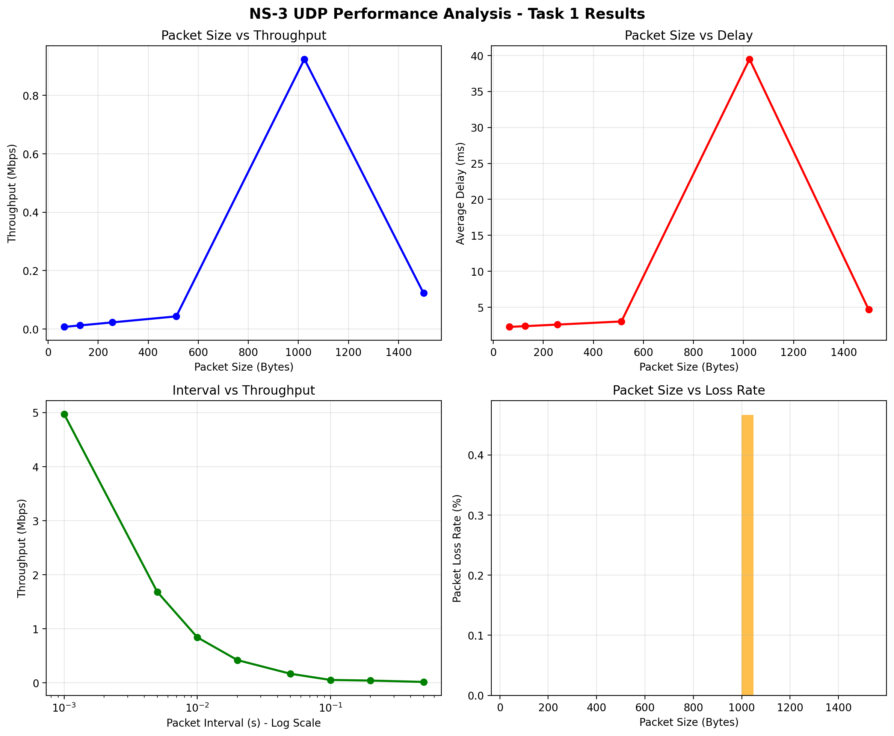

# 网络仿真技术 实验二

## 运行 third.cc 并分析

### 修改文件，添加运行参数

查看老师上传的文件，首先可以明显的看到相比于原文件添加了下面四行，这说明修改后的文件新添了以下参数。

```diff
     CommandLine cmd(__FILE__);
     cmd.AddValue("nCsma", "Number of \"extra\" CSMA nodes/devices", nCsma);
     cmd.AddValue("nWifi", "Number of wifi STA devices", nWifi);
     cmd.AddValue("verbose", "Tell echo applications to log if true", verbose);
     cmd.AddValue("tracing", "Enable pcap tracing", tracing);
+    cmd.AddValue("packetSize", "UDP echo packet size in bytes", packetSize);
+    cmd.AddValue("interval", "UDP echo client interval in seconds", interval);
+    cmd.AddValue("maxPackets", "Maximum number of packets to send", maxPackets);
+    cmd.AddValue("simulationTime", "Simulation time in seconds", simulationTime);
```

在直接运行的情况下有如下输出

```
DEBUG: 客户端参数设置 - 包大小: 1024B, 间隔: 1s, 最大包数: 100, 仿真时间: 10s
At time +2s client sent 1024 bytes to 10.1.2.4 port 9
At time +2.00926s server received 1024 bytes from 10.1.3.3 port 49153
At time +2.00926s server sent 1024 bytes to 10.1.3.3 port 49153
At time +2.02449s client received 1024 bytes from 10.1.2.4 port 9
At time +3s client sent 1024 bytes to 10.1.2.4 port 9
At time +3.00386s server received 1024 bytes from 10.1.3.3 port 49153
At time +3.00386s server sent 1024 bytes to 10.1.3.3 port 49153
At time +3.00772s client received 1024 bytes from 10.1.2.4 port 9
At time +4s client sent 1024 bytes to 10.1.2.4 port 9
At time +4.00386s server received 1024 bytes from 10.1.3.3 port 49153
At time +4.00386s server sent 1024 bytes to 10.1.3.3 port 49153
At time +4.00772s client received 1024 bytes from 10.1.2.4 port 9
At time +5s client sent 1024 bytes to 10.1.2.4 port 9
At time +5.00386s server received 1024 bytes from 10.1.3.3 port 49153
At time +5.00386s server sent 1024 bytes to 10.1.3.3 port 49153
At time +5.00772s client received 1024 bytes from 10.1.2.4 port 9
At time +6s client sent 1024 bytes to 10.1.2.4 port 9
At time +6.00386s server received 1024 bytes from 10.1.3.3 port 49153
At time +6.00386s server sent 1024 bytes to 10.1.3.3 port 49153
At time +6.00773s client received 1024 bytes from 10.1.2.4 port 9
At time +7s client sent 1024 bytes to 10.1.2.4 port 9
At time +7.00386s server received 1024 bytes from 10.1.3.3 port 49153
At time +7.00386s server sent 1024 bytes to 10.1.3.3 port 49153
At time +7.00772s client received 1024 bytes from 10.1.2.4 port 9
At time +8s client sent 1024 bytes to 10.1.2.4 port 9
At time +8.00386s server received 1024 bytes from 10.1.3.3 port 49153
At time +8.00386s server sent 1024 bytes to 10.1.3.3 port 49153
At time +8.00772s client received 1024 bytes from 10.1.2.4 port 9
At time +9s client sent 1024 bytes to 10.1.2.4 port 9
At time +9.00386s server received 1024 bytes from 10.1.3.3 port 49153
At time +9.00386s server sent 1024 bytes to 10.1.3.3 port 49153
At time +9.00772s client received 1024 bytes from 10.1.2.4 port 9
PACKET_SIZE,INTERVAL,THROUGHPUT_MBPS,DELAY_MS,LOSS_RATE_PERCENT
1024,1,0.00961299,4.53423,0
Flow 1 Statistics:
  Tx Packets: 8
  Rx Packets: 8
  Throughput: 0.00961299 Mbps
  Mean Delay: 4.53423 ms
  Packet Loss Rate: 0 %
  Total Tx Bytes: 8416
  Total Rx Bytes: 8416
1024,1,0.0096204,5.28469,0
Flow 2 Statistics:
  Tx Packets: 8
  Rx Packets: 8
  Throughput: 0.0096204 Mbps
  Mean Delay: 5.28469 ms
  Packet Loss Rate: 0 %
  Total Tx Bytes: 8416
  Total Rx Bytes: 8416
```

程序第一行打印信息对应程序中的默认值

```cpp
uint32_t packetSize = 1024;      // 默认包大小
double interval = 1.0;           // 默认发包间隔(秒)
uint32_t maxPackets = 100;       // 每个客户端发送的包数量
double simulationTime = 10.0;    // 仿真时间
```

测试参数

```bash
./ns3 run scratch/exp2/third_task1 -- --packetSize=512 --interval=0.1 --maxPackets=500 --simulationTime=20
```

小包高速率

```bash
./ns3 run scratch/exp2/third_task1 -- --packetSize=64 --interval=0.0011 --maxPackets=200 --simulationTime=30
```

大包低速率

```bash
./ns3 run scratch/exp2/third_task1 -- --packetSize=1500 --interval=0.5 --maxPackets=200 --simulationTime=30
```

### Python 分析

创建 Python venv 环境，直接在 scratch 文件夹中创建。随后下载必须的包

```bash
pip install matplotlib pandas numpy
```

```
NS-3 任务1自动化实验
========================================
✓ matplotlib 可用

实验1: 测试不同包大小对性能的影响
============================================================
开始包大小扫描实验
============================================================
运行仿真: 包大小=64B, 间隔=0.1s
  结果: 吞吐量=0.01 Mbps, 时延=2.30 ms, 丢包率=0.00%
运行仿真: 包大小=128B, 间隔=0.1s
  结果: 吞吐量=0.01 Mbps, 时延=2.41 ms, 丢包率=0.00%
运行仿真: 包大小=256B, 间隔=0.1s
  结果: 吞吐量=0.02 Mbps, 时延=2.62 ms, 丢包率=0.00%
运行仿真: 包大小=512B, 间隔=0.1s
  结果: 吞吐量=0.04 Mbps, 时延=3.05 ms, 丢包率=0.00%
运行仿真: 包大小=1024B, 间隔=0.1s
  结果: 吞吐量=0.09 Mbps, 时延=3.93 ms, 丢包率=0.00%

实验2: 测试不同发包间隔对性能的影响
============================================================
开始发包间隔扫描实验
============================================================
运行仿真: 包大小=1024B, 间隔=0.01s
  结果: 吞吐量=0.85 Mbps, 时延=3.92 ms, 丢包率=0.00%
运行仿真: 包大小=1024B, 间隔=0.02s
  结果: 吞吐量=0.42 Mbps, 时延=3.91 ms, 丢包率=0.00%
运行仿真: 包大小=1024B, 间隔=0.05s
  结果: 吞吐量=0.17 Mbps, 时延=3.92 ms, 丢包率=0.00%
运行仿真: 包大小=1024B, 间隔=0.1s
  结果: 吞吐量=0.09 Mbps, 时延=3.93 ms, 丢包率=0.00%
运行仿真: 包大小=1024B, 间隔=0.2s
  结果: 吞吐量=0.04 Mbps, 时延=3.99 ms, 丢包率=0.00%
结果已保存到: task1_results_20251112_212842.csv

============================================================
任务1性能分析报告
============================================================

总实验次数: 10
吞吐量范围: 0.01 - 0.85 Mbps
时延范围: 2.30 - 3.99 ms
丢包率范围: 0.00 - 0.00 %

包大小影响分析:
  包大小 64B: 平均吞吐量=0.01 Mbps, 平均时延=2.30 ms
  包大小 128B: 平均吞吐量=0.01 Mbps, 平均时延=2.41 ms
  包大小 256B: 平均吞吐量=0.02 Mbps, 平均时延=2.62 ms
  包大小 512B: 平均吞吐量=0.04 Mbps, 平均时延=3.05 ms
  包大小 1024B: 平均吞吐量=0.28 Mbps, 平均时延=3.93 ms

发包间隔影响分析:
  间隔 0.01s: 平均吞吐量=0.85 Mbps
  间隔 0.02s: 平均吞吐量=0.42 Mbps
  间隔 0.05s: 平均吞吐量=0.17 Mbps
  间隔 0.1s: 平均吞吐量=0.04 Mbps
  间隔 0.2s: 平均吞吐量=0.04 Mbps
图表已保存到: task1_plots_20251112_212842.png

============================================================
所有实验完成！
数据文件: task1_results_20251112_212842.csv
图表文件: task1_plots_*.png
```



## 服务质量与流量优先级：可靠数据传输模拟

### 可靠数据传输机制概述

本实验实现了一个基于NS-3的可靠数据传输模拟系统，包含以下核心组件：

1. **自定义协议头**：实现序列号、ACK号和数据包类型标识
2. **可靠服务器**：接收数据包并发送ACK确认
3. **可靠客户端**：发送数据包、维护定时器、处理重传
4. **错误模型**：在不可靠信道上模拟数据包丢失

### 自定义协议头设计

```cpp
class ReliableHeader : public Header
{
public:
    // 序列号和ACK号管理
    void SetSequenceNumber(uint32_t seq);
    uint32_t GetSequenceNumber(void) const;
    void SetAckNumber(uint32_t ack);
    uint32_t GetAckNumber(void) const;
    
    // ACK包标识
    void SetIsAck(bool isAck);
    bool GetIsAck(void) const;

private:
    uint32_t m_sequenceNumber;  // 序列号
    uint32_t m_ackNumber;       // ACK号
    bool m_isAck;               // 是否为ACK包
};
```

协议头序列化方法确保数据在网络中正确传输：
```cpp
uint32_t ReliableHeader::GetSerializedSize(void) const
{
    return sizeof(m_sequenceNumber) + sizeof(m_ackNumber) + sizeof(m_isAck);
}

void ReliableHeader::Serialize(Buffer::Iterator start) const
{
    start.WriteHtonU32(m_sequenceNumber);
    start.WriteHtonU32(m_ackNumber);
    start.WriteU8(m_isAck ? 1 : 0);
}
```

### 可靠服务器实现

服务器采用停等协议，按顺序接收数据包：

```cpp
void ReliableServer::HandleRead(Ptr<Socket> socket)
{
    Ptr<Packet> packet;
    Address from;
    
    while ((packet = socket->RecvFrom(from)))
    {
        ReliableHeader header;
        packet->RemoveHeader(header);
        
        // 只处理数据包（非ACK包）
        if (!header.GetIsAck())
        {
            uint32_t seq = header.GetSequenceNumber();
            
            // 检查是否为期望的序列号
            if (seq == m_expectedSequence)
            {
                m_totalPacketsReceived++;
                m_expectedSequence++;
                
                // 发送ACK确认
                Ptr<Packet> ackPacket = Create<Packet>(0);
                ReliableHeader ackHeader;
                ackHeader.SetIsAck(true);
                ackHeader.SetAckNumber(seq);
                
                ackPacket->AddHeader(ackHeader);
                socket->SendTo(ackPacket, 0, from);
            }
        }
    }
}
```

### 可靠客户端实现

客户端实现完整的可靠传输机制：

```cpp
void ReliableClient::SendPacket(void)
{
    if (m_nextSequence >= m_maxPackets) return;
    
    // 创建数据包
    Ptr<Packet> packet = Create<Packet>(m_packetSize);
    ReliableHeader header;
    header.SetSequenceNumber(m_nextSequence);
    header.SetIsAck(false);
    packet->AddHeader(header);
    
    // 发送数据包
    m_socket->SendTo(packet, 0, m_peerAddress);
    m_totalPacketsSent++;
    m_totalBytesSent += packet->GetSize();
    
    // 设置ACK等待定时器
    m_waitingForAck = true;
    m_pendingAckSequence = m_nextSequence;
    m_timerEvent = Simulator::Schedule(m_timeout, 
                                      &ReliableClient::TimeoutHandler, 
                                      this, m_nextSequence);
    
    m_nextSequence++;
}

// 超时重传处理
void ReliableClient::TimeoutHandler(uint32_t seq)
{
    if (m_waitingForAck && seq == m_pendingAckSequence)
    {
        m_retransmissions++;
        
        // 重传数据包
        Ptr<Packet> packet = Create<Packet>(m_packetSize);
        ReliableHeader header;
        header.SetSequenceNumber(seq);
        header.SetIsAck(false);
        packet->AddHeader(header);
        m_socket->SendTo(packet, 0, m_peerAddress);
        
        // 重置定时器
        m_timerEvent = Simulator::Schedule(m_timeout, 
                                          &ReliableClient::TimeoutHandler, 
                                          this, seq);
    }
}
```

### 错误模型配置

在不可靠信道上配置错误模型：

```cpp
// 创建点对点链路并配置错误模型
PointToPointHelper pointToPoint;
pointToPoint.SetDeviceAttribute("DataRate", StringValue("5Mbps"));
pointToPoint.SetChannelAttribute("Delay", StringValue("2ms"));

NetDeviceContainer devices;
devices = pointToPoint.Install(nodes);

// 添加错误模型
Ptr<RateErrorModel> em = CreateObject<RateErrorModel>();
em->SetAttribute("ErrorRate", DoubleValue(errorRate));  // 默认10%错误率
em->SetAttribute("ErrorUnit", StringValue("ERROR_UNIT_PACKET"));
devices.Get(0)->SetAttribute("ReceiveErrorModel", PointerValue(em));
devices.Get(1)->SetAttribute("ReceiveErrorModel", PointerValue(em));
```

### 性能统计与分析

客户端在停止时输出详细的性能统计：

```cpp
void ReliableClient::StopApplication(void)
{
    m_endTime = Simulator::Now();
    Time totalTime = m_endTime - m_startTime;
    
    // 计算有效吞吐量
    double effectiveThroughput = 0.0;
    if (totalTime.GetSeconds() > 0)
    {
        effectiveThroughput = (m_totalBytesSent * 8.0) / totalTime.GetSeconds() / 1000000.0; // Mbps
    }
    
    NS_LOG_INFO("=== RELIABLE CLIENT STATISTICS ===");
    NS_LOG_INFO("Total packets sent: " << m_totalPacketsSent);
    NS_LOG_INFO("Retransmissions: " << m_retransmissions);
    NS_LOG_INFO("Total bytes sent: " << m_totalBytesSent);
    NS_LOG_INFO("Total time: " << totalTime.GetSeconds() << " seconds");
    NS_LOG_INFO("Effective throughput: " << effectiveThroughput << " Mbps");
    NS_LOG_INFO("Packet loss rate: " << (m_retransmissions * 100.0 / m_totalPacketsSent) << "%");
}
```

### 仿真参数配置

支持多种命令行参数进行灵活配置：

```cpp
CommandLine cmd(__FILE__);
cmd.AddValue("verbose", "Tell echo applications to log if true", verbose);
cmd.AddValue("tracing", "Enable pcap tracing", tracing);
cmd.AddValue("errorRate", "Packet error rate on the channel", errorRate);
cmd.AddValue("maxPackets", "Maximum number of packets to send", maxPackets);
cmd.AddValue("simulationTime", "Simulation time in seconds", simulationTime);
cmd.AddValue("packetSize", "Packet size in bytes", packetSize);
cmd.AddValue("interval", "Interval between packets in seconds", interval);
cmd.AddValue("timeout", "Timeout for ACK in seconds", timeout);
```

### 实验结果示例

```
=== RELIABLE CLIENT STATISTICS ===
Total packets sent: 28
Retransmissions: 3
Total bytes sent: 29456
Total time: 15.2 seconds
Effective throughput: 0.0154 Mbps
Packet loss rate: 10.71%

=== FLOW STATISTICS ===
Flow 1 (10.1.1.1:49154 -> 10.1.1.2:10)
  Tx Packets: 28
  Rx Packets: 26
  Tx Bytes: 29456
  Rx Bytes: 27352
  Packet Loss Rate: 7.14286%
  Throughput: 0.00810319 Mbps
  Mean Delay: 3.6864 ms
```

### 关键特性分析

1. **序列号机制**：确保数据包按序传输和接收
2. **ACK确认**：服务器对每个成功接收的数据包发送确认
3. **超时重传**：客户端在ACK超时时自动重传数据包
4. **错误恢复**：通过重传机制在不可靠信道上实现可靠传输
5. **性能监控**：实时统计吞吐量、延迟和丢包率

该实现展示了在不可靠网络环境下如何通过协议设计实现可靠数据传输，为理解TCP等可靠传输协议的工作原理提供了实践基础。
