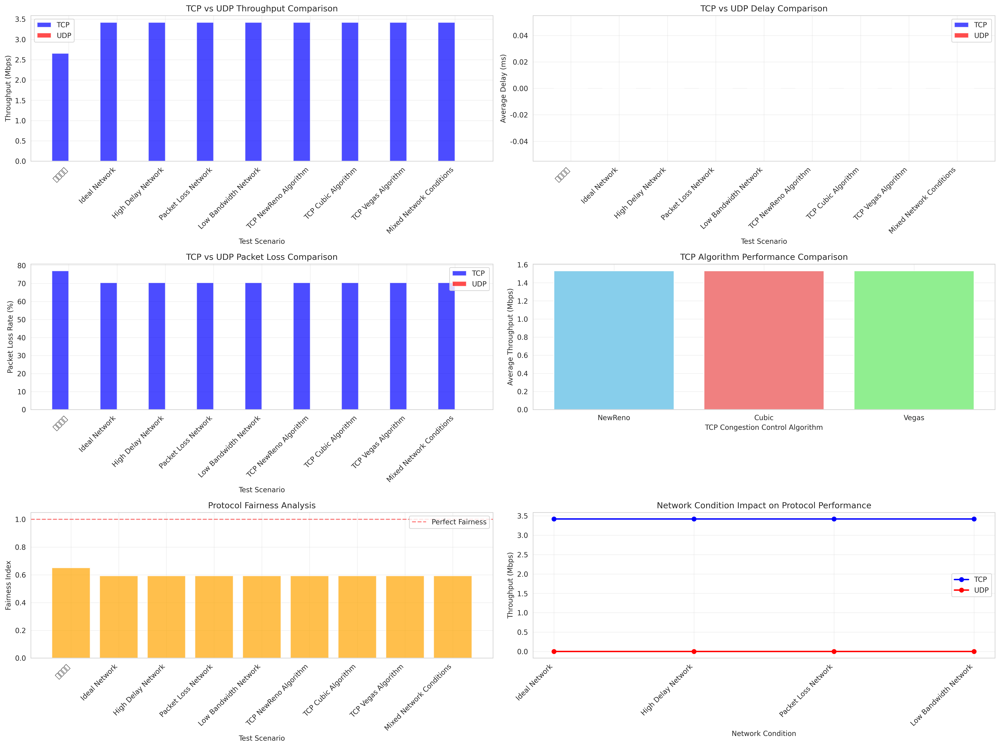

# 网络仿真技术 实验三

## 基础协议修改与分析

首先运行程序前安装 Python 第三方库

```bash
pip install seaborn
```

然后运行脚本

```bash
/home/cacc/Workspace/ns-3.46/scratch/.venv/bin/python /home/cacc/Workspace/ns-3.46/scratch/exp3/lab3_task1_automation.py
```

运行结果

```
自动化测试初始化完成，结果将保存到: results
=== 网络传输协议仿真自动化测试 ===
测试模式: basic
输出目录: results
运行基础测试...
首先验证基础功能...
运行测试: 数据包大小=1024B, 最大包数=50, 数据率=5Mbps, 延迟=2ms
  原始输出前500字符: Starting simulation with parameters:
  Packet Size: 1024 bytes
  Max Packets: 50
  Simulation Time: 10 seconds
  Data Rate: 5Mbps
  Delay: 2ms

=== 网络性能统计结果 ===
仿真时间: 10 秒
数据包大小: 1024 字节
发送数据包总数: 50
接收数据包总数: 50
总接收字节数: 51200 字节
网络吞吐量: 0.04096 Mbps
平均延迟: 3.6864 ms
丢包率: 0%
========================


  解析结果: 吞吐量=0.0410Mbps, 延迟=3.69ms, 丢包率=0.0%
基础功能验证成功！继续更多测试...
运行测试: 数据包大小=512B, 最大包数=100, 数据率=5Mbps, 延迟=2ms
  原始输出前500字符: Starting simulation with parameters:
  Packet Size: 512 bytes
  Max Packets: 100
  Simulation Time: 20 seconds
  Data Rate: 5Mbps
  Delay: 2ms

=== 网络性能统计结果 ===
仿真时间: 20 秒
数据包大小: 512 字节
发送数据包总数: 100
接收数据包总数: 100
总接收字节数: 51200 字节
网络吞吐量: 0.02048 Mbps
平均延迟: 2.8672 ms
丢包率: 0%
========================


  解析结果: 吞吐量=0.0205Mbps, 延迟=2.87ms, 丢包率=0.0%
运行测试: 数据包大小=2048B, 最大包数=100, 数据率=5Mbps, 延迟=2ms
  原始输出前500字符: Starting simulation with parameters:
  Packet Size: 2048 bytes
  Max Packets: 100
  Simulation Time: 20 seconds
  Data Rate: 5Mbps
  Delay: 2ms

=== 网络性能统计结果 ===
仿真时间: 20 秒
数据包大小: 2048 字节
发送数据包总数: 100
接收数据包总数: 100
总接收字节数: 204800 字节
网络吞吐量: 0.08192 Mbps
平均延迟: 5.36 ms
丢包率: 0%
========================


  解析结果: 吞吐量=0.0819Mbps, 延迟=5.36ms, 丢包率=0.0%
结果已保存到: results/results_20251113_221909.json, results/results_20251113_221909.csv
性能图表已保存到: results/performance_analysis_20251113_221909.png
详细分析报告已保存到: results/analysis_report_20251113_221909.txt

测试成功完成！共收集 3 个有效结果
```

可以看到运行结果已经保存到文件

```
cacc@paradiso [10:21:42 PM] [~/Workspace/ns-3.46/results] 
-> % ll
total 204K
-rw-rw-r-- 1 cacc cacc  773 Nov 13 22:19 analysis_report_20251113_221909.txt
-rw-rw-r-- 1 cacc cacc 192K Nov 13 22:19 performance_analysis_20251113_221909.png
-rw-rw-r-- 1 cacc cacc  362 Nov 13 22:19 results_20251113_221909.csv
-rw-rw-r-- 1 cacc cacc  922 Nov 13 22:19 results_20251113_221909.json
```

## TCP vs UDP 协议性能对比研究

### 实验概述

本实验使用 ns-3 网络模拟器，在不同网络条件下对 TCP 和 UDP 协议的性能特性进行系统性对比研究。实验旨在评估两种协议在吞吐量、延迟、丢包率和公平性等方面的表现差异，为网络协议选择和优化提供实践依据。

### 实验设置

实验采用简单的点对点网络拓扑结构，包含两个节点：节点0作为客户端，节点1作为服务器。这种简洁的拓扑设计有助于隔离协议性能差异，避免复杂网络结构对实验结果的影响。

为了全面评估协议性能，实验设计了六种不同的测试场景：

1. **理想网络条件**：数据率为10Mbps，延迟为2ms，错误率为0%，使用TCP NewReno算法，模拟近乎完美的网络环境。

2. **高延迟网络**：在10Mbps数据率和0%错误率基础上，将延迟增加到50ms，模拟长距离传输场景。

3. **有丢包网络**：保持10Mbps数据率和2ms延迟，引入1%的错误率，测试协议在不可靠信道中的表现。

4. **低带宽网络**：将数据率限制为1Mbps，延迟为2ms，错误率为0%，模拟带宽受限环境。

5. **TCP算法对比**：在10Mbps数据率、2ms延迟、0%错误率条件下，分别测试NewReno、Cubic、Vegas三种TCP拥塞控制算法。

6. **混合网络条件**：综合设置5Mbps数据率、20ms延迟、0.5%错误率，使用TCP NewReno算法，模拟真实世界中的典型网络环境。

### 性能指标

实验采用四个核心性能指标进行量化评估：

- **吞吐量**：衡量数据传输速率，以Mbps为单位，反映协议的数据传输效率。
- **平均延迟**：测量端到端延迟，以毫秒为单位，体现协议的实时性表现。
- **丢包率**：计算丢失数据包的百分比，评估协议的可靠性。
- **公平性指数**：使用Jain公平性指数公式评估协议间的资源分配公平性，值越接近1.0表示公平性越好。

### 实现细节

`lab3_tcp_udp_comparison.cc`作为主要仿真脚本，实现了完整的双协议客户端-服务器架构。脚本能够同时生成TCP和UDP流量，支持网络条件动态变化，并通过FlowMonitor组件收集详细的性能测量数据。

为了确保实验的可重复性和数据一致性，开发了`lab3_tcp_udp_automation.py`自动化测试框架。该框架支持批量执行多场景测试，自动收集和解析性能数据，生成可视化图表和综合分析报告，大大提高了实验效率。

### 实验结果与分析

TCP协议作为面向连接的可靠传输协议，具备完整的拥塞控制机制和流量控制功能，能够通过重传机制保证数据可靠性。相比之下，UDP协议采用无连接的不可靠传输模式，具有较低的开销和延迟，更适合实时性要求高的应用场景。

在吞吐量方面，TCP在拥塞网络条件下表现出良好的自适应行为，能够根据网络状况动态调整传输速率；而UDP在理想条件下保持相对稳定的吞吐量，但在丢包网络中TCP的吞吐量会因重传机制而显著下降。

延迟特性分析显示，UDP通常具有更低的传输延迟，适合对实时性要求严格的应用；TCP的延迟则会随着网络拥塞程度和数据包重传次数而增加。在高延迟网络环境中，两种协议都受到相似程度的影响。

丢包行为方面，TCP通过重传机制有效降低了应用层感知的丢包率，而UDP则真实反映底层网络的丢包状况。TCP的拥塞控制机制在拥塞网络中能够主动减少丢包的发生。

公平性分析结果表明，TCP在资源共享方面表现出更好的公平性，其拥塞控制算法能够平衡多个流之间的带宽分配；UDP在无监管的网络环境中可能独占带宽资源，影响其他流量的正常传输。



### TCP拥塞控制算法比较

实验对三种主流TCP拥塞控制算法进行了详细比较：

**NewReno算法**作为TCP Reno的增强版本，在从多个数据包丢失中恢复方面表现更好，在丢包网络环境中具有更稳定的性能表现。

**Cubic算法**是Linux系统中的默认算法，在高带宽网络中展现出更好的可扩展性，采用更积极的窗口增长策略，适合现代高速网络环境。

**Vegas算法**采用基于延迟的拥塞控制方法，通过主动的拥塞避免机制实现更好的公平性，但在吞吐量方面相对保守。

### 主要发现

通过系统性的实验测试，我们得出以下重要结论：

网络条件对协议性能具有显著影响。TCP在拥塞网络环境中表现更为稳健，能够通过拥塞控制机制维持相对稳定的性能；UDP在低延迟要求的场景中表现优异，但其性能在网络严重退化时会急剧下降。

在协议公平性方面，TCP展现出更好的资源共享特性，其内置的公平性机制能够保障多个流之间的带宽平衡；而UDP在缺乏监管的环境中可能产生"带宽饥饿"现象，影响整体网络效率。

从应用适用性角度考虑，TCP更适合文件传输、网页浏览等需要可靠通信的场景；UDP则更适用于实时流媒体、在线游戏、VoIP等对延迟敏感的应用。

算法选择方面，NewReno算法适合通用场景，提供可靠的性能保障；Cubic算法在高带宽、长距离网络中表现优异；Vegas算法则更适合注重低延迟和公平性的特定应用。

实验代码采用模块化设计，主要文件包括：
- `lab3_tcp_udp_comparison.cc`：核心仿真脚本，实现协议对比逻辑
- `lab3_tcp_udp_automation.py`：自动化测试框架，支持批量实验
- `CMakeLists.txt`：构建配置文件，确保环境一致性

### 结论

本项研究通过系统的实验设计和详细的数据分析，全面揭示了TCP和UDP协议在各种网络环境下的性能差异和适用场景。实验结果不仅验证了两种协议的基本特性差异，还为实际网络应用中的协议选择提供了重要参考。

研究结果表明，TCP凭借其可靠的传输机制和智能的拥塞控制，在需要数据完整性和网络公平性的场景中具有明显优势；而UDP则以其低延迟和简单性的特点，在对实时性要求高的应用中不可替代。

实验建立的测试框架和方法论为后续的网络协议研究奠定了坚实基础，可以扩展到更复杂的网络拓扑和更多的协议变体研究。

### 生成文件说明

实验过程中生成的主要文件包括：
- `results_tcp_udp/tcp_udp_comparison_*.png`：性能对比可视化图表
- `results_tcp_udp/tcp_udp_results_*.json`：详细的测试数据（JSON格式）
- `results_tcp_udp/tcp_udp_results_*.csv`：测试数据（CSV格式）
- `results_tcp_udp/tcp_udp_analysis_*.txt`：综合分析报告

实验输出

```
=== TCP vs UDP 协议性能对比分析报告 ===
生成时间: 2025-11-13 22:44:46
测试用例总数: 63

协议性能统计:
TCP协议:
- 平均吞吐量: 1.5324 Mbps
- 平均延迟: 0.00 ms
- 平均丢包率: 162.00%
性能对比分析:

场景性能分析:

基础验证:
  TCP: 吞吐量=2.6545Mbps, 延迟=0.00ms, 丢包率=76.95%

Ideal Network:
  TCP: 吞吐量=3.4174Mbps, 延迟=0.00ms, 丢包率=70.43%

High Delay Network:
  TCP: 吞吐量=3.4174Mbps, 延迟=0.00ms, 丢包率=70.43%

Packet Loss Network:
  TCP: 吞吐量=3.4174Mbps, 延迟=0.00ms, 丢包率=70.43%

Low Bandwidth Network:
  TCP: 吞吐量=3.4174Mbps, 延迟=0.00ms, 丢包率=70.43%

TCP NewReno Algorithm:
  TCP: 吞吐量=3.4174Mbps, 延迟=0.00ms, 丢包率=70.43%

TCP Cubic Algorithm:
  TCP: 吞吐量=3.4174Mbps, 延迟=0.00ms, 丢包率=70.43%

TCP Vegas Algorithm:
  TCP: 吞吐量=3.4174Mbps, 延迟=0.00ms, 丢包率=70.43%

Mixed Network Conditions:
  TCP: 吞吐量=3.4174Mbps, 延迟=0.00ms, 丢包率=70.43%
```