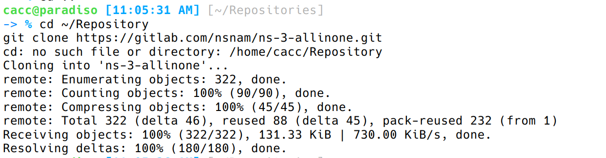
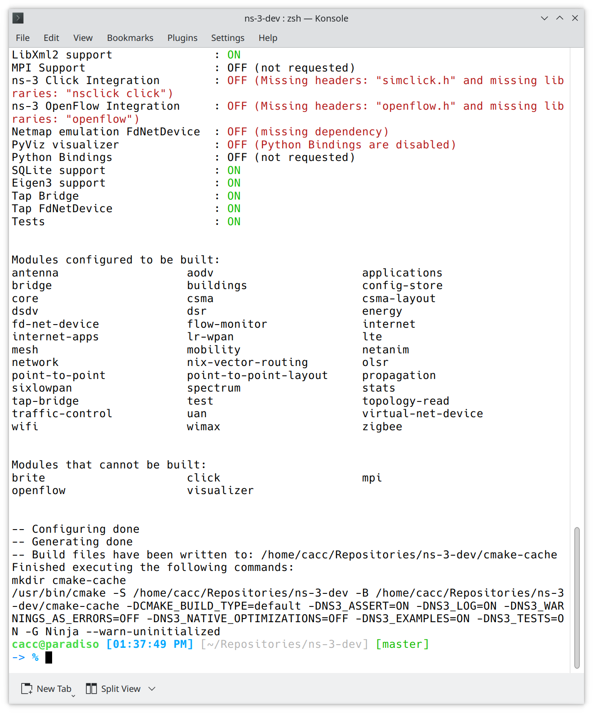
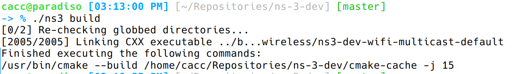
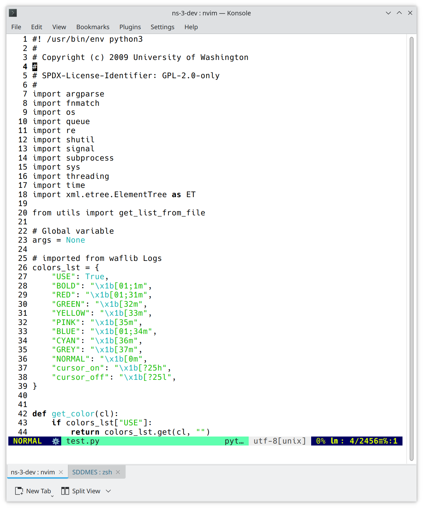
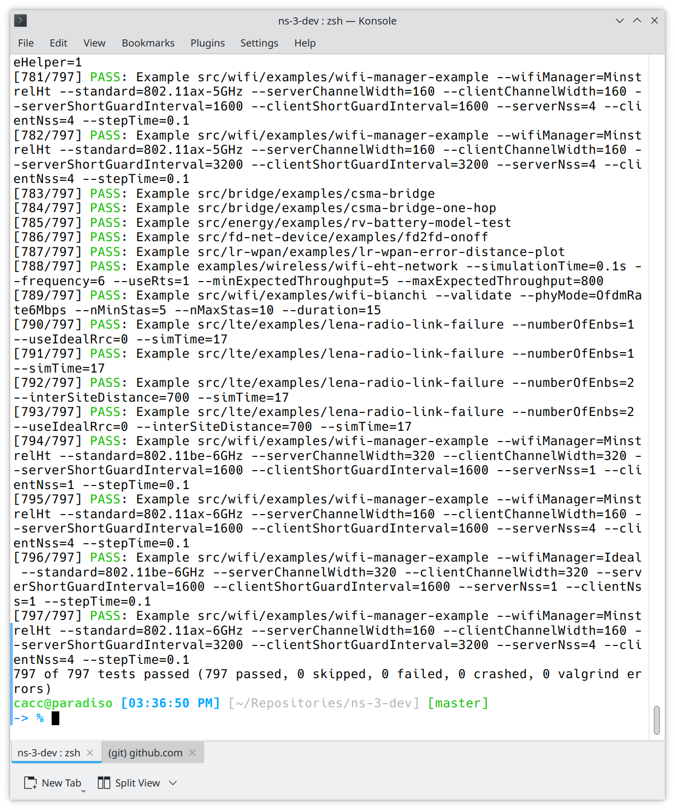
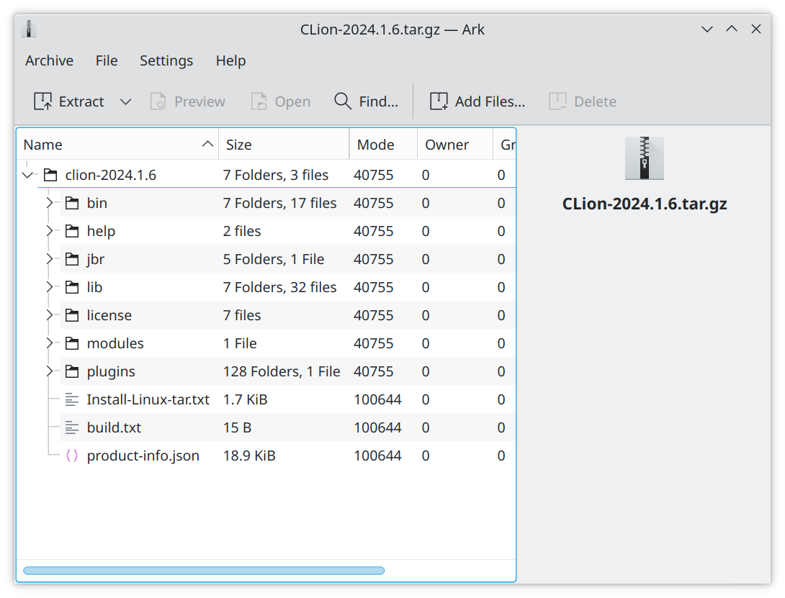
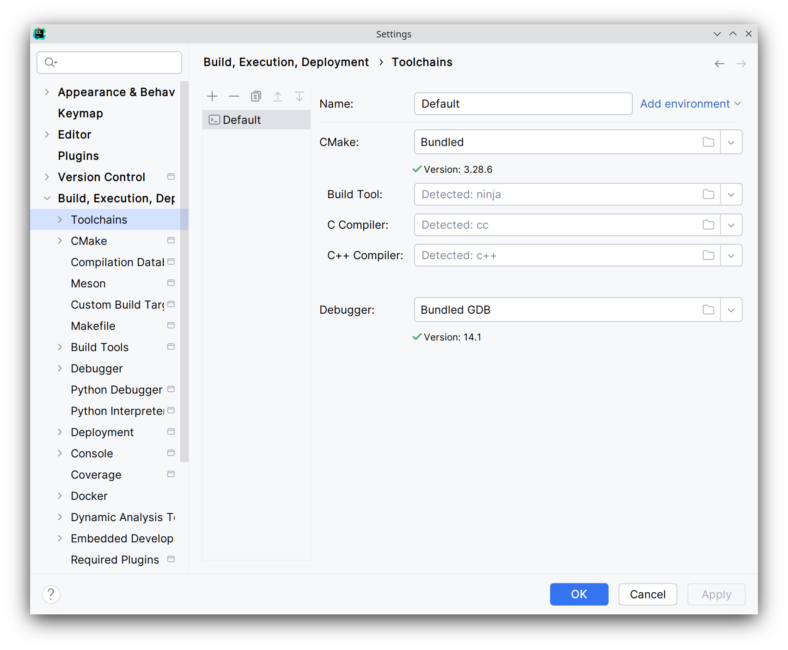
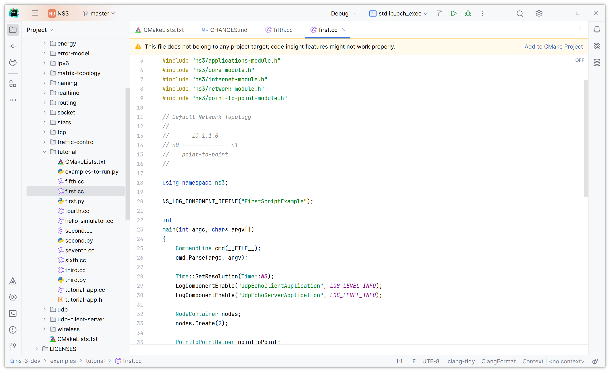

# ns-3 安装文档

## 1. 准备

### 环境说明

操作系统：

- Kubuntu 22.04.5 LTS x86_64

其他工具：

- GNU Make 4.3
- g++ (Ubuntu 11.4.0-1ubuntu1~22.04.2) 11.4.0
- Python 3.10.12
- NVIM v0.12.0-dev


### 下载仓库

**1. 直接下载**

```bash
wget https://www.nsnam.org/releases/ns-allinone-3.44.tar.bz2
tar xfj ns-allinone-3.44.tar.bz2
cd ns-allinone-3.44/ns-3.44
```

**2. git 克隆**

下载 ns-3 源码，官方提供了 GitLab 仓库地址，通过 Git 克隆下载仓库。

```bash
cd ~/Repository
git clone https://gitlab.com/nsnam/ns-3-dev.git --depth=1
```

进入自定义存放仓库的目录，并进行浅克隆（深度为一）。



```bash
cd ns-3-dev
```

进入目录后，根据提示可见默认 master 分支是一个开发分支，手动切换分支

> Note that if you select option 1), your directory name will contain the release number. If you clone ns-3, your directory will be named ns-3-dev. By default, Git will check out the ns-3 master branch, which is a development branch. All ns-3 releases are tagged in Git

```bash
git checkout -b ns-3.44-release ns-3.44
```


## 2. 安装

### 配置

下载完成后，通过 *CMake* 编译系统，官方仓库提供了一个 Python 封装的 CMake 程序叫做 *ns3* ，可以在仓库根目录下找到，首先配置项目。

```bash
./ns3 configure --enable-examples --enable-tests
```



运行速度由 CPU 决定，上图输出代表配置成功，现在开始编译

### 编译

```bash
./ns3 build
```

>Build times vary based on the number of CPU cores, the speed of the CPU and memory, and the mode of the build (whether debug mode, which is faster, or the default or optimized modes, which are slower). Additional configuration (not covered here) can be used to limit the scope of the build, and the ccache, if installed, can speed things up. In general, plan on the build taking a few minutes on faster workstations.

这里由于操作系统就是 KDE Ubuntu，所以不做任何限制等待编译完成。编译完成界面：



### 测试

最后如果编译成功，运行 `test.py` 测试是否完成，可以直接运行，因为在顶部已经标注了解释器。



根据说明，会运行上百个单元测试，全部成功代表完成安装。

>This command should run several hundred unit tests. If they pass, you have made a successful initial build of ns-3. Read further in this manual for instructions about building optional components, or else consult the ns-3 Tutorial or other documentation to get started with the base ns-3.



## 3. 推荐 IDE

>If you prefer to code with an code editor, consult the documentation in the ns-3 Manual on Working with CMake, since CMake enables ns-3 integration with a variety of code editors, including: 
>
>• JetBrains’s CLion
>
>• Microsoft Visual Studio and Visual Studio Code
>
>• Apple’s XCode
>
>• CodeBlocks
>
>• Eclipse CDT4

### 安装 Clion

从[官网](https://www.jetbrains.com/clion/download/other.html
 )下载 Clion 2024.1.x 后安装



安装完成后找盗版密钥[激活](https://3.jetbra.in/)。

### 设置工具链

新版 ns 使用 *CMake* 做为编译器，因此，CLion 在打开项目时自动检测到了所有工具链，自动配置后点击应用即可。



最后完成安装，头文件引用正常。


