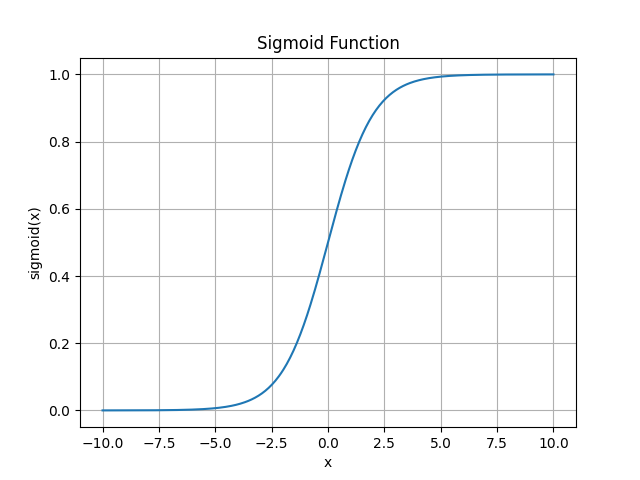
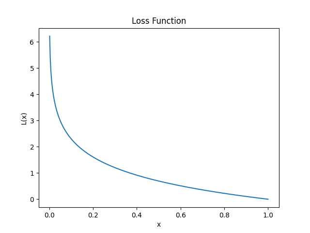

# 机器学习-逻辑回归

## 概念

逻辑回归（Logistic Regression）是一种分类问题的模型。逻辑回归实际是一种分类而不是回归问题，称为回归只是因为他的历史原因。

在二分类问题（Binary Classification）中，我们需要根据输入来判断输出结果是与否，或者说输出值`y`的值只包含1或者0。一种方法是使用之前的线性回归模型，并定义一个临界值。然而这种方法已经不能满足问题所需，因为分类实际上不是一个线性函数。

这里就需要利用其他函数，构建逻辑回归模型来解决二分类问题。

### 模型

首先设一个线性回归的模型，而\theta为参数向量。
$$
z=\theta^Tx
$$
逻辑函数，也叫Sigmoid函数，可以构建一个逻辑回归的模型，由于这个函数的特征，可以良好的表示分类问题。

$$
h_\theta(x)=g(z)=\frac{1}{1+e^{-z}}\\
z=\theta^Tx
$$
那么将带有参数向量和输入的函数值带入到Sigmoid函数中，就可以根据图像得到结果，结果为0或者1，非常符合二分类问题的需求。最终结果所求出来的是输出`y = 1`的可能性。

### 决策边界（Desicion bountary）

根据Sigmoid函数转化后，我们仍然得到的是一个线性的结果。如果需要将结果转换成离散的0或1的分类，可以设置某个特定的阈值。比如若结果小于0.5时，就定义输出`y`的值为0，大于则为1。根据阈值得到的参数和自变量形成的方程，就是这个模型的决策边界。

### 代价函数

首先在线性回归中定义的代价函数，在线性回归模型中是一个凹函数，从而可以找到代价最小处并找到相关参数。
$$
J(\theta)=\frac{1}{m}\sum^m_{i=1}\frac{1}{2}(h_\theta(x)-y)^2，不再适用
$$
然而在逻辑回归模型中，本式不再满足凹函数的特点，所以需要进行修改。定义损失函数（Loss function）。
$$
L(h_\theta(x_i),y_i)=\begin{cases}
-log(h_\theta(x_i))\quad y_i=1\\
-log(1-h_\theta(x_i))\quad y_i=0
\end{cases}
$$

首先这里以`y_i`等于1的情况下举例。根据他的趋势就可以看出，距离1越近，损失越小，越远则趋向无穷。得到损失函数后，定义逻辑回归模型中的代价函数。
$$
J(\theta)=\frac{1}{m}\sum^m_{i=1}L(h_\theta(x_i),y_i)
$$
损失函数会根据`y`的观测值决定不同的式子，需要对代价函数进行简化。重新整理损失函数得下列式子。在y等于0或1时，会让特定项得系数化为0，抵消。
$$
L(h_\theta(x),y)=-ylog(h_\theta(x))-(1-y)log(1-h_\theta(x))
$$

### 梯度下降

整个代价函数如下所示
$$
J(\theta)=-\frac{1}{m}\sum_{i=1}^m[y_ilog(h_\theta(x_i))+(1-y_i)log(1-h_\theta(x_i))]
$$
求步长
$$
\frac{\partial J(\theta)}{\partial \theta_j}=\frac{1}{m}\sum_{i=1}^m(h_\theta(x_i)-y_i)x_{ji})
$$

$$
\theta_j=\theta_j-\alpha\frac{\partial}{\partial\theta_j}J(\theta)
$$
