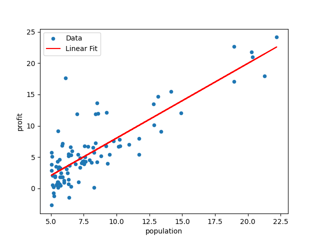

# 线性回归的数学模型

假设单变量回归模型：
$$
h_\theta(x) = \theta^T x = \theta_0 + \theta_1 x_1
$$
这里的 $\theta_0$ 就是偏置，而 $\theta_1$ 就是权重，而 $x_1$ 就是特征。

线性回归方程的代价函数为：
$$
J(\theta) = \frac{1}{2m} \sum^{m}{i = 1}(h_\theta(x^{(i)}) - y^{(i)})^2
$$
这里根据代价函数来计算当前权重与偏置得到的方程与实际情况差距有多大，线性回归问题就是要通过一定方法找到最合适的参数来构造这个方程，也就是找到合适的 $\theta_0$ 和 $\theta_1$ 来使代价函数的值最小，也就是最符合实际情况。

一般来说通过梯度下降的方法来让参数不断接近最优解：
$$
\theta_j:= \theta_j - \alpha \frac{1}{m}\sum^m_{i = 1}(h_\theta(x^{i}) - y^{(i)})x_j^{(i)}
$$
每次跟新都会根据代价函数来更改参数，代价函数在这里反应了与最优解的差距。而式中 $\alpha$ 为学习率，也就是每次更新的幅度。学习率过大会导致下降可能会跳过最优解甚至导致当前值与最优解越来越远，太小会导致循环次数过多靠近最优解的速度太慢。


<center>图 1 代建函数与两个参数的关系</center>

当然，在这里我们使用 python scikit-learn 库来构建线性回归模型，不需要完全读懂数学模型。只需要理解这个模型需要进行什么操作得到最终结果即可。

# Sklearn 单变量线性回归

假设有一份食品供应商的数据，包含了城市的人口（population）和在这个城市的利润（profit），需要以人口作为特征来预测在某个城市的利润。

## 数据处理

假设数据保存在本地的 `ex1data1.txt` 中并以 csv 文件格式保存，那么需要首先用 pandas 读取数据。

```python
import numpy as np
import pandas as pd

data = pd.read_csv('ex1data1.txt', header=none, names=['population', 'profit'])
print(data.head())
```

查看到数据的头部信息：

```
   population   profit
0      6.1101  17.5920
1      5.5277   9.1302
2      8.5186  13.6620
3      7.0032  11.8540
4      5.8598   6.8233
```

然后需要将特征和答案传入 Sklearn 线性回归模型，需要注意的是，这里是单变量回归，而一般的线性回归模型接受的参数是一个特征矩阵，那么这里需要将一维的特征向量转换成矩阵形式才行。

```python
X = data['population'].values.reshape(-1, 1) # 重构特征的数据形状
y = data['profit'].values
```

## 构建模型

首先利用构造函数初始化一个线性回归模型对象 `model` ，然后利用现有的训练数据训练模型。

```python
from sklearn.linear_model import LinearRegression

model = LinearRegression()
model.fit(X, y) # 输入训练数据训练模型
```

## 验证

从模型中取出最终训练后的参数：

```python
slope = model.coef_[0]
intercept = model.intercept_
print(f"Linear model equations: y = {slope:.2f}x + {intercept:.2f}")
```

查看最终的模型：

```
Linear model equations: y = 1.19x + -3.90
```

通过取出的参数来绘制图形，查看模型的拟合效果是否良好：

```python
import matplotlib.pyplot as plt

data.plot(kind='scatter', x='population', y='profit', label='Data')
plt.plot(X, model.predict(X), color='red', label='Linear Fit')
plt.legend()
plt.show()
```



<center>图 2 线性回归模型的拟合效果</center>

# Sklearn 多变量线性回归

多变量回归模型的构建大同小异，也是一样的步骤。这里假设有数据 `ex1data2.txt`，数据包含了房屋面积，卧室数量和房屋的价格，以前两者为特征来预测房屋价格。

## 数据处理与训练

首先读取数据：

```python
data = pd.read_csv('ex1data2.txt', header=None, names=['area', 'bedrooms', 'price'])
print(data.head())
```

```
   area  bedrooms   price
0  2104         3  399900
1  1600         3  329900
2  2400         3  369000
3  1416         2  232000
4  3000         4  539900
```

训练模型

```python
X = data[['area', 'bedrooms']].values
y = data['price'].values

model = LinearRegression()
model.fit(X, y)
```

## 验证

查看训练后的模型的参数：

```python
coefficients = model.coef_
intercept = model.intercept_

print(f"Linear model equation: y = {coefficients[0]:.2f} * area + {coefficients[1]:.2f} * bedrooms + {intercept:.2f}")
```

```
Linear model equation: y = 139.21 * area + -8738.02 * bedrooms + 89597.91
```

这里如果需要画图，则需要绘制一个三维图片，因为此处的特征是二维的。

```python
fig = plt.figure(figsize=(10, 8))
ax = fig.add_subplot(111, projection='3d')

ax.scatter(data['area'], data['bedrooms'], data['price'], color='blue')

area_range = np.linspace(data['area'].min(), data['area'].max(), 100)
bedrooms_range = np.linspace(data['bedrooms'].min(), data['bedrooms'].max(), 100)
area_grid, bedrooms_grid = np.meshgrid(area_range, bedrooms_range)

# 使用模型的预测方法
price_grid = model.predict(np.c_[area_grid.ravel(), bedrooms_grid.ravel()]).reshape(area_grid.shape)

ax.plot_surface(area_grid, bedrooms_grid, price_grid, color='red', alpha=0.5, rstride=100, cstride=100)

ax.set_xlabel('Area')
ax.set_ylabel('Bedrooms')
ax.set_zlabel('Price')
ax.legend()
plt.show()
```


<center> 图 3 多变量模型的拟合效果</center>
