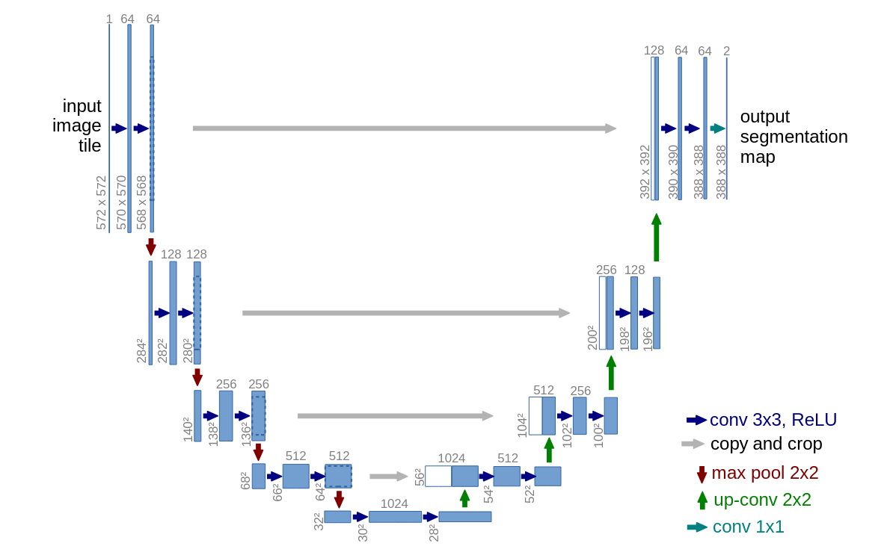

U-Net is a convolutional neural network that was developed for image segmantation. The network is based on a fully convolutional neural network whose architecture was modified and extended to work with fewer training images and to yield more precise segmentation. Segmentation of a $512 \times 512$ image takes less than a second on a modern GPU using the U-Net architecture.

The U-Net architecture gets its name from its distinctive U-shape. It consists of two main paths: a contracting path to caputer context and a summetric expanding path that enables precise localization. This design allows it to effectively combine high-level contextual information with fine-grained spatial details.

- **Encoder**: This is a typical convolutional neural network. It consists of repeated blocks of convolution and pooling operations. The encoder gradually downsamples the image, reducing its spatial dimensions while increasing the number of feature channels. This process allows the network to learn hierarchical features and capture the broader context of the image.
- **Decoder**: The decoder's job is to take the compressed feature representation from the encoder and reconstruct a high-resolution segmentation map. It does this through a series of "up-convolutions"(or transposed convolutions) that increase the spatial dimentions while decreasing the feature channels.
- **Skip Connections**: The most critical innovation of U-Net is the use of skip connections. These connections directly link feature maps from the encoder to the corresponding layers in the decoder. This allows the decoder to reuse high-resolution features from the early encoder layers, which helps it recover fine details that are often lost during the downsampling process. This fusion of shallow and deep features is key to U-Net's precise localization capabilities. The original U-Net paper provides a detailed technical breakdown.
