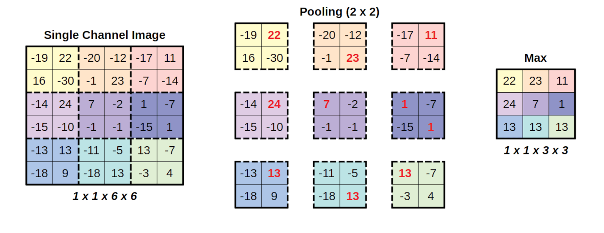

# 神经网络

## 结构概念

**总体上**：神经网络是由多层节点组合而成的系统。以一个简单的神经网络为例，输入一组数据（一般称为特征向量），根据神经网络中多个节点的计算和组合，最后输出一个结果。其中间各层称为隐藏层，在神经网络负责计算输入的各项数据，不断进行信息蒸馏，最后传给输出层。这个神经网络负责一个二分类的任务，最后输出层的节点激活函数为sigmoid函数，输出了根据特征而判断的概率。


**个体上**：神经网络由多层组成，而每一层由若干节点组成。每个节点都负责计算相关数据。由其中一个节点举例，根据前者节点（或者最初的输入）得到的向量，添加权重和偏值进行处理，然后经过神经元的激活函数，计算出输出向量。


$$
z = \vec{w} \cdot \vec{x} + b \\
g(z) = \frac{1}{1+e^{-z}}
$$

由于特征经常是超过一个的，所以多个特征组成了一个特征向量，相对应的权重也是一个向量。其中权重和偏值都是可修改的参数，会根据训练数据来动态调整。激活函数有多种选择，例如`Sigmoid`, `tanh`, `ReLU`函数。这里的sigmoid只是其中的一种。同层节点的激活函数是一样的，层与层之间可以不同。不同的激活函数用处不同，尤其是随后输出层，需要根据问题所确定。

## 更新规则

神经网络由多个节点组成，众多节点的权重决定了最后输出的结果。因此神经网络比较于其他一些单节点的模型来说更加精确。首先第一层节点根据输入向量计算出当前层的值，然后传递给下一层，此时信息逐步传递下去并最后根据这些输入计算出输出，这样一层一层传递称为**前向传播**（Forward Propagation），每一层输出是上一层输出经过加权和偏置后，在通过激活函数处理的结果。

得到结果后即可**计算损失**（Loss Calculation）,通过比较网络的输出和真实标签，计算损失函数的值，常见的损失函数包括均方误差（MSE）和马上要用到的交叉熵损失（Cross-Entropy Loss）。计算出损失就可以根据原有公式去更新权重和偏置，在神经网络中有多个节点，都需要对节点的权重和偏置进行更新，在这里首先在最后一层根据输出的最终结果来更新，然后不断向上层更新。这个过程通过链式法则计算损失函数对每一层的权重和偏置的偏导数（梯度），使用梯度下降等优化算法，利用计算出的梯度更新神经网络的权重和偏置，使得损失函数的值最小化。这里也被称为**反向传播**（Backpropagation）。

对于每一层的权重更新，需要计算损失函数对该层权重的梯度，通过链式法则可以将损失函数的梯度传递回去。举个例子，假设 $L$ 层的输出位 $y_L$，损失函数为 $L$。

$$
\frac{\partial L}{\partial w_L} = \frac{\partial L}{\partial y_L} \cdot \frac{\partial y_L}{\partial w_L}
$$

计算出梯度后更新参数，更新规则常为：

$$
w = w - \eta \cdot \frac{\partial L}{\partial w}
$$

## 卷积神经网络

在经典的神经网络中，主要包括输入层，隐含层和输出层。在隐含层前加入卷积层与池化层即可组成卷积神经网络。**卷积神经网络**（convolutional neural network）是一种前馈神经网络，它的神经元可以响应一部分覆盖范围内的周围单元，对于大型图像有出色表现。卷积神经网络的灵感来自于动物视觉皮层组织得到神经连接方式。单个神经元只对优先区域内的刺激做出反应，不同神经元的感知区域相互重叠从而覆盖整个视野。

首先卷积神将网络相较于经典的神经网络，突出的特点是前者识别某一特征与其他特征的关系。在图像识别中，经典神经网络只计算每个像素点的特征，然后不断传递给下一层直至输出。而卷积神经网络将读取当前像素点特征与周围像素点特征的联系，将这个关系传递给下一层，这样模型就拥有识别局部特征的功能。


**卷积层**可以产生一组平行的特征图，它通过在输入图像上滑动不同的**卷积核**（Filter）并执行一定的运算而组成。卷积核是是一个矩阵，大小要比输入图像小的多。且重叠或平行地作用于输入图像中，一张特征图中的所有元素都是通过一个卷积核计算得出的，也即一张特征图共享了相同的权重和偏置项。

这里举一个简单的例子，比如存在一张图片需要检测，可以使用卷积核来提取图像的特征，最常见的即为边缘检测卷积核，例如水平边缘检测可以将图像竖直边缘特征提取出来，假设卷积核如下：

$$
\begin{bmatrix}
1 & 0 & 1 \\
0 & 1 & 0 \\
1 & 0 & 1
\end{bmatrix}
$$

有了卷积核后，将卷积核对应到图像上，所覆盖的区域叫做**窗口**，通过不断滑动窗口，将卷积核的元素与对应位置的元素相乘最后全部相加，得到卷积后的特征。


同理可以提取出具有其他特征的局部特征，以用来解决经典神经网络不能识别同一特征而位置不同导致无法识别出来的问题。


**池化层**（Pooling）是卷积神经网络另一个重要的概念，他实际上是一种非线性形式的降采样。在图像进行卷积后，每一个卷积核扫过一遍图像都会产生一个新的特征举证输入给下一层。这时就增加了数据量，原本二维的图像矩阵会增加维度，数据的厚度根据卷积核个数而定。常见的池化函数有**最大池化**（Max pooling），他将输入的图像划分为若干个矩形区域，对每个子区域输出最大值。



原数据通过不同模型的变换一层一层传递，被称为数据蒸馏。最后经典神经网络根据卷积层和池化层处理后的数据输出结果。

# Tensorflow 中的卷积神经网络

## MNIST 数据集

**MNIST**（Modified National Institute of Standards and Technology）数据集是机器学习和计算机视觉领域中一个经典且广泛使用的数据集。它包含了大量的手写数字图片，通常用于图像分类任务的训练和测试。来自 0 到 9 的手写数字图像，每张图片是 28x28 像素的灰度图像。该数据集常用于评估图像分类算法，尤其是在深度学习和机器学习领域。MNIST 的目标是将输入的 28x28 的图像分类为 0 到 9 之间的一个数字。

每张图片都是 28x28，且像素的灰度值范围是 0~255 用来表示图片的亮度，且每张图片都有一个对应的标签，表示图片的数字。

MNIST 手写数字数据集作为经典的机器学习数据，通常可以直接通过库调用出来。除了这个还有经典的莺尾花（iris）数据集。

```python
import tensorflow as tf
import matplotlib.pyplot as plt

(train_images, train_labels), (test_images, test_labels) = tf.keras.datasets.mnist.load_data()

images = train_images[:5]
labels = train_labels[:5]

plt.figure(figsize=(6, 2))

for i in range(5):
    plt.subplot(2, 5, i + 1)
    plt.imshow(images[i], cmap='gray_r')
    plt.title(f'Label: {labels[i]}')
    plt.axis('off')

plt.show()
```


## 经典神经网络

导入需要的包

```python
from tensorflow.keras import datasets, models, layers
import matplotlib.pyplot as plt
```

读取数据，这里将图片中的像素灰度（0到255）转换成 0 到 1 方便计算

```python
(train_images, train_labels), (test_images, test_labels) = datasets.mnist.load_data()
train_images = train_images.astype("float32") / 255
test_images = test_images.astype("float32") / 255
```

建立模型，这里可以看到首先平整输入层，将 28*28 的矩阵平整后输入给下一层，随后的隐含层是由 128 个神经元，激活函数为 Relu 函数的神经元，最后传递给输出层，有 10 个函数为 softmax 的神经元，也就是对应了 0 到 9 十个数字的可能性。

```python
model = models.Sequential([
    layers.Flatten(input_shape=(28, 28)),
    layers.Dense(128, activation='relu'),
    layers.Dense(10, activation='softmax')
])

model.compile(optimizer='rmsprop',
              loss='sparse_categorical_crossentropy',
              metrics=['accuracy'])
```

训练

```python
model.fit(train_images, train_labels, epochs=5, batch_size=128)
```

```
Epoch 1/5
469/469 ━━━━━━━━━━━━━━━━━━━━ 1s 1ms/step - accuracy: 0.8469 - loss: 0.5607
Epoch 2/5
469/469 ━━━━━━━━━━━━━━━━━━━━ 1s 1ms/step - accuracy: 0.9490 - loss: 0.1764
Epoch 3/5
469/469 ━━━━━━━━━━━━━━━━━━━━ 1s 1ms/step - accuracy: 0.9655 - loss: 0.1204
Epoch 4/5
469/469 ━━━━━━━━━━━━━━━━━━━━ 1s 1ms/step - accuracy: 0.9739 - loss: 0.0924
Epoch 5/5
469/469 ━━━━━━━━━━━━━━━━━━━━ 1s 1ms/step - accuracy: 0.9782 - loss: 0.0743
```

预测并得到结果

```python
predictions = model.predict(test_images)
plt.imshow(test_images[0], cmap='binary')
plt.show()
print(predictions[0])
print(predictions[0].argmax()) # Get prediction
print(test_labels[0]) # Get label
```

```
313/313 ━━━━━━━━━━━━━━━━━━━━ 0s 722us/step

[1.0371010e-06 3.5972935e-08 1.0258249e-05 1.1843173e-03 1.6212408e-09
 2.1878634e-06 7.1553410e-12 9.9879539e-01 1.5919034e-06 5.1117377e-06]
7
7
```

这里可以看到，第七的标签可能性最大，所以模型判断为 7，正好符合实际值。

## 卷积神经网络

在经典神经网络前加入卷积层和池化层，即其他地方不变，更改模型：

```python
from tensorflow.keras import layers, models, datasets
import matplotlib.pyplot as plt

(train_images, train_labels), (test_images, test_labels) = datasets.mnist.load_data()
train_images = train_images.astype("float32") / 255
test_images = test_images.astype("float32") / 255

model = models.Sequential([
    layers.Conv2D(32, kernel_size=(3, 3), activation='relu', input_shape=(28, 28, 1)),
    layers.MaxPooling2D(pool_size=(2, 2)),
    layers.Conv2D(64, kernel_size=(3, 3), activation='relu'),
    layers.MaxPooling2D(pool_size=(2, 2)),
    layers.Flatten(),
    layers.Dense(128, activation='relu'),
    layers.Dense(10, activation='softmax')
])

model.compile(optimizer="rmsprop",
              loss="sparse_categorical_crossentropy",
              metrics=["accuracy"])

model.fit(train_images, train_labels, epochs=5, batch_size=128)

predictions = model.predict(test_images)
plt.imshow(test_images[0].reshape(28, 28), cmap='binary')
plt.show()
print(predictions[0])
print(predictions[0].argmax())
print(test_labels[0])
```

这里添加了两个 3x3 的激活函数为 Relu 卷积核和 2x2 的最大值池化层。查看输出，这里可以看到，相较于经典神经网络，正确率提高了。MNIST 手写数字并不是太复杂，在更加复杂的图像中卷积神经网络的优势将会更大。

```
Epoch 1/5
469/469 ━━━━━━━━━━━━━━━━━━━━ 4s 7ms/step - accuracy: 0.8482 - loss: 0.4778
Epoch 2/5
469/469 ━━━━━━━━━━━━━━━━━━━━ 4s 8ms/step - accuracy: 0.9803 - loss: 0.0631
Epoch 3/5
469/469 ━━━━━━━━━━━━━━━━━━━━ 4s 8ms/step - accuracy: 0.9877 - loss: 0.0372
Epoch 4/5
469/469 ━━━━━━━━━━━━━━━━━━━━ 4s 8ms/step - accuracy: 0.9914 - loss: 0.0270
Epoch 5/5
469/469 ━━━━━━━━━━━━━━━━━━━━ 4s 7ms/step - accuracy: 0.9939 - loss: 0.0196

313/313 ━━━━━━━━━━━━━━━━━━━━ 1s 2ms/step

[1.3090666e-08 6.1102618e-08 1.5969528e-06 2.9329690e-06 1.9707100e-10
 3.4063227e-10 4.7579562e-13 9.9999511e-01 4.9246247e-09 1.8790494e-07]
7
7
```

## 参考

1. 维基百科. *卷积神经网络*, https://en.wikipedia.org/wiki/Convolutional_neural_network
2. Brad Boehmke(2020). *Computer vision & CNNs: MNIST revisted*, https://rstudio-conf-2020.github.io/dl-keras-tf/04-computer-vision-cnns.html
