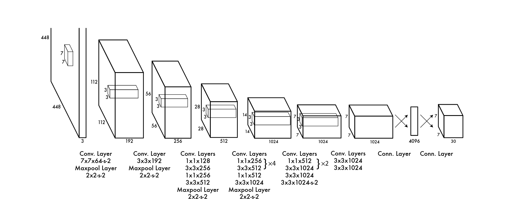

# R-CNN

Rich Feature Hierarchies for Accurate Object Detection and Semantic Segmentation

论文地址：https://www.cv-foundation.org/openaccess/content_cvpr_2014/html/Girshick_Rich_Feature_Hierarchies_2014_CVPR_paper.html

根据图像局部特征划分出子图，最后通过卷积网络（AlexNet）输出，每个子图都会蒸馏出一个特征向量，为 4096 维，最后通过 SVM 进行分类

# YOLOv1

You Only Look Once: Unified, Real-Time Object Detection (2016)

论文地址：https://ieeexplore.ieee.org/document/7780460

特征提取结构：

输入大小是 448 * 448 * 3，输出为 7 * 7 * 30，中间经过了卷积与池化。最后化为 7 * 7 的 30 维张量，也就是最终提取出来的最终特征。

损失函数：
$$
\begin{equation}
\begin{split}
\mathcal{L} &= \lambda_{\text{coord}} \sum_{i=0}^{S^2} \sum_{j=0}^{B} \mathbb{1}_{ij}^{\text{obj}} \left[ (x_i - \hat{x}_i)^2 + (y_i - \hat{y}_i)^2 \right] \\
&+ \lambda_{\text{coord}} \sum_{i=0}^{S^2} \sum_{j=0}^{B} \mathbb{1}_{ij}^{\text{obj}} \left[ (\sqrt{w_i} - \sqrt{\hat{w}_i})^2 + (\sqrt{h_i} - \sqrt{\hat{h}_i})^2 \right] \\
&+ \sum_{i=0}^{S^2} \sum_{j=0}^{B} \mathbb{1}_{ij}^{\text{obj}} (C_i - \hat{C}_i)^2 \\
&+ \lambda_{\text{noobj}} \sum_{i=0}^{S^2} \sum_{j=0}^{B} \mathbb{1}_{ij}^{\text{noobj}} (C_i - \hat{C}_i)^2 \\
&+ \sum_{i=0}^{S^2} \mathbb{1}_{i}^{\text{obj}} \sum_{c \in \text{classes}} (p_i(c) - \hat{p}_i(c))^2
\end{split}
\end{equation}
$$
可以明显看出，YOLOv1的损失函数可以分为五个分项：

1. 预测框中心坐标与真实框的均方误差（MSE）
2. 对宽度 w_i 和高度 h_i 取平方根后的 MSE
3. 有目标的边界框的置信度与真实值的 MSE
4. 无目标的边框的置信度与真实值的 MSE
5. 每个网络的类别概率与真实类别