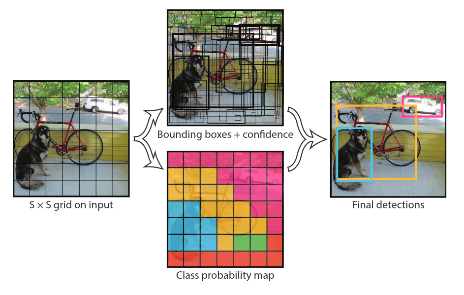

# YOLOv1

You Only Look Once: Unified, Real-Time Object Detection (2016)

论文地址：https://ieeexplore.ieee.org/document/7780460

YOLO 作为单阶段目标检测算法，直接提取出图像中存在物体的位置锚框与类别。首先会划分出若干份子区域，通过特征的提取与蒸馏得到子区域数量的特征向量，这个向量有明显的可读结构。

特征提取结构：

模型接受的输入大小是 $448 \times 448 \times 3$，输出为 $7 \times 7 \times 30$，中间经过了卷积与池化。最后化为 $7 \times 7 \times 30$ 的张量，也就是最终提取出来的最终特征。其中最终的向量被看作 $S \times S \times (5 \times B + C)$，$S \times S$ 为图像被分割的区域数，$5 \times B $为锚框特征。分别为坐标，边框长宽与有物体的信心。
$$
\underbrace{(x, y, w, h, \text{objectness})}_{\text{5个参数}} \times B = 5B
$$
损失函数：
$$
\begin{equation}
\begin{split}
\mathcal{L} &= \lambda_{\text{coord}} \sum_{i=0}^{S^2} \sum_{j=0}^{B} \mathbb{1}_{ij}^{\text{obj}} \left[ (x_i - \hat{x}_i)^2 + (y_i - \hat{y}_i)^2 \right] \\
&+ \lambda_{\text{coord}} \sum_{i=0}^{S^2} \sum_{j=0}^{B} \mathbb{1}_{ij}^{\text{obj}} \left[ (\sqrt{w_i} - \sqrt{\hat{w}_i})^2 + (\sqrt{h_i} - \sqrt{\hat{h}_i})^2 \right] \\
&+ \sum_{i=0}^{S^2} \sum_{j=0}^{B} \mathbb{1}_{ij}^{\text{obj}} (C_i - \hat{C}_i)^2 \\
&+ \lambda_{\text{noobj}} \sum_{i=0}^{S^2} \sum_{j=0}^{B} \mathbb{1}_{ij}^{\text{noobj}} (C_i - \hat{C}_i)^2 \\
&+ \sum_{i=0}^{S^2} \mathbb{1}_{i}^{\text{obj}} \sum_{c \in \text{classes}} (p_i(c) - \hat{p}_i(c))^2
\end{split}
\end{equation}
$$
可以明显看出，YOLOv1的损失函数可以分为五个分项：

1. 预测框中心坐标与真实框的均方误差（MSE）
2. 对宽度 $w_i$ 和高度 $h_i$ 取平方根后的 MSE
3. 有目标的边界框的置信度与真实值的 MSE
4. 无目标的边框的置信度与真实值的 MSE
5. 每个网络的类别概率与真实类别

提取到子区域的特征后，利用非极大值抑制（Non-Maximum Suppression，NMS）算法对所有候选边界框进行筛选。NMS通过比较每个预测框的置信度分数，保留置信度较高的框，并剔除与之高度重叠的低置信度框，从而有效去除重复检测和冗余框。最终，经过NMS处理后，得到一组置信度较高且位置准确的目标边界框，作为最终检测结果。