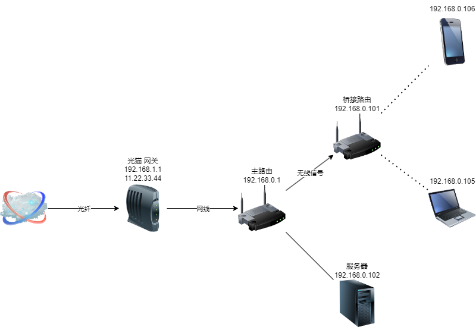

# IPv6

如果想要部署一个个人服务器，除了需要服务器机器本身外，还需要一个在公网上的网络IP地址，对外界提供连接。在IPv4趋于紧张的情况下，人们首先想到了NAT转接。也就是只给一个网关分配一个公网IP，其他数据通过他转接。这个做法会导致不是所有主机都能分配到一个公网IPv4地址，导致服务器无法连接。如果需要部署到公网上，一般常用的方法是继续利用IPv4但是通过云服务器进行转发。而这个方案的不足之处在于，需要从云平台至少购买一个拥有公网IPv4的云服务器，以及支付网络带宽的费用。同时由于端口映射，导致需要重新定义端口容易冲突或混乱。

现在国内逐步支持IPv6后，可以通过开启IPv6设置，来获取IPv6公网地址。如果想要查看网络是否支持IPv6，可以通过访问IPv6服务器是否可行来检测。http://ipv6-test.ch/index.html.zh_CN 可以查看是否开启了IPv6。如果没有开启，可以尝试对光猫和路由器进行修改。

## 局域网

一般的家庭局域网，有一个光猫和路由器，以及其他终端设备组成。光猫负责转换光电信号，通过连入光纤，接受互联网信号并转换成电信号进行工作。光猫接入光纤并拖出网线，连入路由器并提供互联网连接。在这里，光猫负责拨号上网，是整个家庭局域网的网关，NAT方法下光猫会拥有一个动态IP地址，以与外界连接。（如果是多层NAT转接，那么IP地址可能在更上一层的设备）

## 光猫的桥接模式

大部分家庭的光猫，可能是办理宽带后送的，性能并不是特别好，容易成为整个网络的瓶颈。可以将光猫改为桥接模式，也就是本来光猫负责转换光电信号，获取地址并作为整个局域网的网关，现在改成光猫仅负责转换光电信号，让主路由进行拨号和获取地址，让主路由成为网关。

首先找到网关地址，也就是光猫的地址，通常是192.168.1.1。在浏览器网址输入后，即可进入光猫管理页面。在这里输入超级管理员用户和密码（光猫背面的用户名和密码仅是普通用户）。这里的密码可能根据不同地区和不同运营商有所不同，比如江苏移动光猫超管用户名为`CMCCAdmin`，密码可能是默认的也有可能宽带师傅给你修改过了。如果网上搜了默认密码不对，可以打电话询问装宽带的师傅。

这里插一句，有些东西宽带师傅也不清楚，比如IPv6我在问的时候，问了两个师傅他们都说不能搞，其实是不懂。你所在的地区具体到底支不支持IPv6最好直接去问运营商。我最后还是向宽带师傅问到了超管密码后自己搞的。

这里需要在上网设置中，记录下原本的光猫信息，比如拨号上网的账号密码和VLAN ID，**一定拍照**，避免后面设置出错想要恢复。删除原本设置，然后新建WAN连接，设置桥接模式，记得IP版本协议改为IPv4/IPv6。

如果步骤没错，那么你现在就不能上网了。现在需要前往主路由界面设置拨号。

## 路由器拨号

浏览器输入192.168.0.1（路由器地址），输入路由器管理界面后进入上网设置，一般这里原来是自动获取IP，现在需要改成拨号上网。

然后转到IPv6设置，WAN口连接类型也是改为宽带拨号上网，不过需要勾选复用IPv4拨号链路的选项。

## 查看是否开启IPv6

最简单的方法就是进入电脑网络设置，查看自己是否拥有IPv6了。

