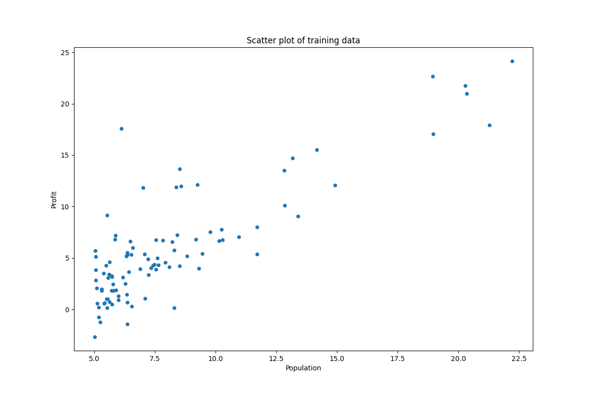
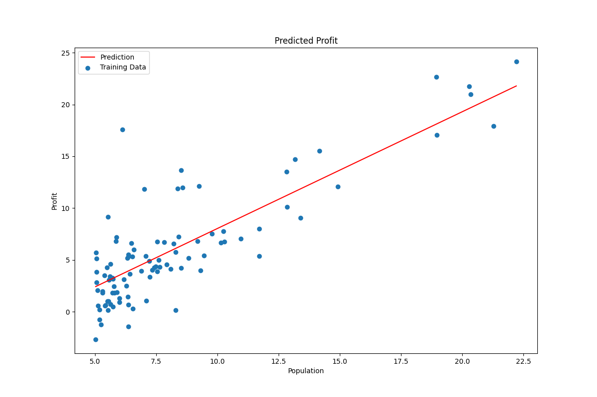
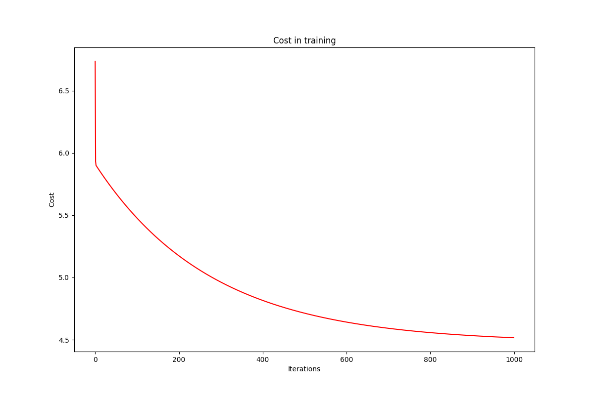

# 机器学习-线性回归

## 单变量线性回归概念

### 模型

假设自变量`x`,参数`w`,`b`可以得到一个**模型**，单变量线性回归模型类似一个一次函数。其中`w`称为权重，`b`称为偏移值。
$$
f_{w,b}(x) = wx + b
$$
其中，在机器学习里经常利用矩阵运算来进行快速的处理数据。在单变量线性回归的模型中，可以将参数看成一个向量，变量中再带一个一组成一个向量，进行运算。（其中一组向量需要转置）
$$
h_\theta(x) = \begin{bmatrix} 1 & x \end{bmatrix} \begin{bmatrix} \theta_0 \\ \theta_1 \end{bmatrix}
$$

### 代价函数

根据计算得到的计算值和实际值，可以根据**代价函数**（Cost Function）计算出代价`J(w, b)`。这里的二分之一是人为添加的，为了让后面梯度下降的计算更加简洁而修饰的常数。
$$
J(\theta_0, \theta_1) = \frac {1} {2m} \sum _{i=1} ^m (\hat y_i - y_i) ^2 = \frac {1} {2m} \sum _{i=1} ^m (h_\theta(x) - y_i)^2
$$
### 梯度下降

机器学习的目标，就是根据代价函数，去调整模型的参数`w`和`b`，让代价`J(w, b)`尽可能的小。这里可以使用**梯度下降**的方法，不断的根据代价函数去更新参数。
$$
w_{new} = w - \alpha \frac {\partial} {\partial w} J(w, b) \\
w_{new} = w - \alpha \frac {1} {m} \sum _{i=1} ^m (f_{w,b}(x_i) - y_i)x_i
$$
其中，这里`w_{new}`是指根据前一次计算更新后的参数。`\alpha`则被称为学习率。学习率需要人为设置，学习率太小可能导致更新速率过慢，需要计算过多次数才能达到合适的效果，而学习率如果过高，则容易跳过代价最小的参数值，并且导致代价在更新过程中不断变大。

## 练习

给出两组数据，一列为城市人口，另一列为Food Truck在本城市的收益。根据城市人口数量构建一个预测城市收益的模型。

### 导入数据

预测Food Truck的收益。在`ex1data1.txt`中，第一列表示城市人口，第二列表示在本城市的收益。

首先引用库，并且读取文件中的数据。其中numpy和pandas提供了更多的数据结构及数据处理的操作，matplotlib用于绘制图表。

```python
import numpy as np
import pandas as pd
import matplotlib.pyplot as plt

path = 'ex1data1.txt'
data = pd.read_csv(path, header=None, names=['Population', 'Profit'])

# Show the origin data
print(data.head())
print(data.describe())

# Plot origin data
data.plot(kind='scatter', x='Population', y='Profit', figsize=(12, 8))
plt.xlabel("Population")
plt.ylabel("Profit")
plt.title("Scatter plot of training data")
plt.show()
```



### 计算代价

首先处理数据，将所有需要计算的数据存入numpy数组中。

```python
data.insert(0, 'Ones', 1)
# 在变量前插入一列为1的列，便于矩阵运算
cols = data.shape[1]
X = data.iloc[:, 0:cols - 1]
Y = data.iloc[:, cols - 1:cols]
print(X.head())
print(Y.head())

X = np.matrix(X.values)
Y = np.matrix(Y.values)
theta = np.matrix(np.array([0, 0]))
```

然后定义一个代价函数。

```python
def cost_function(X, Y, theta):
    inner = np.power((X * theta.T) - Y, 2)
    return np.sum(inner) / (2 * len(X))
```

### 梯度下降

根据梯度下降定义一个函数，`X`, `Y`, `theta` 分别是自变量，观测量和参数，而`alpha` 和`iters` 分别是学习率和迭代次数。后面两个参数会决定梯度下降的过程。随后返回梯度下降算法后的参数，以及最后的代价。

```python
def gradient_descent(X, Y, theta, alpha, iters):
    temp = np.matrix(np.zeros(theta.shape))
    parameters = int(theta.shape[1])
    cost = np.zeros(iters)

    for i in range(iters):
        # 偏差
        error = X * theta.T - Y

        for j in range(parameters):
            term = np.multiply(error, X[:, j])
            temp[0, j] = temp[0, j] - alpha / len(X) * np.sum(term)

        theta = temp
        cost[i] = cost_function(X, Y, theta)

    return theta, cost
```

随后调用函数得到结果

```python
# 设置学习率和迭代次数
alpha = 0.01
iters = 1000
final_theta, final_cost = gradient_descent(X, Y, theta, alpha, iters)

print(f"Final cost: {final_cost}")

x = np.linspace(data.Population.min(), data.Population.max(), 100)
f = final_theta[0, 0] + final_theta[0, 1] * x

# 绘制最终拟合的函数
plt.figure(figsize=(12, 8))
plt.xlabel("Population")
plt.ylabel("Profit")
l1 = plt.plot(x, f, label='Prediction', color='red')
l2 = plt.scatter(data.Population, data.Profit, label='Training Data')
plt.legend(loc='best')
plt.title("Predicted Profit in different city")
plt.show()
```



### 代价趋势

如果选定了一个好的学习率和迭代此处，那么，代价应该随着每一次迭代不断下降，继续通过matplotlib库将cost变量根据迭代不断变化的数据绘制出来，可以观察到它的走势。

```python
# 画出cost的走势
plt.figure(figsize=(12, 8))
plt.xlabel('Iterations')
plt.ylabel('Cost')
plt.title('Cost in training')
plt.plot(np.arange(iters), cost, 'r')
plt.show()
```

