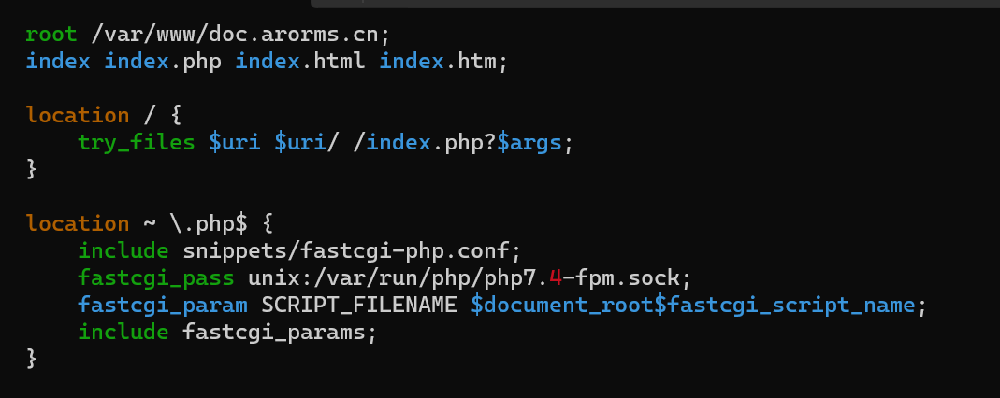

# SSH
## 安装 SSH 服务器

Debian 默认安装了SSH服务器，如果发现系统没有安装过SSH，可以手动下载。

```bash
apt update
# 更新应用列表

apt install -y openssh-server
# 下载SSH服务器
```

## 检查和启用 SSH 服务器

```bash
systemctl status ssh
# 检查SSH服务器是否开启

systemctl enable --now ssh
# 手动设置SSH开机自启动和现在启动
```

还有其他选项用来手动设置SSH服务

```bash
system [option] ssh
```

| 选项    | 操作              |
| ------- | ----------------- |
| start   | 启动SSH           |
| stop    | 停止SSH           |
| enable  | 开机允许SSH自启动 |
| disable | 开机禁止SSH自启动 |
| restart | 重启SSH服务       |

*详情查看systemctl指令详细说明*

## 访问 SSH 服务器

首先在本地查询其IP，两个命令都可以显示IP

```bash
hostname -I
# 查询局域网IP

ip address
# 查询网卡信息
```

返回你的电脑，连接 Debian 的 SSH 服务器

```powershell
ssh username@ip-addr
# 以username 的身份登录 ip-addr
```

然后输入 yes 确认指纹，随后输入 username 的密码登录到 Debian 的 SSH 服务器

操作结束后，可以通过 exit 命令退出 SSH 服务器返回本地的命令行。

```bash
exit
```


## 启用远程 root 登录权限

SSH远程连接时可能无法直接通过root账户登录，会显示权限不足（Permission denied, please try again.）要开启root账户远程登录，找到`/etc/ssh/sshd_config` 文件并修改其中的设置，需要找到这两个设置并将参数修改为`yes`。

```bash
nano /etc/ssh/sshd_config
# 以nano打开sshd_config设置文件
```

```
PermitRootLogin yes
# 允许远程root登录

PasswordAuthentication yes
# 开启密码认证
```


然后重启ssh服务器，使其设置生效。

```bash
systemctl restart ssh
```

## 修改端口

SSH 服务的默认端口为 22，如果你想要修改 SSH 服务的端口，还是前往SSH的设置文件（sshd_config）并修改他，将 port 一行的井号删除使其生效，并修改其参数22为你想要的端口。


最后重启 SSH 服务即可生效。


# LAMP

LAMP即Linux，Apache，Mysql，php

## 安装Apache

```bash
apt update
apt install nginx
```

通过systemctl查看apache是否运行，也可以通过第二行手动设置开机自启动

```bash
systemctl status nginx
systemctl enable --now nginx
```


## 安装和配置PHP环境

首先安装PHP

```bash
apt install php7.4
```

在安装PHP同时，还要安装好必要包。

```bash
apt install php7.4-fpm php7.4-cgi php7.4-curl php7.4-gd php7.4-xml php7.4-xmlrpc php7.4-mysql php7.4-bz2
```

然后配置PHP环境，到/etc/nginx/sites-available/文件夹中，修改default。这是nginx的主配置文件，如果一台服务器包含了多个网站，则配置文件需要去conf文件夹修改。此处修改主要是将php服务的内容注释给去掉，使php生效




## 检查php是否安装成功

apache的默认网站根目录在/var/www/html
使用命令ls可以看到主页文件是index.html
在本文件夹touch创建一个文件phpinfo.php
文件内容如下：

```php
<?php
	phpinfo();
?>
```

随后在浏览器访问这个文件 xxx.xxx.xxx.xxx/phpinfo.php
如果本页面显示了php的信息，那么说明php已经安装成功


## 安装MariaDB

Debian默认软件源并不包含MySQL软件包，取而代之的是MariaDB。这个具体原因是因为MySQL遭到了阉割，而MariaDB是原作者重新创建的，具体原因自行搜索

```bash
apt install mariadb-server

systemctl status mariadb
#查看mariaDB是否运行，而也可以通过下面指令手动改为开机自启动

systemctl enable --now mariadb
```

登录命令

```bash
mysql -uroot -p
# root是数据库用户，没有密码-p后不带参数
```


## *强制安装PHP7.4版本*

现在大多数系统安装源已经不支持7.4版本，但是众多软件与应用仍然以7.4为基础，为此，可以强制给系统安装PHP7.4环境，这样与原来的版本并不影响。首先要解决下载源的问题，按照下列指令添加下载源。

```bash
# 先更新软件源并升级
apt update && apt upgrade -y

# 安装software-properties-common软件管理器（这一步不是必须，有些发行版本已经安装好了）
apt install software-properties-common

# 增加 ondrej/php PPA，提供了多个 PHP 版本
add-apt-repository ppa:ondrej/php

# 再次更新
apt update
```

然后安装`php7.4`以及相关的扩展

```bash
apt install -y php7.4-fpm php7.4-mysql php7.4-dev \
php7.4-redis php7.4-gd php7.4-mbstring php7.4-zip \
php7.4-curl php7.4-sqlite3 php7.4-xml php7.4-yaml \
php7.4-decimal php7.4-http php7.4-imagick php7.4-bcmath \
php7.4-raphf php7.4-xmlrpc 
```


# Code-Server

## 下载安装包

首先下载code-server安装包，网址为https://github.com/coder/code-server/releases。 选择对应的版本号，这里Debian使用的安装包是deb文件后缀，同时注意CPU的类型，amd64是amd的CPU，而arm64是intel的CPU，下载到本地。

上传安装包到Debian服务器上，可以通过SSH来进行上传,scp指令上传文件的方法如下：

```powershell
scp file username@hostname:/home/username
#将本地文件“file”上传到指定服务器的/home/username文件夹下
```

## 安装并设置

首先远程登录服务器并安装code-server

```powershell
ssh username@hostname

cd /home/username
dpkg -i code-server_4.20.0_amd64.deb
#-i是install安装的意思，记得修改对应的版本，保证文件名一样
```

然后设置code-server的设置文件，文件在root/.config/code-server/ 这个文件夹下，名叫config.yaml，如果没有找到这个文件夹或文件，可能是因为没有运行而没有产生设置文件，可以在终端输入code-server启动这个服务再ctrl+c中断掉，对应的设置文件就会产生。然后使用nano打开这个文件进行编辑，修改成如下的样子。

```yaml
bind-addr: 0.0.0.0:8080
auth: password
password: 密码
cert: false
```

其中0.0.0.0是广播地址，意味所有IP都可以连接这台机器的code-server服务，如果有需要可以自己改。将密码改为自己能记住的密码，在稍后登录时需要用到。

## 启动并登录

设置开机自启动并现在启动，由于code-server涉及根目录中文件的编辑上传，可以使用root账户进行登录，如果可以，建议设置一个其他账户进行登录。

```bash
systemctl enable --now code-server@root
```

这样，就开启了code-server服务。code-server服务器默认端口为8080，浏览器登录http:xxx.xxx.xxx.xxx:8080即可访问页面，输入密码即可进入code-server进行编辑。


# FTP

## 下载vsftpd

```bash
apt install vsftpd
apt install ftp
```

## 设置账户

```bash
useradd -m -d /home/share/ -s /bin/bash ftp_user
# 创建一个以/home/share 为起始文件夹的用户ftp_user

passwd ftp_user
# 设置密码
```

## 设置vsftpd

- /etc/vsftpd.conf

  ```ini
  listen=NO
  allow_writeable_chroot=YES
  listen_ipv6=YES
  anonymous_enable=NO
  local_enable=YES
  write_enable=YES
  local_umask=022
  anon_upload_enable=NO
  anon_mkdir_write_enable=NO
  dirmessage_enable=YES
  use_localtime=YES
  xferlog_enable=YES
  connect_from_port_20=YES
  chroot_local_user=YES
  chroot_list_enable=YES
  chroot_list_file=/etc/vsftpd.chroot_list
  secure_chroot_dir=/var/run/vsftpd/empty
  pam_service_name=vsftpd
  rsa_cert_file=/etc/ssl/certs/ssl-cert-snakeoil.pem
  rsa_private_key_file=/etc/ssl/private/ssl-cert-snakeoil.key
  ssl_enable=NO
  ```

- /etc/vsftpd.chroot_list

  ```ini
  ftp_user
  ```

## FTP服务器

```bash
systemctl restart vsftpd
# 重启FTP服务器使其生效

ftp ftp_user@localhost
# 连接至本地的FTP服务器
```


# SMTP

