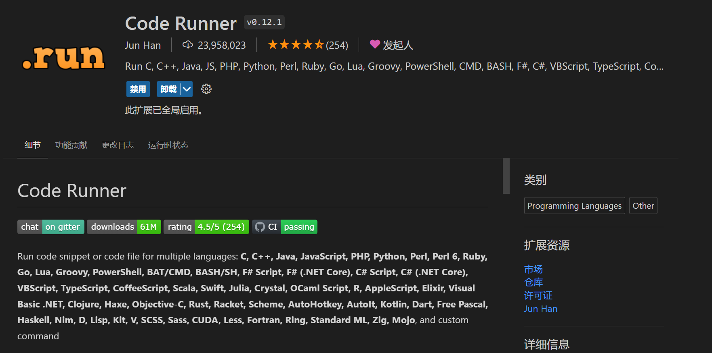
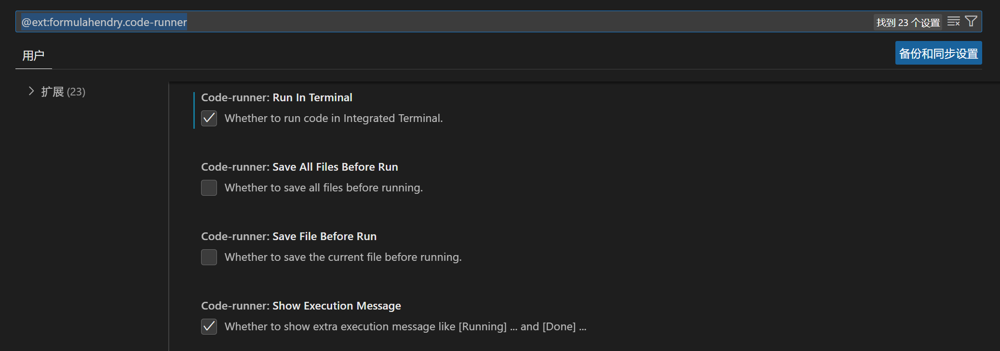

# Visual Studio Code环境下安装code runner并运行代码

## 安装GCC

如果需要编写C/C++程序，需要安装依赖项GCC，它是一款C/C++编译器，负责将源码编译成程序。code runner会在你进行测试时自动生成参数使用GCC编译源文件。GCC安装完后通常需要配置电脑的环境变量，所以要记住他下载的地址。下载完成并配置好环境变量后，打开powershell或cmd，通过以下命令来检测是否安装成功。

```powershell
gcc -v
# 若配置无误，将返回其信息
```

## 下载扩展

在Visual Studio Code的扩展页中搜索Code Runner并下载扩展




下载完成之后进入扩展设置，找到run in terminal选项并开启本设置。




随后创建一个源文件，例如Hello.cpp，写入

```cpp
#include <iostream>
using namespace std;
int main() {
    cout << "Hello World!" << endl;
    return 0;
}
```

然后点击右上角的运行按钮，注意是Run code选项，即可看到下面控制台的输出。所有交互也在控制台内进行。