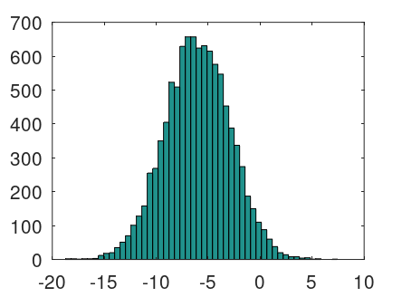

# Customizing the Prompt

```octave
PS1 ('\w \t\nnulla@\h \$ ')  
```


# Basic

## Variables and Display

```octave
a = 3
```

```octave
disp(a)

disp(sprintf('2 decimals: %0.2f', a))
% print a with tow decimals

format long
format short
%  print a long(small) digits
```

## Vectors and Matrix

```octave
A = [1 2; 3 4; 5 6]
% Assign the A a matrix

v = [1 2 3]
% a vector

v = [1; 2; 3]
% v will be a column vector

v = 1: 0.1: 2
v = 1: 6

ones(2, 3)
% generate a 2*3 matrix

C = 2 * ones(2, 3)

zeros(1, 3)

rand(3, 3)
% a 3*3 matrix of all random numbers drawn from the uniform distribution between zero and one
```

```octave
w = -6 + sqrt(10) * (randn(1, 10000));
hist(w, 50);
% draw a histogram of random variable for w
```



```octave
eye(4)
% return a 4*4 identity matrix
```


# Data

```octave
size(A)
% return a matrix which tells the size of matrix A
size(A, 1)
% return the size of first dimension of A

length(v)
% return the length of a vecot
% it will also return the longest dimension of a matrix
```

```octave
load ('filename')
% load data
```

```octave
who
% display all variables

whos
% give more details
```


