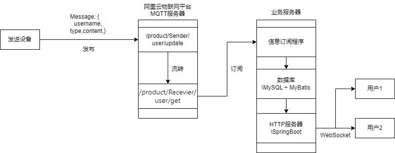

# 1. 设计目的

本系统的设计目的是实现一个基于物联网（IoT）的消息传输与展示平台，旨在通过 MQTT 协议实现设备与服务器之间的高效通信，并为用户提供直观的消息展示和管理功能。具体目标包括：

1. **实现设备与云端的高效通信**，设备通过 MQTT 协议将消息发送到阿里云 IoT 平台，服务器订阅这些消息并将其存储到本地数据库中。通过 MQTT 的轻量级和低延迟特性，确保消息传输的实时性和可靠性。
2. **提供实时消息展示功能**，服务器通过 WebSocket 将接收到的消息实时推送到前端页面，用户可以在页面上实时查看设备发送的消息。支持多种消息类型（如文本、图片、音频等）的动态渲染，提升用户体验。
3. **支持历史消息的查询与管理**，提供历史消息的查询功能，支持按时间、消息类型等条件进行筛选和分页展示。通过数据库存储消息记录，确保数据的持久化和可追溯性。
4. **实现设备管理与安全认证**，通过阿里云 IoT 平台管理设备的注册、认证和消息转发，确保设备与云端通信的安全性。使用设备三元组（`ProductKey`、`DeviceName`、`DeviceSecret`）进行设备认证，防止非法设备接入。
5. **构建可扩展的系统架构**，设计模块化的系统架构，便于后续功能的扩展和优化。支持高并发场景下的消息处理和实时推送，确保系统的稳定性和性能。

通过以上设计目标，本系统能够满足物联网场景下的消息传输、存储和展示需求，为用户提供高效、可靠和易用的消息管理平台。同时，系统的模块化设计和可扩展性为未来的功能扩展和技术升级提供了良好的基础。

# 2. 功能要求和关键问题

## 2.1 系统功能描述

**消息接收与存储**，设备通过 MQTT 协议将消息发送到阿里云 IoT 平台。设备可以是传感器、智能家居设备或其他物联网终端设备，消息内容可以包括环境数据（如温度、湿度）、设备状态或用户指令等。服务器订阅阿里云 IoT 平台的消息，并将其存储到本地数据库中。数据库设计需支持高效的消息存储和查询，确保数据的完整性和可追溯性。

**实时消息推送**，服务器通过 WebSocket 将接收到的消息实时推送到前端页面。WebSocket 的全双工通信机制能够确保消息的实时性和低延迟。前端页面通过 WebSocket 接收消息后，动态更新页面内容，确保用户能够实时查看设备发送的最新消息。

**消息展示与管理**，前端页面实时展示接收到的消息，支持按消息类型（文本、图片、音频等）动态渲染。例如，图片消息显示为缩略图，音频消息提供播放控件，文本消息直接显示内容。提供历史消息查询功能，支持按时间、消息类型等条件进行筛选和分页展示。用户可以通过分页功能浏览历史消息，系统需优化数据库查询性能以支持大规模数据的高效检索。

**设备管理**，通过阿里云 IoT 平台管理设备，包括设备的注册、认证和消息转发。每个设备在平台上注册后，会生成唯一的三元组信息（`ProductKey`、`DeviceName`、`DeviceSecret`），用于设备与云端的安全通信。支持设备的远程控制，例如通过平台向设备发送控制指令，实现设备的开关、配置更新等操作。提供设备状态监控功能，实时查看设备的在线状态、最后通信时间和消息统计信息。

**系统安全与可靠性**，设备与云端通信采用 MQTT 协议，并通过 TLS/SSL 加密传输，确保数据的机密性和完整性。设备认证采用阿里云 IoT 平台的三元组认证机制，防止非法设备接入。系统需具备高可用性和容错能力，确保在设备或网络异常情况下仍能正常运行。

**扩展功能**，支持设备固件升级，通过平台向设备推送固件更新包，确保设备始终运行在最新版本。提供数据分析功能，对设备发送的消息进行统计和分析，生成可视化报表，帮助用户更好地理解设备运行支持多用户权限管理，不同用户可以根据权限查看和管理不同的设备和消息。


## 2.2 复杂工程问题分析

**消息传输的实时性与可靠性**：

- **问题**：MQTT 协议虽然适合低带宽、不稳定的网络环境，但在高并发场景下，消息处理逻辑可能成为性能瓶颈，导致消息丢失或延迟。
- **解决方案**：优化消息处理逻辑，采用异步处理和消息队列机制，确保消息的高效处理和可靠传输。

**数据存储与查询性能**：

- **问题**：消息数据量可能较大，传统的数据库查询方式在大数据量下性能较差，特别是分页查询的效率问题。
- **解决方案**：采用分库分表、索引优化等技术提升数据库查询性能，同时使用缓存机制（如 Redis）减少数据库访问压力。

**前后端实时通信**：

- **问题**：WebSocket 虽然支持全双工通信，但在高并发场景下，连接管理和消息广播的效率可能成为瓶颈。
- **解决方案**：使用连接池和消息队列优化 WebSocket 的连接管理，确保在高并发场景下仍能高效处理消息推送。

**安全性**：
- **问题**：MQTT 和 WebSocket 通信需要加密传输，防止数据泄露或篡改。同时，设备认证和消息来源的合法性验证是系统安全的关键。


通过以上功能描述和问题分析，系统设计不仅满足了物联网场景下的基本需求，还考虑了高并发、高可用性和安全性等复杂工程问题，为系统的稳定运行和未来扩展提供了坚实的基础。

# 3. 系统整体框架设计

系统的整体框架设计围绕消息的流转和处理展开，主要分为以下几个部分：设备端、阿里云 IoT 平台、服务器端和前端展示。以下是详细的架构设计和信息流转说明：

## 3.1 **阿里云 IoT 平台**
**消息接收与转发**：阿里云 IoT 平台作为 MQTT 服务器，负责接收设备发送的消息，并根据配置的规则引擎将消息转发到指定的 Topic。

**消息存储**：平台可以对接收到的消息进行简单的存储和处理，支持消息的持久化和查询。

**设备管理**：平台提供设备管理功能，包括设备的注册、认证、状态监控和远程控制。

## 3.2 **服务器端**
**消息订阅与处理**：服务器通过 MQTT 客户端订阅阿里云 IoT 平台转发的消息。订阅的 Topic 为 `/product/Receiver/user/get`，服务器会实时接收设备发送的消息。

**消息存储**：服务器将接收到的消息存储到本地数据库中（如 MySQL），确保数据的持久化和可追溯性。数据库设计支持高效的消息存储和查询。

**消息推送**：服务器通过 WebSocket 将接收到的消息实时推送到前端页面，确保用户能够实时查看设备发送的最新消息。

## 3.3 **前端展示**
**实时消息展示**：前端页面通过 WebSocket 接收服务器推送的消息，并根据消息类型（文本、图片、音频等）动态渲染页面内容。例如，图片消息显示为缩略图，音频消息提供播放控件，文本消息直接显示内容。

**历史消息查询**：前端页面提供历史消息查询功能，支持按时间、消息类型等条件进行筛选和分页展示。用户可以通过分页功能浏览历史消息，系统优化数据库查询性能以支持大规模数据的高效检索。

## 3.4 **系统架构图**
**设备端**：设备通过 MQTT 协议将消息发送到阿里云 IoT 平台，Topic 为 `/product/Sender/user/update`。

**阿里云 IoT 平台**：平台接收设备发送的消息，并将消息转发到 `/product/Receiver/user/get` Topic。

**服务器端**：服务器订阅 `/product/Receiver/user/get` Topic，接收消息后存储到 MySQL 数据库，并通过 WebSocket 将消息推送到前端页面。

**前端展示**：前端页面通过 WebSocket 接收消息，并实时展示消息内容。同时，前端页面通过 HTTP 请求从服务器获取历史消息数据。

## 3.5 **技术栈**
**MQTT 通信**：设备与阿里云 IoT 平台之间的通信采用 MQTT 协议，确保消息的实时性和低延迟。

**数据库**：使用 MySQL 存储消息数据，MyBatis 作为 ORM 框架，支持高效的数据存储和查询。

**WebSocket**：服务器与前端页面之间的实时通信采用 WebSocket 协议，确保消息的实时推送。

**HTTP 服务器**：使用 Spring Boot 构建 HTTP 服务器，提供历史消息查询接口。

**前端技术**：前端页面使用 HTML、CSS 和 JavaScript 实现消息的动态展示和交互。

## 3.6 **信息流转流程**
   1. 设备通过 MQTT 协议将消息发送到阿里云 IoT 平台，Topic 为 `/product/Sender/user/update`。
   2. 阿里云 IoT 平台接收消息，并将消息转发到 `/product/Receiver/user/get` Topic。
   3. 服务器订阅 `/product/Receiver/user/get` Topic，接收消息后存储到 MySQL 数据库。
   4. 服务器通过 WebSocket 将消息实时推送到前端页面。
   5. 前端页面通过 WebSocket 接收消息，并实时展示消息内容。
   6. 前端页面通过 HTTP 请求从服务器获取历史消息数据，支持分页展示。


系统的整体框架设计围绕消息的流转和处理展开，通过 MQTT 协议实现设备与云端的高效通信，通过 WebSocket 实现消息的实时推送，通过 HTTP 服务器提供历史消息查询功能。系统的模块化设计和可扩展性为未来的功能扩展和技术升级提供了良好的基础。



# 4. 模块的设计和实现

## 4.1 阿里云基础和设计

### 4.1.1 阿里云概述

阿里云物联网平台是一个连接设备、云端和应用的综合服务平台，能够帮助用户实现设备数据的上传、存储、处理和使用。其结构包括物联网终端设备、阿里云物联网云（MQTT服务器）以及用户业务服务器，各部分通过稳定、安全的通信方式完成数据流转。

首先是设备部分。物联网终端设备可以是各种硬件设备，例如传感器、智能家居设备或工业设备。设备通过采集温度、湿度、位置等数据，利用 MQTT、CoAP 或 HTTP 协议，将数据发送到云端。这些设备需要具备基本的通信能力，并根据应用场景定义功能。

阿里云物联网云是整个系统的核心部分。设备通过 MQTT 协议连接到阿里云的物联网平台，平台为设备提供身份认证、数据传输和管理功能。同时，阿里云的规则引擎可以对设备上传的数据进行过滤、转换和分发，进一步流转到用户的业务服务器或云存储服务中。

业务服务器负责处理从阿里云物联网平台转发的数据。用户可以根据具体需求自定义业务逻辑，比如分析数据、存储历史记录或者下发控制命令到设备。阿里云物联网平台提供丰富的 API 和 SDK，方便用户搭建自己的数据处理和展示应用。

### 4.1.2 阿里云设备创建

在阿里云创建设备，首先需要创建产品。产品即为设备的一种类型，例如智能空调或智能路灯。每一种类型的产品可以定义自己的属性或事件等，也就是产品的功能，这些作为产品的一些重要特征。然后，用户需要在产品下注册具体的设备，平台会为每个设备生成唯一的身份认证信息，包括三元组（ProductKey、DeviceName 和 DeviceSecret）。这些信息用于设备和云端的安全通信。

整体上，阿里云物联网平台通过高度可扩展的架构，实现了设备与云端之间的安全、稳定通信，满足了从数据采集到智能控制的各种场景需求。

## 4.2 发送端程序设计

### 4.2.1 登录功能

实现类：`LoginController` 类
功能描述： 登录功能通过 `LoginController` 类实现，用户在登录界面输入客户端ID、用户名、密码和主机URL后，点击登录按钮触发 `onLogin` 方法。

在 onLogin 方法中，首先检查用户是否填写了所有必填字段（客户端ID、用户名、密码、主机URL）。如果有字段为空，显示错误提示信息。

如果用户选择了“记住我”选项，调用 `saveLoginDetails` 方法将登录信息保存到 `user.properties` 文件中。该方法使用 Properties 类将用户输入的值存储为键值对。

连接MQTT服务器：

调用 `MqttClientUtil.connect` 方法，传入客户端ID、用户名、密码和主机URL，以建立与MQTT服务器的连接。
MqttClientUtil 类负责创建 `Mqtt3AsyncClient` 实例并尝试连接到指定的MQTT服务器。

连接结果处理：

如果连接成功，关闭当前登录窗口，并通过 `FXMLLoader` 加载聊天界面 (chat.fxml)，显示主聊天窗口。
如果连接失败，显示错误提示信息，提示用户检查网络或配置信息。
相关代码片段：

```java
@FXML
public void onLogin() {
    String selectedUser = userSelector.getValue();
    String clientId = clientIdField.getText();
    String username = usernameField.getText();
    String password = passwordField.getText();
    String hostUrl = hostUrlField.getText();

    if (selectedUser == null || clientId.isEmpty() || username.isEmpty() || password.isEmpty() || hostUrl.isEmpty()) {
        errorLabel.setText("请填写所有字段！");
        return;
    }
    
    if (rememberMeCheckBox.isSelected()) {
        saveLoginDetails(selectedUser, clientId, username, password, hostUrl);
    }
    
    boolean connected = MqttClientUtil.connect(clientId, username, password, hostUrl);
    if (connected) {
        Stage stage = (Stage) userSelector.getScene().getWindow();
        stage.close();
    
        try {
            FXMLLoader loader = new FXMLLoader(getClass().getResource("/com/example/multidatacommunity/chat.fxml"));
            Stage chatStage = new Stage();
            chatStage.setScene(new Scene(loader.load()));
            chatStage.setTitle("聊天界面");
            chatStage.show();
        } catch (Exception e) {
            e.printStackTrace();
        }
    } else {
        errorLabel.setText("连接失败，请检查网络！");
    }
}
```

### 4.2.2 MQTT连接

实现类：`MqttClientUtil` 类
功能描述： MQTT连接功能通过 `MqttClientUtil` 类实现，负责与MQTT服务器建立连接，并提供消息发送功能。
实现细节：
连接建立：
connect 方法接收客户端ID、用户名、密码和主机URL作为参数，使用这些信息创建一个 `Mqtt3AsyncClient` 实例。
通过 `MqttClient.builder()` 方法配置MQTT客户端，设置服务器主机和端口（默认为1883），并应用简单认证（用户名和密码）。
调用 `client.connectWith().cleanSession(true).send()` 异步连接到MQTT服务器，并在连接完成时输出连接状态。
消息发送：
`sendMessage` 方法用于向指定的主题发送消息。首先检查客户端是否处于连接状态。
使用 `client.publishWith()` 方法设置主题、消息内容（以字节数组形式）和QoS级别（至少一次），然后发送消息。
在消息发送完成后，处理可能的异常或确认发送成功的信息。
客户端信息获取：
`getClientInfo` 方法用于获取并返回客户端的相关信息，包括产品密钥、设备名称以及当前的连接状态。使用正则表达式解析客户端标识符以提取所需信息。
相关代码片段：

```java
public static boolean connect(String clientId, String username, String password, String hostUrl) {
    try {
        client = MqttClient.builder()
                .useMqttVersion3()
                .identifier(clientId)
                .serverHost(hostUrl)
                .serverPort(1883)
                .simpleAuth()
                .username(username)
                .password(password.getBytes())
                .applySimpleAuth()
                .buildAsync();

        client.connectWith()
                .cleanSession(true)
                .send()
                .whenComplete((ack, throwable) -> {
                    if (throwable != null) {
                        throwable.printStackTrace();
                    } else {
                        System.out.println("Connected successfully");
                    }
                });
    
        return true;
    } catch (Exception e) {
        e.printStackTrace();
        return false;
    }
}

public static void sendMessage(String topic, String message) {
    try {
        if (client.getState() == MqttClientState.CONNECTED) {
            String jsonMessage = message;
            client.publishWith()
                    .topic(topic)
                    .payload(jsonMessage.getBytes())
                    .qos(MqttQos.AT_LEAST_ONCE)
                    .send()
                    .whenComplete((publish, throwable) -> {
                        if (throwable != null) {
                            throwable.printStackTrace();
                        } else {
                            System.out.println("消息发送成功到主题：" + topic);
                        }
                    });
        } else {
            System.out.println("Client is not connected");
        }
    } catch (Exception e) {
        e.printStackTrace();
    }
}
public static String getClientInfo() {
        String info;
        String tempinfo;

        tempinfo = client.getConfig().getClientIdentifier().toString();
        Pattern pattern = Pattern.compile("Optional\\[(\\w+)\\.(\\w+)\\|");
        Matcher matcher = pattern.matcher(tempinfo);
    
            if (matcher.find()) {
                produceKey = matcher.group(1);
            deviceName = matcher.group(2);
            System.out.println("Produce Key: " + produceKey);
            System.out.println("Device Name: " + deviceName);
        } else {
            System.out.println("No match found");
        }
        info =
            "产品密钥：" + produceKey +
            "\n当前设备名称: " + deviceName +
            "\n目前与云端的连接状态: " + ((client.getState()).toString().equals("CONNECTING")?"已连接":"未连接")
        ;
        return info;
    }
```

### 4.2.3 聊天功能

实现类：`ChatController` 类
功能描述： 聊天功能通过 `ChatController` 类实现，允许用户发送文本消息、图片和音频，并接收来自MQTT服务器的消息。
实现细节：

发送消息：

用户在聊天界面输入消息后，按下回车键或点击发送按钮触发 `onSendMessage` 方法。
该方法首先检查消息是否为空，并调用 `containsIllegalCharacters` 方法检测是否包含非法字符。如果检测到非法字符，调用 `showAlert` 方法提示用户。
将合法的消息封装为JSON格式，包括用户名、消息类型和内容，通过 `MqttClientUtil.sendMessage` 方法发送到指定的MQTT主题。
同时，调用 `DatabaseUtil.saveMessage` 方法将消息保存到本地数据库，并在 `chatHistory` 文本区域显示消息。

发送图片：

用户点击发送图片按钮，触发 `onSendImage` 方法，打开文件选择对话框，允许用户选择PNG、JPG或JPEG格式的图片。
选择图片后，调用 `ImageUtil.encodeToBase64` 方法将图片文件编码为Base64字符串，并封装为JSON消息发送到MQTT服务器。

录音功能：

用户点击录音按钮，触发 `onRecordAudio` 方法，调用 `RecordingUtil.startRecording` 开始录音，再次点击停止录音。
录音结束后，调用 `RecordingUtil.stopRecording` 方法将录音文件转换为MP3并编码为Base64字符串，通过 `MqttClientUtil.sendMessage` 方法发送到MQTT服务器，并将音频数据保存到数据库。

接收消息：

`ChatController` 类还负责订阅相关MQTT主题，接收来自服务器的消息，并将其显示在聊天记录区域。
相关代码片段：

```java
@FXML
public void onSendMessage() {
    String message = messageInput.getText();
    if (!message.isEmpty()) {
        if (containsIllegalCharacters(message)) {
            showAlert("消息包含非法字符！");
            return;
        }
        String jsonMessage = "{\"username\":\"" + MqttClientUtil.deviceName + "\",\"type\":\"text\",\"content\":\"" + message + "\"}";
        MqttClientUtil.sendMessage("/" + MqttClientUtil.produceKey + "/" + MqttClientUtil.deviceName + "/user/update", jsonMessage);
        DatabaseUtil.saveMessage(message);
        chatHistory.appendText("我: " + message + "\n");
        messageInput.clear();
    }
}
```


### 4.2.4 录音功能

实现类：`RecordingUtil` 类 和 `ChatController` 类
功能描述： 录音功能允许用户录制音频，并将录音转换为MP3格式后发送到MQTT服务器。
实现细节：

录音开始：

用户点击录音按钮，触发 `ChatController` 中的 `onRecordAudio` 方法，调用 `RecordingUtil.startRecording` 方法开始录音。
在 `RecordingUtil.startRecording` 方法中，设置音频格式（44.1 kHz, 16-bit, 单声道），打开音频线路，并启动录音线程，实时读取音频数据并保存为WAV文件。

录音结束：

再次点击录音按钮，触发停止录音逻辑，调用 `RecordingUtil.stopRecording` 方法。
stopRecording 方法中，停止音频线路和录音线程，调用 `convertWavToMp3UsingFFmpeg` 方法使用FFmpeg将WAV文件转换为MP3格式。
转换后的MP3文件通过 `encodeToBase64` 方法编码为Base64字符串，并通过 `MqttClientUtil.sendMessage` 方法发送到MQTT服务器。
最后，将Base64编码的音频数据调用 `DatabaseUtil.saveAudio` 方法保存到数据库中，并在聊天记录中显示发送音频的提示信息。
相关代码片段：

```java
public class RecordingUtil {
    // ... 其他代码 ...

    public static void startRecording() {
        try {
            File tempFolder = new File(TEMP_FOLDER);
            if (!tempFolder.exists()) {
                tempFolder.mkdirs();
            }
    
            // 设置音频格式：44.1 kHz, 16-bit, 单声道
            AudioFormat format = new AudioFormat(44100, 16, 1, true, false);
            DataLine.Info info = new DataLine.Info(TargetDataLine.class, format);
            if (!AudioSystem.isLineSupported(info)) {
                System.out.println("音频线路不支持");
                return;
            }
    
            line = (TargetDataLine) AudioSystem.getLine(info);
            line.open(format);
            line.start();
    
            recordingThread = new Thread(() -> {
                try (ByteArrayOutputStream out = new ByteArrayOutputStream()) {
                    byte[] buffer = new byte[4096];
                    int bytesRead;
                    while (!Thread.currentThread().isInterrupted()) {
                        bytesRead = line.read(buffer, 0, buffer.length);
                        if (bytesRead > 0) {
                            out.write(buffer, 0, bytesRead);
                        }
                    }
                    Files.write(Paths.get(RECORDING_WAV), out.toByteArray(), StandardOpenOption.CREATE);
                } catch (IOException e) {
                    e.printStackTrace();
                }
            });
            recordingThread.start();
            System.out.println("开始录音...");
        } catch (Exception e) {
            e.printStackTrace();
        }
    }
    
    public static void stopRecording() {
        File mp3File = null;
        try {
            if (line != null) {
                line.stop();
                line.close();
            }
            if (recordingThread != null) {
                recordingThread.interrupt();
                recordingThread.join();
            }
            System.out.println("录音结束");
    
            // 转换 WAV 到 MP3
            File wavFile = new File(RECORDING_WAV);
            mp3File = new File(RECORDING_MP3);
            convertWavToMp3UsingFFmpeg(wavFile, mp3File);
    
            // 将 MP3 文件编码为 Base64
            base64String = encodeToBase64(mp3File);
            System.out.println("录音文件已转换为编码");
        } catch (Exception e) {
            e.printStackTrace();
        }
    }
    
    private static void convertWavToMp3UsingFFmpeg(File wavFile, File mp3File) throws IOException {
        try {
            FFmpeg = new FFmpeg(); // 默认使用系统 PATH 中的 FFmpeg
            FFmpegExecutor executor = new FFmpegExecutor(ffmpeg);
    
            FFmpegBuilder builder = new FFmpegBuilder()
                    .setInput(wavFile.getPath())
                    .overrideOutputFiles(true)
                    .addOutput(mp3File.getPath())
                    .setFormat("mp3")
                    .setAudioCodec("libmp3lame")
                    .setAudioBitRate(128000)
                    .setAudioChannels(2)
                    .setAudioSampleRate(44100)
                    .done();
            executor.createJob(builder).run();
        } catch (Exception e) {
            e.printStackTrace();
        }
    }
   
    public static String encodeToBase64(File file) {
        try {
            byte[] bytes = Files.readAllBytes(file.toPath());
            return Base64.getEncoder().encodeToString(bytes);
        } catch (IOException e) {
            e.printStackTrace();
            return null;
        }
    }
}
@FXML
public void onRecordAudio() {
    if (recordButton.isSelected()) {
        RecordingUtil.startRecording();
        recordButton.setText("停止录音");
    } else {
        RecordingUtil.stopRecording();
        String base64Audio = RecordingUtil.encodeToBase64();
        if (base64Audio != null) {
            String jsonMessage = "{\"username\":\"" + MqttClientUtil.deviceName + "\",\"type\":\"audio\",\"content\":\"" + base64Audio + "\"}";
            MqttClientUtil.sendMessage("/" + MqttClientUtil.produceKey + "/" + MqttClientUtil.deviceName + "/user/update", jsonMessage);
            DatabaseUtil.saveAudio(base64Audio);
            chatHistory.appendText("我: 发送了一段语音\n");
        }
        recordButton.setText("录音");
    }
}
```

### 4.2.5 图片发送功能

实现类：`ChatController` 类 和 `ImageUtil` 类
功能描述： 图片发送功能允许用户选择本地图片文件，将其编码为Base64字符串后发送到MQTT服务器。
实现细节：

选择图片文件：

用户点击发送图片按钮，触发 `onSendImage` 方法，使用 `FileChooser` 类打开文件选择对话框，过滤出PNG、JPG和JPEG格式的图片文件。

图片编码与发送：

选择图片后，调用 ImageUtil.encodeToBase64 方法将图片文件读取并编码为Base64字符串。
将编码后的字符串封装为JSON格式消息，包括用户名、消息类型（image）和内容，通过 MqttClientUtil.sendMessage 方法发送到指定的MQTT主题。

保存与显示：

调用 `DatabaseUtil.saveMessage` 方法将发送的图片消息记录到数据库中，并在聊天记录区域显示发送图片的提示信息。
相关代码片段：

```java
@FXML
public void onSendImage() {
    FileChooser fileChooser = new FileChooser();
    fileChooser.getExtensionFilters().add(new FileChooser.ExtensionFilter("Image Files", "*.png", "*.jpg", "*.jpeg"));
    File selectedFile = fileChooser.showOpenDialog(new Stage());
    if (selectedFile != null) {
        String encodedImage = ImageUtil.encodeToBase64(selectedFile);
        String jsonMessage = "{\"username\":\"" + MqttClientUtil.deviceName + "\",\"type\":\"image\",\"content\":\"" + encodedImage + "\"}";
        MqttClientUtil.sendMessage("/" + MqttClientUtil.produceKey + "/" + MqttClientUtil.deviceName + "/user/update", jsonMessage);
        DatabaseUtil.saveMessage("发送了一张图片");
        chatHistory.appendText("我: 发送了一张图片\n");
    }
}
辅助类：
public class ImageUtil {
    public static String encodeToBase64(File file) {
        try {
            byte[] data = Files.readAllBytes(file.toPath());
            return Base64.getEncoder().encodeToString(data);
        } catch (Exception e) {
            e.printStackTrace();
            return null;
        }
    }
}
```

### 4.2.6 数学建模功能

实现类：`ModelingController` 类 和 `ModelingUtil` 类
功能描述： 数学建模功能允许用户选择不同的数学模型，输入相应的参数，生成数据并绘制图表，最后将图表保存为图片并发送到MQTT服务器。
实现细节：

模型选择与参数输入：

用户在数学建模界面选择模型（如随机数、正态分布、泊松分布）后，根据选择的模型动态显示相应的参数输入字段。
通过 `modelSelector` 的事件监听器，触发 `updateParameterFields` 方法，根据模型类型显示或隐藏相关参数输入框。

生成数据与绘图：

用户输入参数后，点击生成按钮触发 onGenerate 方法。
根据选择的模型类型，调用相应的方法生成数据（如 `generateRandomNumbers`、`generateNormalDistribution`、`generatePoissonDistribution`），并将数据添加到 XYChart.Series 中。
更新 LineChart 以显示生成的数据图表，并设置图表标题和标签。

保存与发送图表：

调用 `saveChartAsImage` 方法将当前图表保存为图片文件（如PNG格式）。
调用 onSend 方法，将保存的图表图片文件编码为Base64字符串，通过 `MqttClientUtil.sendMessage` 方法发送到MQTT服务器。
相关代码片段：

```java
@FXML
public void onGenerate() {
    String model = modelSelector.getValue();
    String parameter1 = parameterField1.getText();
    String parameter2 = parameterField2.getText();
    String parameter3 = parameterField3.getText();

    if (model == null || parameter1.isEmpty() ||
            ("正态分布".equals(model) && parameter2.isEmpty()) ||
            ("随机数".equals(model) && (parameter2.isEmpty() || parameter3.isEmpty()))) {
        showAlert("请填写所有必要的参数！");
        return;
    }
    
    XYChart.Series<Number, Number> series = new XYChart.Series<>();
    Random random = new Random();
    
    switch (model) {
        case "随机数" -> generateRandomNumbers(series, Integer.parseInt(parameter1), Double.parseDouble(parameter2), Double.parseDouble(parameter3), random);
        case "正态分布" -> generateNormalDistribution(series, Double.parseDouble(parameter1), Double.parseDouble(parameter2), random);
        case "泊松分布" -> generatePoissonDistribution(series, Double.parseDouble(parameter1), random);
    }
    
    chart.getData().clear();
    chart.getData().add(series);
    
    setChartTitleAndLabels(model);
    
    series.getNode().setStyle("-fx-stroke: blue; -fx-stroke-width: 2;");
}

private void saveChartAsImage() {
    WritableImage image = chart.snapshot(null, null);
    File file = new File("chart.png");
    try {
        ImageIO.write(SwingFXUtils.fromFXImage(image, null), "png", file);
        System.out.println("图表已保存为 chart.png");
    } catch (IOException e) {
        e.printStackTrace();
    }
}

@FXML
public void onSend() {
    saveChartAsImage();
    File imageFile = new File("chart.png");
    if (imageFile.exists()) {
        String encodedImage = ImageUtil.encodeToBase64(imageFile);
        String jsonMessage = "{\"username\":\"" + MqttClientUtil.deviceName + "\",\"type\":\"image\",\"content\":\"" + encodedImage + "\"}";
        MqttClientUtil.sendMessage("/" + MqttClientUtil.produceKey + "/" + MqttClientUtil.deviceName + "/user/update", jsonMessage);
        DatabaseUtil.saveMessage("发送了一张数学建模图表");
        chatHistory.appendText("我: 发送了一张数学建模图表\n");
    }
}
```

### 4.2.7 登录控制器

实现类：`LoginController` 类
功能描述： 登录控制器负责处理用户的登录操作，包括加载保存的登录信息、验证用户输入、保存登录详情等。
实现细节：
初始化：
在 initialize 方法中，初始化用户选择下拉框，例如添加“用户A”作为默认选项。
调用 `loadLoginDetails` 方法，从 `user.properties` 文件中加载之前保存的登录信息，并填充到对应的输入字段中。
保存登录详情：
saveLoginDetails 方法使用 Properties 类将用户的登录信息（用户、客户端ID、用户名、密码、主机URL）保存到 user.properties 文件中，以便下次自动加载。
加载登录详情：
loadLoginDetails 方法从 user.properties 文件中读取保存的登录信息，并填充到相应的输入字段中。如果文件不存在或读取失败，忽略错误。
错误处理：
在登录过程中，如果连接失败或发生异常，显示相应的错误提示信息，帮助用户进行故障排除。

相关代码片段：

```java
public class LoginController {
    @FXML
    private ComboBox<String> userSelector;
    @FXML
    private TextField clientIdField;
    @FXML
    private TextField usernameField;
    @FXML
    private PasswordField passwordField;
    @FXML
    private TextField hostUrlField;
    @FXML
    private CheckBox rememberMeCheckBox;
    @FXML
    private Label errorLabel;

    private static final String PROPERTIES_FILE = "user.properties";
    
    @FXML
    public void initialize() {
        userSelector.getItems().addAll("用户A");
        userSelector.setValue("用户A");
        loadLoginDetails();
    }
    
    private void saveLoginDetails(String user, String clientId, String username, String password, String hostUrl) {
        try (OutputStream output = new FileOutputStream(PROPERTIES_FILE)) {
            Properties prop = new Properties();
            prop.setProperty("user", user);
            prop.setProperty("clientId", clientId);
            prop.setProperty("username", username);
            prop.setProperty("password", password);
            prop.setProperty("hostUrl", hostUrl);
            prop.store(output, null);
        } catch (IOException io) {
            io.printStackTrace();
        }
    }
    
    private void loadLoginDetails() {
        try (InputStream input = new FileInputStream(PROPERTIES_FILE)) {
            Properties prop = new Properties();
            prop.load(input);
            userSelector.setValue(prop.getProperty("user"));
            clientIdField.setText(prop.getProperty("clientId"));
            usernameField.setText(prop.getProperty("username"));
            passwordField.setText(prop.getProperty("password"));
            hostUrlField.setText(prop.getProperty("hostUrl"));
        } catch (IOException ex) {
            ex.printStackTrace();
        }
    }
}
```

## 4.3 订阅端程序设计

### 4.3.1 消息实体

消息的传输需要规范，因此首先定义了消息实体。消息通过 `json` 格式进行传输，并使用 `Jackson` 库对对象进行序列化和反序列化。

```java
package cn.arorms.iot.server.entity;

import com.fasterxml.jackson.annotation.JsonFormat;
import lombok.Data;
import java.time.LocalDateTime;

/**
 * Message entity
 * @version 1.0 2025-01-07
 * @since 2025-01-07
 * @author Holmes Amzish
 */
@Data
public class Message {
    public Integer id;
    public String username;
    public String type;
    public String content;
    
    @JsonFormat(pattern = "yyyy-MM-dd HH:mm:ss")
    public LocalDateTime time;
}
```

经过对消息实体的定义，不需要专门为每个消息设计对应的读取窗口或特别的逻辑。只需要通过接收到对象后对对象的 `type` 来进行判断即可实现直接显示不同的消息。因此在程序的设计中最后都是显示在一起的，没有分开窗口。

### 4.3.2 Mqtt 接收器

​	首先需要定义设备信息，这里通过阿里云提供的设备信息三元组来进行连接。本项目直接使用Mqtt客户端而没有使用阿里云提供的SDK。这些信息最后需要转换成Mqtt连接信息。

```java
// 设备信息定义
private static final String PRODUCT_KEY = "k0zisw6ZO1s";
private static final String DEVICE_NAME = "Receiver";
private static final String REGION_ID = "cn-shanghai";
private static final int PORT = 1883;

// MQTT 连接信息生成
long timestamp = System.currentTimeMillis();
String clientId = "k0zisw6ZO1s.Receiver|securemode=2,signmethod=hmacsha256,timestamp=1736176155489|";
String username = String.format("%s&%s", DEVICE_NAME, PRODUCT_KEY);
String password = "9608df3e9abe09c43d0c4c59329790b43a797abf18e619a6e8bb949a1eb83815";

// MQTT Broker URL
String broker = "ssl://" + PRODUCT_KEY + ".iot-as-mqtt." + REGION_ID + ".aliyuncs.com:" + PORT;
```

​	Mqtt 客户端需要初始化与连接，在 `init` 方法中，使用 `MqttClient` 类创建客户端实例，指定 Broker URL、Client ID 和持久化方式。然后设置链接选项，包括了连接参数和用户名密码。最后设置回调参数，实现 `MqttCallback` 接口，处理连接丢失、消息到达和消息发送完成的事件。

```java
// 创建 MQTT 客户端
MqttClient client = new MqttClient(broker, clientId, new MemoryPersistence());

// 设置连接选项
MqttConnectOptions options = new MqttConnectOptions();
options.setUserName(username);
options.setPassword(password.toCharArray());
options.setCleanSession(false);
options.setAutomaticReconnect(true);

// 设置回调函数
client.setCallback(new MqttCallback() {
    @Override
    public void connectionLost(Throwable cause) {
        log.error("connectionLost", cause.getMessage());
    }

    @Override
    public void messageArrived(String topic, MqttMessage message) throws Exception {
        // 处理接收到的消息
    }

    @Override
    public void deliveryComplete(IMqttDeliveryToken token) {
        // 消息发送完成
    }
});

// 连接 MQTT Broker
client.connect(options);
log.info("MQTT connect successful!");
```

​	连接成功后，客户端需要订阅特定的主题来接收消息。

```java
// 订阅主题
String subscribeTopic = "/" + PRODUCT_KEY + "/" + DEVICE_NAME + "/user/get";
client.subscribe(subscribeTopic);
log.info("Topic subscribed: {}", subscribeTopic);
```

​	当MQTT客户端接收到订阅主题的消息时，会触发 `messageArrived` 方法。首先会将接收到的消息从 `byte[]` 转换成 `base64String` 。再使用 `ObjectMapper` 将 JSON 格式的消息解析为 `Message` 对象。然后将解析后的消息存储到数据库中并将其推送到 WebSocket 服务器，以便前端实时显示。

```java
@Override
public void messageArrived(String topic, MqttMessage message) throws Exception {
    // 解析消息
    String payload = new String(message.getPayload(), StandardCharsets.UTF_8);
    log.info("Received message from [{}]: {}", topic, payload);

    ObjectMapper objectMapper = new ObjectMapper();
    objectMapper.registerModule(new JavaTimeModule());
    try {
        // 将 JSON 消息解析为 Message 对象
        Message msg = objectMapper.readValue(message.getPayload(), Message.class);
        msg.setTime(LocalDateTime.now());

        // 存储消息到数据库
        messageService.insertMessage(msg);

        // 推送消息到 WebSocket
        String formattedMessage = objectMapper.writeValueAsString(msg);
        log.info("Sending message to WebSocket: {}", formattedMessage);
        WebSocketServer.sendMessageToAll(formattedMessage);
    } catch (Exception e) {
        log.error("Error parsing message to Message object: {}", e.getMessage());
    }
}
```

### 4.3.3 数据库

​	JSON 数据会首先被转换成之前定义的消息实体对象，然后通过数据库映射插入数据库中，最后实现数据库的存取。

​	为了支持消息的查询功能，定义了三个 `select` 语句。第一个是 `getAllMessage`，用于查询所有消息，并按 `id` 降序排列。第二个是 `getMessageById`，用于根据 `id` 查询单条消息。第三个是 `getMessagesByPage`，用于分页查询消息，通过 `LIMIT` 子句实现分页功能，其中 `#{offset}` 表示起始位置，`#{pageSize}` 表示每页的记录数。

​	这些 SQL 语句的设计使得系统能够高效地存储和查询消息数据。插入操作支持将接收到的消息持久化到数据库中，而查询操作则支持按需获取消息记录，无论是获取全部消息、单条消息还是分页消息，都能通过简单的 SQL 语句实现。这种设计不仅提高了系统的灵活性，还为后续的功能扩展提供了便利。

```xml
<?xml version="1.0" encoding="UTF-8" ?>
<!DOCTYPE mapper PUBLIC "-//mybatis.org//DTD Mapper 3.0//EN"
        "http://mybatis.org/dtd/mybatis-3-mapper.dtd">
<mapper namespace="cn.arorms.iot.server.mapper.MessageMapper">
    <resultMap id="MessageResultMap" type="cn.arorms.iot.server.entity.Message">
        <id column="id" property="id" />
        <result column="username" property="username" />
        <result column="type" property="type" />
        <result column="content" property="content" />
        <result column="created_at" property="time" />
    </resultMap>
    <insert id="insertMessage">
        INSERT INTO messages (username, type, content, created_at)
        VALUES (#{username}, #{type}, #{content}, #{time});
    </insert>
    <select id="getAllMessage" resultMap="MessageResultMap">
        SELECT * FROM messages
        ORDER BY id DESC;
    </select>
    <select id="getMessageById" resultMap="MessageResultMap">
        SELECT * FROM messages WHERE id=#{id};
    </select>
    <select id="getMessagesByPage" resultMap="MessageResultMap">
        SELECT *
        FROM messages
        ORDER BY id DESC
        LIMIT #{offset}, #{pageSize};
    </select>
</mapper>
```


### 4.3.4 WebSocket 服务器

​	WebSocket 服务器类 `WebSocketServer` 是实现实时消息推送的核心组件。它通过 `@ServerEndpoint` 注解定义了 WebSocket 的端点路径为 `/websocket`，并使用 `@Component` 注解将其注册为 Spring 组件。类中维护了一个 `CopyOnWriteArraySet<Session>` 集合，用于存储所有连接的 WebSocket 会话。`CopyOnWriteArraySet` 是线程安全的集合，适合在高并发场景下使用。

```java
@Slf4j
@Component
@ServerEndpoint("/websocket")
public class WebSocketServer {
    private static final CopyOnWriteArraySet<Session> sessions = new CopyOnWriteArraySet<>();
}
```

**`@ServerEndpoint("/websocket")`**：定义 WebSocket 的端点路径为 `/websocket`，客户端通过该路径连接到服务器。
**`CopyOnWriteArraySet<Session>`**：用于存储所有连接的 WebSocket 会话，确保线程安全。


在 `onOpen` 方法中，当客户端成功连接到 WebSocket 服务器时，会将当前的会话 `Session` 添加到 `sessions` 集合中，并记录日志。

```java
@OnOpen
public void onOpen(Session session) {
    sessions.add(session);
    log.info("New connection, session id: {}", session.getId());
}
```

**`@OnOpen`**：当客户端成功连接时触发。
**`sessions.add(session)`**：将当前会话添加到集合中。
**日志记录**：记录新连接的会话 ID。


`onClose` 方法则会在客户端断开连接时，从集合中移除对应的会话，并记录日志。

```java
@OnClose
public void onClose(Session session) {
    sessions.remove(session);
    log.info("Connection closed, session id: {}", session.getId());
}
```

**`@OnClose`**：当客户端断开连接时触发。
**`sessions.remove(session)`**：从集合中移除当前会话。
**日志记录**：记录断开连接的会话 ID。


`onMessage` 方法用于处理客户端发送的消息，这里仅记录了接收到的消息内容。

```java
@OnMessage
public void onMessage(String message, Session session) {
    log.info("Received message from client [{}]: {}", session.getId(), message);
}
```

**`@OnMessage`**：当接收到客户端发送的消息时触发。
**日志记录**：记录消息内容和发送者的会话 ID。


`onError` 方法用于处理 WebSocket 通信过程中发生的错误，并记录错误日志。

```java
@OnError
public void onError(Session session, Throwable error) {
    log.error("Error occurred in session [{}]: {}", session.getId(), error.getMessage());
}
```

**`@OnError`**：当 WebSocket 通信发生错误时触发。
**日志记录**：记录错误信息和发生错误的会话 ID。


`sendMessageToAll` 是一个静态方法，用于向所有连接的客户端广播消息。它遍历 `sessions` 集合中的每一个会话，并尝试通过 `session.getBasicRemote().sendText(message)` 发送消息。如果发送过程中发生异常（如客户端已断开连接），则会记录错误日志。

```java
public static void sendMessageToAll(String message) {
    for (Session session : sessions) {
        try {
            session.getBasicRemote().sendText(message);
        } catch (IOException e) {
            log.error("Error sending message: {}", e.getMessage());
        }
    }
}
```

**`sendMessageToAll`**：向所有连接的客户端广播消息。
**`session.getBasicRemote().sendText(message)`**：向客户端发送文本消息。
**异常处理**：如果发送失败，记录错误日志。


前端 WebSocket 初始化代码解析

在前端部分，通过 JavaScript 初始化 WebSocket 连接，并定义了事件处理函数。

```javascript
const socket = new WebSocket("ws://localhost:8080/websocket");
const maxRows = 50; // Maximum rows in the table
const statusDiv = document.getElementById("status");
const tableBody = document.getElementById("message-table-body");
```

**`new WebSocket("ws://localhost:8080/websocket")`**：初始化 WebSocket 连接，连接到服务器的 `/websocket` 端点。**`maxRows`**：定义表格中最大显示的行数。**`statusDiv` 和 `tableBody`**：分别用于显示连接状态和消息内容的 DOM 元素。


`socket.onopen` 在连接成功时触发，更新页面状态为“已连接”。

```javascript
socket.onopen = function () {
    console.log("WebSocket connected");
    statusDiv.className = "alert alert-success";
    statusDiv.textContent = "WebSocket connected";
};
```

**`socket.onopen`**：当 WebSocket 连接成功时触发。

**更新页面状态**：将状态栏的样式和文本更新为“已连接”。


`socket.onclose` 在连接断开时触发，更新页面状态为“已断开”。

```javascript
socket.onclose = function () {
    console.log("WebSocket disconnected");
    statusDiv.className = "alert alert-danger";
    statusDiv.textContent = "WebSocket disconnected";
};
```

**`socket.onclose`**：当 WebSocket 连接断开时触发。

**更新页面状态**：将状态栏的样式和文本更新为“已断开”。


`socket.onerror` 在发生错误时触发，更新页面状态为“发生错误”。

```javascript
socket.onerror = function (error) {
    console.error("WebSocket Error: ", error);
    statusDiv.className = "alert alert-warning";
    statusDiv.textContent = "WebSocket encountered an error";
};
```

**`socket.onerror`**：当 WebSocket 通信发生错误时触发。

更新页面状态：将状态栏的样式和文本更新为“发生错误”。


`socket.onmessage` 用于处理从服务器接收到的消息，将消息解析为 JSON 对象后调用 `addMessageToTable` 方法将其添加到页面表格中。

```javascript
socket.onmessage = function (event) {
    console.log("Received data:", event.data);
    const data = JSON.parse(event.data);
    addMessageToTable(data);
};
```

**`socket.onmessage`**：当接收到服务器发送的消息时触发。
**`JSON.parse(event.data)`**：将消息解析为 JSON 对象。
**`addMessageToTable(data)`**：将消息添加到页面表格中。


`addMessageToTable` 方法根据消息的类型动态生成表格行的内容。如果消息类型为 `image` 或 `model`，则生成一个图片元素；如果消息类型为 `record`，则生成一个音频播放器；否则，直接显示文本内容。生成的行会被插入到表格的顶部，如果表格行数超过设定的最大值 `maxRows`，则会移除最旧的一行。

```javascript
function addMessageToTable(data) {
    const row = document.createElement("tr");
    let contentCell = "";
    if (data.type === "image") {
        contentCell = `<td></td>`;
    } else if (data.type === "model") {
        contentCell = `<td></td>`;
    } else if (data.type === "record") {
        contentCell = `
            <td>
                <audio controls>
                    <source src="data:audio/wav;base64,${data.content}" type="audio/wav">
                    Your browser does not support the audio element.
                </audio>
            </td>`;
    } else {
        contentCell = `<td>${data.content}</td>`;
    }
    row.innerHTML = `
        <td>${data.username}</td>
        <td>${data.type}</td>
        ${contentCell}
        <td>${data.time}</td>
    `;
    tableBody.prepend(row);
    if (tableBody.rows.length > maxRows) {
        tableBody.deleteRow(tableBody.rows.length - 1);
    }
}
```

**动态生成内容**：根据消息类型生成不同的 HTML 内容（图片、音频或文本）。
**插入新行**：将新生成的行插入到表格的顶部。
**移除旧行**：如果表格行数超过 `maxRows`，则移除最旧的一行。

通过这种设计，WebSocket 服务器能够高效地处理客户端连接、消息接收和广播，同时前端页面能够实时展示接收到的消息内容，并根据消息类型动态调整显示方式。这种实时通信机制为系统提供了强大的实时数据展示能力。


### 4.3.5 控制器

控制器 `MessageController` 是处理前端请求的核心组件，负责将请求映射到相应的业务逻辑，并返回视图或数据。通过 `@Controller` 注解将其注册为 Spring 的控制器组件，并使用 `@Autowired` 注入 `MessageService` 服务类，以便调用业务逻辑。

```java
@Controller
public class MessageController {

    @Autowired
    private MessageService messageService;
}
```

`@Controller`：标识该类为 Spring MVC 的控制器。
`@Autowired`：自动注入 `MessageService`，用于处理消息相关的业务逻辑。

`@GetMapping("/messages")` 方法用于处理路径为 `/messages` 的 GET 请求，返回视图名称 `messages`。该方法没有额外的业务逻辑，仅用于渲染页面。

```java
@GetMapping("/messages")
public String message(Model model) {
    return "messages";  
}
```

`@GetMapping("/messages")`：映射 `/messages` 路径的 GET 请求。

`return "messages"`：返回视图名称 `messages`，Spring 会根据配置解析为对应的视图文件（如 `messages.html`）。

`@GetMapping("/history")` 方法用于处理路径为 `/history` 的 GET 请求，支持分页查询消息记录。通过 `@RequestParam` 注解获取分页参数 `page` 和 `pageSize`，并调用 `messageService.getMessagesByPage` 方法获取分页数据。最后，将分页数据和分页参数添加到 `Model` 中，返回视图名称 `history`。

```java
@GetMapping("/history")
public String printMessageByPage(
        @RequestParam(defaultValue = "1") int page,
        @RequestParam(defaultValue = "50") int pageSize,
        Model model) {
    List<Message> messages = messageService.getMessagesByPage(page, pageSize);
    model.addAttribute("messages", messages);
    model.addAttribute("currentPage", page);
    model.addAttribute("pageSize", pageSize);
    model.addAttribute("nextPage", page + 1);
    model.addAttribute("prevPage", Math.max(page - 1, 1));
    return "history";
}
```

`MessageController` 控制器通过简单的映射方法，实现了对前端请求的处理和响应。`/messages` 路径用于渲染消息页面，而 `/history` 路径支持分页查询消息记录，并将分页数据和分页参数传递给视图层。这种设计使得前端能够灵活地展示消息数据，同时为后续的功能扩展提供了便利。通过控制器的协调，系统能够高效地处理用户请求并返回相应的视图或数据。

## 4.4 数据服务器部署

本项目的接收端服务器，也就是数据服务器本来部署在本地。但是在调试过程中，仅允许本地或局域网访问，在接收端和发送端不在同一局域网时会显得有些麻烦，所以需要部署到服务器上。

首先给予服务器一个域名解析记录，这里设置了 `iot.arorms.cn` 为服务器的ip。其中二级域名 `arorms.cn` 已经备案，允许建站，而服务器安全组也要放行本项目需要的8080端口。

随后需要创建数据库服务器，这里使用 MariaDB 作为本项目的数据库。首先需要初始化数据库：

```mysql
CREATE DATABASE iot_cloud;
```

创建完数据库后创建数据表：

```mysql
CREATE TABLE messages (
    id INT(11) NOT NULL AUTO_INCREMENT,
    username VARCHAR(50) NOT NULL,
    type VARCHAR(20) NOT NULL,
    content MEDIUMTEXT NULL,
    created_at TIMESTAMP DEFAULT CURRENT_TIMESTAMP,
    PRIMARY KEY (id)
) ENGINE=InnoDB DEFAULT CHARSET=utf8mb4;
```

所有操作完毕后，即可将接收端程序上传至服务器运行

```bash
java -jar server-1.0.0-SNAPSHOT.jar 
```


# 5. 调试和运行结果

## 5.1 问题与解决方案

### 5.1.1 接收端的统一

本项目是接收端与发送端分开开发的。在后期想要将两者合并为同发同收的程序。然而由于设计和前端实现方法的不同，结合起来比较麻烦，尤其是接收端服务器作为信息处理服务器，利用了 SpringBoot 框架管理控制项目，将数据库，消息展示和Mqtt接收器注册为 Bean 并交给Spring框架自动管理，最后通过 Controller 和 Web 前端来实现操作，与发送端的本地软件GUI设计有比较大的出入，导致结合比较困难。

最后通过在发送端的GUI程序中，设置一个 Java web 窗口用来展示浏览器内容，来实现在设计的发送端程序GUI中显示已经发送的消息和历史消息。

### 5.1.2 消息的实时接收

在一开始的接收端设计中，为了增加消息的可靠性以及可以保存消息至本地数据库的功能，采用部署一个接收端服务器的方法，在接收消息后将数据存入数据库中。在一开始展示消息的时候，消息先存入数据库，再从数据库中调用显示给前端。这样做不仅导致消息接收多了步骤导致延迟，每次查看新的消息都需要客户端再请求一次，使程序运行比较麻烦。

解决方案是，再创建一个 WebSocket 服务器类，用来实时向前端发送接收到的消息。在 MqttReceiver 类中已经可以实现每次接收到消息就触发存入数据库的逻辑，在此基础上还要利用 WebSocket 服务器将消息推送到前端来实现实时接收消息。

## 5.2 运行结果

服务器接收端后台，后台会打印出来相应服务器程序的日志。


进入主页后，可以选择进入消息接收页面还是查看历史信息。


如果点击接收页，那么跳转时首先会尝试建立 WebSocket ，建立完成后，在接收页面，如果此时发送端有消息发送出去，那么此处应该会实时接收到所有类型的消息。


而在历史记录页面，可以看到之前所有发送过的信息记录。


# 6. 心得体会

## 6.1 Java 网络开发

本项目是应用层的集中体现。首先利用了阿里云平台，MQTT服务器作为信息传输的核心。在消息发送端构造信息对象并以 JSON 格式发送给MQTT服务器，MQTT服务器实现流转并发送给订阅的接收服务器。接收服务器收到 JSON格式数据后转换成信息对象并传入数据库和前端显示给用户。

其次，数据库的设计和优化是系统稳定运行的关键。在项目中，我使用 MariaDB 作为消息存储的数据库，并通过MyBatis框架实现了数据的持久化和查询。

在前后端实时通信的实现过程中，我选择了WebSocket协议作为前后端通信的基础。WebSocket的全双工通信机制能够确保消息的实时性和低延迟，非常适合物联网场景下的实时消息推送。然而，在高并发场景下，WebSocket的连接管理和消息广播的效率可能成为瓶颈。为了解决这个问题，我使用了连接池和消息队列来优化WebSocket的连接管理，确保在高并发场景下仍能高效处理消息推送。这让我意识到，实时通信的实现不仅要选择合适的协议，还要考虑系统的并发处理能力和资源管理。

## 6.2 物联网开发

在设计和实现这个基于物联网（IoT）的消息传输与展示平台的过程中，我深刻体会到了物联网技术的复杂性和挑战性。从设备端的消息发送到云端的数据处理，再到前端的实时展示，每一个环节都需要精细的设计和严谨的实现。通过这个项目，我不仅加深了对物联网技术的理解，还提升了自己在系统设计、编程实现和问题解决方面的能力。

物联网系统的核心在于设备与云端的高效通信。MQTT协议作为物联网领域广泛应用的轻量级通信协议，具有低延迟、低带宽消耗的特点，非常适合物联网设备的通信需求。在项目中，我通过阿里云IoT平台实现了设备与云端的安全通信，并利用MQTT协议实现了消息的实时传输。然而，MQTT协议在高并发场景下的性能问题也让我意识到，仅仅依赖协议本身的特性是不够的，还需要通过优化消息处理逻辑、引入异步处理和消息队列等机制，来确保消息传输的实时性和可靠性。这让我深刻体会到，系统设计不仅要考虑功能的实现，还要兼顾性能和可扩展性。

在项目的实现过程中，我还深刻体会到了模块化设计的重要性。通过将系统划分为设备端、云端、服务器端和前端展示等模块，我能够更加清晰地定义每个模块的功能和接口，便于后续功能的扩展和优化。例如，设备管理模块不仅支持设备的注册和认证，还支持设备的远程控制和状态监控；消息展示模块不仅支持实时消息的推送，还支持历史消息的查询和管理。这种模块化的设计思路不仅提高了系统的可维护性，还为未来的功能扩展提供了良好的基础。

## 6.3 团队开发

这个项目让我更加深刻地理解了团队合作的重要性。在项目的开发过程中，我与团队成员密切合作，分工明确，共同完成了系统的设计和实现。通过定期的沟通和讨论，我们能够及时发现和解决问题，确保项目的顺利进行。这让我认识到，团队合作不仅能够提高工作效率，还能够促进知识的共享和技术的进步。

首先项目主要分为接收端与发送端，区别于普通的消息收发程序，作为物联网应用设计，这两个模块的设计差异还是比较大的。本人在项目中负责接收端服务器开发，负责接收阿里云平台订阅的信息并经过处理存入本地服务器中，还有向用户展示信息的功能。在开发中两人保持交流，同时利用版本控制（Git）将代码分开和上传，在后期进行分支合并，实现一个项目的双线开发互不影响，了解了项目多线开发流程与版本的控制规则。

总的来说，通过这个基于物联网的消息传输与展示平台的设计与实现，我不仅掌握了物联网技术的核心原理和实现方法，还提升了自己在系统设计、编程实现和问题解决方面的能力。这个项目让我深刻认识到，物联网系统的设计和实现是一个复杂而系统的工程，需要综合考虑功能、性能、安全性和可扩展性等多个方面。未来，我将继续深入学习物联网技术，不断提升自己的技术能力，为物联网领域的发展贡献自己的力量。
