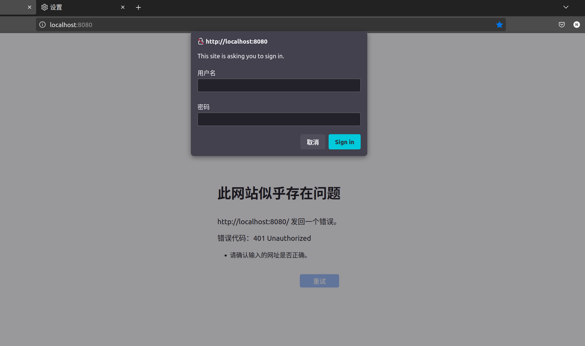

# 认证方式

## HTTP Basic

### 基本介绍



HTTP Basic Authentication 是最简单的一种认证方式，客户端在每次请求时通过 HTTP 头部的 Authorization 字段将用户名和密码发送给服务器。

```http
Authorization: Basic YWRtaW46YWRtaW4=
```

其中 Basic 是认证类型，而后面是 Base64 编码后的用户名和密码。

### Spring 实现

session 进行会话保存和用户管理

```java
package cn.arorms.security.demo.config;

import org.springframework.context.annotation.Bean;
import org.springframework.context.annotation.Configuration;
import org.springframework.security.config.annotation.web.builders.HttpSecurity;
import org.springframework.security.config.annotation.web.configuration.EnableWebSecurity;
import org.springframework.security.core.userdetails.User;
import org.springframework.security.core.userdetails.UserDetails;
import org.springframework.security.core.userdetails.UserDetailsService;
import org.springframework.security.crypto.bcrypt.BCryptPasswordEncoder;
import org.springframework.security.crypto.password.PasswordEncoder;
import org.springframework.security.provisioning.InMemoryUserDetailsManager;
import org.springframework.security.web.SecurityFilterChain;

@Configuration // Use @Configuration instead of @Component with @EnableWebSecurity
@EnableWebSecurity
public class SecurityConfig {

    // 1. PasswordEncoder Bean (Highly Recommended!)
    @Bean
    public PasswordEncoder passwordEncoder() {
        return new BCryptPasswordEncoder();
    }

    // 2. UserDetailsService for in-memory users (replaces auth.inMemoryAuthentication())
    @Bean
    public UserDetailsService userDetailsService(PasswordEncoder passwordEncoder) {
        UserDetails user = User.builder()
                .username("admin")
                .password(passwordEncoder.encode("admin")) // Always encode passwords!
                .roles("USER", "ADMIN") // Use roles instead of authorities directly for common use cases
                .build();
        return new InMemoryUserDetailsManager(user);
    }

    // 3. SecurityFilterChain Bean (replaces WebSecurityConfigurerAdapter's configure(HttpSecurity))
    @Bean
    public SecurityFilterChain filterChain(HttpSecurity http) throws Exception {
        http
                .authorizeHttpRequests(authorize -> authorize // Modern way to configure authorization
                        .anyRequest().authenticated() // All requests require authentication
                )
                .httpBasic(org.springframework.security.config.Customizer.withDefaults()); // Enable HTTP Basic with defaults
        // If you need to disable CSRF for API endpoints (e.g., if you're building a REST API
        // consumed by a separate frontend and handling CSRF there), you might add:
        // .csrf(csrf -> csrf.disable());

        return http.build();
    }
}
```

流程图

```
客户端发送请求 → 服务端返回 401 Unauthorized（要求认证）
           ↘
    客户端附加 Authorization: Basic 认证头
           ↘
     服务端验证用户名和密码是否正确
           ↘
   如果通过：返回数据；否则：继续返回 401
```

### Session

虽然 Basic 认证每次都会传用用户名和密码，但 Spring Security 默认使用 Session 记录认证状态，Http Basic 本身是无状态的，是 Spring 自动管理。


# 权限管理

