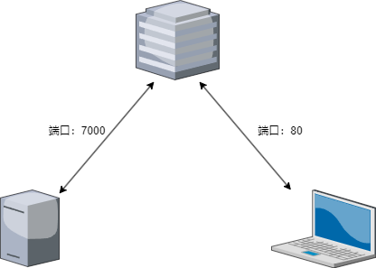

# frp 内网穿透

FRP是一款高性能的反向代理应用，专注于内网穿透。在今天IPv4地址非常紧张的情况下，可以选择使用内网穿透将一些内网服务器的程序或者说项目部署，允许公网访问。他需要一个用来转发流量的公网服务器，仅仅用来转发流量，通常可以使用阿里云，华为云一类的云服务器，且配置要求很低，只需要考虑网络带宽问题，租金会比较便宜。



# frps 服务端

首先需要下载frp软件，进入github页面`https://github.com/fatedier/frp`，随后到Releases处可以下载相对应的系统版本。

将frp程序下载后，会有四个主要的文件，其中服务器需要用到的是`frps`和`frps.toml`，前者是内网穿透服务器程序，后者则是设置文件。编辑设置文件后写入以下内容。

```toml
bindPort = 7000    			  		# 服务器监听端口，默认7000
token = 123456						# 服务器token，用来防止盗用

webServer.addr = "0.0.0.0"    		# 网页控制面板监听地址，默认0.0.0.0
webServer.port = 7500    	  		# 网页控制面板监听端口
webServer.user = "admin"      		# 控制面板用户名
webServer.password = "admin"  		# 控制面板密码
```

运行服务器程序就可开启服务端，也可以自己设置一个开机自启动。

```bash
./frps -c ./frps.toml
```

如果需要查看服务器隧道的情况，可以浏览器访问服务器地址加上设置的7500端口（xxx.xxx.xxx.xxx:7500)，输入用户名和密码后即可进入dashboard查看总体的信息。


# frpc 客户端

而客户端则同样需要执行程序和设置，分别是`frpc`和`frpc.toml`，下面是以ssh设置为例子。

## 一般配置

```toml
serverAddr = "xxx.xxx.xxx.xxx"    	# 服务器地址
serverPort = 7000    				# 服务器端口
token = 123456						# 服务器token，与设置一样

[[proxies]]
name = "ssh"    					# 代理服务名称
type = "tcp"    					# 代理类型
localIP = "127.0.0.1"    			# 代理地址
localPort = 22    					# 代理本地端口
remotePort = 6000    				# 远程开放端口
```


## 配置拆分

如果需要多个代理，比如需要内网穿透ssh服务和http服务80端口，那么可以设置两个配置文件，当然设置在一起会比较方便，但是分开设置更加方便管理。

首先设置一个总的配置文件frpc.toml

```toml
serverAddr = "xxx.xxx.xxx.xxx"
serverPort = 7000
token = 123456
includes = ["./confd/*.toml"]    	# 包括本目录下confd文件夹所有toml文件
```

设置ssh配置文件

```toml
# ./confd/ssh.toml
[[proxies]]
name = "ssh"
type = "tcp"
localIP = "127.0.0.1"
localPort = 22
remotePort = 6000
```

设置http配置文件，内网穿透还允许自定义域名进行连接，通过指定customDomains来远程访问时进行不同域名访问。记住域名解析需要指向公网服务器。

```toml
# ./confd/http.toml
[[proxies]]
name = "http"
type = "http"
localIP = "127.0.0.1"
localPort = 80
customDomains = ["www.example.com"]
```

随后开启客户端程序即可

```bash
./frpc -c ./frpc.toml
```

