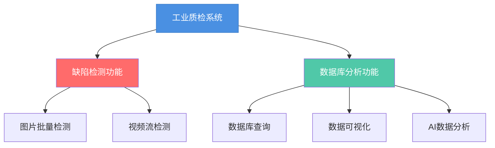

# 项目背景

## 1.1 市场现状

当前，我国汽车产业正处于转型升级的关键时期，新能源汽车、智能网联汽车等新技术、新产品、新模式不断涌现，给汽车质检行业带来了新的挑战和机遇。数据显示，2024年，我国新能源汽车市场呈现持续式增长，产量和销量均超过1000万辆，占汽车新车总销量的40.9%，较2023年提高9.3个百分点。新能源汽车的发展给车辆质检行业带来了新的需求和机遇。

中国工业视觉市场虽起步较晚，但正以近6年平均16%的增速高速增长，显著高于全球市场9.2%的年复合增长率（2023年全球规模达200亿美元）。在智能制造政策推动和制造业高质量发展带动下，中国工业机器视觉市场呈现强劲增长态势，规模从2022年的184亿元快速攀升，预计到2025年将达到470亿元，展现出巨大的发展潜力。

## 1.2 行业痛点

人工检测效率低下且精准度欠佳

传统的钢材缺陷检测主要依赖人工检查，效率低、精确度不高且受人员主观因素影响，误检率和漏检率较高。

单一机理检测方法局限性明显

单一机理识别包括红外线检测法、涡流检测法等，而车辆零部件材质涵盖金属、塑料、橡胶等，结构复杂多样，单一检测机理无法全面覆盖。

计算资源需求与设备性能的矛盾突出

深度学习模型用于缺陷检测虽能实现较高准确性，但训练与测试过程对计算资源需求巨大。汽车生产车间的终端设备通常计算能力有限，难以支撑复杂模型的流畅运行。

缺陷类型复杂多样导致检测难度大

车辆零部件的缺陷类型丰富，包括划痕、裂纹、气孔、夹杂等。由于缺乏统一、标准的缺陷图像样本，检测设备难以对缺陷进行准确描述与充分特征提取，目标分割精度难以保障。

## 1.3 政策导向

# 技术方案

## 2.1 问题分析

接入大模型进行结果分析

如何将大模型API无缝集成到现有检测流程中，避免架构冲突；由于大模型输出还存在随机性，需设计严格的提示词规则，以确保分析结果的准确性和标准化。此外，考虑到大模型API调用存在响应延迟和计算成本，需优化交互频率与数据量，以提高效率并降低成本。

模型效率与精度难以兼顾

训练集中近50%为缺陷样本，而剩余有缺陷样本中第三类缺陷占比过高，第一、二、四类样本极少。传统分割模型（如UNet、DeepLabV3）因数据分布和缺陷形态复杂导致效果不佳，我们最终选择采用“分类+分割”两阶段方案——基于ResNet50的分类器快速筛选无缺陷样本，结合以EfficientNetB3为骨干的PAN模型实现高精度分割。

跨平台应用开发支持国产系统

不同操作系统的桌面编程接口差异导致开发和移植复杂，而项目中后端检测和数据库服务涉及多语言、多框架，部署时需应对依赖在不同平台上的配置难题。为解决问题，用Electron统一桌面开发；后端采用微服务架构，结合容器部署，确保环境一致性和可移植性。

## 2.2 创新点描述

通过Ollama框架在本地私有化部署DeepSeek大语言模型，并结合模型上下文（MCP）协议栈开发智能数据库中间件。这种架构通过协议层的双向上下文同步机制，为缺陷模式识别、质量根因分析、工艺优化建议等复杂场景提供低延迟、高可信的智能分析基础支撑。

通过分类模型预过滤噪声，分割模型Dice系数达0.9以上，显著减少误检。双模型并行处理，推理速度较单一模型提升30%，适用于实时检测场景。针对墨西哥训练数据特点，通过消融实验优化PAN结构的特征金字塔参数，模型体积减少20%但保持高召回率。

保留历史检测记录，支持追溯与复现，同时通过脱敏技术隐藏敏感信息。平台集成“刷新数据”功能，动态更新缺陷统计（如“0个缺陷”至“4个缺陷”分布），并利用AI分析模块自动标注异常趋势。缺陷分布直方图与标签热力图联动，辅助用户快速定位高频缺陷类型。

## 2.3 解决方案

## 2.4 数据预处理

训练集总量：12,000+张图像无缺陷图像占比：大约50%有缺陷图像分布：第三类缺陷占绝大多数第一、二、四类缺陷占比极低

利用Albumentations库对缺陷图像进行了随机裁剪、翻转、旋转、添加高斯噪声、锐化等操作，以提高模型的泛化性能。

## 2.5 模型构建

ResNet50通过四个阶段的残差块逐步提取从低级到高级的特征，最终输出四类缺陷的置信度。神经网络在浅中层聚焦局部纹理和几何特征（如列文轮廓），深层提取全局语义信息（如缺陷类型判别），结合Bottleneck设计高效压缩计算量，并通过残差链接确保梯度稳定回传，避免深层网络退化。本模型采用ImageNet预训练的ResNet50具有泛化性强和鲁棒性高的特点，其核心优势在于多尺度特征融合与结构创新，残差结构赋予模型对噪声（如反光）的鲁棒性，分阶段下采样平衡空间细节与语义抽象，Bottleneck的卷积显著减少参数量，适合高分辨率输入。

在分割阶段，采用以EfficientNet-B3作为骨干网络，通过其深度可分离卷积与复合缩放机制高效提取多层级特征，结合PAN（PyramidAttentionNetwork）的多尺度特征融合与注意力机制，在保留空间细节的同时增强语义表征，从而精准分割出缺陷区域并实现细粒度缺陷类别判定。EfficientNet的复合缩放策略平衡了计算效率与精度，PAN的注意力机制增强对小目标缺陷（如微米级裂纹）的敏感度，Dice系数较其他模型提升15%以上。

## 2.6 训练结果

## 2.7 部署优化

Ollama本地大模型的量化与微调方案采用量化技术，显著减少显存占用并提升推理效率，同时通过分阶段量化平衡性能与资源消耗。在微调阶段，基于LoRA/QLoRA技术，仅训练1%~10%的参数量即可适配领域任务，配合结构化数据和轻量级工具链，实现单卡微调70B级模型，最终量化模型可通过Ollama serve高效部署，达成70%+体积压缩、2-3倍推理加速及15%-30%的准确率提升。

采用结构化剪枝方法，对卷积层中的冗余通道进行削减，减少不必要的计算开销。例如，在 ResNet50 中剪除对最终分类影响较小的通道，或在EfficientNet的中间阶段裁剪宽度系数，既可以保持模型整体框架，也能显著压缩模型参数量。剪枝后可进行微调恢复精度，最终模型更适合实际工业部署环境。

# 成果展示

## 3.2 软件界面

图片检测功能系统支持JPG、PNG等常见工业图像格式的批量检测，，在标准硬件配置下可实现每秒数十张的检测速度。通过多尺度特征融合技术，能够准确识别各类产品表面缺陷。视频流检测功能可对产线视频流进行实时分析。基于动态批处理优化技术，确保检测过程不影响产线正常运行节奏。数据库管理功能采用关系型数据库存储检测记录，支持按时间、产线、缺陷类型等多维度组合查询。提供Excel/CSV格式导出功能，便于质量追溯和报表生成。可视化分析功能通过热力图直观展示缺陷分布规律，结合趋势图表反映质量波动情况。支持自定义报表模板，帮助管理人员把握整体质量状况。智能分析功能基于模型上下文协议实现大语言模型与传统检测系统的无缝对接。不仅能识别缺陷，还能分析潜在成因，生成包含改进建议的可解释性报告，为工艺优化提供数据支持。

## 3.1 缺陷检测功能

## 3.2 数据分析功能

## 3.3 大语言分析功能

该系统利用Spring ai框架通过MCP协议连接DeepSeek与钢铁生产数据库，自动执行趋势分析和优化建议生成。例如，通过MCP工具查询金相检测数据，结合LLM的NLP能力生成报告，或预测裂纹风险。相比传统方法，该方案提升了分析效率，并支持灵活扩展，适用于智能制造、质量监控等应用场景。

## 3.4 API接口

采用微服务的方式分开部署图像检测功能与数据分析功能，前端交互系统基于Electron框架构建，实现跨平台的高性能可视化界面。并设计模型上下文协议工具，通过 Stdio 为 LLM 提供结构化数据接口，支持包括缺陷模式分析等智能决策功能。

图像输入源后首先经过OpenCV预处理，并传递给双模型进行结果分析，推理服务通过Flask REST API实现微服务化部署。

结果查询子系统采用Spring架构。持久层采用 MyBatis 框架实现动态 SQL 构建和查询。

# 总结与展望

## 成果总结

本项目面向工业质检场景，打造了一套集缺陷检测、数据分析与智能辅助决策于一体的综合解决方案。系统支持自动识别零部件缺陷、生成检测报告，并提供趋势分析与优化建议，可灵活接入现有生产管理系统，具备良好的稳定性、可扩展性与部署适应性，适用于提升制造企业的质检效率与质量管理水平。

本团队已完成核心软件开发与测试验证，系统具备实际生产环境部署能力，并已在GitHub开源。代码库包含完整模型权重、量化部署脚本及API接口文档，支持Docker容器化一键部署，同时提供 API 对接方案。团队在网络公开训练集中训练效果优秀，速度和准确率适合工业场景的部署。开源版本持续维护更新，后续将扩展至半导体、汽车零部件等更多工业场景。

## 系统优化与提升方向

微服务化部署：将检测终端/计算服务器/数据服务拆解为独立模块，提供更高的稳定性。均衡负载：为 API 接口提供不同调用策略与方案，组合多个计算服务器提高计算效率与速度。

边缘端：摄像头设备本地化快速缺陷初筛（降低带宽压力）云端：服务器集群完成复杂缺陷复核（如AI模型迭代分析）

基于微服务架构设计，项目各模块可独立容器化封装为 Docker 镜像，适用于工业级部署场景。通过容器编排可实现跨平台部署、快速扩缩容及故障隔离，有效提升系统的稳定性、可维护性与可移植性，满足复杂制造环境下的持续运行与弹性扩展需求。

引入红外成像、超声检测等数据，融合不同模态提高检测精度。

