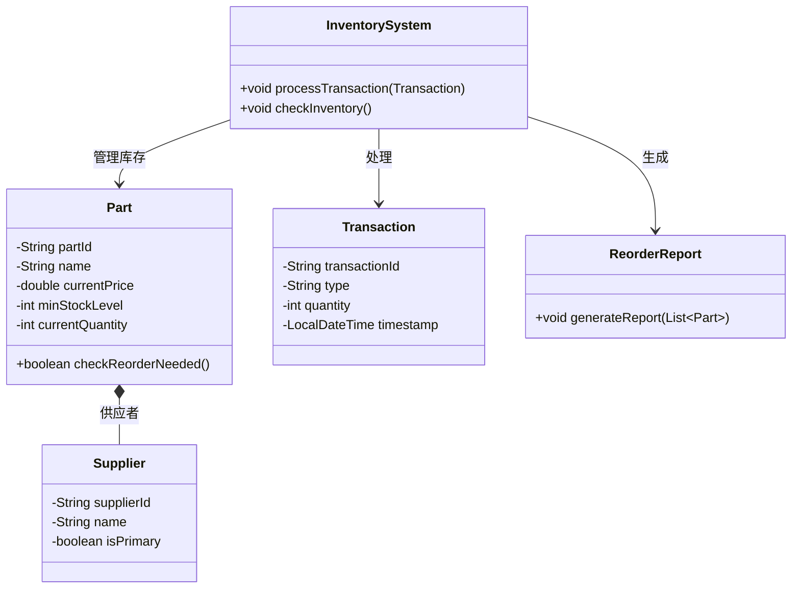
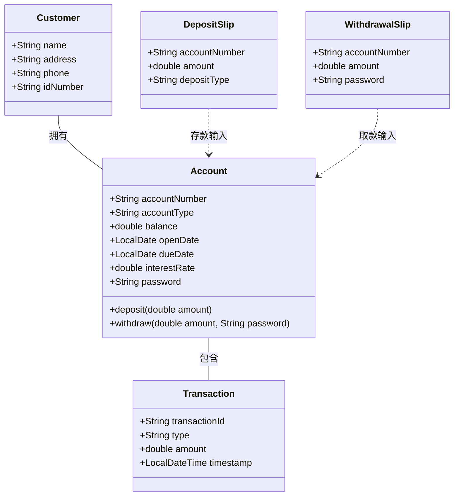
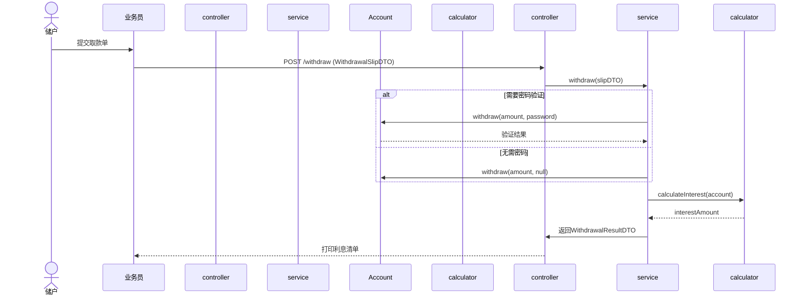
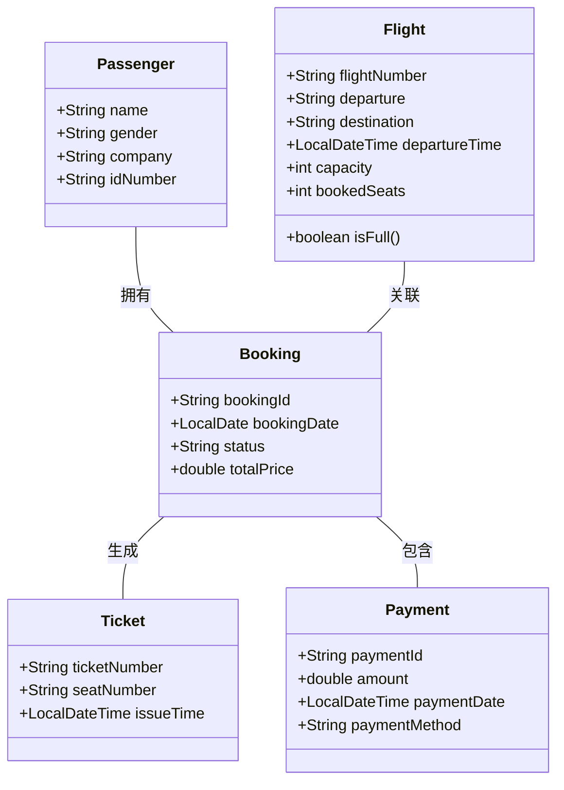
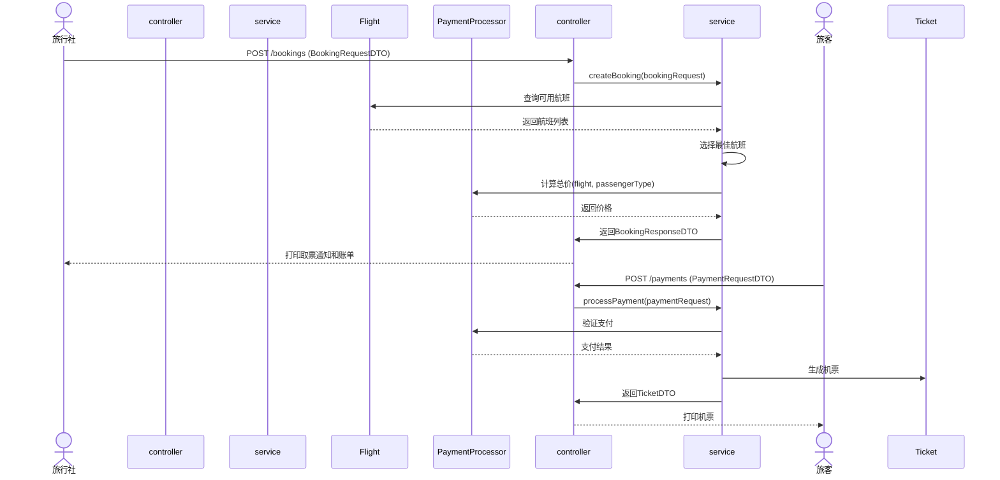
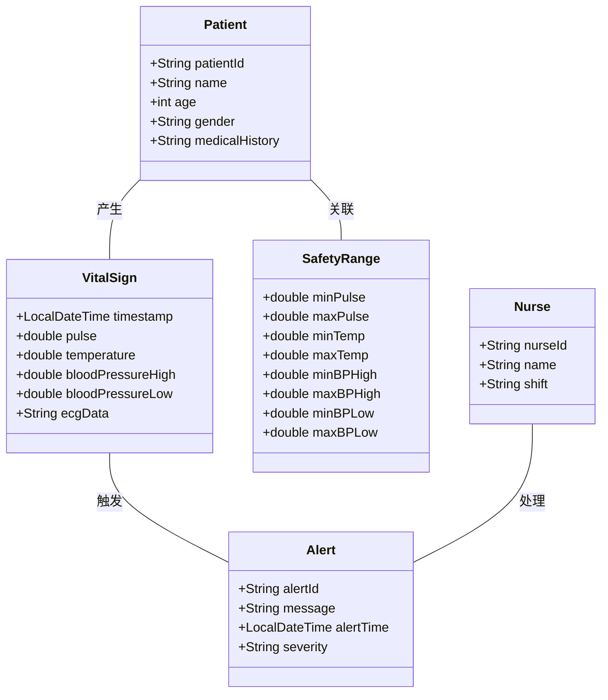
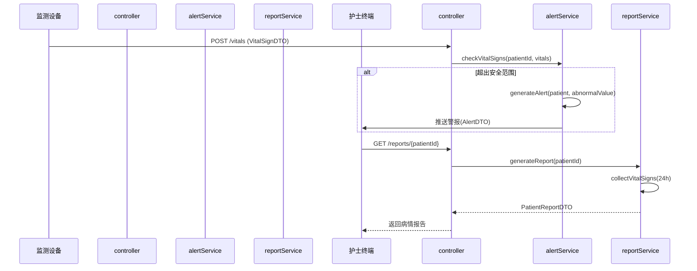

# 软件工程 第四次平时作业

## 语句覆盖和路径覆盖测试

>习题 7 第 4 题 第 (3) 问
>
>设计下列伪代码程序的语句覆盖和路径覆盖测试用例：
>
>```shell
>START
>INPUT (A, B, C)
>
>IF A > 5
>	THEN X = 10
>	ELSE X = 1
>END IF
>
>IF B > 10
>	THEN Y = 20
>	ELSE Y = 2
>END IF
>
>IF C > 15
>	THEN Z = 30
>	ELSE Z = 3
>END IF
>
>PRINT (X, Y, Z)
>STOP
>```

1. **语句覆盖**要求每个语句至少执行一次。由于伪代码中没有循环或复杂嵌套，只需要确保每个 `IF` 和 `ELSE` 分支都被执行即可。

   测试用例 1（覆盖所有 IF 分支）：A = 6, B = 11, C = 16

   测试用例 2（覆盖所有 ELSE 分支）：A = 5, B = 10, C = 15

2. **路径覆盖**要求覆盖所有可能的路径组合。由于有 3 个独立分支，每条分支有 2 种可能，因此总共有 $2^3 = 8$ 条路径。

   | 路径编号 | A 的取值 | B 的取值 | C 的取值 |     执行路径     | 输出 (X, Y, Z) |
   | :------: | :------: | :------: | :------: | :--------------: | :------------: |
   |    1     |  A > 5   |  B > 10  |  C > 15  | X=10, Y=20, Z=30 |  (10, 20, 30)  |
   |    2     |  A > 5   |  B > 10  |  C ≤ 15  | X=10, Y=20, Z=3  |  (10, 20, 3)   |
   |    3     |  A > 5   |  B ≤ 10  |  C > 15  | X=10, Y=2, Z=30  |  (10, 2, 30)   |
   |    4     |  A > 5   |  B ≤ 10  |  C ≤ 15  |  X=10, Y=2, Z=3  |   (10, 2, 3)   |
   |    5     |  A ≤ 5   |  B > 10  |  C > 15  | X=1, Y=20, Z=30  |  (1, 20, 30)   |
   |    6     |  A ≤ 5   |  B > 10  |  C ≤ 15  |  X=1, Y=20, Z=3  |   (1, 20, 3)   |
   |    7     |  A ≤ 5   |  B ≤ 10  |  C > 15  |  X=1, Y=2, Z=30  |   (1, 2, 30)   |
   |    8     |  A ≤ 5   |  B ≤ 10  |  C ≤ 15  |  X=1, Y=2, Z=3   |   (1, 2, 3)    |


## 维护

>习题 8 第 1 题
>
>软件的可维护性与那些因素有关？在软件开发过程中应该采取哪些措施来提高软件产品的可维护性。

软件的可维护性主要与代码质量、架构设计、文档完整性、技术债务和测试覆盖度等因素相关。在软件开发过程中，应通过模块化设计、代码规范、自动化测试、文档管理和持续重构等措施来提高可维护性。其中，采用Spring框架的开发思想，如控制反转和依赖注入降低耦合、面向接口编程提高扩展性、AOP统一管理横切关注点，以及约定优于配置简化开发，都能显著提升软件的可维护性。


## 面向对象方法学引论

> 习题 9 第 1 问：什么是面向对象方法学？它有哪些优点？

面向对象方法学（Object-Oriented Methodology）是一种以**对象**为核心，通过**类**、**继承**、**封装**、**多态**（Polymorphism）等机制进行软件建模和开发的系统化方法。它强调**现实世界问题域**与**软件系统**的自然映射，使软件更易于理解、维护和扩展。

> 习题 9 第 3 问：什么是类？

类是面向对象的基本构造单元，用于描述**具有相同属性和行为的一组对象**的抽象模板。

>习题 9 第 6 问：什么是对象模型？建立对象模型时主要使用哪些图形符号？这些符号的含义是什么？

描述系统中**类及其静态关系**的结构化模型，通常使用**UML类图**表示。

| 符号                    | 含义                              |
| ----------------------- | --------------------------------- |
| **类（Class）**         | 矩形框，分三栏：类名、属性、方法  |
| **关联（Association）** | 实线箭头，表示类间关系            |
| **继承（Inheritance）** | 空心三角箭头，子类指向父类        |
| **聚合（Aggregation）** | 空心菱形箭头，表示“整体-部分”关系 |
| **组合（Composition）** | 实心菱形箭头，更强的聚合关系      |
| **依赖（Dependency）**  | 虚线箭头，表示临时使用            |

> 习题 9 第 9 问：使用面向对象观点分析、研究订货系统的例子。在这个例子中有哪些类？试建立订货系统的对象模型。
>
> 假设一家工厂的采购部每天需要一张订货报表，报表按零件编号排序,表中列出所有需要再次订货的零件。对于每个需要再次订货的零件应该列出下述数据：零件编号，零件名称，订货数量，目前价格，主要供应者，次要供应者。零件入库或出库称为事务，通过放
> 在仓库中的 CRT 终端把事务报告给订货系统。当某种零件的库存数量少于库存量临界值时就应该再次订货。

应该包括**货物**、**供应者**、**事务**、**订货报表**四个核心类。



> 习题 9 第 10 问：建立订货系统的用例模型。

用 Spring 伪代码描述，首先定义实体类，这里也写入了自身行为。

```java
@Entity
public class Part {
    @Id
    private String partId;
    private int minStockLevel;

    public boolean needsReorder() {
        return currentQuantity < minStockLevel;
    }
}
```

服务层

```java
@Service
@Transactional
public class InventoryService {
    @Autowired
    private PartRepository partRepo;

    public void processTransaction(TransactionDTO dto) {
        Part part = partRepo.findById(dto.getPartId())
                .orElseThrow(() -> new PartNotFoundException(dto.getPartId()));
        part.adjustStock(dto.getQuantity());
    }

    public List<Part> findPartsNeedingReorder() {
        return partRepo.findAll().stream()
                .filter(Part::needsReorder)
                .sorted(Comparator.comparing(Part::getPartId))
                .toList();
    }
}
```

后面根据服务层提供的逻辑定义接口即可。


## 面向对象分析

> 习题 10 第 1 问：用面向对象方法分析研究储蓄系统，试建立它的对象模型、动态模型和功能模型。
>
> 银行计算机储著系统的工作过程大致如下：储户填写的存款单或取款单由业务员输入系统,如果是存款则系统记录存款人姓名、住址或电话号码、身份证号码、存款类型、存款日期、到期日期、利率及密码(可选)等信息，并印出存单给储户；如果是取款而且存款时留有密码，则系统首先核对储户密码，若密码正确或存款时未留密码，则系统计算利息并印出利息清单给储户 。

**对象模型**



```java
@Entity
public class Customer {
    @Id
    private String idNumber;
    private String name;
    private String address;
    private String phone;
    
    @OneToMany(mappedBy = "customer")
    private List<Account> accounts;
}
```

```java
@Entity
public class Account {
    @Id
    private String accountNumber;
    private String accountType; // "SAVINGS"|"FIXED"
    private double balance;
    private LocalDate openDate;
    private LocalDate dueDate;
    private double interestRate;
    private String password;
    
    @ManyToOne
    private Customer customer;
    
    @OneToMany(mappedBy = "account")
    private List<Transaction> transactions;
    
    public void deposit(double amount) {
        this.balance += amount;
    }
    
    public boolean withdraw(double amount, String password) {
        if (this.password != null && !this.password.equals(password)) {
            return false;
        }
        this.balance -= amount;
        return true;
    }
}
```

**动态模型**



Service

```java
@Service
@Transactional
public class AccountService {
    @Autowired
    private AccountRepository accountRepo;
    
    public WithdrawalResult withdraw(WithdrawalSlip slip) {
        Account account = accountRepo.findById(slip.getAccountNumber())
            .orElseThrow(AccountNotFoundException::new);
            
        boolean success = account.withdraw(slip.getAmount(), slip.getPassword());
        if (!success) {
            throw new InvalidPasswordException();
        }
        
        double interest = InterestCalculator.calculate(account);
        return new WithdrawalResult(account, interest);
    }
}

public class InterestCalculator {
    public static double calculate(Account account) {
        return account.getAccountType().equals("FIXED") ? 
            account.getBalance() * account.getInterestRate() :
            account.getBalance() * 0.003;
    }
}
```

**功能模型**

Controller

```java
@RestController
@RequestMapping("/api/banking")
public class BankController {
    @Autowired
    private AccountService accountService;
    
    @PostMapping("/deposit")
    public ResponseEntity<Void> deposit(@RequestBody DepositSlip slip) {
        accountService.processDeposit(slip);
        return ResponseEntity.ok().build();
    }
    
    @PostMapping("/withdraw")
    public ResponseEntity<WithdrawalResult> withdraw(@RequestBody WithdrawalSlip slip) {
        return ResponseEntity.ok(accountService.withdraw(slip));
    }
}
```

DTO

```java
public record WithdrawalSlip(
    String accountNumber,
    double amount,
    String password
) {}
```


> 习题 10 第 2 问：用面向对象方法分析研究机票预订系统，建立它的对象模型、动态模型和功能模型。
>
> 为方便旅客，某航空公司拟开发一个机票预订系统。旅行社把预订机票的旅客信息（姓名、性别、工作单位身份证号码、旅行时间、旅行目的地等）输入进该系统，系统为旅客安排航班，印出取票通知和账单，旅客在飞机起飞的前一天赁取票通知和账单交款取票，系统校对无误即印出机票给旅客 。

**对象模型**



```java
@Entity
public class Passenger {
    @Id
    private String idNumber;
    private String name;
    private String gender;
    private String company;
    
    @OneToMany(mappedBy = "passenger")
    private List<Booking> bookings;
}
```

```java
@Entity
public class Flight {
    @Id
    private String flightNumber;
    private String departure;
    private String destination;
    private LocalDateTime departureTime;
    private int capacity;
    private int bookedSeats;
    
    @OneToMany(mappedBy = "flight")
    private List<Booking> bookings;
    
    public boolean isFull() {
        return bookedSeats >= capacity;
    }
}
```

**动态模型**



```java
@Service
@Transactional
public class BookingService {
    @Autowired
    private FlightRepository flightRepo;
    @Autowired
    private PassengerRepository passengerRepo;
    
    public BookingResponse createBooking(BookingRequest request) {
        Passenger passenger = passengerRepo.findById(request.getIdNumber())
            .orElseGet(() -> createNewPassenger(request));
            
        List<Flight> availableFlights = flightRepo.findAvailableFlights(
            request.getDestination(), 
            request.getTravelDate()
        );
        
        Flight selectedFlight = selectBestFlight(availableFlights);
        if (selectedFlight == null) {
            throw new NoAvailableFlightException();
        }
        
        double price = PricingCalculator.calculatePrice(selectedFlight, passenger);
        
        Booking booking = new Booking(passenger, selectedFlight, price);
        return new BookingResponse(booking);
    }
    
    private Flight selectBestFlight(List<Flight> flights) {
        return flights.stream()
            .filter(f -> !f.isFull())
            .min(Comparator.comparing(Flight::getDepartureTime))
            .orElse(null);
    }
}
```

**功能模型**

```java
@RestController
@RequestMapping("/api/bookings")
public class BookingController {
    @Autowired
    private BookingService bookingService;
    
    @PostMapping
    public ResponseEntity<BookingResponse> createBooking(
        @RequestBody BookingRequest request) {
        return ResponseEntity.ok(bookingService.createBooking(request));
    }
    
    @PostMapping("/{id}/payments")
    public ResponseEntity<TicketResponse> processPayment(
        @PathVariable String id, 
        @RequestBody PaymentRequest request) {
        return ResponseEntity.ok(bookingService.processPayment(id, request));
    }
}
```

```java
public record BookingRequest(
    String name,
    String gender,
    String company,
    String idNumber,
    LocalDate travelDate,
    String destination
) {}

public record PaymentRequest(
    String bookingId,
    double amount,
    String paymentMethod,
    String cardNumber
) {}
```


> 习题 10 第 3 问：用面向对象方法分析研究患者监护系统，试建立它的对象模型、动态模型和功能模型。
>
> 目前住院病人主要由护士护理，这样做不仅需要大量护士，而且由于不能随时观察危重病人的病情变化，还可能会延误抢救时机。某医院打算开发一个以计算机为中心的患者监护系统。医院对患者监护系统的基本要求是随时接收每个病人的生理信号（脉搏、体温、血压、心电图等），定时记录病人情况以形成患者日志，当某个病人的生理信号超出医生规定的安全范围时向值班护士发出警告信息，此外，护士在需要时还可以要求系统印出某个指定病人的病情报告。

**对象模型**



```java
@Entity
public class Patient {
    @Id
    private String patientId;
    private String name;
    private int age;
    private String gender;
    private String medicalHistory;
    
    @OneToMany(mappedBy = "patient")
    private List<VitalSign> vitalSigns;
    
    @OneToOne(mappedBy = "patient")
    private SafetyRange safetyRange;
}

@Entity
public class VitalSign {
    @Id
    private String recordId;
    private LocalDateTime timestamp;
    private double pulse;
    private double temperature;
    private double bloodPressureHigh;
    private double bloodPressureLow;
    private String ecgData;
    
    @ManyToOne
    private Patient patient;
}
```

**动态模型**



```java
@Service
public class AlertService {
    @Autowired
    private PatientRepository patientRepo;
    
    public void checkVitalSigns(String patientId, VitalSign vitals) {
        Patient patient = patientRepo.findById(patientId)
            .orElseThrow(PatientNotFoundException::new);
        
        SafetyRange range = patient.getSafetyRange();
        List<String> abnormalities = new ArrayList<>();
        
        if (vitals.getPulse() < range.getMinPulse() || vitals.getPulse() > range.getMaxPulse()) {
            abnormalities.add("脉搏异常: " + vitals.getPulse());
        }
        if (vitals.getTemperature() < range.getMinTemp() || vitals.getTemperature() > range.getMaxTemp()) {
            abnormalities.add("体温异常: " + vitals.getTemperature());
        }
        // 其他指标检查...
        
        if (!abnormalities.isEmpty()) {
            Alert alert = new Alert(patient, String.join("; ", abnormalities));
            alertRepository.save(alert);
            pushNotification(alert);
        }
    }
    
    private void pushNotification(Alert alert) {
        // 实现推送到护士终端逻辑
    }
}
```

**功能模型**

```java
@RestController
@RequestMapping("/api/monitoring")
public class MonitoringController {
    @Autowired
    private AlertService alertService;
    @Autowired
    private ReportService reportService;
    
    @PostMapping("/vitals")
    public ResponseEntity<Void> receiveVitalSigns(@RequestBody VitalSignDTO dto) {
        alertService.checkVitalSigns(dto.getPatientId(), dto);
        return ResponseEntity.ok().build();
    }
    
    @GetMapping("/reports/{patientId}")
    public ResponseEntity<PatientReport> getPatientReport(
        @PathVariable String patientId,
        @RequestParam(required = false) Integer hours) {
        
        int duration = (hours != null) ? hours : 24;
        return ResponseEntity.ok(reportService.generateReport(patientId, duration));
    }
}
```

