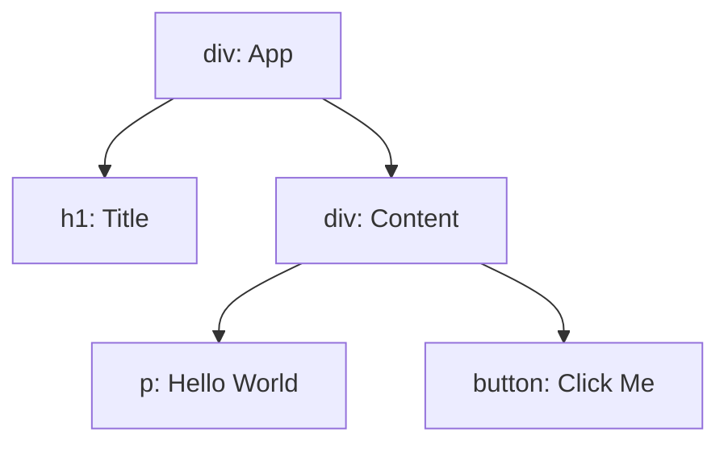

# React 介绍与创建

## 为什么使用 React 以及前端框架


## 工作原理

React 通过构建虚拟 DOM（Virtual DOM）来高效管理界面。当组件的状态或属性发生变化时，React 会重新渲染生成新的虚拟 DOM，并通过 Diff 算法找出新旧虚拟 DOM 树之间的差异，最终仅将发生变化的部分同步到真实 DOM 中。这种方式避免了不必要的 DOM 操作，从而提升性能。




## CDN 引入

在不使用打包工具（如 Vite、Webpack、Create React App）的前提下，你可以通过 **CDN** 直接引入 React 和 ReactDOM，然后在 HTML 文件中使用 React。

```html
<!-- React 和 ReactDOM CDN（必须使用 development 版本） -->
<script src="https://unpkg.com/react@18/umd/react.development.js" crossorigin></script>
<script src="https://unpkg.com/react-dom@18/umd/react-dom.development.js" crossorigin></script>

<!-- Babel（用于解析 JSX） -->
<script src="https://unpkg.com/@babel/standalone/babel.min.js"></script>
```

随后在 `script` 标签添加 React 代码，JSX 是不是浏览器原生支持的语法，所以必须通过 Babel 来转译 `<App />` 这样的语法。

```html
<script type="text/babel">
  // 定义一个简单组件
  function App() {
    return <h1>Hello, React + CDN!</h1>;
  }
  // 渲染组件
  const root = ReactDOM.createRoot(document.getElementById('example'));
  root.render(<App />);
</script>
```

| 项目         | CDN 地址                                                     | 用途                                              |
| ------------ | ------------------------------------------------------------ | ------------------------------------------------- |
| React 核心库 | `https://unpkg.com/react@18/umd/react.development.js`        | 提供 `React` 全局对象，支持定义组件等功能         |
| ReactDOM     | `https://unpkg.com/react-dom@18/umd/react-dom.development.js` | 提供 `ReactDOM` 全局对象，支持将组件渲染到 DOM 上 |
| Babel        | `https://unpkg.com/@babel/standalone/babel.min.js`           | 让浏览器在运行时解析 JSX                          |

由于 unpkg 提供的 CDN 在国内没有节点，可以使用其他镜像的 CDN 提供 react 框架代码

```html
<script src="https://cdn.jsdelivr.net/npm/react@18/umd/react.development.js"></script>
<script src="https://cdn.jsdelivr.net/npm/react-dom@18/umd/react-dom.development.js"></script>
<script src="https://cdn.jsdelivr.net/npm/@babel/standalone/babel.min.js"></script>
```

> [!NOTE]
>
> 在 `file:///` 协议下，浏览器会出于安全考虑 **禁止脚本发出网络请求或模块加载**；因此如果需要预览，至少需要开启 VSCode 的 Live Server 预览插件。


## NPM 脚手架

脚手架方法创建项目有两种方法，一种是

通过 NPM 脚手架方式创建 React 项目需要 Node.js 环境，首先要确保本地安装了对应环境，版本应该在 16 以上

```bash
npm -v  # 检查 node.js 环境版本
```

**通过 Vite 创建 React 项目**

```bash
npm create vite@latest
#npm create vite@4.1.0
```

随后输入项目名称，选择框架、语言后创建即可。创建完成后需要进入项目文件夹随后安装所有第三方依赖

```bash
cd react-demo #  这里换成刚刚创建的项目名称文件夹
npm install  # 安装所有第三方库
```

最后如果需要运行，可以直接运行前端服务器

```bash
npm run dev
```

随后进入给出的地址即可，一般是 `http://localhost:5173`

> [!NOTE]
>
> 编译项目
>
> ```bash
> npm build
> ```
>
> 随后在 build 文件夹中找到编译后的文件即可


## 基本项目结构

创建项目后，应该有以下文件

- node_modules: 存放第三方库的文件夹，一般被加入到 gitignore 中
- public: 公共资源，比如图片和视频等
- src: 前端网站的源代码
  - App.tsx 作为初始项目的组件
  - index.css
  - App.css 使用 Vite 构建时自带给的样式文件，后期一般自己定义
- index.html: 项目入口
- package.json: 对这个 node 项目的一般信息和设置等

> [!NOTE]
>
> 注意，除了基本的 JavaScript（.js文件）和 TypeScript（.ts文件），还有对应的扩展文件分别为 .jsx 和 .tsx


# React 快速入门

## 创建组件

React 组件是构建 React 应用的基本单位，组件可以分为函数组件和类组件。

React 应用程序是由 **组件** 组成的。一个组件是 UI（用户界面）的一部分，它拥有自己的逻辑和外观。组件可以小到一个按钮，也可以大到整个页面，组件的设计让整个 UI 结构化，并且可以复用一些常用组件。React 组件现在比较流行与用返回标签的 JavaScript 函数来编写，这样更加轻便逻辑更加简单：

创建一个 Message 组件，在 `src` 文件夹下创建 `Message.tsx`

```jsx
function Message() {
    // JSX: JavaScript XML
    return <h1>Hello, World!</h1>;
}

export default Message;
```

在这里，似乎是在 JavaScript 中返回了一个 html 标签，但事实上，这里返回的是 JavaScript XML，属于 JavaScript 扩展的语法代码。实际上，这个代码会先转换成普通 JS 代码，再渲染到 HTML 前端中。

在这里，可以使用 `<Message></Message>` 来调用组件，而给出的代码使用的是自闭合标签，让组件标签更加清晰。

> [!NOTE]
>
> React 组件必须以大蛇式或帕斯卡（PascalCasing）命名，而 HTML 标签是小写字母，两者予以区分。

你可以在这个工具网站看看过程 `babeljs.io/repl` ，babel 就是在 CDN 引用方法中提到的解析工具。

```tsx
<h1>hello world</h1>
```

```js
import { jsx as _jsx } from "react/jsx-runtime";
/*#__PURE__*/_jsx("h1", {
  children: "hello world"
});
```

可以看出，扩展语法并不是简单的写入前端代码，只是将 js 的渲染更改的更加简单。

编写完组件之后，需要将这个组件作为默认对象从其中导出，这样在其他代码中就可以复用这个组件。`export default` 关键字指定了文件中的主要组件。如果对 JavaScript 某些语法不熟悉，可以参考 [MDN](https://developer.mozilla.org/zh-CN/docs/web/javascript/reference/statements/export) 和 [javascript.info](https://javascript.info/import-export)。

**应用组件**，在 App.tsx 中重新编写一个利用 Message 组件来打印 hello world 的页面。

```jsx
import Message from './Message';

function App() {
  return <div><Message /></div>;
}

export default App;
```

随后运行网站，直接访问给出地址，就可以看到定义在 Message 中的 helloword 信息。

在 tsx 代码中，可以通过变量来动态修整显示信息，创建变量的方法与 js 类似，而在标签内显示变量需要用花括号括起来。

```tsx
function Message() {
    const name = "Cacciatore";
    return <h1>Hello, {name}!</h1>;
}
export default Message;
```


## 引入样式

首先通过 npm 为本项目下载前端样式框架

```bash
npm install bootstrap  # Bootstrap
```

随后在 `main.tsx` 中可以看到默认引用了 `index.css` 现在更改成之前下载的框架，修改后如下。

```tsx
import { StrictMode } from 'react'
import { createRoot } from 'react-dom/client'
import 'bootstrap/dist/css/bootstrap.css'
import App from './App.tsx'

createRoot(document.getElementById('root')!).render(
  <StrictMode>
    <App />
  </StrictMode>,
)
```

这样就直接导入了 Boostrap 作为前端样式框架

现在创建一个新的组件，比如创建一个列表组件，首先在 src 文件夹创建一个 components 文件夹用于存放所有组件代码，这样子更加方便项目的源代码管理。

```tsx
function ListGroup() {
  return (
    <ul className="list-group">
      <li className="list-group-item">123</li>
      <li className="list-group-item">321</li>
      <li className="list-group-item">abc</li>
      <li className="list-group-item">xyz</li>
    </ul>
  );
}

export default ListGroup;
```

这是一个创建列表的组件，首先利用一般的 HTML 语法创建了一个列表，其次将元素的类赋予 Bootstrap 样式预先定义的类，这样子就可以生成一个带有定义样式的列表组件，将其载入到 App.tsx 后即可在前端查看。

> [!NOTE]
>
> - 如果你使用 VSCode 作为 IDE，你可能会知道它自带了格式化文档的功能，让代码直接格式化成符合缩进的样子，快捷键 `ctrl + shift + I`，除了自带的格式化样式，还可以安装插件 Prettier ，这个插件提供了更好的格式化功能，当下载好后第一次去格式化文档 IDE 会让你设置使用普通的还是 Prettier 提供的进行格式化。
>
> - `class` 在 js 中属于关键字，因此在这里的返回标签应该使用 `className` 作为类的引用。


## 组件函数返回与碎片

组件函数只能返回一个根元素，如果说，在上面的列表，我们想要添加一个 h1 元素作为这个列表的名称，是不可行的，因为这样将包含一个 h1 元素和 ul 列表元素，这是因为在上文提到，这里返回的不是一个简单的 HTML 前端代码，这些会被转换成 js 代码，因此必须只有一个根元素作为参数然后渲染。如果通过在这两个元素外套一个 div 元素将他们包裹，一起返回这一个外面的 div 元素给 react, 虽然可以解决这个问题，但是这里多出一个 div 元素，只是为了让参数正确是不必要的，而且会增加文件结构的复杂度。因此，这里引入碎片来解决这个问题。

```tsx
import { Fragment } from "react";

function ListGroup() {
  return (
    <Fragment>
      <h1>List group</h1>
      <ul className="list-group">
        <li className="list-group-item">123</li>
        <li className="list-group-item">321</li>
        <li className="list-group-item">abc</li>
        <li className="list-group-item">xyz</li>
      </ul>
    </Fragment>
  );
}

export default ListGroup;
```

当然，你也可以直接使用空标签来使用碎片

```tsx
<>
  <h1>List group</h1>
  <ul className="list-group">
    <li className="list-group-item">123</li>
    <li className="list-group-item">321</li>
    <li className="list-group-item">abc</li>
    <li className="list-group-item">xyz</li>
  </ul>
</>
```

## 标记内的动态渲染

在组件的返回中，作为标记无法使用其他 js 代码，因此需要通过用 {} 对标记进行动态渲染

```tsx
import { Fragment } from "react";

function ListGroup() {
  const cities = ["New York", "Los Angeles", "Chicago", "Houston", "Phoenix"];

  return (
    <Fragment>
      <h1>List group</h1>
      <ul className="list-group">
        {cities.map((city) => (
          <li className="list-item" key={city}>{city}</li>
        ))}
      </ul>
    </Fragment>
  );
}

export default ListGroup;
```

或者，在返回前定义好需要显示的内容，避免对返回的标记的结构进行太大的破坏

```tsx
import { Fragment } from "react";

function ListGroup() {
  let cities = ["New York", "Los Angeles", "Chicago", "Houston", "Phoenix"];
  cities = [];
  const message = cities.length === 0 ? "No cities found" : null;

  return (
    <Fragment>
      <h1>List group</h1>
      {message}
      <ul className="list-group">
        {cities.map((city) => (
          <li className="list-item" key={city}>{city}</li>
        ))}
      </ul>
    </Fragment>
  );
}

export default ListGroup;
```

或者，你可以使用逻辑符号

```tsx
cities.length === 0 && <p>No city found</p>
```

当前者条件为真时，将会返回第二个元素

