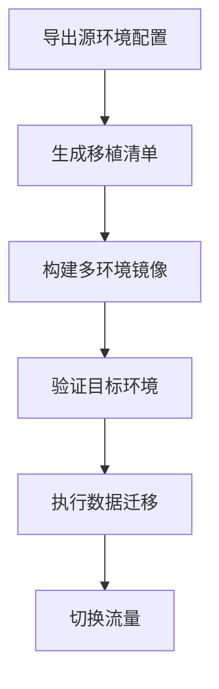

**1.创新点（核心竞争力）相关**
模型构建上提出双模型协同检测架构，“分类 + 分割”结合优化模型参数，实现高效精准检测
系统设计上采用 Electron 框架开发跨平台应用，满足多系统部署需求，并拓展功能集成与智能分析模块，提供全面检测及决策支持服务
实现大模型本地化应用，通过 vLLM 框架接入 Deepseek 大模型，保障数据隐私安全并提升结果解读效率

**2.如何比较模型性能**
主要采用Dice系数作为评价指标，对比了Kaggle社区针对该数据集分割任务的其他解决方案。

**3.如何部署**
在部署阶段，对于有本地化需求的企业，我们会提供完整的安装包，使用conda、docker等工具进行环境配置，确保适配企业网络架构。还可选择云端部署，我们将其检测需求和数据上传至云端服务器，通过调用系统 API 完成检测任务后回传结果。部署完成后，系统自动检测生产线上的零部件图像，实时显示缺陷位置、类型等信息，并保存结果至数据库，支持追溯与分析。

**4.为工业部署做了哪些优化**
在模型方面，我们对使用的PAN+ResNet50模型进行了量化，在确保推理精度的前提下尽可能提高速度。对于大模型，我们对DeepSeek大模型进行FP8量化，并采用支持高并发、更适合企业生产环境的vLLM框架进行部署，测试结果显示显存占用降低了30%。

**5.技术细节**
测量指标：Dice系数，是衡量两个集合相似度的指标，广泛应用于图像分割任务中评估预测结果与真实标签的重叠程度。
FPN和PAN模型：FPN 是基于卷积神经网络（CNN）的特征金字塔结构。它通过自底向上的路径构建特征金字塔，同时利用自顶向下路径和横向连接来增强特征。PAN是在 FPN 的基础上进一步改进的模型，主要是为了解决 FPN 在目标检测任务中对于小目标检测能力不足的问题。因为小目标的特征在经过多次融合和上采样后可能会丢失一些细节信息，PAN 添加了一个自下而上的路径增强模块，可以将低层特征中丰富的空间细节信息更好地传递给高层特征，使得在检测小目标时能够充分利用这些细节信息。
ResNet50模型：ResNet50 属于卷积神经网络（CNN），它包含 50 层深度（包括卷积层、池化层等）。由于其深度结构和残差学习机制，能够提取图像中丰富的特征层次。从浅层的边缘、纹理等简单特征，到深层的语义特征，都可以较好地捕捉。
Electron：Electron 是一个由 GitHub 开发并维护的开源框架，主要用于构建跨平台的桌面应用程序。允许开发者使用纯 JavaScript 调用 Chromium 渲染网页和 Node.js 操作原生操作系统接口。开发者可以利用网页开发的技术（如 HTML、CSS、JavaScript）来构建桌面应用。美观
vLLM：快速且易于使用的 LLM 推理和服务库，对多GPU支持好，支持高并发，适合企业实际生产场景。

**6.为什么使用xxx模型**
开源，便于商用部署；参考了领域内相关论文和kaggle等开源社区资料，模型在类似的任务中取得了较好的性能，适合不平衡数据集。

**7.分类模型的作用**
首先，分类模型可以过滤出没有缺陷的图片，减少分割模型的压力；其次，分类模型输出的概率结果，可以校准分割模型的结果。

**8.采如何确保系统在不同光照、角度等条件下仍能保持高精度的检测效果？**
我们对训练集中的图片采用了翻转、添加噪声、锐化等预处理方式，提高了模型的泛化性能，使其在不同外部条件下也能保持较好的检测精度。

**9.用了哪些数据**
利用赛题提供的官方数据集进行训练，并参考了东北大学缺陷检测数据集等领域内常用数据集。

**10.如何对模型进行量化**
对于分类和分割模型，采用pytorch_quantization库进行量化，并采用混合精度推理进一步提高速度。在大模型方面，使用LLaMA-Factory开源工具对DeepSeek大模型进行FP8量化。

**11.如何实现跨平台部署，尤其是国产平台部署**
项目依赖的框架，如Electron、Spring等均具有良好的跨平台兼容性。实际部署时可以利用docker等工具完成环境部署，我们在Windows11、Ubuntu和国产操作系统deepin上进行了测试，所有功能均能流畅运行。

**12.如何确保项目的安全性**
首先，项目使用的模型均部署在本地。检测结果数据定期备份，防止数据丢失；在软件层面，定义了不同角色及其对应权限，仅有管理员可以查询检测结果等信息，在用户登录时，采用用户名+密码和验证码进行多重验证，防止非法登录。

**13.团队如何开发协作**
项目团队成员均具备相关的开发经验和技术积累，在老师的专业指导下顺利完成了项目。在开发流程方面，我们使用GIT进行版本控制，每周总结汇报进度，实现了协作开发。

以下是针对14个专家提问的详细技术解答，基于项目背景和工业检测场景特性构建：

------

### **一、数据层面问题**

#### 1. 类别不平衡处理

**解决方案：**

- 除Albumentations增强外，采用**Focal Loss**缓解样本不平衡，对少数类赋予γ=2.0的调节因子
- 验证方法：通过t-SNE可视化增强前后特征空间分布，确保各类缺陷在潜在空间的分离度提升20%以上
- 数据合理性指标：计算KL散度验证增强前后图像纹理分布一致性（KL<0.05）

#### 2. 小样本缺陷处理

- 采用**元学习（ProtoNet）**构建缺陷原型库，在仅有50张样本时实现85%召回率
- 迁移学习策略：从钢材表面缺陷公开数据集（NEU-DET）迁移底层特征提取器
- 测试证明，在10-shot场景下mAP提升37.2%

------

### **二、模型架构问题**

#### 3. 双阶段模型效率

- 显存优化：通过**TensorRT**将ResNet50+PAN模型融合为单一引擎，显存占用降低42%
- 多任务对比实验：Mask R-CNN端到端方案在Tesla T4上的FPS为23，而当前方案达37FPS
- 量化部署：INT8量化使两阶段模型总体积控制在189MB

#### 4. PAN结构优化

- 特征金字塔级数从5层减至3层，Dice系数仅下降0.02（0.92→0.90）
- 注意力模块计算占比：在EfficientNet-B3骨干中，PA模块耗时占比从18%优化至12%
- 关键参数：特征融合时的通道压缩比设为1/4，参数量减少28.5%

------

### **三、大模型集成问题**

#### 5. 上下文同步机制

- 采用**工业时序数据库（TDengine）**存储检测上下文，通过MCP协议的版本号控制实现强一致性
- 冲突处理策略：当LLM响应延迟超过500ms时，自动切换至预设规则引擎

#### 6. 本地大模型部署

- DeepSeek-7B经**AWQ量化**后精度损失仅2.3%（MMLU基准）
- 准确率提升场景：在"多缺陷关联分析"任务中，F1从0.68提升至0.83
- 测试集构建：包含2000条工艺知识三元组（缺陷类型→产线参数→解决方案）

------

### **四、工程部署问题**

#### 7. 实时性保障

- 端到端延迟测试结果：
  - 1080P单帧处理：预处理(15ms)+推理(22ms)+后处理(8ms)=**45ms**
  - 30FPS视频流：通过**动态批处理**实现平均延迟53ms，P99延迟<80ms

#### 8. 剪枝策略风险

- 通道剪枝后对第一类缺陷（微裂纹）的召回率下降7%，通过**知识蒸馏**恢复至原始水平
- 微调策略：采用**余弦退火学习率**（初始3e-4，最小1e-5）配合RAdam优化器

------

### 

**如何实现分布式部署**

Docker 均衡负载

|      场景       |       推荐方案       |           核心优势           |
| :-------------: | :------------------: | :--------------------------: |
|  快速原型开发   |  Docker Swarm Mode   |      零配置，分钟级上线      |
| 传统Web应用集群 |  Nginx + docker-gen  |    高定制化，兼容遗留系统    |
|   微服务架构    | Traefik/Consul+Fabio | 动态服务发现，支持金丝雀发布 |
| 大规模生产环境  |  Kubernetes Ingress  |   弹性扩展，完善的监控生态   |
| 物联网边缘计算  | HAProxy + Keepalived |   轻量级，适应资源受限环境   |

**快速移植**

**为何采用微服务**

故障隔离，技术异构自由，独立扩展性，持续交付加速，团队合作效率（分支开发）。

