# 第一章 软件工程学概述

## 1.1 软件危机（Software Crisis）

概念

**定义**：软件危机指在计算机软件开发与维护过程中遇到的一系列严重问题，源于1960年代软件复杂度激增与传统开发方法失效的矛盾。

**本质**：软件规模扩大 → 开发效率/质量下降 → 项目失控。

**典型表现**

| 表现                | 具体说明                                                     |
| ------------------- | ------------------------------------------------------------ |
| 成本与进度超支      | 项目实际成本/工期远超预估（例：银行系统开发预算翻倍）        |
| 质量低下            | 软件错误频发、性能不稳定（例：早期操作系统频繁崩溃）         |
| 维护困难            | 修改代码如同“拆炸弹”（例：Y2K千年虫问题修复耗资数百亿美元）  |
| 需求不明确/变化频繁 | 用户无法准确描述需求，开发中频繁变更（例：政府管理系统多次返工） |

**根本原因**

| 原因           | 说明                                                         |
| -------------- | ------------------------------------------------------------ |
| 软件复杂度激增 | 系统功能膨胀导致传统“手工作坊式”开发无法应对（如：阿波罗登月软件bug率极高） |
| 缺乏工程化方法 | 无标准流程、文档缺失、团队协作混乱                           |
| 沟通与管理不足 | 用户-开发者-管理者信息断层（经典案例：IBM OS/360系统延期超预算） |

> 📌 **考点提示**：选择题常考软件危机的表现与原因，简答题需答出至少3个表现。


## 1.2 软件工程（Software Engineering）

**定义**

- **核心思想**：应用工程化原则（系统性、规范性、可量化）解决软件问题。
- **目标**：提高质量、降低成本、控制风险。

**本质特性**

| 特性       | 说明                                                   |
| ---------- | ------------------------------------------------------ |
| 系统性     | 全生命周期管理（需求→设计→编码→测试→维护）             |
| 规范性     | 标准化文档（如需求规格说明书、设计文档）               |
| 工程化     | 项目管理（进度控制、风险评估）、质量保证（测试、评审） |
| 创新与适应 | 持续改进方法（如敏捷开发适应需求变化）                 |

**如何解决软件危机**

| 措施           | 实例                                                |
| -------------- | --------------------------------------------------- |
| 标准化开发流程 | 瀑布模型（阶段划分）、敏捷开发（迭代交付）          |
| 模块化设计     | 将系统拆分为独立模块（如MVC架构分离数据/视图/控制） |
| 强化质量管理   | 单元测试、代码审查（如GitHub Pull Request审核机制） |

> 📌 **考点提示**：简答题常考“软件工程如何消除软件危机”，需结合特性与措施作答。


## **1.3 软件生命周期模型**

**核心模型对比**

| 模型             | 关键思想             | 优点                     | 缺点                       | 适用场景                 |
| ---------------- | -------------------- | ------------------------ | -------------------------- | ------------------------ |
| **瀑布模型**     | 线性阶段推进         | 管理简单、文档完整       | 需求变更困难、风险滞后     | 需求明确的小型项目       |
| **快速原型模型** | 快速构建原型验证需求 | 降低需求风险             | 原型代码质量低、易忽略架构 | 用户需求模糊的项目       |
| **增量模型**     | 分批次交付功能       | 早期交付、风险分散       | 模块集成复杂度高           | 大型可拆分系统           |
| **螺旋模型**     | 风险分析驱动迭代     | 强风险控制、支持大型项目 | 管理成本高、流程复杂       | 高风险复杂系统（如航天） |

**模型选择场景**

- **学生管理系统** → 瀑布模型（需求稳定）
- **电商平台** → 增量模型（模块清晰：用户/订单/支付）
- **AI医疗诊断系统** → 螺旋模型（技术风险高）

> 📌 **考点提示**：综合题常要求比较模型优缺点，需熟记表格内容。


## **1.4 软件工程方法学**

**结构化方法 vs 面向对象方法**

| **维度**     | 结构化方法（Structured）     | 面向对象方法（OO）     |
| ------------ | ---------------------------- | ---------------------- |
| **核心思想** | 自顶向下分解功能             | 对象模拟现实世界       |
| **关键机制** | 模块化、顺序/分支/循环       | 类/继承/封装/多态      |
| **优点**     | 流程清晰、易调试             | 复用性高、适应需求变化 |
| **缺点**     | 灵活性差、难以应对复杂交互   | 学习曲线陡峭           |
| **典型代表** | SA/SD方法（结构化分析/设计） | UML建模、设计模式      |

**结构化方法要点**

1. **自顶向下设计**：先整体后细节（例：先设计“学生管理系统”总体架构，再细化模块）。
2. 三大控制结构：
   - 顺序：语句线性执行
   - 分支：`if-else`/`switch`
   - 循环：`for`/`while`
3. **禁用`goto`**：避免面条式代码（Spaghetti Code）。

> 📌 **考点提示**：简答题常考“结构化程序设计要点”，需答出三大控制结构。


**典型考题解析**

> 下列哪项**不是**软件危机的典型表现？
>  A. 成本超支
>  B. 质量可靠
>  C. 维护困难
>  D. 需求不明确
>  ​**​答案​**​：B（软件危机表现为质量低下，而非可靠）

> **问题**：简述瀑布模型的优缺点及适用场景。
>  ​**​参考答案​**​：
>
> - 优点：阶段划分清晰、文档完备、管理简单。
> - 缺点：需求变更困难、风险滞后发现。
> - 适用：需求明确、技术成熟的小型项目（如图书馆管理系统）。

------

## **本章知识图谱**

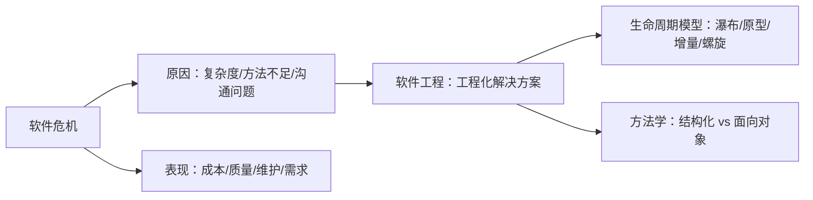

> 💡 **复习建议**：
>
> 1. 理解软件危机与软件工程的因果关系（为什么需要软件工程）。
> 2. 对比记忆生命周期模型，结合实例区分应用场景。
> 3. 结构化方法重点掌握“三大控制结构”和“模块化”。


# 第二章 可行性研究

可行性研究是软件开发生命周期的**第一步**，解决“**要不要做**”的核心问题。本章内容系统性强，需重点掌握分析维度、建模工具和实战方法。

## 2.1 可行性研究的目的与任务

**为什么需要可行性研究？**

- **避免资源浪费**：在投入大量开发资源前验证项目可行性（例：某市政府耗资千万开发智慧城市系统，因技术不成熟最终废弃）。
- **决策依据**：为管理层提供是否启动项目的客观数据支持。

**核心任务**

| 任务           | 说明                                                         |
| -------------- | ------------------------------------------------------------ |
| **技术可行性** | 现有技术能否实现？(如：AI医疗诊断需评估深度学习算法的成熟度) |
| **经济可行性** | 投入 vs 收益分析（计算ROI）(例：开发成本500万，预计年收益200万，回收期2.5年) |
| **操作可行性** | 用户能否接受？(如：老年人医院系统需考虑触屏操作便利性)       |
| **法律可行性** | 是否符合法规？(例：金融系统需满足GDPR数据隐私要求)           |

> 📌 **考点提示**：简答题常考四个可行性维度的定义，需结合案例说明。


## 2.2 系统流程图（System Flowchart）

**核心作用**

- **可视化物理流程**：描述系统如何与外部实体（人/设备）交互（非逻辑细节）。
- **区分边界**：明确软件系统与外部环境的接口。

**关键符号与含义**

| 符号 | 名称      | 用途                                              |
| ---- | --------- | ------------------------------------------------- |
|      | 处理框    | 表示程序/人工处理过程（例：银行柜员审核开户申请） |
|      | 输入/输出 | 广义输入输出（例：扫描身份证）                    |
|      | 文档      | 纸质/电子文件（例：打印存款单）                   |
|      | 磁盘      | 数据库/文件存储（例：客户信息数据库）             |

**经典案例解析**

**图书馆借书系统流程图**

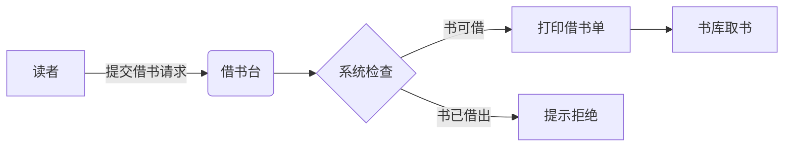

> 💡 **关键点**：箭头表示**物理流动方向**（非数据流），如纸质借书单从打印机传递到书库管理员。


## 2.3 数据流图（DFD）与数据字典（DD）

**数据流图（Data Flow Diagram）**

**分层设计思想**：

- **顶层图（Context Diagram）**：系统黑盒视图（1个加工+外部实体+数据流）
- **0层图（Level-0 DFD）**：分解顶层加工（4-7个关键加工）
- **1层图（Level-1 DFD）**：细化0层加工

**绘图规则**：

1. 加工名用**动词短语**（例：“计算利息”而非“利息计算器”）
2. 数据流用**名词**（例：“存款金额”）
3. **禁止**控制流（如“审核通过”是控制信号，应转为“审核结果”数据流）

**实例：ATM取款系统DFD片段**

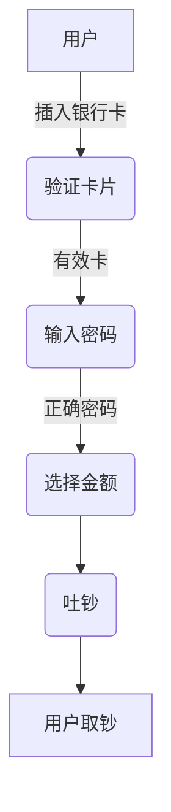

**数据字典（Data Dictionary）**

**作用**：定义DFD中所有元素的详细规格说明书。

**核心条目格式**：

```
1. 数据流：存款单 = 姓名 + 身份证号 + 存款类型 + 金额  
2. 数据项：金额 = 数字(10,2)   // 10位整数，2位小数  
3. 加工：计算利息 = 存款金额 × 利率 × 存期  
4. 文件：客户信息 = {客户ID + 姓名 + 手机号}  
```

> 📌 **考点提示**：应用题常要求补充DFD缺失的数据流或修正错误符号。

------

## 2.4 可行性研究实战案例

**机票预订系统可行性分析**

1. **技术可行性**：

   - 接口：需对接航空公司API（技术成熟）
   - 性能：支持1000并发查询（需负载测试）

2. **经济可行性**：

   ```
   开发成本：人力50万 + 硬件30万 = 80万  
   年收益：售票佣金200万/年  
   ROI = (200-80)/80 = 150%  // 可行  
   ```

3. **操作可行性**：

   - 用户：旅行社员工有电脑操作基础
   - 培训：提供2天操作手册培训

4. **法律可行性**：

   - 数据合规：乘客信息加密存储（符合《网络安全法》）

------

典型考题解析

**应用题示例**

> 绘制“患者监护系统”顶层DFD：
>  ​**​参考答案​**​：
>
> ```mermaid
> graph TD  
>     A[监测设备] -->|生理信号| B(患者监护系统)  
>     B -->|报警信号| C[护士站]  
>     B -->|病情报告| D[医生工作站]  
> ```

------

## 本章知识图谱

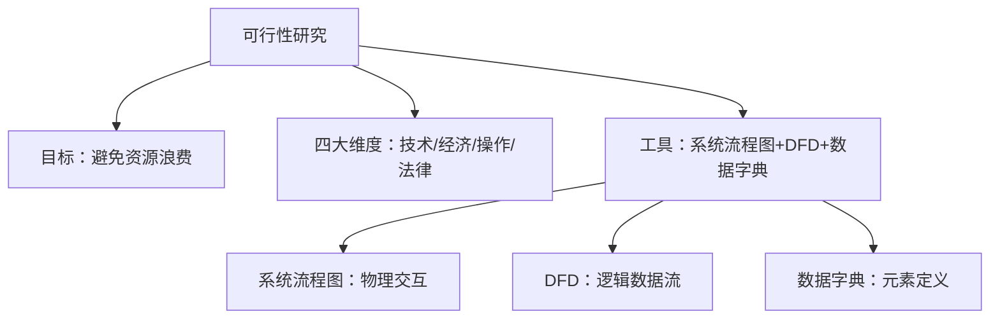

> 💡 **复习建议**：
>
> 1. 对比记忆系统流程图（物理）与DFD（逻辑）的符号差异
> 2. 掌握经济可行性计算方法（ROI=年净收益/总成本×100%）
> 3. 练习DFD分层绘图：顶层图必须只有1个加工


# 第三章 需求分析

## 3.1 需求分析的目的与任务

**为什么需要需求分析？**

- **弥补可行性研究的不足**：可行性研究确定“**做不做**”，需求分析解决“**做什么**”，细化到可执行细节（例：ATM系统需明确“单笔取款上限5000元”）。
- **避免后续返工**：需求不清晰导致50%的项目失败（Standish Group数据），需求分析降低后期修改成本。

**四大核心任务**

| 任务             | 说明                                    | 实例（机票预订系统）            |
| ---------------- | --------------------------------------- | ------------------------------- |
| **确定综合要求** | 功能、性能、安全等全局需求              | 支持1000并发用户，响应时间<2秒  |
| **分析数据要求** | 定义数据结构与关系（ER图）              | 乘客信息={身份证号+姓名+手机号} |
| **导出逻辑模型** | 建立行为模型（状态图）、功能模型（DFD） | 订票状态：搜索→选择→支付→出票   |
| **修正开发计划** | 根据需求复杂度调整资源与进度            | 增加3人周用于支付接口安全测试   |

## 3.2 软件需求分类（8类）

**考试必考的8类需求**

| 需求类型         | 说明                           | 案例（医院挂号系统）                   |
| ---------------- | ------------------------------ | -------------------------------------- |
| **功能需求**     | 系统必须提供的服务（动词短语） | 患者预约科室、医生、时段               |
| **性能需求**     | 响应时间、吞吐量等量化指标     | 挂号峰值5000次/分钟，延迟≤1秒          |
| **可靠性需求**   | 系统无故障运行概率             | 365天×24小时可用，故障率<0.1%          |
| **出错处理需求** | 对异常输入的响应方式           | 身份证号格式错误时提示“请输入18位数字” |
| **接口需求**     | 软/硬件交互规范                | 支持社保卡读卡器型号XXX                |
| **约束**         | 技术或业务限制                 | 必须使用Java开发，数据库用MySQL        |
| **逆向需求**     | 系统**禁止**的行为             | 禁止修改已支付订单的预约时间           |
| **未来需求**     | 预留扩展可能性                 | 预留对接医保结算接口                   |

> ⚠️ **易错点**：逆向需求≠错误处理，而是业务规则限制（如“禁止删除已付款订单”）。

## 3.3 三大模型的作用

**需求分析的三种核心模型**

| 模型         | 描述对象     | 工具          | 作用                                  | 实例（银行转账系统）       |
| ------------ | ------------ | ------------- | ------------------------------------- | -------------------------- |
| **数据模型** | 系统数据结构 | ER图          | 定义实体、属性及关系（1:1, 1:N, M:N） | 账户-(1:N)-交易记录        |
| **功能模型** | 系统行为     | 数据流图(DFD) | 描述数据如何被处理                    | 输入金额→验证余额→执行转账 |
| **行为模型** | 状态变化     | 状态转换图    | 描绘系统响应事件的状态迁移            | 空闲→验证→处理→完成        |

> 🔍 **考点**：选择题常考模型与工具的对应关系（如：行为模型→状态图）。

## 3.4 ER图（实体-联系图）

**绘图规则与符号**

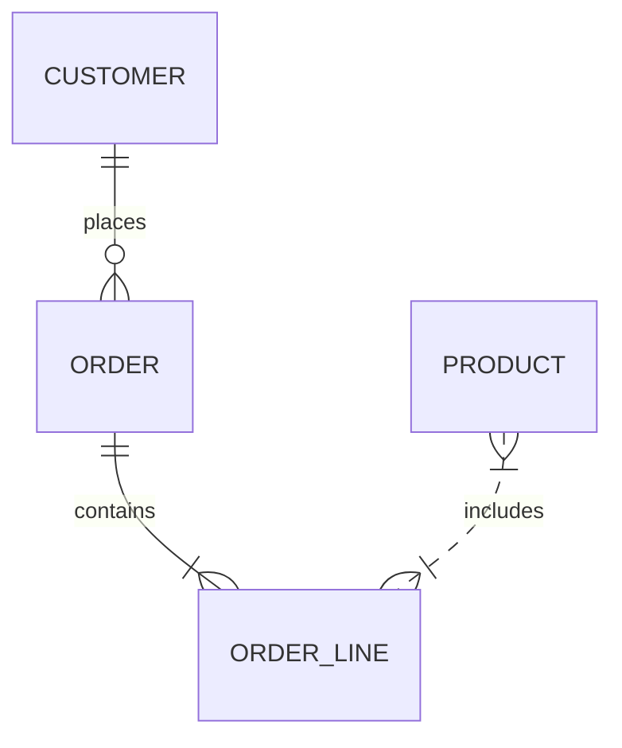

- **实体**：矩形框 → `CUSTOMER`（客户）、`PRODUCT`（产品）

- **属性**：椭圆 → `customer_id`（主键）、`product_price`

- **联系**：菱形 → `places`（下单）、`contains`（包含）

- 基数：

  - `1:1`：医生---值班安排
  - `1:N`：部门-<职工（1个部门有N个职工）
  - `M:N`：学生>-<课程（学生选多门课，课程被多人选）

**典型考题**

> **题目**：画出“学生选课系统”的ER图（1个学生选多门课，1门课被多个学生选，课程有课程号/名称，学生有学号/姓名）。
>  ​**​答案​**​：
>
> ```mermaid
> erDiagram
>     STUDENT }|--o{ SELECT : "选择"
>     COURSE }o--o{ SELECT : "被选"
>     STUDENT {
>         string student_id PK
>         string name
>     }
>     COURSE {
>         string course_id PK
>         string course_name
>     }
>     SELECT {
>         int score
>     }
> ```

## 3.5 状态转换图

**核心元素与案例**

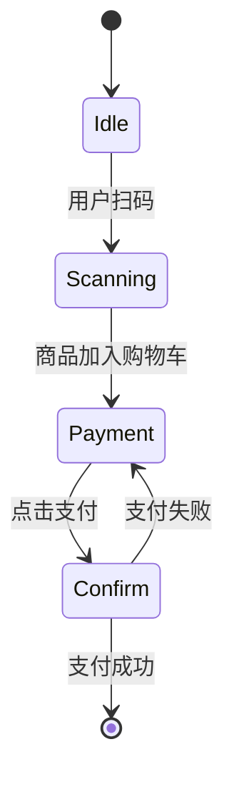

- **状态**：圆角矩形 → `Idle`（空闲）、`Payment`（支付中）
- **转移**：箭头 → `点击支付`（事件）
- **起点/终点**：`[*]`

**应用题步骤**

1. **识别状态**：系统可能处于的阶段（如：订单状态=待支付/已支付/已取消）
2. **定义事件**：触发状态转移的动作（如：“用户取消”事件使订单→已取消）
3. **绘制迁移**：用箭头连接状态，标注事件名

> 📌 **考点**：根据文字描述画状态图（例：电梯控制系统）。

## 3.6 需求分析工具

**层次方框图 vs IPO图**

| **工具**       | 用途                     | 特点                   | 示例片段                                       |
| -------------- | ------------------------ | ---------------------- | ---------------------------------------------- |
| **层次方框图** | 数据结构的层次分解       | 树形结构，自顶向下细化 | 订单→订单头+订单明细                           |
| **IPO图**      | 描述模块的输入/处理/输出 | 表格形式，简洁清晰     | 输入：用户ID → 处理：查询订单 → 输出：订单列表 |

**IPO图示例**：

| 模块名   | 输入               | 处理逻辑                | 输出       |
| -------- | ------------------ | ----------------------- | ---------- |
| 计算折扣 | 订单金额, 会员等级 | 根据等级查折扣率 × 金额 | 折扣后金额 |

## 高频考点总结

1. 选择题：

   - 区分需求类型（如：可靠性需求→故障率）
   - 识别ER图符号（菱形=联系）
   
2. 简答题：

   - 简述需求分析的四大任务（综合要求/数据要求/逻辑模型/修正计划）
   - 列举8类需求并举例（功能/性能/接口...）
   
3. 应用题：

   - 根据场景画ER图（注意M:N关系的转化）
- 绘制状态转换图（标注事件和状态）

> 💡 **复习建议**：
>
> - 重点掌握ER图和状态图的**绘图规范**（考试必考）
> - 熟记需求分类的**关键词**（功能=“做什么”，性能=“多快多稳”）
> - 结合案例理解抽象概念（如：逆向需求=业务禁止规则）


# 第五章 总体设计

## 5.1 总体设计的两大阶段

1. **系统设计阶段**
   - **任务**：确定技术方案（物理设计）
   - **输出**：硬件选型（如服务器配置）、软件栈（如MySQL+Tomcat）、网络拓扑图
   - **考点**：区分“做什么”（需求阶段）和“用什么做”（系统设计）
2. **结构设计阶段**
   - **任务**：定义软件模块结构
   - **输出**：模块结构图（HIPO图/层次图）
   - **考点**：结构设计聚焦**模块划分**，非算法细节（属于详细设计）


## 5.2 总体设计9步骤

| 步骤          | 关键行动                 | 考试要点说明                           |
| ------------- | ------------------------ | -------------------------------------- |
| 1. 设想方案   | 提出≥2种可行架构         | 需包含不同技术路线（如集中式vs分布式） |
| 2. 筛选方案   | 评估技术/经济/操作可行性 | 用决策矩阵加权评分法                   |
| 3. 推荐方案   | 输出《系统设计方案书》   | 包含架构图+选型理由                    |
| 4. 功能分解   | 模块划分（自顶向下）     | 用H图展示层级                          |
| 5. 设计结构   | 绘制模块结构图           | 箭头表示调用关系（非数据流）           |
| 6. 数据库设计 | ER图→关系模型            | 考纲关联第3章ER图                      |
| 7. 测试计划   | 制定集成测试策略         | 重点：自顶向下vs自底向上策略           |
| 8. 编写文档   | 《概要设计说明书》       | 含模块清单+接口定义                    |
| **9. 复审**   | **正式技术评审（FTR）**  | **易考点：不通过则返回步骤4**          |

> 📌 **关键记忆点**：步骤9是**质量关卡**，未通过需重新分解模块（步骤4）


## 5.3 模块化设计原理

1. 四大基本原则

| 原理         | 核心思想           | 应用案例                                              |
| ------------ | ------------------ | ----------------------------------------------------- |
| **模块化**   | 分治法解决复杂问题 | 学生管理系统拆分为：登录/选课/成绩管理模块            |
| **抽象**     | 关注本质忽略细节   | 定义数据库接口`DB.executeQuery()`，隐藏具体SQL        |
| **逐步求精** | 分层细化设计       | 1. 先设计用户管理模块 → 2. 细化为添加/删除/查询子模块 |
| **信息隐藏** | 封装模块内部细节   | 支付模块隐藏加密算法实现                              |

2. 模块独立性指标（重点！）

**耦合度衡量**（从优到劣）：


- 数据耦合（最优）：通过参数传递基本数据类型

  ```
  // 示例：数据耦合
  calculateTax(income); // 仅传递数值
  ```
  
- 内容耦合（最差）：直接修改其他模块内部数据

  ```
  // 示例：内容耦合（禁止！）
  moduleA.internalData = 0; // 外部修改内部数据
```

**内聚性分级**（从优到劣）：

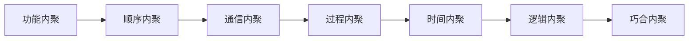

- 功能内聚（最优）：模块只做一件事

  ```
  class PaymentProcessor {
      void processPayment() { /* 仅处理支付 */ }
  }
  ```
  
- 

  巧合内聚

  （最差）：模块内元素无关联

  ```
  class Utils { 
      void formatDate() {...} 
      void encryptData() {...} // 无关功能硬凑
  }
  ```

> 🔥 **黄金法则**：追求**高内聚+低耦合**
>
> - 高内聚：模块内元素紧密相关
> - 低耦合：模块间依赖简单明确

------

## 5.4 结构图设计

1. 从DFD到结构图

**转换规则**：

- **变换型DFD**（输入→处理→输出）→ **三层结构**

  ```mermaid
  graph TD
      A[输入模块] --> B[中心变换模块]
      B --> C[输出模块]
  ```

  **案例**：文件处理系统

  ```
  读取文件 → 格式转换 → 打印报告
  ```

- **事务型DFD**（事件分发）→ **调度中心结构**

  ```mermaid
  graph TD
      D[事务中心] --> E[操作模块A]
      D --> F[操作模块B]
      D --> G[操作模块C]
  ```

  **案例**：ATM系统

  ```
  用户请求 → 分发到存款/取款/查询模块
  ```

2. 结构图绘制规范

- **符号说明**：
   ▭ 矩形：模块（写模块名）
   → 箭头：调用方向（​**​箭头指向被调用模块​**​）
   ◇ 菱形：选择调用
   ○ 环形：循环调用

- **典型错误**：
   ❌ 箭头标注数据流（应写调用关系）
   ✅ 正确标注：

  ```mermaid
  graph LR
      Main --调用--> Payment
      Payment --包含--> Validation
  ```

## 考点总结与答题模板

选择题速记

- 模块化目的：**降低复杂性**
- 最佳耦合类型：**数据耦合**
- 最差内聚类型：**巧合内聚**
- 结构图箭头含义：**模块调用关系**
- 复审未通过：**返回功能分解步骤**

简答题模板

**题目**：简述模块化设计的优点
 ​**​参考答案​**​：

1. **降低复杂性**：分解为独立子问题
2. **提高可维护性**：模块可单独修改（例如支付模块升级不影响订单模块）
3. **促进团队协作**：并行开发不同模块
4. **增强复用性**：通用模块（如日志模块）可跨系统复用

**题目**：比较耦合与内聚
 ​**​参考答案​**​：

| **维度** | 耦合（Coupling）         | 内聚（Cohesion）         |
| -------- | ------------------------ | ------------------------ |
| **定义** | 模块间依赖程度           | 模块内部元素相关程度     |
| **目标** | 追求**低耦合**（松耦合） | 追求**高内聚**（紧内聚） |
| **示例** | 数据耦合（最优）         | 功能内聚（最优）         |

应用题技巧

**题目**：根据DFD设计结构图
 ​**​解题步骤​**​：

1. 判断DFD类型（变换型/事务型）
2. 识别核心处理模块
3. 按调用层级绘制模块（顶层→中层→底层）
4. 用箭头标注调用方向（勿画数据流！）

> 💡 **重要提醒**：考试中的DFD通常简化（如机票预订系统、银行储蓄系统），直接套用变换型/事务型模板即可。

# 第六章：详细设计 

## 6.1 详细设计的本质

- **核心任务**：设计程序的 **“蓝图”**（非直接编码）

- **输入**：概要设计的模块结构图

- **输出**：模块的 **算法描述**（流程图/盒图/伪代码） + **数据结构**

- 关键目标：

  1. 可读性高（方便他人维护）
  2. 可测试性强（逻辑清晰易覆盖）
  3. 与编程语言无关（设计先于实现）

> **考点**：区分总体设计（模块划分） vs 详细设计（模块内部逻辑）

## 6.2 结构化程序设计

定义

> 如果一个程序的代码块仅通过 **顺序、选择、循环** 3种基本控制结构连接，且每个代码块 **只有一个入口和一个出口**，则称为结构化程序。

三种基本结构详解

| 结构 | 图形表示（流程图） | 特点                         |
| ---- | ------------------ | ---------------------------- |
| 顺序 |                    | 按顺序执行语句（无分支）     |
| 选择 |                    | 单分支/双分支（if-else）     |
| 循环 |                    | 当型/直到型循环（while/for） |

**重要原则**：

- **禁止使用** `goto` 语句（破坏单入口单出口）
- **嵌套深度** ≤ 3层（否则需拆分子模块）

## 6.3 详细设计工具

1. 程序流程图（最传统）

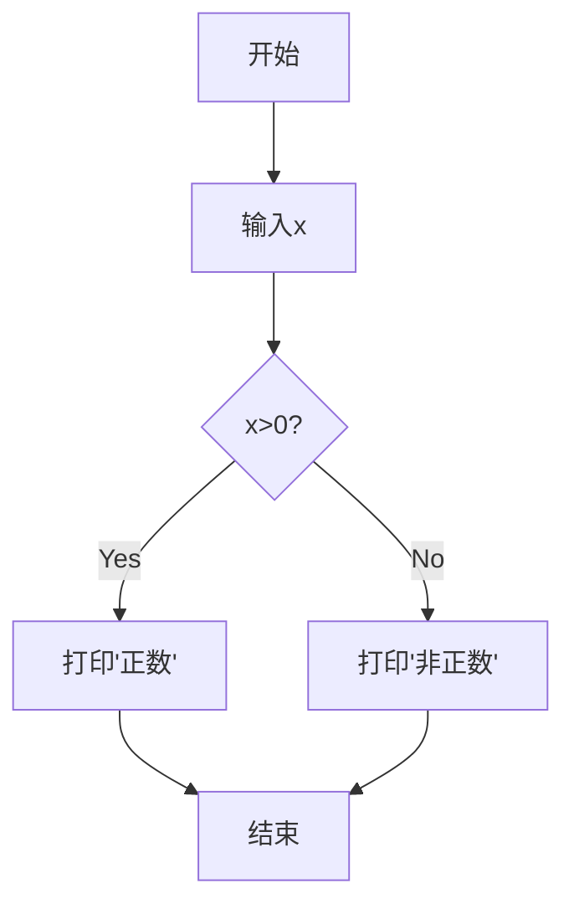

- **优点**：直观易画

- 缺点：

  - 允许任意跳转（破坏结构化）
  - 无法约束作用域（如循环体范围模糊）

2. 盒图（N-S图，考试首选）

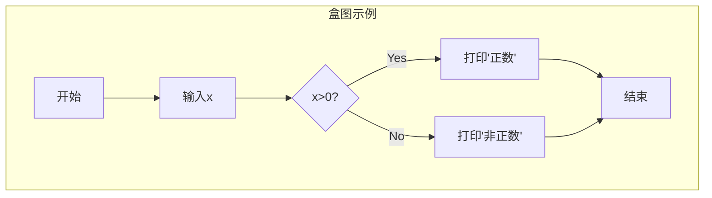

- 特点：

  - 功能域明确（矩形框限定范围）
  - **禁止控制转移**（强制结构化）
  - 嵌套结构可视化（循环/选择一目了然）

3. 判定表（复杂条件场景）

**适用场景**：多条件组合决策（如折扣规则）
​**​设计步骤​**​：

1. 列出所有条件桩（如：会员等级、订单金额）
2. 列出所有动作桩（如：打9折、打8折）
3. 填充条件组合与对应动作

| 条件：会员等级   | 金牌 | 金牌 | 银牌 | 非会员 |
| ---------------- | ---- | ---- | ---- | ------ |
| 条件：订单≥1000  | Y    | N    | Y    | Y      |
| **动作：打9折**  | ✓    | ✓    |      |        |
| **动作：打8折**  |      |      | ✓    |        |
| **动作：不打折** |      |      |      | ✓      |

> 🔥 **考点**：盒图是结构化设计的黄金工具，判定表用于多条件逻辑

------

## 6.4 Jackson方法（面向数据结构设计）

核心思想

> 程序结构 = 数据结构
>
> - 输入数据结构 → 程序处理结构
> - 输出数据结构 → 程序输出结构

设计步骤

1. 分析输入/输出数据结构

   用 Jackson 图表示（树形结构）

   ```mermaid
   graph TD
       File --> Header
       File --> Body
       Body --> Record1
       Body --> Record2
   ```
   
2. 映射到程序结构

   - 输入结构中的元素 → 程序中的处理模块
   - 输出结构中的元素 → 程序中的输出模块
   
3. **列出所有操作**（如打开文件、计算校验和）

4. **分配操作到程序模块**

典型考题

> 设计一个程序：读入学生成绩文件（格式：文件头+多条记录），输出及格学生名单。
>  ​**​解题​**​：
>
> 1. 输入结构：文件 → 文件头 + 成绩记录（学号+分数）
>
> 2. 输出结构：名单 → 标题 + 多条学生信息（学号）
>
> 3. 程序结构：
>
>    ```mermaid
>    graph TD
>        Main --> ReadHeader
>        Main --> ProcessBody
>        ProcessBody --> ReadRecord
>        ReadRecord --> CheckScore
>        CheckScore -->|及格| WriteOutput
>    ```

## 考点总结与答题技巧

- 详细设计目标：**可读性 > 效率**（易维护优先）
- 结构化程序核心：**3种控制结构 + 单入口/出口**
- 最结构化工具：**盒图（N-S图）**
- Jackson方法适用于 **数据主导型系统**（如文件处理）

简答题模板

**题目**：为什么提倡结构化程序设计？
​**​答案​**​：

1. **可读性强**：避免`goto`导致的“面条代码”
2. **易维护**：单入口单出口减少逻辑路径
3. **易验证**：可通过数学证明正确性（如霍尔逻辑）

**题目**：盒图 vs 流程图的优缺点？
​**​答案​**​：

| **维度**   | 盒图（N-S图）            | 流程图           |
| ---------- | ------------------------ | ---------------- |
| **结构化** | 强制遵守（无法画跳转）   | 允许非结构化跳转 |
| **作用域** | 图形边界明确（如循环体） | 依赖箭头，易混淆 |
| **易用性** | 嵌套复杂时难绘制         | 绘制简单         |

1. 画盒图时：

   - 循环结构必须用 **矩形框包裹**
   - 选择结构 **明确标注T/F分支**
   
2. 判定表设计：

   - 条件组合需 **全覆盖**（2ⁿ种情况）
   - 动作避免冲突（每列仅一个✓）
   
3. Jackson方法：

   - 输入/输出结构需用 **树形图表示**
- 程序结构需与 **数据结构严格对应**


# 第七章 实现

## 7.1 测试的本质与目标

- **核心定义**：

  > 测试的目的是在软件投入生产性运行之前，尽可能多地发现软件中的错误。

- **关键认知**：

  - 测试是**发现错误的过程**（非证明无错）
  - 测试横跨两个阶段：
    - **单元测试**（编码阶段，开发者自测）
    - **综合测试**（测试阶段，独立测试团队）
  - 测试成本占项目总成本 **30%~50%**（大型系统）

## 7.2 白盒测试 vs 黑盒测试（简答题高频）

| **维度**     | 白盒测试（结构测试） | 黑盒测试（功能测试）               |
| ------------ | -------------------- | ---------------------------------- |
| **测试依据** | 程序内部逻辑结构     | 软件功能规格说明书                 |
| **目标**     | 验证代码逻辑正确性   | 验证功能是否符合需求               |
| **执行者**   | 开发者               | 测试工程师                         |
| **典型技术** | 逻辑覆盖法、路径测试 | 等价类划分、边界值分析、错误推测法 |
| **优势**     | 深度覆盖代码路径     | 贴近用户实际使用场景               |
| **局限**     | 无法检测缺失功能     | 无法保证内部逻辑全覆盖             |

> **考点**：区分两种测试的适用场景（白盒→单元测试；黑盒→系统测试）

## 7.3 单元测试的五大焦点

单元测试针对**单个模块**，验证以下方面：

1. 模块接口

   - 检查参数传递：数量/类型/顺序是否匹配
   - 示例：调用`calculateTax(income)`时传入字符串应报错
   
2. 局部数据结构

   - 检测局部变量初始化/越界/溢出
   - 案例：数组索引超出范围
   
3. 重要执行通路

   - 覆盖所有关键逻辑路径（如if-else分支）

4. 出错处理通路

   - 验证异常处理：如文件不存在时是否友好提示

5. 边界条件

   - 测试临界值：如循环的`0次`和`最大值+1`


## 7.4 集成测试策略

1. 自顶向下集成

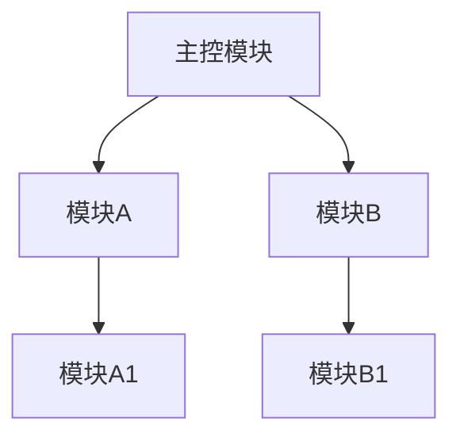

- **过程**：从顶层模块开始，逐步集成下层模块

- 特点：

  - **需要桩模块（Stub）**：模拟未实现的下层模块
  - **优点**：早期验证主要控制流
  - **缺点**：底层模块测试延迟

2. 自底向上集成

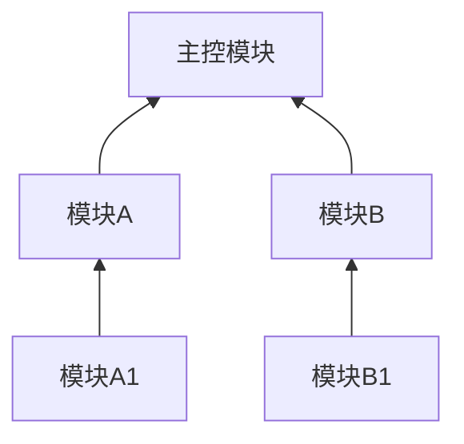

- **过程**：从底层模块开始，逐步组装上层

- 特点：

  - **需要驱动模块（Driver）**：调用被测模块
  - **优点**：无需桩模块，测试用例易设计
  - **缺点**：顶层设计缺陷晚期发现

| **策略** | 适用场景     | 测试难度       | 缺陷发现阶段     |
| -------- | ------------ | -------------- | ---------------- |
| 自顶向下 | 控制复杂系统 | 高（需桩模块） | 早期发现顶层问题 |
| 自底向上 | 数据驱动系统 | 低             | 晚期发现顶层问题 |

## 7.5 逻辑覆盖测试用例设计

覆盖强度排序（由弱到强）：

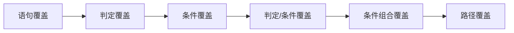

1. 语句覆盖（最弱）

- **目标**：每条语句至少执行1次

- 用例设计：

  ```
  if (A>1 && B==0) 
      X=X/A;  // 需覆盖
  if (A==2 || X>1)
      X=X+1;  // 需覆盖
  ```
  
  用例：
  
  ```
  A=2, B=0, X=4
  ```

   → 执行路径：

  ```
  sacbed
  ```

2. 判定覆盖（分支覆盖）

- **目标**：每个判定的真/假分支至少执行1次

- 用例设计：

  - 用例1：`A=3, B=0, X=3` → 覆盖第一个判定真分支（`sacbd`）
- 用例2：`A=2, B=1, X=1` → 覆盖第一个判定假分支（`sabed`）

3. 条件覆盖

- **目标**：每个条件的可能取值至少执行1次

- 用例设计：

  - 条件1：`A>1`（真/假）

  - 条件2：`B==0`（真/假）

  - 条件3：`A==2`（真/假）

  - 条件4：

    ```
    X>1
    ```

    （真/假）
  
    用例：

    - `A=2, B=0, X=4`（全真）
- `A=1, B=1, X=1`（全假）

## 7.6 其他关键概念

1. α测试

   - 开发环境下由**一个用户**测试（通常是内部用户）
   - 目的：发现严重BUG，验证核心功能
   
2. β测试

   - 真实环境中由**多个用户**测试
   - 目的：收集用户体验，检测兼容性问题
   
3. 测试用例

   - 定义：**测试数据 + 预期输出**的组合
- 示例：输入`用户名="", 密码="123"` → 预期输出：提示“用户名不能为空”

## 考点总结与答题模板

选择题速记

- 测试根本目的：**发现错误**
- 最强逻辑覆盖：**路径覆盖**
- 最弱逻辑覆盖：**语句覆盖**
- α测试 vs β测试：**开发环境 vs 真实环境**
- 单元测试重点：**边界条件**（如循环0次）

简答题模板

**题目**：为什么单元测试要聚焦边界条件？
​**​答案​**​：

1. **边界易出错**：如数组索引越界、循环次数偏差
2. **用户输入不可控**：可能输入极端值（如金额=0或极大值）
3. **防御性编程**：提前暴露潜在崩溃点

**题目**：自顶向下集成的优缺点？
​**​答案​**​：
​**​优点​**​：

- 早期验证主控逻辑

- 支持深度优先或广度优先策略

**​缺点​**​：

- 需要开发桩模块（增加成本）

- 底层细节测试延迟

应用题技巧

**设计逻辑覆盖用例步骤**：

1. **绘制程序流程图**（明确判定节点）

2. **列出所有条件**（如`A>1`, `B=0`）

3. 根据覆盖要求生成用例：

   - 语句覆盖 → 选1组数据覆盖所有语句
- 判定覆盖 → 2组数据覆盖所有分支
   - 条件覆盖 → 2ⁿ组数据覆盖所有条件取值

4. **验证路径**：标注每个用例的执行路径


# 第八章 软件维护

## 8.1 软件维护的本质

**定义**（考纲原文）：

  > 在软件交付使用后，为改正错误或满足新需求而修改软件的过程。

- **关键认知**：

  - 维护成本 ≈ **开发成本的4倍**（大型系统）
  - 维护阶段占软件生命周期 **60%+** 时间
  - **75%** 的维护成本用于完善性+适应性维护

## 8.2 维护类型与特点

**四类维护活动对比**：

| 类型         | 触发原因                  | 占比   | 典型案例                     |
| -------------- | ---------------------------- | ------- | ---------------------------- |
| **改正性维护** | 修复软件缺陷（BUG）          | 20%     | 修复支付金额计算错误         |
| **适应性维护** | 适应环境变化（硬件/OS/法律） | 25%     | 适配Windows 11系统           |
| **完善性维护** | 用户新增功能需求             | **50%** | 为电商系统增加“直播购物”功能 |
| **预防性维护** | 主动优化可维护性             | **<5%** | 重构老旧代码方便未来扩展     |

> 🔥 **考点**：
>
> 1. **占比最大**：完善性维护（用户需求驱动）
> 2. **占比最小**：预防性维护（技术驱动）

------

## 8.3 维护流程与方法

**结构化维护流程**（需完整软件配置）：


特点：

1. 以**设计文档为起点**（非直接改代码）
2. 依赖**回归测试**（用原始测试用例验证）
3. **成本低、质量高**

> ⚠️ **对比非结构化维护**（无文档）：
>
> - 直接修改代码 → 测试困难 → 易引入新错误 → **成本极高**

## 8.4 维护实施步骤

**标准事件流**：

1. 确定维护类型（四选一）

2. 中间步骤：理解现有代码，修改设计/代码测试（单元+回归）


3. 最后一步：复审，检查配置有效性，确认满足维护需求表


## 8.5 可维护性提升

**五大影响因素**：

| 因素         | 定义               | 提升措施举例                  |
| ------------ | ------------------ | ----------------------------- |
| **可理解性** | 快速理解代码逻辑   | 写注释、模块化、命名规范      |
| **可测试性** | 易于设计测试用例   | 提供测试接口、日志输出        |
| **可修改性** | 修改代码的难易程度 | 低耦合设计、避免全局变量      |
| **可移植性** | 适应新硬件/OS环境  | 用标准库、隔离平台相关代码    |
| **可重用性** | 组件复用的可能性   | 设计通用工具类（如DateUtils） |

2. 提高可维护性的6大措施（简答题模板）

1. **模块化设计**：高内聚低耦合（如独立支付模块）
2. **详细设计文档**：描述模块功能与接口
3. **编码规范**：统一命名/注释风格
4. **防御式编程**：输入校验、异常处理
5. **使用高级语言**：Java/Python > C > 汇编
6. **保留测试用例**：便于回归测试


## 8.6 系统重构技术

**逆向工程 vs 再工程**：

| 技术         | 定义                      | 目的                |
| ------------------ | ---------------------------------------------------------- | -------------------- |
| **逆向工程**       | 分析代码 → 提取设计信息（代码→设计）                       | 理解遗留系统逻辑     |
| **代码重构**       | 优化代码结构（不改变功能）                                 | 提高可读性/可维护性  |
| **预防性维护**     | 主动优化为未来准备                                         | 本质是**软件再工程** |
| **再工程过程模型** | 6步：库存分析→文档重构→逆向工程→代码重构→数据重构→正向工程 | 系统化改造旧系统     |

> 🔍 **考点辨析**：
>
> - **逆向工程**：理解现有系统（分析）
> - **代码重构**：改进代码质量（优化）
> - **再工程**：全面升级系统（重建）

## 本章知识图谱

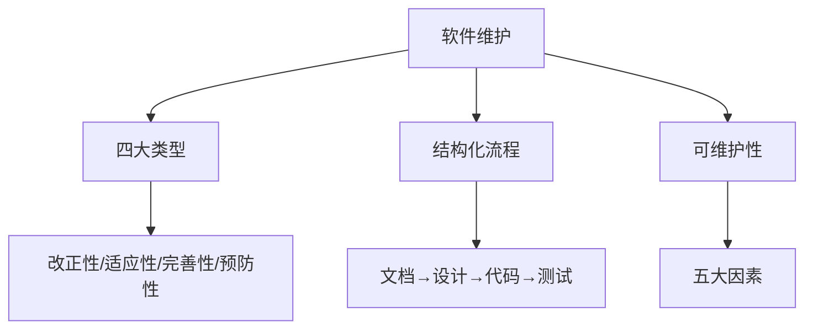

> 📌 **考点提示**：
> - 维护类型占比（完善性>适应性>改正性>预防性）
> - 结构化维护起点（设计文档）
> - 提高可维护性措施（模块化/文档/规范）

> 💡 **复习建议**：
> 1. 重点记忆四类维护的占比和典型案例
> 2. 理解结构化维护与非结构化维护的成本差异
> 3. 掌握可维护性的五大影响因素

- 维护成本占比：**开发成本的4倍**
- 最常见维护类型：**完善性维护**
- 最耗时维护类型：**改正性维护**（定位隐蔽错误难）
- 结构化维护起点：**评价设计文档**
- 再工程起点：**库存目录分析**

简答题模板

**题目**：为什么软件维护成本高？
​**​答案​**​：

1. **需求变化频繁**：用户新增完善性需求（占50%）
2. **人员流动**：新成员理解旧代码困难
3. **文档缺失**：非结构化维护效率低
4. **系统老化**：技术债务累积（如祖传代码）

**题目**：提高可维护性的具体措施？
​**​答案​**​：

1. **设计阶段**：模块化分解（高内聚低耦合）

2. 实现阶段：

   - 编写可读代码（命名规范+注释）
   - 使用高级语言（如Java）
   
3. **测试阶段**：保存测试用例用于回归测试

4. **维护阶段**：完善文档记录修改历史

易错点提醒

- 错误：”预防性维护占比最大“ → 改正：**完善性维护最大**
- 错误：”维护从修改代码开始“ → 改正：结构化维护从**评价设计文档**开始

> 💎 **终极提示**：本章约5-10分，重点记忆 **四类维护占比** 和 **可维护性措施**！


# 第九章 面向对象方法学

## 9.1 面向对象方法学核心

**特点**（简答题重点）：

**定义**（考纲原文）：

> 面向对象方法学的出发点和基本原则，是尽可能模拟人类习惯的思维方式，使开发软件的方法与过程尽可能接近人类认识世界解决问题的方法与过程。

**五大优点**：

1. 与人类思维一致

   - 现实世界→对象模型直接映射
   - 案例：银行系统用"账户"对象直接对应真实账户
   
2. 稳定性好

   - 基于对象而非功能分解，需求变化时只需修改局部

3. 可重用性好

   - 通过继承实现代码复用（如"VIP客户"继承"客户"类）

4. 易开发大型系统

   - 模块化程度高（如电商系统分解为订单、支付、库存等对象）

5. 可维护性好

   - 封装性使修改影响局部化

## 9.2 核心概念辨析

**类与对象关系**（选择题高频）：

| 概念     | 定义                                         | 关系说明         |
| -------- | -------------------------------------------- | ---------------- |
| **类**   | 具有相同属性和操作的对象的模板（如"汽车"类） | 类是对象的抽象   |
| **对象** | 类的实例（如"车牌A123的宝马汽车"）           | 对象是类的具体化 |
| **实例** | 由类创建的具体对象（与"对象"同义）           | 实例=对象        |

> 🔥 **关键区别**：
>
> - **类** = 设计蓝图（如"学生"类）
> - **对象** = 根据蓝图建造的具体事物（如"学号20231101的张同学"）

## 9.3 面向对象模型

**三种模型对比**（选择题必考）：

| 模型         | 描述         | 核心作用                                          | 图形工具   |
| ------------ | ------------ | ------------------------------------------------- | ---------- |
| **对象模型** | 静态数据结构 | 描述系统"数据"性质，是其他模型的基础              | 类图       |
| **动态模型** | 行为控制     | 描述对象状态变化序列（如订单从"未支付"→"已发货"） | 状态转换图 |
| **功能模型** | 系统功能     | 描述系统"做什么"，直接反映用户需求                | 用例图     |

> 考试重点**：对象模型是**最核心**模型，为其他模型提供框架

## 9.4 类的关系类型

**四种关系详解**（应用题核心）：

1. 关联（Association）

- **定义**：类间的语义连接（如"学生"-"选课"-"课程"）

- **符号**：直线连接类

- 多重性：

  - 1：1（一个学生一个学号）
  - 1：N（一个老师教多个学生）
  - M：N（学生选多门课/课程有多学生）

  ```mermaid
  classDiagram
      Student "1" --> "N" Course : 选课
      Teacher "1" --> "N" Student : 授课
  ```

2. 聚集（Aggregation）

- 共享聚集：部分可属于多个整体（如"学生"加入多个"社团"）

  ```mermaid
  classDiagram
      Club "1" o-- "N" Student : 成员
  ```

- 组合聚集：部分与整体共存亡（如"订单"与"订单项"）

  ```mermaid
  classDiagram
      Order "1" *-- "N" OrderItem : 包含
  ```

3. 泛化（Generalization）

- 继承关系（如"VIP客户"继承"客户"）

  ```
  classDiagram
      Customer <|-- VIPCustomer
  ```

- **抽象类**：类名标注`{abstract}`（如"支付方式"抽象类）

4. 依赖（Dependency）

- 临时使用关系（如"报表生成器"依赖"数据库连接"）

  ```
  classDiagram
      ReportGenerator ..> Database : 使用
  ```

# 第十章 面向对象分析

## 10.1 OOA核心任务

**输入输出**（选择题）：

- **输入**：用户需求
- **输出**：三种模型（对象/动态/功能模型）
- 关键活动：
  1. 识别类与对象
  2. 定义属性与服务
  3. 建立对象关系

> **重点**：OOA阶段**不涉及实现细节**（如编程语言）

## 10.2 建模层次

**五个层次说明**（简答题）：

| 层次           | 内容             | 案例（电商系统）             |
| -------------- | ---------------- | ---------------------------- |
| **主题层**     | 系统模块划分     | 用户管理、订单处理、支付系统 |
| **类与对象层** | 识别核心类       | Customer, Order, Product     |
| **结构层**     | 类之间关系       | Order "1"→"N" OrderDetail    |
| **属性层**     | 类的属性定义     | Order: orderID, totalPrice   |
| **服务层**     | 类的操作（方法） | Order: calculateTotal()      |

> **主题层作用**：简化复杂系统（如将大型ERP分解为采购/销售/库存主题）

## 10.3 类与对象识别

**非正式分析法步骤**（应用题）：

**非正式分析法步骤**（考纲要求）：

1. 提取名词：从需求描述中圈出所有名词

   > 需求："学生通过选课系统选择课程，教师管理课程信息"
   >  名词：学生、选课系统、课程、教师

2. 筛选候选类：

   - 保留核心实体（学生、课程、教师）
   - 剔除边界类（选课系统）

3. **确定属性**：用形容词描述（学生：学号、姓名）

4. **确定服务**：用动词描述（学生：选课()、查询成绩()）

**类图绘制规范**：

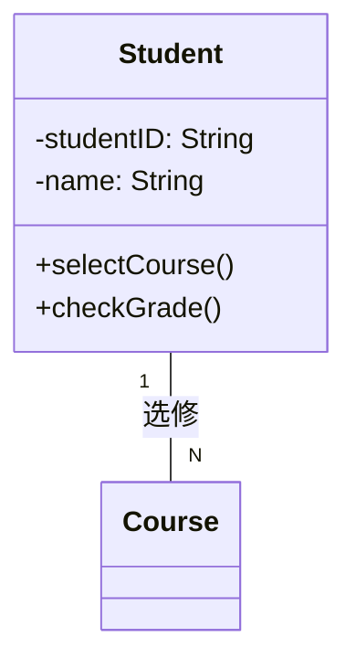

## 10.4 用例图设计

**元素与关系**（应用题）：

**元素说明**：

- **行为者(Actor)**：系统外部交互者（学生、教师）
- **用例(Use Case)**：系统功能单元（选课、评分）
- 关系类型：
  - 包含`<<include>>`：必选子功能（选课必须验证身份）
  - 扩展`<<extend>>`：可选功能（评分可扩展打印成绩单）

**案例：选课系统**

```mermaid
usecaseDiagram
    actor Student as S
    actor Teacher as T
    S --> (选课) : 包含
    (选课) .> (身份验证) : <<include>>
    (评分) --> (打印成绩单) : <<extend>>
    T --> (评分)
```

**寻找行为者的关键问题**（考纲要求）：

1. 谁使用主要功能？ → 学生
2. 谁维护系统？ → 管理员
3. 系统交互的硬件？ → 打印机
4. 其他关联系统？ → 教务系统

## 本章知识图谱

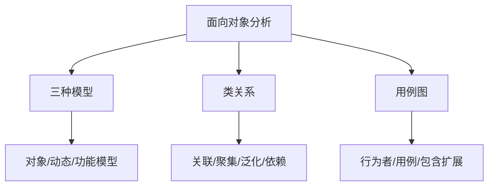

> 📌 **考点提示**：
> - 区分三种模型的作用（对象模型最基础）
> - 掌握四种类关系的符号表示
> - 用例图关系类型（包含 vs 扩展）

> 💡 **复习建议**：
> 1. 重点记忆类图的四种关系符号
> 2. 练习用例图设计，注意行为者位置
> 3. 理解对象模型是其他模型的基础

- 面向对象最核心模型：**对象模型**
- 组合聚集符号：**实心菱形**
- 用例图关系：**包含→必选，扩展→可选**
- 主题层本质：**模块化分解**

简答题模板

**题目**：为什么面向对象方法更稳定？
​**​答案​**​：

1. **基于对象建模**：需求变化时只需修改局部对象（如支付方式新增）
2. **封装性保护**：属性私有化，修改不影响外部调用
3. **继承机制**：通用功能在父类统一维护

**题目**：泛化与聚集的区别？
 ​**​答案​**​：

| **维度**     | 泛化（继承）                  | 聚集（整体-部分）              |
| ------------ | ----------------------------- | ------------------------------ |
| **关系**     | "是一种"关系（VIP客户是客户） | "包含"关系（订单包含商品项）   |
| **生命周期** | 父子类独立存在                | 组合聚集中部分随整体销毁而销毁 |

应用题避坑指南

1. 画类图时：

   - 必须标注多重性（如1、N、*）
   - 组合聚集用**实心菱形**（整体删除则部分删除）
   
2. 用例图时：

   - 行为者必须在系统外部（数据库不算行为者）
- 用例名用**动词+名词**（如"生成报表"）

> 💎 **终极提示**：面向对象分析的核心是"识别正确的类"，考试中类图设计占分高，务必掌握名词筛选法！


# 第十三章 软件项目管理

## 13.1 项目管理基础

**定义**（考纲原文）：

  > 软件项目管理先于任何技术活动之前开始，并且贯穿于软件的整个生命周期之中。

- **管理范畴**：

  1. **成本估算**（规模/工作量）
  2. **进度计划**（甘特图/关键路径）
  3. **团队组织**（人员配置）
  4. **质量保证**（CMM/测试）

## 13.2 规模估算方法

**两种常用方法对比**：

| 方法           | 核心原理                                               | 适用场景                   |
| -------------- | ------------------------------------------------------ | -------------------------- |
| **代码行技术** | 基于历史项目数据，估算新项目的代码行数（LOC）          | 有类似项目历史数据时       |
| **功能点技术** | 通过系统功能数量估算规模（输入/输出/查询/文件/接口数） | **早期需求阶段**（更准确） |

**功能点计算示例**：

- 输入数：用户表单（如注册表单）
- 输出数：报表（如销售报表）
- 查询数：搜索操作
- 文件数：数据库表
- 接口数：外部系统API

> 📌 **考点**：功能点技术独立于编程语言，更适合早期估算

## 13.3 团队组织模式

**三种模式对比**：

| 模式             | 核心特点                                                     | 缺点                     |
| ---------------- | ------------------------------------------------------------ | ------------------------ |
| **民主制小组**   | 成员平等协商（≤10人）                                        | 决策效率低               |
| **主程序员组**   | 技术大牛（主程序员）主导 + 后备程序员 + 秘书                 | 主程序员成为瓶颈         |
| **现代程序员组** | 双负责人：<br> - 技术组长（技术决策）<br> - 行政组长（资源/进度管理） | **最佳实践**（权责分离） |

**布鲁克斯定律**：

> 向进度落后的项目中增加人手，只会使进度更加落后。
>
> - 原因：新人培训成本 + 沟通开销指数级增长

## 13.4 软件质量定义

**三个核心要点**：

**三个核心要点**（考纲原文）：

1. **需求符合性**：软件行为与需求规格一致
2. **标准符合性**：遵守开发规范（如编码标准）
3. **隐含需求满足**：满足未明写的期望（如可维护性）

> ✅ **正确质量观**：
>
> - 通过验收测试 ≠ 高质量（可能未测隐含需求）
> - 无BUG ≠ 高质量（可能不符合可维护性标准）

## 13.5 能力成熟度模型(CMM)

**五个成熟度等级**：

> 软件质量问题的根源是**过程管理不当**，而非技术不足。

五个成熟度等级：

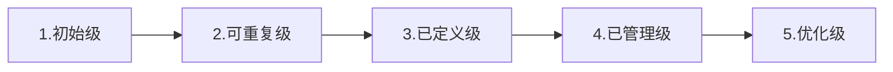

| 等级         | 关键特征                     | 企业状态                |
| ------------ | ---------------------------- | ----------------------- |
| **初始级**   | 过程无序，依赖个人英雄主义   | 小作坊模式              |
| **可重复级** | 可复用成功经验（如成本估算） | 有基本项目管理          |
| **已定义级** | 过程标准化（文档化流程）     | 中型企业主流            |
| **已管理级** | 量化控制（如缺陷率统计）     | 成熟企业                |
| **优化级**   | 持续改进过程                 | 行业标杆（如微软/谷歌） |

> 🔥 **考点**：
>
> - 国内企业多数处于2~3级
> - 最高级是**优化级（5级）**

## 本章知识图谱

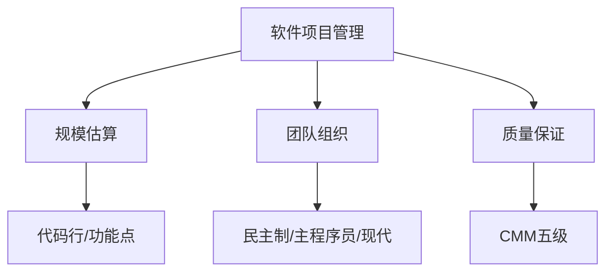

> 📌 **考点提示**：
> - 功能点技术适用于早期估算
> - 现代程序员组是最佳实践模式
> - CMM五级名称及特征（优化级为最高）

> 💡 **复习建议**：
> 1. 重点记忆CMM五个等级名称
> 2. 理解布鲁克斯定律的实际意义
> 3. 区分功能点与代码行估算的适用场景

- 早期规模估算首选：**功能点技术**
- 最佳团队模式：**现代程序员组**（技术+行政分离）
- 质量基础：**需求规格说明书**
- CMM最高级：**优化级（5级）**
- 人员增加的影响：**生产率不线性增长**（布鲁克斯定律）
