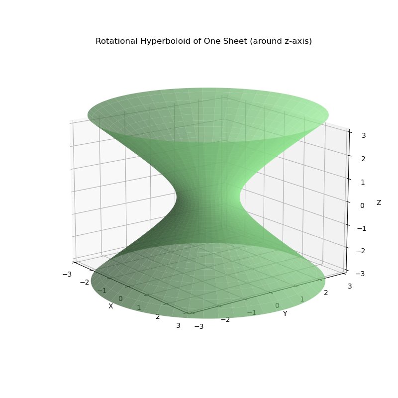
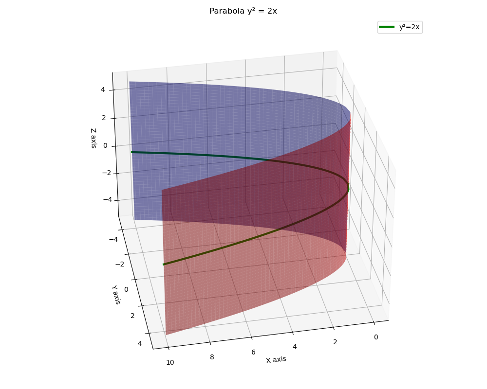

# 向量代数与空间解析几何

[...保持之前所有内容不变...]

## 空间曲线及其方程

### 空间曲线的一般方程
空间曲线可以表示为两个曲面的交线：
$$
\begin{cases}
F(x,y,z) = 0 \\
G(x,y,z) = 0 
\end{cases}
$$

### 空间曲线的参数方程
曲线可以用参数方程表示：
$$
\begin{cases}
x = x(t) \\
y = y(t) \\
z = z(t)
\end{cases}, \quad t \in [\alpha, \beta]
$$

### 空间曲线在坐标面上的投影
1. **投影柱面**：通过消去一个变量得到
   - 消去z得到关于x,y的方程，表示平行于z轴的柱面
   - 消去y得到关于x,z的方程，表示平行于y轴的柱面
   - 消去x得到关于y,z的方程，表示平行于x轴的柱面

2. **投影曲线**：投影柱面与坐标面的交线
   - xOy平面投影：$\begin{cases}H(x,y)=0 \\ z=0\end{cases}$
   - yOz平面投影：$\begin{cases}K(y,z)=0 \\ x=0\end{cases}$
   - zOx平面投影：$\begin{cases}L(z,x)=0 \\ y=0\end{cases}$

**解题步骤**：

1. 从曲线方程中消去一个变量得到投影柱面方程
2. 与对应坐标面方程联立得到投影曲线
3. 确定投影区域的范围

**例题**：求曲线$\begin{cases}z=x^2+y^2 \\ x+y+z=1\end{cases}$在xOy平面上的投影。

1. 从两个方程中消去z：
   $x^2+y^2=1-x-y$
2. 整理得投影柱面方程：
   $x^2+y^2+x+y-1=0$
3. 投影曲线为：
   $\begin{cases}x^2+y^2+x+y-1=0 \\ z=0\end{cases}$

### 平面的点法式方程

当平面 $\Pi$ 上一点 $M_0(x_0, y_0, z_0)$ 和它的一个法向量 $\vec{n}  = (A, B, C)$ 为已知时，可以确定平面方程：
$$
A(x - x_0) + B(y - y_0) + C(z - z_0) = 0
$$

### 平面的一般方程

由上面点法式方程可以化简得到如下一般式方程：
$$
Ax + By + Cz + D = 0
$$

### 两平面的夹角

设平面 $Pi_1$ 和 $Pi_2$ 的法向量依次为 $n_1 = (A_1, B_1, C_1)$ 和 $n_2 = (A_2, B_2, C_2)$，则 $Pi_1$ 和 $Pi_2$ 的夹角 $\theta$ 的余弦值可以表示为：
$$
\cos\theta = \frac{\vec{n_1} \cdot \vec{n_2}}{|\vec{n_1}| \cdot |\vec{n_2}|}
=\frac{|A_1A_2 + B_1B_2 + C_1C_2|}{\sqrt{A_1^2+B_1^2+C_1^2}\sqrt{A_2^2+B_2^2+C_2^2}}
$$

## 空间直线及其方程

### 空间直线的一般方程
$$
\begin{cases}
A_1x + B_1y + C_1z + D_1 = 0 \\
A_2x + B_2y + C_2z + D_2 = 0
\end{cases}
$$

### 空间直线的对称式方程与参数方程
1. 对称式方程（点向式）：
$$
\frac{x-x_0}{m} = \frac{y-y_0}{n} = \frac{z-z_0}{p}
$$
其中$(x_0,y_0,z_0)$为直线上一点，$\vec{s}=(m,n,p)$为方向向量

2. 参数方程：
$$
\begin{cases}
x = x_0 + mt \\
y = y_0 + nt \\
z = z_0 + pt
\end{cases}
$$

### 两直线的夹角
设两直线方向向量为$\vec{s_1}=(m_1,n_1,p_1)$, $\vec{s_2}=(m_2,n_2,p_2)$
$$
\cos\varphi = \frac{|\vec{s_1}\cdot\vec{s_2}|}{|\vec{s_1}||\vec{s_2}|} = \frac{|m_1m_2 + n_1n_2 + p_1p_2|}{\sqrt{m_1^2+n_1^2+p_1^2}\sqrt{m_2^2+n_2^2+p_2^2}}
$$

### 直线与平面的夹角
设直线方向向量$\vec{s}=(m,n,p)$，平面法向量$\vec{n}=(A,B,C)$
$$
\sin\theta = \frac{|\vec{s}\cdot\vec{n}|}{|\vec{s}||\vec{n}|} = \frac{|Am+Bn+Cp|}{\sqrt{A^2+B^2+C^2}\sqrt{m^2+n^2+p^2}}
$$

## 曲面及其方程

### 曲面研究的基本问题

球面的特征方程：
$$
\sqrt{(x - x_0)^2 + (y - y_0)^2 + (z - z_0)^2} = R \\
(x - x_0)^2 + (y - y_0)^2 + (z - z_0)^2 = R^2
$$
其中球心为：$M_0(x_0, y_0, z_0)$ 

球面的一般方程：
$$
Ax^2 + Ay^2 + Az^2 + Dx + Fy + Ez + G = 0
$$
这个方程的特点是缺 xy, yz, xz各项，而且平方项系数相同。

### 旋转曲面

设在 yOz 做表面上有一已知曲线 C ，他的方程为
$$
f(y, z) = 0
$$
将曲线绕 z 轴旋转一周，就得到一个以 z 轴为轴的旋转曲面，他的方程为：
$$
f(\pm \sqrt{x^2 + y^2}, z) = 0
$$
假设 zOx 坐标面上**双曲线**：
$$
\frac{x^2}{a^2} - \frac{z^2}{c^2} = 1
$$
绕 z 轴形成旋转单叶双曲面
$$
\frac{x^2 + y^2}{a^2} - \frac{z^2}{c^2} = 1
$$

绕 x 轴形成旋转双也双曲面
$$
\frac{x^2}{a^2} - \frac{y^2 + z^2}{c^2} = 1
$$

### 柱面

一般的，直线 L 沿定曲线 C 平行移动形成的轨迹叫做柱面，定曲线 C 叫做柱面的准线，动直线 L 叫做柱面的母线。

设柱面可以看作由平行于 z 轴的直线 沿 xOy 面上的 $x^2 + y^2 = R^2$ 移动面形成的。
$$
x^2 + y^2 = R^2
$$

其中他的母线平行于 z 轴，准线是 xOy 面上的圆 x^2 + y^2 = R^2

类似的方程 y^2 = 2x 表示母线平行于 z 轴的柱面，他的准线是 xOy 面上的抛物线 y^2 = 2x，该柱面叫做抛物柱面

### 二次曲面

二次曲面的一般式：
$$
F(x, y, z) = Ax^2 + By^2 + Cz^2 + Dxy + Eyz + Fxz + Gx + Hy + Iz + J = 0
$$
**椭圆锥面**
$$
\frac{x^2}{a^2} + \frac{y^2}{b^2} = z^2
$$
以垂直于 z 轴的平面 z = t 截此曲面，当 t = 0 时得一点 (0, 0, 0)；当 $t \neq 0$ 时，得平面 z = t 上的椭圆
$$
\frac{x^2}{(at)^2} + \frac{y^2}{(bt)^2} = 1
$$

**椭球面**
$$
\frac{x^2}{a^2} + \frac{y^2}{b^2} + \frac{z^2}{c^2} = 1
$$

## 空间曲线及其方程

### 空间曲线的一般方程

### 空间曲线的参数方程

### 空间曲线在坐标面上的投影

# 多元函数微分法及其应用

## 偏导数

### 偏导数的定义及其计算法

如果函数 $z = f(x, y)$ 在区域 D 内每一点 (x, y) 处对 x 的偏导数都存在，那么这个偏导数就是的x, y 的函数，他就称为函数 $z = f(x, y)$ 对自变量 x 的偏导函数，记作
$$
\frac{\partial z}{\partial x}, \frac{\partial f}{\partial x}, z_x \text{ 或 }f_x(x, y)
$$
由偏导数的概念可知，$f(x, y)$ 在点 $(x_0, y_0)$ 处对 x 的偏导数 $f_x(x_0, y_0)$ 显然就是偏导函数 $f_x(x, y)$ 在点 $(x_0, y_0)$ 处的函数值。

**例 4** 求 $r = \sqrt{x^2 + y^2 + z^2}$ 的偏导数

解：将 y 和 z 都看作常量，得
$$
\frac{\partial r}{\partial x} = \frac{2x}{2\sqrt{x^2 + y^2 + z^2}} = \frac{x}{r}
$$
当函数表达式中任意两个自变量对调后，仍表示原来的函数，即函数关于自变量的对称性，所以
$$
\frac{\partial r}{\partial y} = \frac{y}{r}, \frac{\partial r}{\partial z} = \frac{z}{r}
$$

### 高阶偏导数

设 z = f(x, y) 在区域 D 内具有偏导数，于是在 D 内 f_x(x, y)，f_y(x, y) 都是 x, y 的函数，如果这两个函数的偏导数也存在，那么称其为二阶偏导数，按照对变量求导次序的不同得出四个不同的二阶偏导数。

**定理** 如果函数 z = f(x, y) 的两个二阶混合偏导数 $\frac{\partial^2 z}{\partial y \partial x}$，$\frac{\partial^2 z}{\partial x\partial y}$ 在区域 D 内连续，那么在该区域内这两个二阶混合偏导数必然相等。

## 全微分

**定理 1 ** 如果函数 z = f(x, y) 在点 (x, y) 可微分，那么该函数在点 (x, y) 的偏导数必定存在，且函数 z = f(x, y) 在点 (x, y) 的全微分为
$$
dz = \frac{\partial z}{\partial x} \Delta x + \frac{\partial z}{\partial y} \Delta y
$$

## 多元复合函数的求导法则

**定理 2 **多元函数与多元函数复合的情形，如果函数 $u = \phi(x, y)$ 及 $v = \psi(x, y)$
$$
\frac{\partial z}{\partial x} = \frac{\partial z}{\partial u} \frac{\partial u}{\partial x} + \frac{\partial z}{\partial v} \frac{\partial v}{\partial x}
$$

## 多元函数微分学的几何应用

# 重积分

## 二重积分的概念与性质

### 曲顶柱体的体积

由而重积分的定义可知，曲顶柱体的体积是函数 f(x, y) 在底 D 上的二重积分
$$
V = \iint_D f(x, y) d\sigma
$$

### 平面薄片的质量

平面薄片的质量是它的面密度 \mu(x, y) 在薄片所占闭区间 D 上的二重积分
$$
m = \iint_D \mu(x, y) d\sigma
$$

### 二重积分的性质

$$
\iint_D[\alpha f(x, y) + \beta g(x, y)]d\sigma = \iint_D\alpha f(x, y)d\sigma + \iint_D\beta g(x, y)d\sigma
$$

如果闭区间 D 被有限条曲线分为有限个部分闭区域，那么在 D 上的二重积分等于在各部分闭区域上的而重积分的和
$$
\iint_D f(x, y)d\sigma = \iint_{D_1} f(x, y)d\sigma + \iint_{D_2} f(x, y)d\sigma
$$
如果在 D 上，$f(x, y) \le g(x, y)$，那么q
$$
\iint_D f(x, y)d\sigma \le \iint_D g(x, y)d\sigma
$$

## 二重积分的计算方法

### 利用直角坐标

### 利用极坐标

## 三重积分

### 三重积分的概念

如果 f(x, y, z) 表示某个物体在点 (x, y, z) 处的密度，$\Omega$ 是该物体所占有的空间闭区域，f(x, y, z) 在 \Omega 上连续，则
$$
m = \iiint_\Omega f(x, y, z)dV
$$

### 三重积分的计算

# 曲线积分与曲面积分

## 对弧长的曲线积分

### 概念与性质

当曲线线密度 $\mu(x, y)$ 在 L 上连续时，就等于 $\mu(x, y)$ 对弧长的曲线积分，即
$$
m = \int_L \mu(x, y) ds
$$
如果 L 可以分成两段光滑曲线弧 L_1 和 L_2，即为 L = L_1 + L_2
$$
\int_{L_1 + L_2}f(x, y) ds = \int_{L_1}f(x, y)ds + \int_{L_2}f(x, y)ds
$$
如果 L 是闭曲线那么函数 f(x, y) 在闭曲线 L 上对弧长的曲线积分记为 $\oint_L f(x, y) ds$

### 对弧长的曲线积分计算方法

## 对坐标的曲线积分

### 概念与性质

变力沿曲线所作的功，设一个质点在 xOy 面内受到力
$$
\textbf{F}(x, y) = P(x, y)\textbf{i} + Q(x, y)\textbf{j}
$$
那么变力 \textbf{F} 所作的功可以表达成
$$
W = \int_L P(x, y)dx + Q(x, y)dy \\
W = \int_L \textbf{F}(x, y) \cdot d\textbf{r}
$$

## 格林公式及其应用

### 格林公式

设 D 是由分段光滑的简单闭曲线 L 所围成的平面区域，函数 P(x, y) 和 Q(x, y) 在 D 上具有一阶连续的偏导数，则有
$$
\oint_L P(x, y)dx + Q(x, y)dy = \iint_D \left (\frac{\partial Q}{\partial x} - \frac{\partial P}{\partial y} \right )dA
$$
因此，格林公式将一个沿封闭曲线的线积分转换为一个在该曲线所围区域上的二重积分。

计算曲线积分 $\int_L (x^3 - xy^2)dx + (y^3 - x^2y)dy$，其中 L 是曲线 $y = 1 - x^2$ 从 A(0, 1) 到 B(1, 0) 的一段弧。

## 对面积的曲面积分

## 对坐标的曲面积分

## 高斯公式

## 斯托克斯公式

# 无穷级数

## 常数项级数的概念和性质

### 常数项级数的概念

作常数项级数的前 n 项和
$$
s_n = u_1 + u_2 + ... + u_n = \sum_{i = 1}^n u_i
$$
s_n 称为级数部分和，当 n 依次取 1, 2, 3, ... 时，它们构成一个新的数列，根据这个数列有没有极限，引进无穷级数的收敛与发散概念

**定义 如果级数 $\sum_{i=1}^\infty u_i$ 的部分和数列 $\{s_n\}$ 有极限 s, 那么称无穷级数收敛，这时极限 s 叫做这级数的和。**
$$
\lim_{n \rarr \infty} s_n = s \\
s = u_1 + u_2 + ... + u_i + ...;
$$
**如通过没有极限，那么称无穷级数发散**，（级数就是无穷项求和）。而这上面的常数级数，就是通项 u_n 不依赖于变量（如 x）的无穷级数，即每一项均为常数。

### 收敛级数的基本性质

如果级数 $\sum_{n=1}^\infty u_n$ 收敛与 $s$，那么级数 $\sum_{n=1}^\infty ku_n$ 也收敛于 $ks$。

如果级数 $\sum_{n=1}^\infty u_n$ 与 $\sum_{n=1}^\infty v_n$ 分别收敛于 $s$ 与 $\sigma$，那么级数 $\sum_{n=1}^\infty(u_n \pm v_n)$ 也收敛于 $s \pm \sigma$。

在级数中去掉、加上或改变有限项，不会改变级数的收敛性。

如果级数收敛，那么对这级数的项任意家括号后所成的级数仍收敛，且其和不变。

## 常数项级数的审敛法

### 正项级数的敛散性常用方法

一般的常数项级数，各项可以是正数、负数或零，如果各项都是正数或者零的级数，这种级数称为**正项级数**。

正项级数 $\sum_{n=1}^\infty u_n$ 收敛的充分必要条件是：它的部分和数列 {s_n} 有界。

**比较审敛法** 设 $\sum_{n=1}^\infty u_n$ 和 $\sum_{n=1}^\infty v_n$ 都是正项级数

1. 如果 $\lim_{n \rarr \infty} \frac{u_n}{v_n} = l, (0 \le l < +\infty)$，且 $\sum_{n=1}^\infty v_n$ 收敛，那么 $\sum_{n=1}^\infty u_n$ 收敛。

2. 如果 $\lim_{n \rarr \infty} \frac{u_n}{v_n} = l >0$ 或 $\lim_{n \rarr \infty} \frac{u_n}{v_n} = l = +\infty$ 且级数 $\sum_{n=1}^\infty v_n$ 发散，那么 $\sum_{n=1}^\infty u_n$ 也发散

**比值审敛法**

设 $\sum_{n=1}^\infty u_n$ 是正项级数，如果：
$$
\lim_{n \rarr \infty}\frac{u_{n+1}}{u_n} = \rho
$$
那么当 $\rho < 1$ 时级数收敛， $\rho > 1$ 或 $\rho = \infty$ 时级数发散，\rho = 1 时级数可能收敛也可能发散。

**根值审敛法**

设 $\sum_{n=1}^\infty u_n$ 是正项级数，如果
$$
\lim_{n \to \infty} \sqrt[n]{u_n} = \rho
$$
如果 $\rho < 1$ 那么级数 $\sum_{n=1}^\infty u_n$ 收敛。反之，如果 $\rho > 1$，则级数 $\sum_{n=1}^\infty u_n$ 发散。

常见经典结论

例 判别正项级数的敛散性：（1）$\sum_{n=1}^\infty \frac{2n+1}{2^n}$；（2）$\sum_{n=1}^\infty\frac{n^3}{n!}$

## 幂级数

## 函数展开成幂级数

## 函数的幂级数展开式的应用

## 傅立叶级数

## 一般周期函数的傅立叶级数

### 周期为 2l 的周期函数的傅立叶级数

设这个周期函数 f(x) 满足收敛定理的条件，则它的傅立叶级数展开式为
$$
f(x) = \frac{a_0}{2} + \sum_{n=1}^\infty\left(a_n\cos\frac{n\pi x}{l} + b_n\sin\frac{n\pi x}{l}\right)\ (x \in C)
$$

### 傅立叶级数的复数形式

