# 向量代数与空间解析几何

## 向量及其线性运算

### 向量的线性运算

加法、减法与数乘

向量的模（即向量的长度）

### 向量的模、方向角和投影

设向量 $\vec a$ 与坐标轴 x, y, z 分别成角 $\alpha, \beta, \gamma$
$$
\cos\alpha = \frac{a_x}{|\vec a|} \\
其中 |\vec a| = \sqrt{a_x^2 + a_y^2 + a_z^2}
$$
方向余弦满足
$$
\cos^2\alpha+\cos^2\beta+\cos^2\gamma = 1
$$

**投影** 设向量 $\vec a$ 在单位向量 $\vec e$ 方向上的投影是
$$
\mathrm{proj}_\vec e\vec a = (\vec a \cdot \vec e)
$$
\vec a 在 \vec b 方向的投影为
$$
\text{proj}_\vec b\vec a = \frac{\vec a \cdot \vec b}{|\vec b|}
$$
**例题** 设向量 \vec a = (1, 1, 4), \vec b = (1, -2, 2) ，则向量 \vec b 在 \vec a 上的投影

## 空间向量的基本运算

### 三种基本运算

**1. 数量积（点积）**

设向量 $\vec{a} = (a_x, a_y, a_z)$，$\vec{b} = (b_x, b_y, b_z)$，其数量积定义为：

$$
\vec{a} \cdot \vec{b} = a_x b_x + a_y b_y + a_z b_z  
$$

**几何意义**：
$$
\vec{a} \cdot \vec{b} = |\vec{a}| |\vec{b}| \cos\theta
$$

其中 `\theta` 为两向量夹角。
**性质**：

- 交换律： $\vec{a} \cdot \vec{b} = \vec{b} \cdot \vec{a}$
- 正交判定： $\vec{a} \cdot \vec{b} = 0 \Leftrightarrow \vec{a} \perp \vec{b}$

**2. 向量积（叉积）**

向量积定义为：

$$
\vec{a} \times \vec{b} = \begin{vmatrix}
\vec{i} & \vec{j} & \vec{k} \\
a_x & a_y & a_z \\
b_x & b_y & b_z
\end{vmatrix} = (a_yb_z - a_zb_y)\vec{i} - (a_xb_z - a_zb_x)\vec{j} + (a_xb_y - a_yb_x)\vec{k}
$$

**几何意义**：
$$
|\vec{a} \times \vec{b}| = |\vec{a}| |\vec{b}| \sin\theta
$$

所得向量垂直于 $\vec{a}$ 与 $\vec{b}$ 所在平面，方向由右手定则确定。
**性质**：

- $\vec{a} \times \vec{b} = -\vec{b} \times \vec{a}$
- $\vec{a} \times \vec{a} = \vec{0}$

**3. 混合积（标量三重积）**

混合积定义为：

$$
[\vec{a}\ \vec{b}\ \vec{c}] = \vec{a} \cdot (\vec{b} \times \vec{c}) = \begin{vmatrix}
a_x & a_y & a_z \\
b_x & b_y & b_z \\
c_x & c_y & c_z
\end{vmatrix}
$$

**几何意义**：
混合积的绝对值表示以 $\vec{a},\vec{b},\vec{c}$ 为棱的**平行六面体体积**：
$$
V = [\vec{a}\ \vec{b}\ \vec{c}]
$$

**性质**：

- 轮换对称性： $[\vec{a}\ \vec{b}\ \vec{c}] = [\vec{b}\ \vec{c}\ \vec{a}] = [\vec{c}\ \vec{a}\ \vec{b}]$
- 共面判定： $[\vec{a}\ \vec{b}\ \vec{c}] = 0 \Leftrightarrow$ 三向量共面

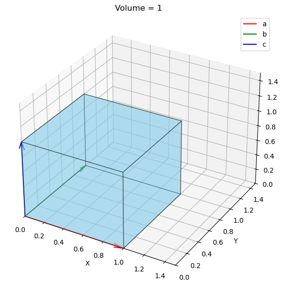

### 运算关系总结

| 运算类型       | 符号     | 结果类型 | 主要应用场景       |
| -------------- | -------- | -------- | ------------------ |
| 数量积（点积） | $\cdot$  | 标量     | 计算夹角、投影     |
| 向量积（叉积） | $\times$ | 向量     | 求法向量、计算面积 |
| 混合积         | $[\ ]$   | 标量     | 计算体积、判定共面 |

**经典公式**：
 拉格朗日恒等式：
$$
(\vec{a} \times \vec{b}) \cdot (\vec{c} \times \vec{d}) = (\vec{a} \cdot \vec{c})(\vec{b} \cdot \vec{d}) - (\vec{a} \cdot \vec{d})(\vec{b} \cdot \vec{c})
$$

**例题** 若 $\vec a, \vec b, \vec c$ 满足 $|\vec a| = 6, |\vec b| = 3, (\widehat{\vec a, \vec b}) = \frac{\pi}{6}, \vec c \perp \vec a,\vec c \perp \vec b, |\vec c| = 3$

求 1. $|\vec a \times \vec b|$ 2. $$ 混合积
$$
|\vec a \times \vec b|
= |\vec a|\cdot|\vec b| \sin\theta
= 9
$$

$$
[\vec a, \vec b, \vec c]
= \vec a \cdot (\vec b \times \vec c)
= \vec c \cdot (\vec a \times \vec b)
$$

由于 $\vec c \perp \vec a, \vec c \perp \vec b$，所以 \vec c 垂直于另外两个向量所在平面，即 $\vec c$ 与 $\vec a \times \vec b$ 共线
$$
[\vec a, \vec b, \vec c]
= |\vec a \times \vec b| \cdot |\vec c| \cdot \cos\theta
= 9 \cdot 3 \cdot 1
= 27
$$

## 平面及其方程

### 平面的点法式方程

当平面 $\Pi$ 上一点 $M_0(x_0, y_0, z_0)$ 和它的一个法向量 $\vec{n}  = (A, B, C)$ 为已知时，可以确定平面方程：
$$
A(x - x_0) + B(y - y_0) + C(z - z_0) = 0
$$

### 平面的一般方程

由上面点法式方程可以化简得到如下一般式方程：
$$
Ax + By + Cz + D = 0
$$

### 两平面的夹角

设平面 $Pi_1$ 和 $Pi_2$ 的法向量依次为 $n_1 = (A_1, B_1, C_1)$ 和 $n_2 = (A_2, B_2, C_2)$，则 $Pi_1$ 和 $Pi_2$ 的夹角 $\theta$ 的余弦值可以表示为：
$$
\cos\theta = \frac{\vec{n_1} \cdot \vec{n_2}}{|\vec{n_1}| \cdot |\vec{n_2}|}
=\frac{|A_1A_2 + B_1B_2 + C_1C_2|}{\sqrt{A_1^2+B_1^2+C_1^2}\sqrt{A_2^2+B_2^2+C_2^2}}
$$

## 空间直线及其方程

### 空间直线的一般方程

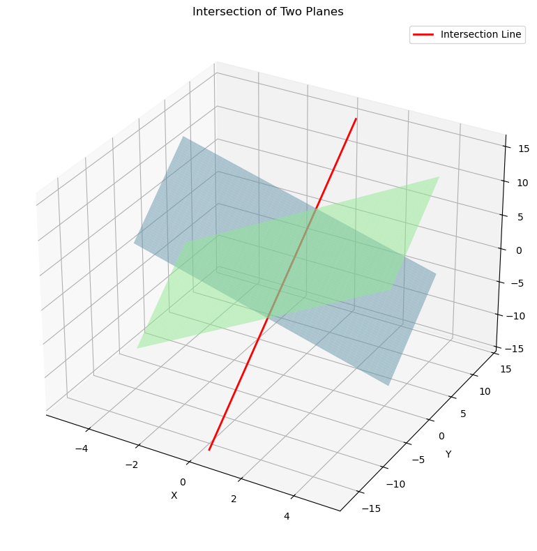
$$
\begin{cases}
A_1x + B_1y + C_1z + D_1 = 0 \\
A_2x + B_2y + C_2z + D_2 = 0
\end{cases}
$$

### 空间直线的对称式方程与参数方程
1. 对称式方程（点向式）：
$$
\frac{x-x_0}{m} = \frac{y-y_0}{n} = \frac{z-z_0}{p}
$$
其中$(x_0,y_0,z_0)$为直线上一点，$\vec{s}=(m,n,p)$为方向向量

2. 参数方程：几何意义与上式相同，做基本变换后得到
$$
\begin{cases}
x = x_0 + mt \\
y = y_0 + nt \\
z = z_0 + pt
\end{cases}
$$

3. 两点方程：$M_1(x_1, y_1, z_1),\ M_2(x_2, y_2, z_2)$
   $$
   \frac{x - x_1}{x_2 - x_1} = \frac{y - y_1}{y_2 - y_1} = \frac{x - x_1}{x_2 - x_1}
   $$
   

**例题** 直线 l 与直线 $l_1: \frac{x+3}{2} = \frac{y-5}{1} = \frac{z}{1}$ 和 $l_2: \frac{x-3}{1} = \frac{y+1}{4} = \frac{z}{1}$ 都相交，且与直线 $l_3: \frac{x+2}{3} = \frac{y-1}{2} = \frac{z-3}{1}$ 平行，求 l 的方程。

**分析** 由 $l \parallel l_3$，并由 l_3 的方向向量可知，l 的方向向量 $\vec s = \{3, 2, 1\}$

设 l 与 l_1 和 l_2 的交点为 P_1, P_2，根据对称式方程转换成参数方程后得到：
$$
l_1 : \begin{cases}
x = -3 + xt \\
y = 5 + t \\
z = t
\end{cases}
,\  
l_2 : \begin{cases}
x = 3 + t \\
y = -1 + 4t \\
z = t
\end{cases}
$$
由于 $\vec {{P_1}{P_2}} \parallel \vec s$ 得到
$$
\frac{(3 + t_2) - (-3 + 2t_1)}{3}
= \frac{(-1 + 4t_2) - (5 + t_1)}{2}
= \frac{t_2 - t_1}{1}
$$

### 两直线的夹角

设两直线方向向量为$\vec{s_1}=(m_1,n_1,p_1)$, $\vec{s_2}=(m_2,n_2,p_2)$
$$
\cos\varphi = \frac{|\vec{s_1}\cdot\vec{s_2}|}{|\vec{s_1}||\vec{s_2}|} = \frac{|m_1m_2 + n_1n_2 + p_1p_2|}{\sqrt{m_1^2+n_1^2+p_1^2}\sqrt{m_2^2+n_2^2+p_2^2}}
$$

### 直线与平面的夹角
设直线方向向量$\vec{s}=(m,n,p)$，平面法向量$\vec{n}=(A,B,C)$
$$
\sin\theta = \frac{|\vec{s}\cdot\vec{n}|}{|\vec{s}||\vec{n}|} = \frac{|Am+Bn+Cp|}{\sqrt{A^2+B^2+C^2}\sqrt{m^2+n^2+p^2}}
$$

## 曲面及其方程

### 曲面研究的基本问题

球面的特征方程：
$$
\sqrt{(x - x_0)^2 + (y - y_0)^2 + (z - z_0)^2} = R \\
(x - x_0)^2 + (y - y_0)^2 + (z - z_0)^2 = R^2
$$
其中球心为：$M_0(x_0, y_0, z_0)$ 

球面的一般方程：
$$
Ax^2 + Ay^2 + Az^2 + Dx + Fy + Ez + G = 0
$$
这个方程的特点是缺 xy, yz, xz各项，而且平方项系数相同。

### 旋转曲面

设在 yOz 做表面上有一已知曲线 C ，他的方程为
$$
f(y, z) = 0
$$
将曲线绕 z 轴旋转一周，就得到一个以 z 轴为轴的旋转曲面，他的方程为：
$$
f(\pm \sqrt{x^2 + y^2}, z) = 0
$$
假设 zOx 坐标面上**双曲线**：
$$
\frac{x^2}{a^2} - \frac{z^2}{c^2} = 1
$$
绕 z 轴形成旋转单叶双曲面
$$
\frac{x^2 + y^2}{a^2} - \frac{z^2}{c^2} = 1
$$
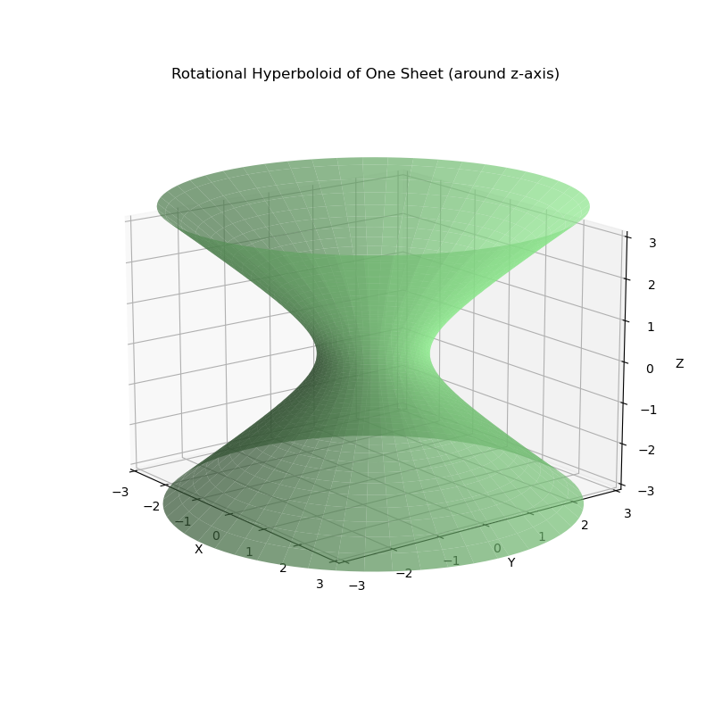

绕 x 轴形成旋转双也双曲面
$$
\frac{x^2}{a^2} - \frac{y^2 + z^2}{c^2} = 1
$$
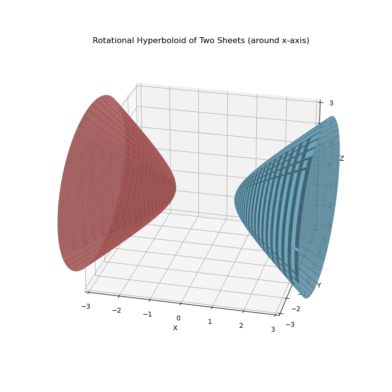

### 柱面

一般的，直线 L 沿定曲线 C 平行移动形成的轨迹叫做柱面，定曲线 C 叫做柱面的准线，动直线 L 叫做柱面的母线。

设柱面可以看作由平行于 z 轴的直线 沿 xOy 面上的 $x^2 + y^2 = R^2$ 移动面形成的。
$$
x^2 + y^2 = R^2
$$

其中他的母线平行于 z 轴，准线是 xOy 面上的圆 $x^2 + y^2 = R^2$

类似的方程 $y^2 = 2x$ 表示母线平行于 z 轴的柱面，他的准线是 xOy 面上的抛物线 $y^2 = 2x$，该柱面叫做抛物柱面

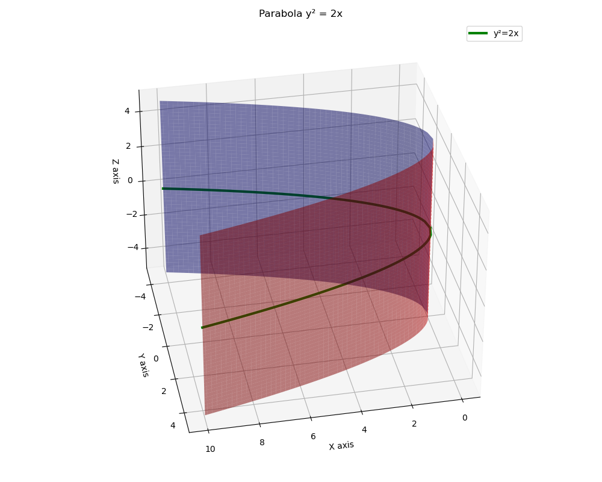

### 二次曲面

二次曲面的一般式：

$$
F(x, y, z) = Ax^2 + By^2 + Cz^2 + Dxy + Eyz + Fxz + Gx + Hy + Iz + J = 0
$$

**椭球面**
$$
\frac{x^2}{a^2} + \frac{y^2}{b^2} + \frac{z^2}{c^2} = 1
$$

以垂直于 z 轴的平面 z = t 截此曲面，当 t = 0 时得一点 (0, 0, 0)；当 $t \neq 0$ 时，得平面 z = t 上的椭圆
$$
\frac{x^2}{(at)^2} + \frac{y^2}{(bt)^2} = 1
$$

**椭圆抛物面**
$$
\frac{x^2}{a^2} + \frac{y^2}{b^2} - z = 0
$$
椭圆抛物面的特殊情况，当 a = b 时，出现
$$
x^2 + y^2 = z
$$
称为旋转抛物面，这个曲面的每一个水平截面都是圆

**椭圆锥面**
$$
\frac{x^2}{a^2} + \frac{y^2}{b^2} = z^2
$$
**双曲抛物面**
$$
\frac{x^2}{a^2} - \frac{y^2}{b^2} - z =0
$$
**单叶双曲面**
$$
\frac{x^2}{a^2} + \frac{y^2}{b^2} - \frac{z^2}{c^2} = 1
$$
**双叶双曲面**
$$
\frac{x^2}{a^2} + \frac{y^2}{b^2} - \frac{z^2}{c^2} = -1
$$

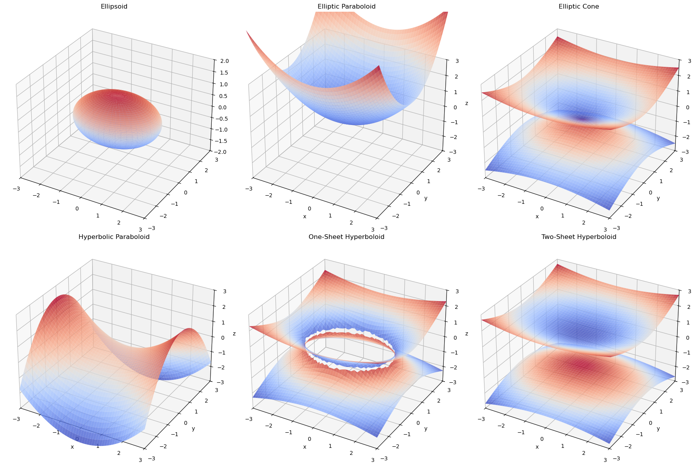

**例题** 方程 $y^2 + z^2 - 4x + 8 = 0$ 表示什么图像

化简得到以下方程，可得为一个椭圆抛物面。
$$
y^2 + z^2 = 4(x - 2)
$$

## 空间曲线及其方程

**空间曲线的一般方程**

空间曲线可以看作空间两个曲面的交线，设F(x), G(x) 为两个曲面方程，那么空间曲线 C 的一般方程组为
$$
\begin{cases} 
F(x, y, z) = 0 \\
G(x, y, z) = 0
\end{cases}
$$
**空间曲线的参数方程**

也可以用一个参数 t 来表示 x, y, z 三个坐标，形式如下
$$
\begin{cases}
x = x(t) \\
y = y(t) \\
z = z(t)
\end{cases}
,\ t \in I
$$
**空间曲线在坐标面上的投影**

将空间曲线在三维空间中的轨迹映射到某一坐标平面上，设曲线参数方程为：
$$
\begin{cases}
x = \cos t \\
y = \sin t \\
z = t
\end{cases}
$$
在 xOy 平面上的投影，忽略 z 轴，可见是一个单位圆。

# 多元函数微分法及其应用

## 多元函数的基本概念

### 多元函数的极限

二元极限的计算方法

1. 非零因子趋向带入
2. 利用恒等变形
3. 整体代换 + 洛必达法则

**例题** 二元函数的极限（二重极限）的计算

求 1. $\lim_{\substack{x \to 0\\ y \to 1}} \frac{1 - xy}{x^2 + y^2}$ 2. $\lim_{\substack{x \to 1\\y \to 0}}\frac{\sin(x + e^y)}{\sqrt{x^2 + y^2}}$

两者直接带入得：
$$
\frac{1 - 0 \cdot 1}{0^2 + 1^2} = \frac{1}{1} = 1
$$

$$
\frac{\sin(1 + e^0)}{\sqrt{1^2 + 0^2}} = \frac{\sin(1 + 1)}{1} = \sin(2)
$$

求 $\lim_{\substack{x \to 0 \\ y \to 0}} \frac{2 - \sqrt{xy + 4}}{xy}$

分子与分母趋向于 0 ，首先将其有理化，然后约分。
$$
\begin{align*}
\lim_{\substack{x \to 0 \\ y \to 0}} \frac{2 - \sqrt{xy + 4}}{xy} 
&= \lim_{\substack{x \to 0 \\ y \to 0}} \frac{2 - \sqrt{xy + 4}}{xy} \cdot \frac{2 + \sqrt{xy + 4}}{2 + \sqrt{xy + 4}} \\
&= \lim_{\substack{x \to 0 \\ y \to 0}} \frac{4 - (xy + 4)}{xy(2 + \sqrt{xy + 4})} \\
&= \lim_{\substack{x \to 0 \\ y \to 0}} \frac{-1}{2 + \sqrt{xy + 4}} = \frac{-1}{4}
\end{align*}
$$
或者整体带入，令 xy = t 后利用洛必达法则
$$
\begin{align*}
\lim_{\substack{x \to 0 \\ y \to 0}} \frac{2 - \sqrt{xy + 4}}{xy}
&= \lim_{t \to 0} \frac{2 - \sqrt{t + 4}}{t} \\
&= \lim_{t \to 0} \frac{d}{dt} \left[2 - \sqrt{t + 4} \right] \Big/ \frac{d}{dt}[t] \\
&= \lim_{t \to 0} \frac{-1}{2\sqrt{t + 4}} = \frac{-1}{2 \cdot 2} = -\frac{1}{4}
\end{align*}
$$

**例题** 计算 $\lim_{(x, y) \to (0, 0)}\frac{xy}{\sqrt{2 - e^{xy}} - 1}$

令 t = xy ，转换为一元极限，此时 $t \to 0$
$$
\begin{align}
\lim_{t \to 0}\frac{t}{\sqrt{2 - e^t} - 1}
\end{align}
$$
随后利用泰勒展开式
$$
e^t = 1 + t + \frac{t^2}{2} + \frac{t^3}{6} + ...
$$
得到
$$
2 - e^t = 1 - t - \frac{t^2}{2} - ...
$$
令 $s = -t - \frac{t^2}{2} - ...$ 利用二项式展开（平方根的泰勒展开）
$$
\begin{align}
\sqrt{1 + s} 
&= 1 + \frac{s}{2} - \frac{s^2}{8} + ... \\
&= 1 + \frac{-t - \frac{t^2}{2}}{2} - \frac{(-t)^2}{8} +... \\
&= 1 - \frac{t}{2} - \frac{t^2}{4} - \frac{t^2}{8} + ...
\end{align}
$$

## 偏导数

### 偏导数的定义及其计算法

如果函数 $z = f(x, y)$ 在区域 D 内每一点 (x, y) 处对 x 的偏导数都存在，那么这个偏导数就是的x, y 的函数，他就称为函数 $z = f(x, y)$ 对自变量 x 的偏导函数，记作
$$
\frac{\partial z}{\partial x}, \frac{\partial f}{\partial x}, z_x \text{ 或 }f_x(x, y)
$$
由偏导数的概念可知，$f(x, y)$ 在点 $(x_0, y_0)$ 处对 x 的偏导数 $f_x(x_0, y_0)$ 显然就是偏导函数 $f_x(x, y)$ 在点 $(x_0, y_0)$ 处的函数值。

**例 4** 求 $r = \sqrt{x^2 + y^2 + z^2}$ 的偏导数

解：将 y 和 z 都看作常量，得
$$
\frac{\partial r}{\partial x} = \frac{2x}{2\sqrt{x^2 + y^2 + z^2}} = \frac{x}{r}
$$
当函数表达式中任意两个自变量对调后，仍表示原来的函数，即函数关于自变量的对称性，所以
$$
\frac{\partial r}{\partial y} = \frac{y}{r}, \frac{\partial r}{\partial z} = \frac{z}{r}
$$

### 高阶偏导数

设 $z = f(x, y)$ 在区域 D 内具有偏导数，于是在 D 内 $f_x(x, y)，f_y(x, y)$ 都是 x, y 的函数，如果这两个函数的偏导数也存在，那么称其为二阶偏导数，按照对变量求导次序的不同得出四个不同的二阶偏导数。

**定理** 如果函数 z = f(x, y) 的两个二阶混合偏导数 $\frac{\partial^2 z}{\partial y \partial x}$，$\frac{\partial^2 z}{\partial x\partial y}$ 在区域 D 内连续，那么在该区域内这两个二阶混合偏导数必然相等。

## 全微分

**定理 1 ** 如果函数 $z = f(x, y)$ 在点 $(x, y)$ 可微分，那么该函数在点 $(x, y)$ 的偏导数必定存在，且函数 $z = f(x, y)$ 在点 $(x, y)$ 的全微分为
$$
dz = \frac{\partial z}{\partial x} \Delta x + \frac{\partial z}{\partial y} \Delta y
$$

## 多元复合函数的求导法则

**定理 2 **多元函数与多元函数复合的情形，如果函数 $u = \phi(x, y)$ 及 $v = \psi(x, y)$
$$
\frac{\partial z}{\partial x} = \frac{\partial z}{\partial u} \frac{\partial u}{\partial x} + \frac{\partial z}{\partial v} \frac{\partial v}{\partial x}
$$

## 多元函数的极值及其求法

### 极值及最大值与最小值

**定理（必要条件）** 设函数 $z = f(x, y)$ 在点 $(x_0, y_0)$ 具有偏导数，且在点 $(x_0, y_0)$ 处有极值，那么则有
$$
f_x(x, y) = 0,\ f_y(x, y) = 0
$$
仿照一元函数，凡是能使 $f_x(x, y) = 0, f_y(x, y) = 0$ 同时成立的点 (x_0, y_0) 称为**驻点**。所以可知具有偏导数的函数的极值点必定是驻点，但函数的驻点不一定是极值点。

**定理（充分条件）**设函数 $z = f(x, y)$ 在点 $(x_0, y_0)$ 的某邻域内连续且具有一阶及二阶连续偏导数，又 $f_x(x_0,y_0) = 0, f_y(x_0, y_0)$ 令
$$
f_{xx}(x_0, y_0) = A, f_{xy}(x_0, y_0) = B, f_{yy}(x_0, y_0) = C
$$
则是否取得极值的条件如下

1. $AC - B^2 > 0$ 时具有极值，$A < 0$ 时具有极大值，$A > 0$ 时具有极小值
2. $AC - B^2 < 0$ 时没有极值
3. $AC - B^2 = 0$ 时另外讨论

可微函数 f(x, y) 的极值点必是 f(x, y) 的驻点。

### 条件极值与拉格朗日数乘法

拉格朗日乘数法（Lagrange Multiplier Method）是求解多元函数在约束条件下的极值问题的有效方法。其核心思想是将约束条件引入目标函数，通过引入拉格朗日乘数构造一个新的函数（拉格朗日函数），然后对该函数求极值。

适用场景：

- 目标函数：f(x, y, z) 需要最大化或最小化的函数
- 约束条件：g(x, y, z) = 0 可能是一个或多个约束

拉格朗日函数：
$$
\mathcal L(x, y, z, \lambda) = f(x, y, z) - \lambda \cdot g(x, y, z)
$$

其中 $\lambda$ 就是拉格朗日乘数，对参数和乘数求偏导得到极值
$$
\begin{cases}
\frac{\partial{\mathcal{L}}}{\partial{x}}=0 \\
\frac{\partial{\mathcal{L}}}{\partial{y}}=0 \\
\frac{\partial{\mathcal{L}}}{\partial{z}}=0 \\
\frac{\partial{\mathcal{L}}}{\partial{\lambda}}=0 \\
\end{cases}
$$
求解步骤：

1. 构造拉格朗日函数
2. 对拉格朗日函数关于所有变量包括乘数求偏导，并令其为 0
3. 解方程组，得到可能的极值点
4. 验证

如果约束条件不止一个，则稍微变形
$$
\mathcal{L}(x, y, z, \lambda, \mu)
= f(x, y, z) - \lambda g_1(x, y, z) - \mu g_2(x, y, z)
$$
然后求偏导

**例题** 已知曲线 $C: \begin{cases} x^2 + y^2 - 2z^2 = 0 \\ x+ y + 3z = 5 \end{cases}$​，求曲线C距离平面 xOy 的最近点与最远点。

目标是最大化或最小化 |z|，其约束为：
$$
x^2 + y^2 - 2z^2 = 0, x + y + 3z = 5
$$
设拉格朗日函数：
$$
\mathcal L = z^2 - \lambda(x^2 + y^2 - 2z^2) - \mu(x + y + 3z - 5)
$$
对 $x, y, z$ 求偏导
$$
\frac{\partial\mathcal{L}}{\partial{x}} = -2 \lambda x - \mu = 0 \\
\frac{\partial\mathcal{L}}{\partial{y}} = -2 \lambda y - \mu = 0 \\
\frac{\partial\mathcal{L}}{\partial{z}} = 2z + 4\lambda z - 3\mu = 0
$$
得到点 $(1, 1, 1,), (-5, -5, 5)$

## 二元函数的泰勒公式

一元函数的泰勒公式：设函数 f(x) 在点 a 的某邻域内具有 n 阶导数，则对该邻域内任一 x 有 n 阶泰勒公式
$$
f(x) = f(a) + f'(a)(x - a) + \frac{f''(a)}{2!}(x-a)^2 + ... + \frac{f^{(n)}(a)}{n!}(x-a)^n + R_n(x)
$$
其中 $R_n(x)$ 是余项，一般有几种形式，比如拉格朗日余项：
$$
R_n(x) = \frac{f^{(n+1)}(\xi)}{(n+1)!}(x-a)^{n+1}
$$
其中 $\xi$ 介于 x 和 a 之间。

# 重积分

## 二重积分的概念与性质

### 曲顶柱体的体积

由而重积分的定义可知，曲顶柱体的体积是函数 $f(x, y)$ 在底 D 上的二重积分
$$
V = \iint_D f(x, y) d\sigma
$$

### 平面薄片的质量

平面薄片的质量是它的面密度 $\mu(x, y)$ 在薄片所占闭区间 D 上的二重积分
$$
m = \iint_D \mu(x, y) d\sigma
$$

### 二重积分的性质

$$
\iint_D[\alpha f(x, y) + \beta g(x, y)]d\sigma = \iint_D\alpha f(x, y)d\sigma + \iint_D\beta g(x, y)d\sigma
$$

如果闭区间 D 被有限条曲线分为有限个部分闭区域，那么在 D 上的二重积分等于在各部分闭区域上的而重积分的和
$$
\iint_D f(x, y)d\sigma = \iint_{D_1} f(x, y)d\sigma + \iint_{D_2} f(x, y)d\sigma
$$
如果在 D 上，$f(x, y) \le g(x, y)$，那么q
$$
\iint_D f(x, y)d\sigma \le \iint_D g(x, y)d\sigma
$$

**例题** 交换累次积分的顺序
$$
\int_0^1dx\int_{-\sqrt{x}}^\sqrt{x}f(x,y)dy + \int_1^4dx\int_{x-2}^{\sqrt(x)}f(x,y)dy
$$
原式对 x 先积分再对 y 积分，更改顺序，首先理解积分区域，两个积分相加，整体积分区域是两个部分区域的并集
$$
D_1 = \{(x,y) \mid 0 \le x \le 1,\, -\sqrt{x} \le y \le \sqrt{x} \} \\
D_2 = \{(x,y) \mid 1 \le x \le 4,\, x-2 \le y \le \sqrt{x} \}
$$

## 二重积分的计算方法

### 利用直角坐标

**例题** 非圆周区域上的二重积分的计算

求 $\iint_D xy dxdy$ ，其中 D 由直线 $x = 2, y = 1, y = x$ 所围成。

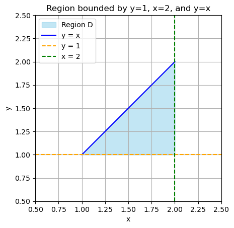

**分析** 首先需要分析出区域 D 的分类，分为 x 型区域与 y 型区域，当所积区域便于使用 x = t 也就是垂直与 x 轴的线所截时最多有两个交点，就是 x 型区域，因为这样便于**对 y 进行积分以获取区域面积**。

随后根据被积区域对二重积分进行二次积分法，即
$$
\iint_D xy dx dy = \int^2_{x = 1} \int^x_{y = 1} xy dy dx
$$
然后计算积分，先对内层 y 积分：
$$
\int_{y=1}^{x} xy \, dy 
= x \int_{y=1}^{x} y \, dy 
= x \left[ \frac{y^2}{2} \right]_{1}^{x} 
= x \left( \frac{x^2 - 1}{2} \right) 
= \frac{x(x^2 - 1)}{2}
$$
再求外层积分：
$$
\int_{x=1}^{2} \frac{x(x^2 - 1)}{2} \, dx 
= \frac{1}{2} \int_{1}^{2} (x^3 - x) \, dx
$$
最后可以将被积函数拆开分别计算后相减，得到最终结果
$$
\iint_D xy dxd
= \frac{9}{8}
$$

**例题** 求 $\iint_D \frac{\sin y}{y}dxdy$ ，其中 D 由区分 $x = y^2, y=x$ 所围成。

**分析** 当用 $D_x$ 无法算出二重积分时，则交换积分次序选 $D_y$ 区域，无法算出的积分：$\int\frac{\sin y}{y}dy$、$\int\frac{\cos y}{y}dy$、$\int e^{-y^2}dy$、$\int e^{y^2}dy$

首先画出区域 D 的草图，并将 D 表示出来 $D_x = \left\{ (x, y) \,\middle|\, 0 \le x \le 1,\ x \le y \le \sqrt{x} \right\}$

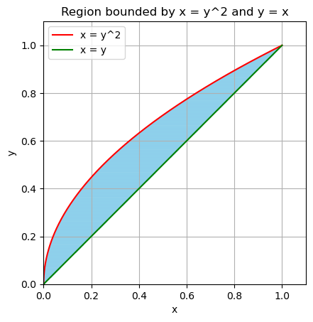

根据 D_x 分析的区域得到二重积分的转化
$$
\iint_D \frac{\sin y}{y} dxdy
= \int_0^1 dx \int_x^\sqrt{x} \frac{\sin y}{y} dy
$$
这里发现 $\int\frac{\sin y}{y} dy$ 算不出来，因此需要交换积分次序
$$
D_y = \{(x,y) \mid 0 \le y \le 1, y^2 \le x \le y\}
$$
写出积分表达式
$$
\iint_D \frac{\sin y}{y} \, dx \, dy = \int_{y=0}^{1} \int_{x=y^2}^{y} \frac{\sin y}{y} 
\, dx \, dy
$$
因为在内层积分中 $\frac{\sin y}{y}$ 与 x 无关，可以直接提取出来
$$
= \int_{y = 0}{1}\frac{\sin y}{y}\left ( \int_{x=y^2}^y dx \right )dy
= \int_0^1 \frac{\sin y}{y} (y - y^2)dy
$$
最后即可计算积分，这里需要用到分部积分法
$$
\begin{align}
原式 & = \int_0^1 (\sin y - y \sin y) dy \\
& = \int_0^1 \sin ydy - \int_0^1 y\sin y dy \\
\end{align}
$$
其中
$$
\int y \sin y dy
= -y \cos y - \int(-\cos y) dy
$$

### 利用极坐标

当积分区域 D 与圆有关，或被积函数含有 $x^2 + y^2$ 时，利用**极坐标**计算。其中 dxdy 为面积元，注意转换后由于雅可比行列式会多出一个 r。
$$
x = r \cos \theta,\ 
y = r \sin \theta,\ 
dxdy = rdrd\theta
$$
积分变化如下
$$
\iint_Df(x,y)dxdy = \iint_{D'}f(r\cos\theta, r\sin\theta)\cdot r drd\theta
$$
**例题** 圆周相关区域上的二重积分的计算

求 $\iint_D \sqrt{x^2 + y^2} dxdy$，其中 D 是圆环区域：$a^2 \le x^2 + y^2 \le b^2$

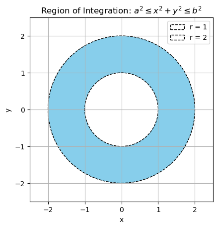

**分析** 被积函数直接简化 $\sqrt{x^2 + y^2} = r$，那么积分区域为圆环 $a \le r \le b$，角度 $\theta \in [0, 2\pi]$，随后带入被积函数
$$
\iint_D r \cdot rdrd\theta
= \int_0^{2\pi}d\theta \int_a^b r^2dr
$$

**例题** 求 $\iint_D xydxdy$，其中区域 D：$1 \le x^2 + y^2 \le 2x,\ y \ge 0$

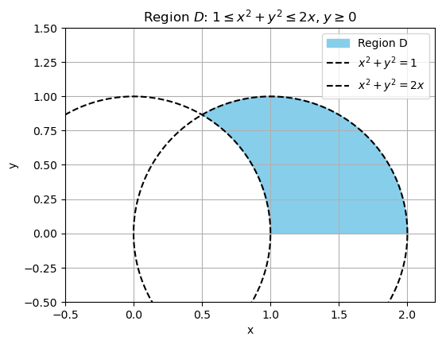

将积分区域用极坐标表示出来
$$
\theta \in [0, \frac{\pi}{3}],\ 
r \in [1, 2\cos\theta]
$$
转换被积函数并利用极坐标计算
$$
\iint_D xydxdy 
= \int_0^{\pi/3}\int_1^{2\cos\theta}r\cos\theta\cdot r\sin\theta rdrd\theta
$$
对 r 积分（内层）
$$
\int_1^{2\cos\theta} r^3 dr
= \left[ \frac{r^4}{4} \right]_1^{2\cos\theta}
= 4\cos^4\theta - \frac{1}{4}
$$
对 \theta 积分（外层）
$$
\int_0^{\pi/3}\left( 4\cos^4\theta - \frac{1}{4} \right)\cos\theta\sin\theta d\theta
= \int_0^{\pi/3} 4\cos^5\theta \sin\theta d\theta - \int_0^{\pi/3}\frac{1}{4}\cos\theta \sin\theta d\theta
$$

**例题** 计算积分 $\iint_D\left( \frac{x^2}{a^2} + \frac{y^2}{b^2} \right)dxdy$，其中 $D: x^2 + y^2 \le R^2$。

极坐标代换
$$
\begin{align}
&\iint_D\left( \frac{x^2}{a^2} + \frac{y^2}{b^2} \right)dxdy \\
&= \int_0^{2\pi}\int_0^Rr^2\left( \frac{\cos^2 \theta}{a^2} + \frac{\sin^2\theta}{b^2} \right)\cdot r dr d\theta \\
&= \int_0^{2\pi}\left( \frac{\cos^2 \theta}{a^2} + \frac{\sin^2\theta}{b^2} \right)\int_0^R r^3 drd\theta \\
&= \frac{R^4}{4}\int_0^{2\pi}\left( \frac{\cos^2 \theta}{a^2} + \frac{\sin^2\theta}{b^2} \right) d\theta
\end{align}
$$

根据二倍角公式降次
$$
\int_0^{2\pi}\cos^2\theta d\theta = \int_0^{2\pi}\frac{1 + \cos 2\theta}{2}d\theta
= \left[ \frac{\theta}{2} + \sin 2\theta \right]_0^{2\pi} = \pi
$$
同理另一项也是 \pi ，所以
$$
 \frac{R^4}{4}\int_0^{2\pi}\left( \frac{\cos^2 \theta}{a^2} + \frac{\sin^2\theta}{b^2} \right) d\theta
 = \frac{R^4 \pi}{4}\left( \frac{1}{a^2} + \frac{1}{b^2} \right)
$$

## 三重积分

### 三重积分的概念

如果 f(x, y, z) 表示某个物体在点 (x, y, z) 处的密度，$\Omega$ 是该物体所占有的空间闭区域，f(x, y, z) 在 \Omega 上连续，则
$$
m = \iiint_\Omega f(x, y, z)dV
$$

### 三重积分的计算

**利用直角坐标计算三重积分**

1. 画出 $\Omega$ 的草图
2. 将积分区域表示出来
3. 转换成定积分公式

**例题** 求 $\iiint_\Omega \frac{1}{(1+x+y+z)^3}dxdydz$，其中 $\Omega$ 为由平面 $x=0, y=0, z=0, x+y+z=1$ 所围成

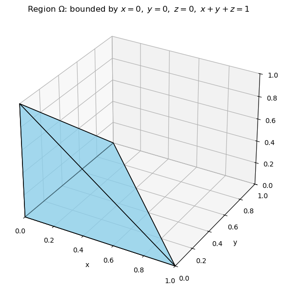
$$
Ω={(x,y,z)∣0≤x≤1, 0≤y≤1−x, 0≤z≤1−x−y} \\
原式 = \int_0^1\int_0^{x-1}\int_0^{1-x-y}\frac{1}{(1+x+y+z)^3}dzdydx
$$

**例题** 设有空间闭区域
$$
\Omega_1 = \{(x, y, z)|x^2+y^2+z^2\le R^2, z\ge0\},\ \Omega_2 = \{(x, y, z)|x^2+y^2+z^2\le R^2, x\ge0, y\ge0, z\ge0\}
$$
\Omega_1 是球体的上半部分，需要看被积函数，只有 z 始终保持在正半轴，因此得到以下关系式
$$
\iiint_{\Omega_1} zdV = 4\iiint_{\Omega_2}zdV
$$
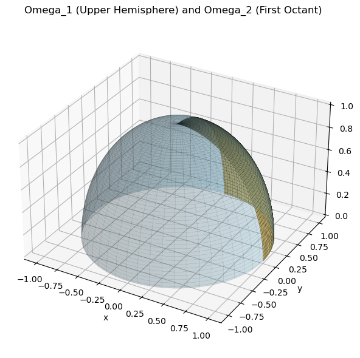

# 曲线积分与曲面积分

## 对弧长的曲线积分（第一类曲线积分）

对弧长的曲线积分，也称为**第一类曲线积分**。当曲线线密度 $\mu(x, y)$ 在 L 上连续时，就等于 $\mu(x, y)$ 对弧长的曲线积分，即以弧长为微元
$$
m = \int_L \mu(x, y) ds
$$
如果 L 可以分成两段光滑曲线弧 L_1 和 L_2，即为 $L = L_1 + L_2$
$$
\int_{L_1 + L_2}f(x, y) ds = \int_{L_1}f(x, y)ds + \int_{L_2}f(x, y)ds
$$
如果 L 是闭曲线那么函数 f(x, y) 在闭曲线 L 上对弧长的曲线积分记为 $\oint_L f(x, y) ds$

**计算方法**

1. 第一类曲线积分 $\int_L f(x, y)ds$ 的计算步骤：首先画出积分路径 L 的图

2. 若 L 的方程为直角坐标方程：$y = y(x),\ a \le x \le b$, 则 $ds = \sqrt{1 + {y'}^2}dx$​，将弧长的微元投影到 x 轴上

   若 L 的方程为参数方程：$\begin{cases} x = x(t) \\ y = y(t)\end{cases}, \alpha \le t \le \beta$， 则 $ds = \sqrt{{x_t'}^2 + {y_t'}^2}dt$

3. 带入积分公式，作为定积分计算（如果被积函数 f(x, y) 含有 L 的方程，可直接代入）

   $$
   \int_Lf(x,y)ds = \int_a^bf(x,y)\sqrt{1+y'^2}dx \\
   \int_Lf(x,y)ds = \int_\alpha^\beta f(x(t),y(t))\sqrt{{x_t'}^2 + {y_t'}^2}dt
   $$

**例题** 设平面曲线 L 为下半圆周： $x^2 + y^2 = 1, (y<0)$, 求 $\int_L {x^2 + y^2} ds$

**方法一** 下半圆周 L 方程为 $y = -\sqrt{1-x^2}, -1 \le x \le 1$

所以
$$
ds = \sqrt{1 + y'^2}dx
= \sqrt{1 + (\frac{x}{\sqrt{1 - x^2}})^2}\cdot dx = \frac{1}{\sqrt{1 - x^2}}\cdot dx
$$
代入被积函数
$$
原式
= \int_L 1 ds
= \int_{-1}^1\cdot\frac{1}{\sqrt{1 - x^2}}dx
= \arcsin x\Big|_{-1}^1
= \frac{\pi}{2} - (-\frac{\pi}{2})
= \pi
$$
**方法二** 单位圆下部分可以参数化为
$$
x = \cos t, y = \sin t, t \in [\pi, 2\pi]
$$
带入被积函数
$$
f(x, y) = x^2 + y^2 \\
f(x(t), y(t)) = 1
$$
计算 ds
$$
x'(t) = -\sin t, y'(t) = \cos t
$$
所以
$$
ds = \sqrt{(-\sin t)^2 + (\cos t)^2}dt = dt
$$
最后代入积分表达式
$$
\int_L(x^2 + y^2)ds = \int_\pi^{2\pi}1\cdot dt = t\Big|_\pi^{2\pi} = \pi
$$

## *对坐标的曲线积分（第二类曲线积分）

对坐标的曲线积分，也称为**第二类曲线积分**。

变力沿曲线所作的功，设一个质点在 xOy 面内受到力
$$
\textbf{F}(x, y) = P(x, y)\textbf{i} + Q(x, y)\textbf{j}
$$
那么变力 $\textbf{F}$ 所作的功可以表达成
$$
W = \int_L P(x, y)dx + Q(x, y)dy \\
W = \int_L \textbf{F}(x, y) \cdot d\textbf{r}
$$

**计算方法**

解题思路：

1. 画出积分路径 L 的图

2. 若 L 方程为直角坐标方程 $y = y(x)$ 则
   $$
   \begin{align}
   \int_LP(x, y)dx + Q(x,y)dy 
   & = \int_a^bP(x, y(x))dx + Q(x, y(x))\cdot y'(x)\cdot dx\\
   & = \int_a^b[P+Q\cdot y'(x)]dx\ 其中 a，b分别对应L的起点与终点
   \end{align}
   $$
   若 L 方程为参数方程 $\begin{cases} x = x(t) \\ y = y(t) \end{cases}$ 则
   $$
   \int_LP(x,y)dx+Q(x,y)dy = \int_\alpha^\beta P(x(t), y(t))\cdot x'(x)dt + Q(x(t),y(t))\cdot y'(x)dt \\
   其中 \alpha 和 \beta 分别对应 L 起点和终点
   $$
   

**例题** 求 $\int_L xy dx$ ，其中 L 为抛物线 $y = x^2$​ 上从点 $A(-1, 1)$ 到 $B(1, 1)$ 的一段弧

带入 $y = x^2$ 得到
$$
\int_L xydx = \int_{-1}^1x\cdot x^2dx = 0
$$

**例题** 计算曲线积分 $\int_L(x^2 - y)dx - (x + \sin^2 y)dy$，其中 L 是圆周 $y = \sqrt{2x - x^2}$ 上由 $O(0, 0)$ 到 $A(1, 1)$ 上的一段弧。

## 利用格林公式计算闭合曲线

设 D 是由分段光滑的简单闭曲线 L 所围成的平面区域，函数 P(x, y) 和 Q(x, y) 在 D 上具有一阶连续的偏导数，则有
$$
\oint_L P(x, y)dx + Q(x, y)dy
= \iint_D \left (\frac{\partial Q}{\partial x} - \frac{\partial P}{\partial y} \right )dxdy
$$
因此，格林公式将一个沿封闭曲线的线积分转换为一个在该曲线所围区域上的二重积分。其中 L 正向时取正号，负向取负号

**例题** 计算 $\oint_L -x^2ydx + y^2xdy$，其中 L 是圆周 $x^2 + y^2 = a^2$，方向为顺时针
$$
\oint_L -x^2ydx + y^2xdy = \iint_D \left (\frac{\partial Q}{\partial x} - \frac{\partial P}{\partial y} \right )dxdy
= -\iint_D y^2 + x^2 dxdy
$$
设极坐标，$x = r\cos\theta, y = r\sin\theta, dxdy = rdrd\theta$
$$
\begin{align}
原式 &= -\iint_D r^2\cdot rdrd\theta \\
&= -\int_0^{2\pi}d\theta \int_0^a r^3dr \\
&= -\frac{\pi}{2}a^4
\end{align}
$$

计算曲线积分 $\int_L (x^3 - xy^2)dx + (y^3 - x^2y)dy$，其中 L 是曲线 $y = 1 - x^2$​ 从 A(0, 1) 到 B(1, 0) 的一段弧。

## 对面积的曲面积分（第一类曲面积分）

**计算方法**

第一类曲线积分 $\iint_\Sigma f(x,y,z)dS$​ 的计算方法

1. 将曲面 $\Sigma$ 投影到恰当的坐标面

2. 当 $\Sigma$ 方程为 $z = z(x, y)$，将 $\Sigma$ 投影到 $xOy$ 面上，且 $dS = \sqrt{1 + z_x^2 + z_y^2}dxdy$

   ......

3. 将 $\Sigma$ 方程代入被积函数

4. 化为二重积分计算

**例题** 求 $\oiint_\Sigma x^2 +y^2 dS$，其中 $\Sigma$ 是由锥面 $z = \sqrt{x^2 + y^2}$ 及平面 $z = 1$​ 所围成的整个边界曲面

$\Sigma$ 的范围是 $\Sigma = \Sigma_1 + \Sigma_2$​​，及圆锥曲面周围和顶部圆形

$$
\Sigma_1: \sqrt{x^2 + y^2}, \Sigma_2: z = 1, D_{xy}: x^2 + y^2 \le 1
$$
$\Sigma_1$ 方程：$z = \sqrt{x^2 + y^2}$，
$$
dS = \sqrt{1 + z_x^2 + z_y^2}dxdy \\
z'_x = \frac{x}{\sqrt{x^2+y^2}} ,同理求出 z_y'\\
dS = \sqrt{1 + \frac{x^2}{x^2 + y^2} + \frac{y^2}{x^2 + y^2}}dxdy = \sqrt2dxdy
$$

$\Sigma_2$ 方程：z = 1
$$
dS = \sqrt{1 + 0}dxdy = dxdy
$$
随后转换并相加
$$
\begin{align}
\oiint_\Sigma & = \iint_{\Sigma_1} + \iint_{\Sigma_2} \\
& = (1 + \sqrt2)\iint_{D_{xy}}x^2 + y^2 dxdy
\end{align}
$$
极坐标转换
$$
x = \rho\cos \rho, y = \rho\sin \rho, dxdy = \rho d\rho d\theta
$$

$$
\begin{align}
原式 &= (1 + \sqrt2)\iint_{D_{xy}}x^2 + y^2 dxdy \\
&= (1+\sqrt2)\int_0^{2\pi}d\theta\int_0^1\rho^3 d\rho
\end{align}
$$

## 对坐标的曲面积分（第二类曲线积分）

第二类曲面积分
$$
\iint_\Sigma P(x, y, z)dydz
= \pm\iint_{D_{xy}}P(x, y, z(x,y))dxdy \\
其中D_{xy}为曲面\Sigma在xOy上的投影，\Sigma上侧时取正，下侧取负
$$

## *高斯公式

高斯公式是微积分中的一个核心定理，它将**三维空间中封闭曲面上的曲面积分**与**该曲面所包围区域内的体积积分**联系起来。它是格林公式在三维空间的推广，用于计算三维空间的闭合曲面。
$$
\oiint_\Sigma(Pdydz + Qdzdx + Rdxdy)
= \iiint_\Omega\left( \frac{\partial{P}}{\partial{x}} + \frac{\partial{Q}}{\partial{y}} + \frac{\partial{R}}{\partial{z}}\right)dxdydz
$$

**例题** 计算曲面积分 $\iint_\Sigma xz^2dydz + (x^2y-z^3)dzdx + (2x^2+y^2z)dxdy$，其中 $\Sigma$ 是球面 $x^2 + y^2 + z^2 = 16$ 被平面 $z = 2$ 所截顶部的上侧。

## 斯托克斯公式

# *无穷级数

## 常数项级数的概念和性质

### 常数项级数的概念

作常数项级数的前 n 项和
$$
s_n = u_1 + u_2 + ... + u_n = \sum_{i = 1}^n u_i
$$
$s_n$ 称为级数部分和，当 n 依次取 $1, 2, 3, ...$ 时，它们构成一个新的数列，根据这个数列有没有极限，引进无穷级数的收敛与发散概念

**定义 如果级数 $\sum_{i=1}^\infty u_i$ 的部分和数列 $\{s_n\}$ 有极限 s, 那么称无穷级数收敛，这时极限 s 叫做这级数的和。**
$$
\lim_{n \rarr \infty} s_n = s \\
s = u_1 + u_2 + ... + u_i + ...;
$$
**如通过没有极限，那么称无穷级数发散**，（级数就是无穷项求和）。而这上面的常数级数，就是通项 u_n 不依赖于变量（如 x）的无穷级数，即每一项均为常数。

### 收敛级数的基本性质

如果级数 $\sum_{n=1}^\infty u_n$ 收敛与 $s$，那么级数 $\sum_{n=1}^\infty ku_n$ 也收敛于 $ks$。

如果级数 $\sum_{n=1}^\infty u_n$ 与 $\sum_{n=1}^\infty v_n$ 分别收敛于 $s$ 与 $\sigma$，那么级数 $\sum_{n=1}^\infty(u_n \pm v_n)$ 也收敛于 $s \pm \sigma$。

在级数中去掉、加上或改变有限项，不会改变级数的收敛性。

如果级数收敛，那么对这级数的项任意家括号后所成的级数仍收敛，且其和不变。

## 常数项级数的审敛法

### 正项级数的敛散性常用方法

一般的常数项级数，各项可以是正数、负数或零，如果各项都是正数或者零的级数，这种级数称为**正项级数**。

正项级数 $\sum_{n=1}^\infty u_n$ 收敛的充分必要条件是：它的部分和数列 {s_n} 有界。

**比较审敛法** 设 $\sum_{n=1}^\infty u_n$ 和 $\sum_{n=1}^\infty v_n$ 都是正项级数

1. 如果 $\lim_{n \to \infty} \frac{u_n}{v_n} = l, (0 \le l < +\infty)$，且 $\sum_{n=1}^\infty v_n$ 收敛，那么 $\sum_{n=1}^\infty u_n$ 收敛。

2. 如果 $\lim_{n \to \infty} \frac{u_n}{v_n} = l >0$ 或 $\lim_{n \to \infty} \frac{u_n}{v_n} = l = +\infty$ 且级数 $\sum_{n=1}^\infty v_n$ 发散，那么 $\sum_{n=1}^\infty u_n$ 也发散

**比值审敛法**

设 $\sum_{n=1}^\infty u_n$ 是正项级数，如果：
$$
\lim_{n \to \infty}\frac{u_{n+1}}{u_n} = \rho
$$
- $\rho < 1$ 时级数收敛
- $\rho > 1$ 或 $\rho = \infty$ 时级数发散
- $\rho = 1$ 时级数可能收敛也可能发散。

**根值审敛法（柯西判别法）**

设 $\sum_{n=1}^\infty u_n$ 是正项级数，如果
$$
\lim_{n \to \infty} \sqrt[n]{u_n} = \rho
$$
- $\rho < 1$ 那么级数 $\sum_{n=1}^\infty u_n$ 收敛
- $\rho > 1$，则级数 $\sum_{n=1}^\infty u_n$ 发散。

常见经典结论

**例题** 判别正项级数的敛散性：（1）$\sum_{n=1}^\infty \frac{2n+1}{2^n}$；（2）$\sum_{n=1}^\infty\frac{n^3}{n!}$

**例题** *判别级数敛散性，如果收敛，判断是不是绝对收敛
$$
\sum^\infty_{n = 1} \ln \frac{n+1}{n}
$$

### 交错级数及其审敛法

**莱布尼兹定理** 如果交错级数 $\sum_{n=1}^\infty(-1)^{n-1}u_n$ 满足条件

1. $u_n \ge u_{n+1}$
2. $\lim_{n \to \infty} u_n = 0$

那么级数收敛，且其和 $s \le u_1$，其余项 $r_n$ 的绝对值 $|r_n| \le u_{n+1}$

### 绝对收敛与条件收敛

如果级数 $\sum_{n=1}^\infty u_n$，各项的绝对值所构成的正项级数 $\sum_{n=1}^\infty |u_n|$ 收敛，那么称此级数**绝对收敛**，如果级数 $\sum_{n=1}^\infty u_n$ 收敛但是由其绝对值构成的级数发散，那么称为**条件收敛**。

**定理** 如果级数绝对收敛，那么级数必定收敛

## 幂级数

### 幂级数及其收敛性

函数项级数中简单而常见的一类级数就是各项都是常数乘米函数的函数项级数，即所谓的幂级数，其形式为
$$
\sum_{n=0}^\infty a_n x^n = a_0 + a_1x + ... + a_nx^n + ...
$$
其中 a_n 称为幂级数的系数。

**阿贝尔定理** 如果级数在 $x = x_0$ 处收敛，那么适合不等式 $|x| < |x_0|$ 的一切 x 使这幂级数**绝对收敛**，反之如果幂级数在 x_0 处发散，那么合适不等式 $|x| > |x_0|$ 的一切 x 使这幂级数发散。

**推论** 如果幂级数不是仅在 x = 0 一点收敛，也不是在整个数轴上都收敛，那么一定存在一个正数 R 使得：

1. 当 $|x| < R$ 时，幂级数绝对收敛
2. 当 $|x| > R$ 时，幂级数发散
3. 当 $x = R$ 与 $x = -R$ 时，幂级数可能收敛也可能发散

其中 R 被称为幂级数的**收敛半径**，在开区间 (-R, -R) 叫做幂级数的收敛区间。

**定理** 如果
$$
\lim_{n \to \infty}\left|\frac{a_{n+1}}{a_n}\right| = \rho
$$
其中上面连个鬼是相邻两项的系数，那么这幂级数的收敛半径为
$$
R = \begin{cases}
\frac{1}{\rho}&, \rho \ne 0 \\
\infty&, \rho = 0 \\
0&, \rho = \infty
\end{cases}
$$
**例题** 若幂级数 $\sum_{n=1}^\infty a_n x^n 在 x = -2$ 处收敛，则 $\sum_{n=1}^\infty a_n$ 是否收敛？

由于 $x = -2$ 时收敛，说明收敛半径 $R \ge 2$，由于 $x = 1 < 2$ 所以绝对收敛

## *函数展开成幂级数

| 函数             | 幂级数展开式                               | 收敛域         |
| ---------------- | ------------------------------------------ | -------------- |
| $\frac{1}{1-x}$  | $\sum_{n=0}^\infty x^n$                    | $-1 < x < 1$   |
| $\ln(1 + x)$     | $\sum_{n=1}^\infty(-1)^(n-1)\frac{x^n}{n}$ | $-1 < x \le 1$ |
| $(1 + x)^\alpha$ | $\sum_{n=0}^\infty\matrix{\alpha \\ n}x^n$ | $-1 < x < 1$   |

## 函数的幂级数展开式的应用

## 傅立叶级数

**例题** 设 $f(x)$ 是周期为 $2\pi$ 的函数，且在 $[-\pi, \pi)$ 上的表达式为 $f(x) = \begin{cases} 0 &, -\pi \le x < 0 \\ e^x &, 0 \le x < \pi \end{cases}$，其傅里叶级数的和函数为 $s(x)$，则 $s(4\pi)$ 的值为

## 一般周期函数的傅立叶级数

**周期为 $2l$ 的周期函数的傅立叶级数**

设这个周期函数 $f(x)$ 满足收敛定理的条件，则它的傅立叶级数展开式为
$$
f(x) = \frac{a_0}{2} + \sum_{n=1}^\infty\left(a_n\cos\frac{n\pi x}{l} + b_n\sin\frac{n\pi x}{l}\right)\ (x \in C)
$$

# 微分方程

## 微分方程的基本概念

一般的，表示未知函数，未知函数的导数与自变量之间的关系的方程叫做微分方程。

例如
$$
\frac{dy}{dx} = 2x \\
对两边积分得\ y = x^2 + C，其为微分方程的通解
$$

$$
\frac{d^2y}{dx^2} = -y
$$

为简谐振动的方程，其解是
$$
y = A \cos x + B \sin x
$$

## 一阶微分方程的求解

1. **可分离变量方程**
   $$
   \frac{dy}{dx} = f(x) \cdot g(y)
   $$
   分离 x 与 y
   $$
   \frac{dy}{g(y)} = f(x) dx
   $$
   随后对两端积分即可

2. **齐次方程**
   $$
   \frac{dy}{dx} = f(\frac{y}{x})
   $$
   令 $\frac{y}{x} = u$ 带入后转换成一元方程

**例题** 求方程通解 1. $ydx + (x^2 - 4x) dy = 0$ ，2. $\frac{dy}{dx} = \frac{x^2 + y^2}{xy}$

$$
\frac{dy}{dx} = \frac{x^2 + y^2}{xy}，同除 x^2 \\
\frac{dy}{dx} = \frac{1 + (\frac{y}{x})^2}{\frac{y}{x}}
$$

## 一阶线性方程

一阶线性方程：$y' + P(x)y = Q(x)$ 的解法（公式法）
$$
y(x) = e^{-\int P(x)dx}\left(\int Q(x)e^{\int P(x)dx}dx +C \right)
$$
**例题** 求 $xy' + y = x^2 + 3x + 2 $
$$
y' + \frac{1}{x}y = x + 3 + \frac{2}{x}
$$

$$
\begin{align}
y(x) &= e^{-\ln x}\left[ \int(x+3+\frac{2}{x})e^{\int\frac{1}{x}dx}+C \right]\\
&= \frac{1}{x}\left[ \int x^2 + 3x + xdx + C \right]
\end{align}
$$

### 常系数齐次线性微分方程

二阶常系数齐次线性方程方程：$y'' + py' + qy = 0$

首先写出特征方程：$r^2 + pr + q = 0$

写出判别式 $\Delta = p^2 - 4q$

1. 如果大于零，那么 $r_1, r_2$ 为两个不相等的实根

   $$
   r = \frac{-p \pm \sqrt{p^2 - 4q}}{2}
   $$
   得到 $y_1 = e^{r_1x}, y_2 = e^{r_2x}$，

   微分方程的通解为
   $$
   y = C_1 e^{r_1x} + C_2e^{r_2x}
   $$
   
2. 等于零时， $r_1 = r_2 = -\frac{p}{2}$

   这时得到微分方程的一个解 $y_1 = e^{r_1x}$
   $$
   y = (C_1 + C_2 x)e^{r_1x}
   $$
   
3. 当小于零时， $r_1, r_2$ 是一对共轭复根

   $$
   r_1 = \alpha + \beta i, r_2 = \alpha - \beta i \\
   \alpha = -\frac{p}{2}, \beta = \frac{\sqrt{4q - p^2}}{2}
   $$
   此时微分方程的通解为
   $$
   y = e^{\alpha x}(C_1\cos\beta x + C_2\sin\beta x)
   $$
   

**例题** 1. $y'' - 3y' + 2y = 0$，2. $4y'' - 4y' + y = 0$，3. $y'' + 2y' + 10y = 0$

## 常系数非齐次线性微分方程

二阶常系数非齐次方程：$y'' + py' + qy = f(x)$

$$
此时通解 = 齐次通解 + 非齐次特解
$$

**例题** 求二阶微分方程 $y'' + 3y' = 2xe^x$ 的通解

先求齐次方程：$y'' + 3y' = 0$，令特征方程为：r^2 + 3r = 0

解得：$r_1 = 0, r_2 = -3$，因此齐次方程的通解为
$$
y_h(x) = C_1 + C_2e^{-3x}
$$
随后求特解，原方程的右端是 2xe^x，使用常数变易法和待定系数法

**例题** 求以 $(x+C)^2 + y^2 = 1$ 为通解的微分方程

将通解视为隐函数关系，对两边关于 x 求导，注意 $y = y(x)$
$$
2(x + C) + 2yy' = 0
$$
消去常数 C
$$
\begin{align}
(x + C)^2 + y^2 &= 1 \\
x + C &= \pm \sqrt{1 - y^2}
\end{align}
$$
带入之前的式子得
$$
\pm\sqrt{1-y^2} + yy' = 0
$$
得到
$$
(yy')^2 = 1 - y^2
$$
最终得到微分方程
$$
y^2(y')^2 = 1 - y^2
$$

# 附录 公式

## 考试知识点

- 微分方程

  - 一阶线性方程

  - **二阶常系数非齐次方程**

  - 可分离变量、齐次、可降阶的高阶方程

  - n 阶长系数非齐次方程

  - 反问题**

- 无穷级数

  - 常数项级数敛散性
  - **绝对条件收敛**
  - **和函数**
  - **函数展开成无穷级数**
  - **傅立叶绝对收敛定理**
  - **阿贝尔定理**

- 曲线曲面积分

  - **曲线积分**
  - **曲面积分**
  - **格林公式**
  - **高斯公式**
  - 斯托克斯公式

- 重积分

  - 二重积分计算
  - 三重积分计算
  - 二重积分变换积分次序
  - 求体积、曲面面积

- 多元函数微分法

  - 求极限
  - 复合函数微分法
  - 极值
  - **条件极值**
  - 方向导数极值

- 空间解析几何

  - **向量计算**
  - **平面直线方程**
  - 二次曲面
  - 柱面旋转曲面锥面

## 常用导数

| 原函数      | 导函数                       |
| ----------- | ---------------------------- |
| $C$         | $0$                          |
| $a^x$       | $a^x \ln a$                  |
| $e^x$       | $e^x$                        |
| $x^n$       | $nx^{n - 1}$                 |
| $\log_a x$  | $\frac{1}{x\ln a}$           |
| $\ln x$     | $\frac{1}{x}$                |
| $\sin x$    | $\cos x$                     |
| $\cos x$    | $- \sin x$                   |
| $\arcsin x$ | $\frac{1}{\sqrt{1 - x^2}}$   |
| $\arccos x$ | $- \frac{1}{\sqrt{1 - x^2}}$ |
| $\arctan x$ | $\frac{1}{1 + x^2}$          |

分步积分
$$
\int udv
= uv - \int vdu
$$