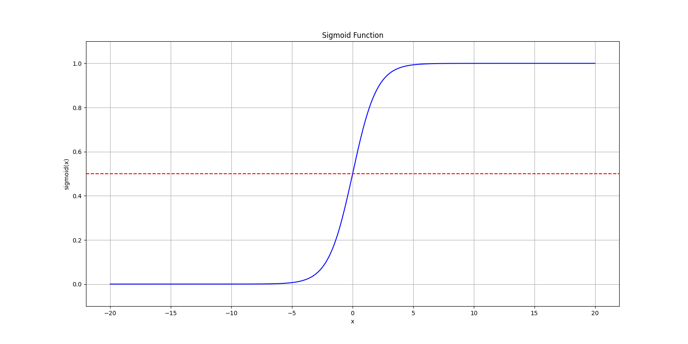
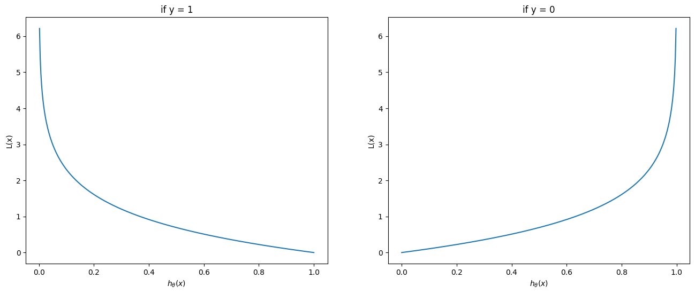
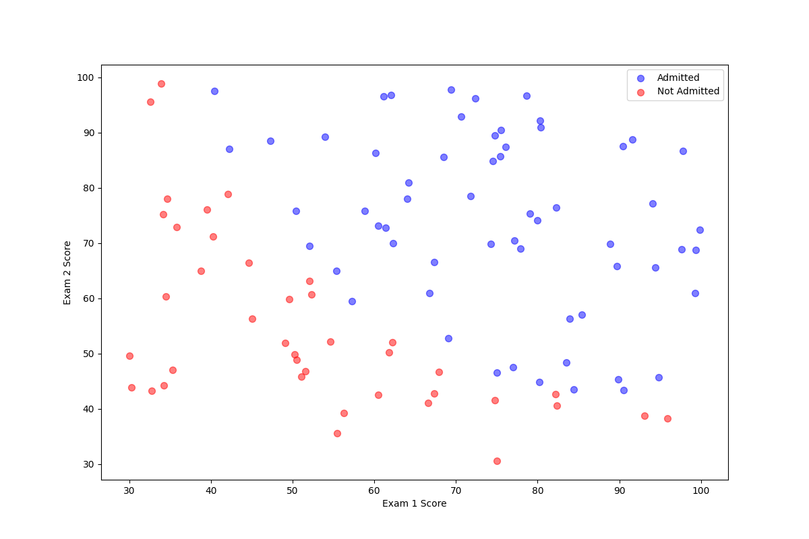
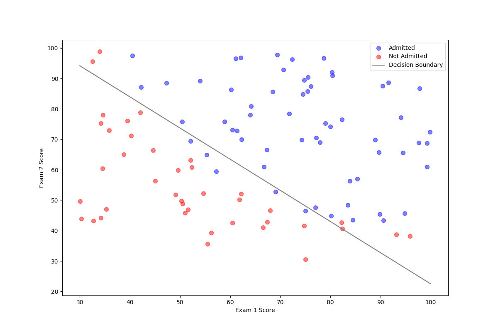

# 逻辑回归的数学模型

## 基本模型

逻辑回归主要用于处理二分类问题。二分类问题对于模型的输出包含 0 和 1，是一个不连续的值。分类问题的结果一般不能由线性函数求出。这里就需要一个特别的函数来求解，这里引入一个新的函数 Sigmoid 函数，也成为逻辑函数。
$$
h_\theta(x) = g(\theta^Tx) \\
z = \theta^Tx \\
g(z) = \frac{1}{1 + e^{-z}}
$$
这里函数 $g(z)$ 将任何实数映射到了 $(0, 1)$ 区间中，从而将任何值函数转换为适合分类的函数。这里我们将线性回归模型函数插入到这个函数中形成新的逻辑回归模型。



<center> 图 1 Sigmoid 函数</center>

如图所示，转换后可以看到在 $x = 0$ 处有一个明显的变化，两边的函数值无限接近于 0 和 1，而中间的交界处则根据输出来判断如何分类，例如 $h_\theta(x) = 0.7$ 则表示有 70% 的概率输出为 1。

## 决策边界

决策边界（Decision boundary）即为输出的分界点。二分类问题的输出是离散的零一分类，也就是说：
$$
h_\theta(x) \ge 0.5 \rarr y = 1 \\
h_\theta(x) < 0.5 \rarr y = 0
$$
那么此处由 Sigmoid 函数的性质可以得到：
$$
\theta^T x \ge 0 \Rightarrow y = 1 \\
\theta^T x < 0 \Rightarrow y = 0
$$
那么此处根据输入 $x$ 来判断输出从当前值跳变到另一个值的边界，即为决策边界。在上面 Sigmoid 函数的实例图中，假设输入函数仅是简单的 $z = x$，并且认为当 $h_\theta(x) \ge 0.5$ 时，输出 $y = 1$，那么可以看到，$x = 0$​ 即为其决策边界。

在更复杂的情况下，假设 

$$
\theta^T x = \theta_0 + \theta_1 x_1 + \theta_2 x_2
$$

那么通过变形可得到
$$
\theta_0 + \theta_1 \cdot x = - \theta_2 \cdot y \\
y = \frac{\theta_0 + \theta_1 \cdot x}{\theta_2}
$$


## 代价函数

根据模型的代价函数（Cost function）即可根据对当前参数的评估最后找到最优解，逻辑回归的代价函数定义为：
$$
J(\theta) = \frac{1}{m}\sum^m_{i = 1}\mathrm{Cost}(h_\theta(x^{(i)}), y^{(i)}) \\
\mathrm{Cost}(h_\theta(x), y) = -\log(h_\theta(x)) & \text{if } y = 1 \\
\mathrm{Cost}(h_\theta(x), y) = -\log(1 - h_\theta(x)) & \text{if } y = 0 \\
$$


<center>图 2 Sigmoid 的损失函数</center>

这里可以看出，当 $y = 1 \text{ and } h_\theta(x) \rarr 0$ 时，损失函数的值会趋向于无穷，可以直观看到损失函数对模型预测与实际值的差距评估。机器学习的主要目标就是要将损失函数降到最低，以求得最优模型。

## 梯度下降

通过梯度下降（Gradient descent）找到最优解，首先将代价函数转化为如下形式。不难看出在某一情况时，另一种情况会被化为 0，这样做的目的是方便编程：
$$
\mathrm{Cost}(h_\theta(x), y) = - y \log(\theta(x)) - (1 - y) \log(1 - h_\theta(x))
$$
那么整个代价函数如下：
$$
J(\theta) = -\frac{1}{m}\sum_{i = 1}^{m}[y^{(i)}\log(h_\theta(x^{(i)})) + (1 - y^{(i)}) \log(1 - h\theta(x^{(i)}))]
$$
则可以求出梯度下降迭代的步骤：
$$
\theta_j := \theta_j - \alpha\frac{\partial{J(\theta)}}{\partial{\theta_j}} \\
\text{即 } \theta_j := \theta_j - \frac{\alpha}{m}\sum^m_{i = 1}(h_\theta(x^{(i)}) - y^{(i)})x_j^{(i)}
$$

# Sklearn 逻辑回归模型

## 数据整理

假设有一份学生的成绩单和大学录取的名单，学生们通过两门考试的两门分数来被决定是否被录取。这是一个两个特征的二分类问题，首先整理一下数据。

```python
data = pd.read_csv('ex2data1.txt', names=['exam1', 'exam2', 'is_admitted'])
print(data.head())

# 将数据拆分成是否录取的两批，绘制散点
positive = data[data['is_admitted'] == 1]
negative = data[data['is_admitted'] == 0]

fig, ax = plt.subplots(figsize=(12, 8))
ax.scatter(positive['exam1'], positive['exam2'], s=50, c='b', alpha=0.5, label='Admitted')
ax.scatter(negative['exam1'], negative['exam2'], s=50, c='r', alpha=0.5, label='Not Admitted')
ax.legend()
ax.set_xlabel('Exam 1 Score')
ax.set_ylabel('Exam 2 Score')
plt.show()
```

```
       exam1      exam2  admitted
0  34.623660  78.024693         0
1  30.286711  43.894998         0
2  35.847409  72.902198         0
3  60.182599  86.308552         1
4  79.032736  75.344376         1
```



<center>图 3 数据预览</center>

## 逻辑回归模型

这里将从上面读取的数据传递给定义的逻辑回归的模型，并训练得到模型参数。

```python
X = data[['exam1', 'exam2']].values
Y = data['is_admitted'].values

# 定义并训练模型
model = LogisticRegression()
model.fit(X, Y)

print("Model Coefficients:", model.coef_)
print("Intercept:", model.intercept_)
```

```
Model Coefficients: [[0.20535491 0.2005838 ]]
Intercept: [-25.05219314]
```

## 验证

验证模型的准确性，首先从模型中取出相关参数，即为 $\theta$ 。这里需要说明一下数学模型中与 Sklearn 逻辑回归模型的属性，首先求出决策边界：
$$
y = \frac{\theta_0 + \theta_1 \cdot x}{\theta_2}
$$
这里 $\theta_0$ 为偏置，$\theta_1$ 和 $\theta_2$ 是每个特征的系数。两者分别对应了两个属性。

```python
coef = model.coef_[0]
intercept = model.intercept_[0]
x = np.linspace(30, 100, 1000)
y = -(coef[0] * x + intercept) / coef[1]

fig, ax = plt.subplots(figsize=(12, 8))
ax.scatter(positive['exam1'], positive['exam2'], s=50, c='b', alpha=0.5, label='Admitted')
ax.scatter(negative['exam1'], negative['exam2'], s=50, c='r', alpha=0.5, label='Not Admitted')
ax.plot(x, y, label='Decision Boundary', c='grey')
ax.legend()
ax.set_xlabel('Exam 1 Score')
ax.set_ylabel('Exam 2 Score')
plt.show()
```

最后可以看出决策边界较好的分割了两类点集。



<center>图 4 决策边界</center>
