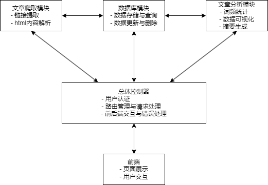

# Python 课程设计

## 设计目标

本次Python课程设计的主要目标是构建一个**新闻爬取与分析系统**，能够从指定的新闻网站自动获取文章内容，并对文章进行存储、分析和可视化展示。具体的设计目标包括以下几个方面：

1. **自动化新闻爬取**：实现从目标新闻网站（如新浪新闻）自动爬取文章链接和内容。支持动态渲染页面的爬取，确保能够获取完整的网页内容。设计合理的反爬虫策略，避免被目标网站封禁。
2. **数据管理**：使用SQLite数据库存储爬取到的新闻数据，确保数据的持久化和可管理性。实现数据的去重、分页查询和条件搜索功能，方便用户快速查找和管理文章。
3. **文章内容分析**：对爬取到的新闻内容进行分词和词频统计，提取文章的关键词。通过可视化工具（如Matplotlib和WordCloud）生成词频直方图和词云图，直观展示文章的核心内容。利用自然语言处理技术（如大语言模型）生成文章摘要，帮助用户快速了解文章主旨。
4. **用户交互界面**：使用Flask框架搭建后端服务，提供RESTful API接口，支持前后端数据交互。设计简洁直观的前端页面，支持用户登录、文章浏览、搜索、分析和可视化展示等功能。实现分页显示和动态更新功能，提升用户体验。
5. **安全性**：实现用户认证和权限管理，确保只有授权用户才能访问系统的核心功能。对用户输入进行合法性校验，防止SQL注入等安全问题。

通过实现以上目标，本次课程设计旨在构建一个功能完善、易于使用且具有较高实用价值的新闻爬取与分析系统，为用户提供高效的文章管理和分析工具。同时，通过项目的实践，进一步提升编程能力、问题解决能力以及对Python生态系统的掌握程度。

## 关键问题

### 2.1 如何从网页获取文章

**网页内容的获取**：网页内容可以通过HTTP请求获取，但对于动态渲染的网页（如使用JavaScript加载内容的网页），简单的HTTP请求可能无法获取完整的页面内容。因此，我们需要使用工具如Selenium来模拟浏览器行为，确保能够获取到完整的页面内容。

**链接的提取**：从网页中提取文章的链接是获取文章的第一步。通常，我们可以通过正则表达式或HTML解析库（如BeautifulSoup）来提取页面中的链接。对于复杂的页面结构，可能需要结合XPath或CSS选择器来定位链接。

**内容的解析**：获取到文章页面后，需要从HTML中提取出文章的标题、正文、发布时间等信息。这可以通过HTML解析库（如BeautifulSoup）来实现。需要注意的是，不同网站的HTML结构可能不同，因此解析逻辑需要具备一定的灵活性。

**反爬虫机制**：许多网站为了防止爬虫，会设置反爬虫机制，如IP封禁、验证码等。为了应对这些机制，我们需要使用代理IP、设置请求头、模拟用户行为等技术手段。

### 2.2 如何管理数据

**数据存储**：我们需要选择合适的数据库来存储文章数据。对于小型项目，SQLite是一个轻量级且易于使用的选择。对于更大规模的项目，可以考虑使用MySQL数据库。

**数据去重**：在爬取过程中，可能会遇到重复的文章。为了避免数据冗余，我们需要在存储数据时进行去重处理。可以通过文章的URL或标题等唯一标识符来判断是否已经存在相同的文章。

**数据查询与分页**：为了在前端展示文章列表，我们需要支持分页查询功能。这可以通过SQL的`LIMIT`和`OFFSET`语句来实现。同时，还需要支持根据标题、发布时间等条件进行查询。

### 2.3 文章的分析

**词频统计**：通过分词工具（如jieba）对文章内容进行分词，并统计每个词的出现频率。词频统计可以帮助我们了解文章的主题和关键词。

**可视化展示**：为了直观地展示分析结果，我们可以使用图表（如直方图、词云图）来展示词频统计结果。本项目使用了Matplotlib和WordCloud。

**摘要生成**：通过自然语言处理技术，我们可以生成文章的摘要。可以使用预训练的语言模型（如GPT、BERT）来实现这一功能。对于小型项目，可以使用轻量级的模型（如Qwen2.5）来生成摘要。

### 2.4 前后端交互

前后端通过API进行数据交互。需要设计合理的API接口，确保前端能够获取到所需的数据。API设计应遵循RESTful原则，使用HTTP方法（GET、POST）来表示不同的操作。

**数据传递与展示**：前端通过API获取数据后，需要将数据展示给用户。可以使用Flask的内置模板引擎（如Jinja2）来渲染HTML页面。

在前后端交互过程中，可能会遇到各种错误（如网络错误、数据格式错误等）。需要设计合理的错误处理机制，并记录日志以便排查问题。

## 整体构思和设计



## 模块设计

### 4.1 网站爬虫

#### 4.1.1 驱动器*

在创建Python爬虫中，可以使用request库来请求页面。但是原生的request库返回的是一个静态html内容。在一些网站中包含JavaScript代码来动态渲染页面，而直接使用request库来获取页面并不能渲染这些内容。因此，需要使用selenium库，来模拟浏览器爬取网页，使其能动态渲染内容。

```python
def get_driver():
    if not os.path.exists(DRIVER_PATH):
        driver_path = ChromeDriverManager().install()
        shutil.copy(driver_path, DRIVER_PATH)
    options = webdriver.ChromeOptions()
    options.add_argument("--headless")
    options.add_argument("--disable-blink-features=AutomationControlled")
    return webdriver.Chrome(service=Service(DRIVER_PATH), options=options)
driver = get_driver()
```

#### 4.1.2 获取链接

在得到主页后，通过正则表达式将网站中存在的链接整理出来。

```python
def get_links():
    # Parse js code and get page content by selenium
    # Set the root page for sina news
    root_url = "https://news.sina.com.cn/roll/"
    driver.get(root_url)
    driver.implicitly_wait(5)
    content = driver.page_source
    # Get news list by regex
    pattern = r"https://finance\.sina\.com\.cn/[a-zA-Z0-9/_-]+/doc-[a-zA-Z0-9]+\.shtml"
    news_list = re.findall(pattern, content)
    return news_list
```

#### 4.1.3 保存新闻

将获取到的新闻内容以html文件保存到本地。

```python
def save_news_html(news_list):
    """
    Save all content from news list link by html form
    :param news_list: List of news urls
    :return None
    """
    for news_link in news_list:
        driver.get(news_link)
        driver.implicitly_wait(5)
        content = driver.page_source
        file_name = re.search(r'doc-([a-zA-Z0-9]+)\.shtml', news_link).group(1)
        with open(f"saved_news/{file_name}.html", "w", encoding="utf-8") as f:
            f.write(content)
        print(f"Saved: {file_name}.html")
```

#### 4.1.4 获取内容

首先通过驱动器找到url的html原内容。获取到原内容后利用 BeautifulSoup 库来通过元素和修饰词筛选出内容。此处还修改了时间格式，将中文时间改成了方便存储的时间格式。

```python
def get_news_content_from_url(url):
    """
    Get news content from html content
    Record url, title, time and article
    :param url
    :return: news content_dict
    """
    news_dict = {'url': url}
    driver.get(url)
    driver.implicitly_wait(5)
    content = driver.page_source
    soup = BeautifulSoup(content, 'lxml')
    news_title = soup.select('h1.main-title')[0].text.strip()
    news_dict['title'] = news_title
    news_time_temp = datetime.datetime.strptime(
        soup.select('span.date')[0].text.strip(),
        '%Y年%m月%d日 %H:%M'
    )
    news_time = (news_time_temp.strftime('%Y-%m-%d %H:%M:%S'))
    news_dict['time'] = news_time
    news_article = soup.select('div#artibody p')
    news_article_text = ''
    for paragraph in news_article:
        news_article_text += paragraph.text.strip()
    news_dict['article_text'] = news_article_text
    return news_dict
```


### 4.2 数据库操作

#### 4.2.1 初始化

首先需要创建一个用于存储爬取新闻的表。一般来说可在程序中写入初始化脚本来在库中创建数据表。本项目所使用的数据库是sqlite，以本地文件形式存储，一个文件就代表了这个数据库，因此不需要初始化数据库。

```sql
CREATE TABLE IF NOT EXISTS news (
        id INTEGER PRIMARY KEY AUTOINCREMENT,
        title TEXT NOT NULL,
        content TEXT,
        published_time TEXT,
        url TEXT UNIQUE,
        created_at TIMESTAMP DEFAULT CURRENT_TIMESTAMP
    )
```

#### 4.2.2 存储新闻

在爬取操作中，最后提取出来的内容是一个字典，写一个存储新闻到本地数据库的函数来存储数据。

```python
def save_news_to_db(news_dict):
    """
    Check for duplicate URLs before inserting into the database
    """
    conn = sqlite3.connect('news_data.db')
    cursor = conn.cursor()
    cursor.execute('SELECT COUNT(*) FROM news WHERE url = ?', (news_dict['url'],))
    exists = cursor.fetchone()[0]
    if exists:
        print(f"Duplicate URL, skipped: {news_dict['title']}")
    else:
        cursor.execute('''
        INSERT INTO news (title, content, published_time, url)
        VALUES (?, ?, ?, ?)
        ''', (
            news_dict['title'],
            news_dict['article_text'],
            news_dict['time'],
            news_dict['url']
        ))
        conn.commit()
        print(f"Saved to DB: {news_dict['title']}")
    conn.close()
```

在这里要注意一下存储url，这个值可以用来判断存储的新闻是否重复。

#### 4.2.3 获取新闻

**获取所有新闻**，这里的限制条件是页数，避免一次查询出太多信息返回到前端。

```python
def get_all_news(page_id=1):
    """
    Retrieve all news articles from the database with pagination
    :param page_id: Current page number (starts from 1)
    :return: List of news articles for the requested page
    """
    conn = sqlite3.connect('news_data.db')
    cursor = conn.cursor()
    offset = (page_id - 1) * 10
    cursor.execute('''
    SELECT id, title, published_time, url FROM news
    ORDER BY published_time DESC
    LIMIT ? OFFSET ?
    ''', (10, offset))
    news_list = cursor.fetchall()
    conn.close()
    return news_list
```

**根据编号查询**，以新闻的编号来查询新闻。在跳转时通过编号来查询数据库信息。

```python
def get_news_by_id(article_id):
    """
    Get news by specific article ID
    :param article_id:
    :return:
    """
    conn = sqlite3.connect('news_data.db')
    cursor = conn.cursor()
    cursor.execute("SELECT * FROM news WHERE id = ?", (article_id,))
    article = cursor.fetchone()
    conn.close()
    return article
```


#### 4.2.4 查询新闻*

查询功能在信息过多时比较有用。如果需要查询某一条特定的新闻，那么只需要从前端传输**关键词**，交付给数据库操作模块，并通过模糊匹配每条信息的标题，即可返回查询结果。

```python
def search_news_by_title(keyword, page_id=1):
    """
    Search news by title
    :param keyword: The search keyword
    :param page_id: Current page for pagination
    :return: List of matched news articles
    """
    conn = sqlite3.connect('news_data.db')
    cursor = conn.cursor()
    offset = (page_id - 1) * 10
    keyword = f"%{keyword}%"
    cursor.execute('''
    SELECT id, title, published_time, url FROM news
    WHERE title LIKE ?
    ORDER BY published_time DESC
    LIMIT ? OFFSET ?
    ''', (keyword, 10, offset))
    results = cursor.fetchall()
    conn.close()
    return results
```


### 4.3 文章分析

#### 4.3.1 词频

利用`jieba`将新闻内容分词。为了防止分词时将无意义的词语或标点计算，可以首先使用正则表达式把标点符号删除。将不需要的信息删除后进行分词，最后统计词频。其中丢弃词频为1

```python
def get_word_freq(content):
    """
    Get word frequency from news
    :param content
    :return:
    """
    content = re.sub(r'[^\w\s]', '', content)
    words = jieba.cut(content, cut_all=True)
    word_list = [word for word in words if len(word) > 1]
    word_freq = Counter(word_list)
    return word_freq
```

#### 4.3.2 直方图

传入刚刚统计的词频，取前十个并生成图片

```python
def plot_hist(word_freq):
    top_words = word_freq.most_common(10)
    words, counts = zip(*top_words)
    plt.figure(figsize=(8, 6))
    plt.bar(words, counts)
    plt.xticks(rotation=45)
    img_bytes = io.BytesIO()
    plt.savefig(img_bytes, format='png')
    plt.close()
    img_bytes.seek(0)
    return img_bytes.getvalue()
```

#### 4.3.3 词云

词云的生成需要接收词频作为数据源，将词频作为衡量词语大小的标准。

```python
def plot_wordcloud(word_freq):
    word_dict = dict(word_freq)
    wordcloud = WordCloud(
        width=800, height=600,
        background_color='white',
        font_path='C:/Windows/Fonts/simhei.ttf'
    ).generate_from_frequencies(word_dict)
    plt.figure(figsize=(8, 6))
    plt.imshow(wordcloud, interpolation='bilinear')
    plt.axis('off')
    img_bytes = io.BytesIO()
    plt.savefig(img_bytes, format='png')
    plt.close()
    img_bytes.seek(0)
    return img_bytes.getvalue()
```

#### 4.3.4 摘要*

利用大模型来生成一个新闻的摘要，可以作为分析文章的一个重要功能。首先在本机部署了大语言模型`qwen2.5:0.5b`，千问2.5 0.5b模型比较小，轻量且反应速度较快。然后在python虚拟环境中安装ollama库，来调用大语言模型即可返回文章摘要。

```python
def summarize_article(article_content):
    try:
        response = ollama.chat(model="qwen2.5:0.5b", messages=[{"role": "user", "content": article_content}])
        if 'message' in response and 'content' in response['message']:
            summary = response['message']['content']
            return summary
        else:
            return "Error: No summary found in the response"
    except Exception as e:
        return f"Error: {str(e)}"
```


### 4.4 控制器入口

#### 4.4.1 登录*

用户访问主页后，会检查session中是否存在已登录的标签，如果标签存在且为真，那么跳转到应用的控制台界面。如果未假那么需要登录，登录后才可以访问应用的相关功能。

```python
@app.route('/')
def index():
    if "logged_in" not in session:
        return redirect(url_for('login'))
    else:
        return redirect(url_for('dashboard'))
```

代码首先利用解释器来定义这个函数的路由，`/`表示访问根目录时，执行后端函数。函数内是跳转逻辑。

跳转到登录界面后，需要用户输入用户名与密码并提交给后端。这里设定本页面的两个方法，第一次通过GET获取网页信息会返回网页，在本页提交后，会带着输入的用户名和密码使用POST方法提交，那么此时触发的函数逻辑就是判断用户密码，正确则使session中的标签更改并跳转，如果不正确则还是返回登录页面并显示错误。

```python
@app.route('/login', methods=['GET', 'POST'])
def login():
    if request.method == 'POST':
        username = request.form['username']
        password = request.form['password']
        if username == 'admin' and password == '123':
            session['logged_in'] = True
            return redirect(url_for('dashboard'))
        else:
            return render_template('login.html', error='Invalid credentials')
    return render_template('login.html')
```

有时登录还需要更完善的密码机制，例如使用数据库来存放密码。一般在前端输入密码后，需要进行单向加密，然后给数据库服务器中已经加密过的密码比较。这样的密码机制可以防止密码泄露。

最后允许用户登出，即删除session中的登录标签。

```python
session.pop('logged_in', None)
```

#### 4.4.2 主页

主页要显示当前数据库爬取的文章和交互按钮。交互按钮作为侧边栏的组件使用前端实现即可。显示的文章首先需要从数据库中查询并返回，同时还需要优化显示，比如设置分页和查询功能。

```python
@app.route('/dashboard', methods=['GET'])
@app.route('/dashboard/<int:page_id>', methods=['GET'])
def dashboard(page_id=1):
    """
    Dashboard page
    :param page_id:
    :return:
    """
    if 'logged_in' not in session:
        return redirect(url_for('login'))
    query = request.args.get('query')
    if query:
        articles = db.search_news_by_title(query, page_id)
    else:
        articles = db.get_all_news(page_id)
    return render_template('dashboard.html', articles=articles, page_id=page_id, query=query)
```

传送参数包括了文章列表，当前所处的页码以及查询关键词。

#### 4.4.3 搜索*

```python
@app.route('/search', methods=['GET'])
def search():
    if 'logged_in' not in session:
        return redirect(url_for('login'))

    query = request.args.get('query')
    page_id = request.args.get('page_id', 1, type=int)
    articles = db.search_news_by_title(query, page_id)

    return render_template('dashboard.html', articles=articles, page_id=page_id, query=query)
```

#### 4.4.4 爬取新闻

创建前端API接口，

```python
@app.route('/crawl_news', methods=['POST'])
def crawl_news():
    if 'logged_in' not in session:
        return redirect(url_for('login'))

    data = request.get_json()
    url = data.get('url')

    if not url:
        return jsonify({'success': False, 'message': 'URL is required'})

    try:
        news_content = news_getter.get_news_content_from_url(url)
        db.save_news_to_db(news_content)
        return jsonify({'success': True, 'message': 'News crawled and saved successfully!'})

    except Exception as e:
        print(f"Error: {e}")
        return jsonify({'success': False, 'message': 'Failed to crawl news'})
```

#### 4.4.5 检查更新

```python
@app.route('/update_news', methods=['POST'])
def update_news():
    """
    Update news articles by crawling and saving to the database.
    Dynamically provide status updates to the frontend.
    """
    try:
        news_links = news_getter.get_links()
        if not news_links:
            return jsonify({'success': False, 'message': 'No new links found'})
        status_list = []
        for link in news_links:
            try:
                # Get news content
                news_content = news_getter.get_news_content_from_url(link)
                # Save news to the database
                saved = db.save_news_to_db(news_content)
                status_list.append({'url': link, 'status': 'Completed'})
            except Exception as e:
                status_list.append({'url': link, 'status': f'Failed: {str(e)}'})
        return jsonify({'success': True, 'status_list': status_list})
    except Exception as e:
        print(f"Error in update_news: {e}")
        return jsonify({'success': False, 'message': 'Failed to update news'})

```

#### 4.4.6 查看文章

```python
@app.route('/article/<int:article_id>')
def article(article_id):
    article_content = db.get_news_by_id(article_id)
    if not article:
        abort(404)
    return render_template('article.html', article=article_content)
```

#### 4.4.7 文章分析

```python
@app.route('/analysis/<int:article_id>')
def analysis(article_id):
    article = db.get_news_by_id(article_id)
    if not article:
        abort(404)
    article_summary = analyzer.summarize_article(article[2])
    word_freq = analyzer.get_word_freq(article[2])
    img_hist = analyzer.plot_hist(word_freq)
    img_wordcloud = analyzer.plot_wordcloud(word_freq)
    if not img_hist or not img_wordcloud:
        abort(500, description="Failed to generate image")
    img_hist_base64 = base64.b64encode(img_hist).decode('utf-8')
    img_wordcloud_base64 = base64.b64encode(img_wordcloud).decode('utf-8')
    return render_template(
        'article-analysis.html',
        img_hist_data=img_hist_base64,
        img_wordcloud_data=img_wordcloud_base64,
        article_summary=article_summary,
        article_id=article[0],
    )
```


## 运行结果和调试

登录界面


控制面板


搜索功能


文章原文


文章分析


文章爬取


检查最新文章


## 心得体会

通过本次Python课程设计，我深刻体会到了从需求分析到系统实现的完整开发流程。整个项目从最初的构思到最终的实现，涵盖了网页爬取、数据管理、文章分析以及前后端交互等多个技术领域，极大地提升了我的编程能力和项目开发经验。

首先，在**网页爬取模块**的开发中，我学会了如何使用Selenium模拟浏览器行为，解决了动态渲染页面的问题。通过正则表达式和BeautifulSoup库，我能够高效地提取网页中的链接和内容。同时，我也意识到反爬虫机制的重要性，学会了通过设置请求头、使用代理IP等方式来规避反爬虫策略。

其次，在**数据库操作模块**的设计中，我掌握了SQLite数据库的基本操作，包括数据的存储、查询、更新和删除。通过设计合理的表结构和去重机制，我确保了数据的完整性和一致性。此外，分页查询功能的实现让我对数据库的性能优化有了更深的理解。

在**文章分析模块**中，我使用了jieba分词工具和Matplotlib、WordCloud等可视化库，实现了词频统计和图表生成功能。特别是通过大语言模型生成文章摘要的功能，让我对自然语言处理技术有了初步的探索，感受到了AI技术在文本分析中的强大能力。

最后，在**前后端交互模块**的开发中，我使用Flask框架搭建了后端服务，并通过Jinja2模板引擎实现了动态页面的渲染。通过设计RESTful API，我实现了前后端的数据交互，并处理了用户认证、权限管理等安全性问题。这一过程让我对Web开发的整体架构有了更清晰的认识。

总的来说，本次课程设计不仅让我巩固了Python编程的基础知识，还让我在实践中掌握了多种工具和框架的使用方法。通过解决实际问题，我深刻体会到了编程的乐趣和挑战，也认识到了团队协作和文档编写的重要性。未来，我将继续深入学习相关技术，进一步提升自己的开发能力。

## 附录

### 7.1 文件目录

```
NewsAnalysis
	static
		css
			bootstrap.css
			bootstrap.rtl.css
		js
			bootstrape.bundle.js
			bootstrape.js
	template
		article.html
		article-analysis.html
		dashboard.html
		index.html
		login.html
	analyzer.py
	app.py
	chromedriver
	db.py
	news_data.db
	news_getter.py
```

### 7.2 预安装库

```txt
Package            Version
------------------ -----------
annotated-types    0.7.0
anyio              4.7.0
attrs              24.3.0
beautifulsoup4     4.12.3
blinker            1.9.0
bs4                0.0.2
certifi            2024.12.14
cffi               1.17.1
charset-normalizer 3.4.1
click              8.1.8
colorama           0.4.6
contourpy          1.3.1
cycler             0.12.1
Flask              3.1.0
fonttools          4.55.3
h11                0.14.0
httpcore           1.0.7
httpx              0.27.2
idna               3.10
itsdangerous       2.2.0
jieba              0.42.1
Jinja2             3.1.5
kiwisolver         1.4.8
lxml               5.3.0
MarkupSafe         3.0.2
matplotlib         3.10.0
numpy              2.2.1
ollama             0.4.5
outcome            1.3.0.post0
packaging          24.2
pillow             11.0.0
pip                23.2.1
pycparser          2.22
pydantic           2.10.4
pydantic_core      2.27.2
pyparsing          3.2.0
PySocks            1.7.1
python-dateutil    2.9.0.post0
python-dotenv      1.0.1
requests           2.32.3
selenium           4.27.1
six                1.17.0
sniffio            1.3.1
sortedcontainers   2.4.0
soupsieve          2.6
trio               0.28.0
trio-websocket     0.11.1
typing_extensions  4.12.2
urllib3            2.3.0
webdriver-manager  4.0.2
websocket-client   1.8.0
Werkzeug           3.1.3
wordcloud          1.9.4
wsproto            1.2.0
```

### 7.3 前端页面

login.html 登录页面

```html
<!DOCTYPE html>
<html lang="en">
<head>
    <meta charset="UTF-8">
    <meta name="viewport" content="width=device-width, initial-scale=1.0">
    <title>Login</title>
    <link href="/static/css/bootstrap.min.css" rel="stylesheet">
</head>
<body>
    <div class="container d-flex justify-content-center align-items-center vh-100">
        <div class="card shadow-lg" style="width: 400px;">
            <div class="card-body">
                <h3 class="card-title text-center mb-4">登录</h3>
                <form method="POST">
                    <div class="mb-3">
                        <label for="username" class="form-label">用户名</label>
                        <input type="text" id="username" name="username" class="form-control" required>
                    </div>
                    <div class="mb-3">
                        <label for="password" class="form-label">密码</label>
                        <input type="password" id="password" name="password" class="form-control" required>
                    </div>
                    <div class="d-grid gap-2">
                        <button type="submit" class="btn btn-primary">提交</button>
                    </div>
                </form>
                <div class="mt-3 text-center">
                    <p>没有账户? <a href="#">注册</a></p>
                </div>
            </div>
        </div>
    </div>
    <script src="/js/bootstrap.bundle.min.js"></script>
</body>
</html>

```


dashboard.html 控制面板

```html
<!DOCTYPE html>
<html lang="zh-CN">
<head>
    <meta charset="UTF-8">
    <meta name="viewport" content="width=device-width, initial-scale=1.0">
    <title>控制面板</title>
    <link href="/static/css/bootstrap.css" rel="stylesheet">
    <link href="https://cdn.jsdelivr.net/npm/bootstrap-icons/font/bootstrap-icons.css" rel="stylesheet">
    <style>
        .sidebar {
            height: 100vh;
            width: 200px;
            position: fixed;
            left: 0;
            top: 0;
            background-color: #343a40;
            padding-top: 1rem;
        }
        .sidebar .nav-link {
            color: #fff;
            margin-bottom: 1rem;
            align-items: center;
        }
        .sidebar .nav-link:hover {
            background-color: #495057;
        }
        .main-content {
            margin-left: 260px;
            padding: 2rem;
        }
        .image-container img {
            width: 100%;
            height: auto;
            margin-bottom: 1rem;
        }
        .article-list {
            margin-top: 2rem;
        }
        .modal-backdrop {
            opacity: 0.5 !important;
        }
    </style>
</head>
<body>

<div class="sidebar">
    <h4 class="text-center text-light">导航菜单</h4><br>
    <ul class="nav flex-column text-center">
        <li class="nav-item">
            <a class="nav-link" href="/dashboard">首页</a>
        </li>
        <li class="nav-item">
            <a href="#" class="nav-link text-light" data-bs-toggle="modal" data-bs-target="#addArticleModal">
                添加文章
            </a>
        </li>
        <li class="nav-item">
            <a href="#" class="nav-link text-light" data-bs-toggle="modal" data-bs-target="#updateNewsModal">
                检查更新
            </a>
        </li>

        <li class="nav-item">
            <a class="nav-link" href="#">文章分析</a>
        </li>
        <li class="nav-item">
            <a class="nav-link" href="#">设置</a>
        </li>
        <li class="nav-item">
            <a class="nav-link" href="/logout">退出登录</a>
        </li>
    </ul>
</div>
<div class="main-content">
    <div class="container">
        <div class="article-list">
            <h3>文章列表 - 搜索结果：{{ query }}</h3>
            <form action="{{ url_for('search') }}" method="GET" class="d-flex mb-3 align-items-center">
                <input class="form-control me-2" type="search" name="query" placeholder="搜索文章标题"
                    aria-label="Search" style="height: 36px; padding: 4px 8px; font-size: 14px;" required>
                <button class="btn btn-primary" type="submit" style="height: 36px; width: 42px; display: flex; align-items: center; justify-content: center;">
                    <i class="bi bi-search"></i>  <!-- Bootstrap 图标 -->
                </button>
            </form>
                <ul class="list-group">
                    
                    <li class="list-group-item">
                        <a href="/article/{{ article[0] }}">{{ article[1] }}</a>
                        <small class="text-muted float-end">{{ article[2] }}</small>
                    </li>
                    
                    <li class="list-group-item">未找到文章</li>
                    
                </ul>
            </div>
            <!-- page number -->
            <nav aria-label="Page navigation" class="mt-4">
                <ul class="pagination justify-content-center">
                    <li class="page-item disabled">
                        <a class="page-link" href="{{ url_for('dashboard', page_id=page_id - 1) }}" tabindex="-1">上一页</a>
                    </li>
                    
                        <li class="page-item">
                            <a class="page-link" href="{{ url_for('dashboard', page_id=page_id - 2) }}" tabindex="-1">{{ page_id - 2}}</a>
                        </li>
                    
                    
                        <li class="page-item">
                            <a class="page-link" href="{{ url_for('dashboard', page_id=page_id - 1) }}" tabindex="-1">{{ page_id - 1 }}</a>
                        </li>
                    
                    <li class="page-item active">
                        <a class="page-link" href="#">{{ page_id }}</a>
                    </li>
                    <li class="page-item">
                        <a class="page-link" href="{{ url_for('dashboard', page_id=page_id + 1) }}">{{ page_id + 1 }}</a>
                    </li>
                    <li class="page-item">
                        <a class="page-link" href="{{ url_for('dashboard', page_id=page_id + 2) }}">{{ page_id + 2 }}</a>
                    </li>
                    <li class="page-item">
                        <a class="page-link" href="{{ url_for('dashboard', page_id=page_id + 1) }}">下一页</a>
                    </li>
                </ul>
            </nav>
        </div>

    </div>
</div>
<!-- module for get news by url link -->
<div class="modal fade" id="addArticleModal" tabindex="-1" aria-labelledby="addArticleModalLabel" aria-hidden="true">
    <div class="modal-dialog">
        <div class="modal-content">
            <div class="modal-header">
                <h5 class="modal-title" id="addArticleModalLabel">添加文章</h5>
                <button type="button" class="btn-close" data-bs-dismiss="modal" aria-label="Close"></button>
            </div>
            <div class="modal-body">
                <form id="urlForm">
                    <div class="mb-3">
                        <label for="url" class="form-label">文章 URL</label>
                        <input type="url" class="form-control" id="url" placeholder="请输入文章的URL" required>
                    </div>
                    <div class="mb-3">
                        <button type="button" class="btn btn-primary" id="crawlButton">爬取</button>
                    </div>
                </form>
            <div id="statusMessage" class="alert d-none"></div>
            </div>
        </div>
    </div>
</div>
<div id="updateNewsModal" class="modal fade" tabindex="-1" aria-labelledby="updateNewsModalLabel" aria-hidden="true">
    <div class="modal-dialog modal-lg">
        <div class="modal-content">
            <div class="modal-header">
                <h5 class="modal-title" id="updateNewsModalLabel">更新新闻</h5>
                <button type="button" class="btn-close" data-bs-dismiss="modal" aria-label="Close"></button>
            </div>
            <div class="modal-body">
                <button id="updateButton" class="btn btn-primary mb-3">开始更新</button>
                <ul id="updateStatusList" class="list-group">
                </ul>
            </div>
        </div>
    </div>
</div>
<!-- Bootstrap JS -->
<script src="/static/js/bootstrap.bundle.js"></script>
<script>
document.getElementById('crawlButton').addEventListener('click', function () {
    var url = document.getElementById('url').value;
    var statusMessage = document.getElementById('statusMessage');
    if (!url) {
        statusMessage.textContent = '请输入有效的URL！';
        statusMessage.classList.add('alert-danger');
        statusMessage.classList.remove('d-none');
        return;
    }
    statusMessage.classList.remove('d-none');
    statusMessage.textContent = '正在爬取...';
    statusMessage.classList.remove('alert-danger');
    statusMessage.classList.add('alert-info');

    fetch('/crawl_news', {
        method: 'POST',
        headers: {
            'Content-Type': 'application/json',
        },
        body: JSON.stringify({ url: url })
    })
    .then(response => response.json())
    .then(data => {
        if (data.success) {
            statusMessage.textContent = '新闻爬取成功并已保存！';
            statusMessage.classList.remove('alert-info');
            statusMessage.classList.add('alert-success');
        } else {
            statusMessage.textContent = '爬取失败，请检查URL！';
            statusMessage.classList.remove('alert-info');
            statusMessage.classList.add('alert-danger');
        }
    })
    .catch(error => {
        console.error(error);
        statusMessage.textContent = '发生错误，请稍后再试！';
        statusMessage.classList.remove('alert-info');
        statusMessage.classList.add('alert-danger');
    });
});
</script>
<script>
    document.getElementById('updateButton').addEventListener('click', function () {
        var updateStatusList = document.getElementById('updateStatusList');
        updateStatusList.innerHTML = ''; // 清空状态列表
        var statusItem = document.createElement('li');
        statusItem.textContent = '正在获取链接...';
        statusItem.classList.add('list-group-item', 'text-info');
        updateStatusList.appendChild(statusItem);
        fetch('/update_news', {
            method: 'POST',
            headers: {
                'Content-Type': 'application/json',
            },
        })
            .then(response => response.json())
            .then(data => {
                updateStatusList.innerHTML = '';
                if (data.success) {
                    data.status_list.forEach(item => {
                        var listItem = document.createElement('li');
                        listItem.textContent = `${item.url} - ${item.status}`;
                        if (item.status === 'Completed') {
                            listItem.classList.add('list-group-item', 'text-success');
                        } else if (item.status === 'Duplicate') {
                            listItem.classList.add('list-group-item', 'text-warning');
                        } else {
                            listItem.classList.add('list-group-item', 'text-danger');
                        }
                        updateStatusList.appendChild(listItem);
                    });
                } else {
                    var errorItem = document.createElement('li');
                    errorItem.textContent = data.message || '更新失败';
                    errorItem.classList.add('list-group-item', 'text-danger');
                    updateStatusList.appendChild(errorItem);
                }
            })
            .catch(error => {
                console.error(error);
                updateStatusList.innerHTML = '';
                var errorItem = document.createElement('li');
                errorItem.textContent = '发生错误，请稍后再试！';
                errorItem.classList.add('list-group-item', 'text-danger');
                updateStatusList.appendChild(errorItem);
            });
    });
</script>
</body>
</html>
```

article.html 文章原文

```html
<!DOCTYPE html>
<html lang="zh-CN">
<head>
    <meta charset="UTF-8">
    <meta name="viewport" content="width=device-width, initial-scale=1.0">
    <title>{{ article[1] }}</title>
    <link href="/static/css/bootstrap.min.css" rel="stylesheet">
    <style>
        .sidebar {
            height: 100vh;
            width: 200px;
            position: fixed;
            left: 0;
            top: 0;
            background-color: #343a40;
            padding-top: 1rem;
        }
        .sidebar .nav-link {
            color: #fff;
            margin-bottom: 1rem;
            align-items: center;
        }
        .sidebar .nav-link:hover {
            background-color: #495057;
        }
        .main-content {
            margin-left: 200px;
            padding: 2rem;
        }
        .image-container img {
            width: 100%;
            height: auto;
            margin-bottom: 1rem;
        }
        .article-list {
            margin-top: 2rem;
        }
        .modal-backdrop {
            opacity: 0.5 !important;
        }
    </style>
</head>
<body>
<div class="sidebar">
    <h4 class="text-center text-light">导航菜单</h4><br>
    <ul class="nav flex-column text-center">
        <li class="nav-item">
            <a class="nav-link" href="/dashboard">首页</a>
        </li>

        <li class="nav-item">
            <a class="nav-link" href="{{ url_for('analysis', article_id=article[0]) }}">文章分析</a>
        </li>
        <li class="nav-item">
            <a class="nav-link" href="#">设置</a>
        </li>
        <li class="nav-item">
            <a class="nav-link" href="/logout">退出登录</a>
        </li>
    </ul>
</div>
<div class="main-content">
    <div class="container mt-5">
        <div class="text-center mb-4">
            <h1 class="display-6">{{ article[1] }}</h1>
            <p class="text-muted">发布于 {{ article[3] }}</p>
        </div>
        <div class="mb-5">
            <h5>文章内容</h5>
            <p>{{ article[2] }}</p>
        </div>
        <div class="mb-4">
            <h5>原地址:</h5>
            <p><a href="{{ article[4] }}" class="btn btn-link" target="_blank">{{ article[4] }}</a></p>
        </div>
        <div class="text-center">
            <a href="{{ url_for('analysis', article_id=article[0]) }}" class="btn btn-primary">文章分析</a>
        </div><br>
    </div>
</div>
<script src="/static/js/bootstrap.bundle.min.js"></script>
</body>
</html>
```

article-analysis.html 文章分析

```html
<!DOCTYPE html>
<html lang="zh-CN">
<head>
    <meta charset="UTF-8">
    <meta name="viewport" content="width=device-width, initial-scale=1.0">
    <title>控制面板</title>
    <link href="/static/css/bootstrap.css" rel="stylesheet">
    <style>
        .sidebar {
            height: 100vh;
            width: 200px;
            position: fixed;
            left: 0;
            top: 0;
            background-color: #343a40;
            padding-top: 1rem;
        }
        .sidebar .nav-link {
            color: #fff;
            margin-bottom: 1rem;
            align-items: center;
        }
        .sidebar .nav-link:hover {
            background-color: #495057;
        }
        .main-content {
            margin-left: 200px;
            padding: 2rem;
        }
        .image-container img {
            width: 100%;
            height: auto;
            margin-bottom: 1rem;
        }
        .article-list {
            margin-top: 2rem;
        }
        .modal-backdrop {
            opacity: 0.5 !important;
        }
    </style>
</head>
<body>
<div class="sidebar">
    <h4 class="text-center text-light">导航菜单</h4><br>
    <ul class="nav flex-column text-center">
        <li class="nav-item">
            <a class="nav-link" href="/dashboard">首页</a>
        </li>
        <li class="nav-item">
            <a class="nav-link" href="/article/{{ article_id }}">查看原文</a>
        </li>
        <li class="nav-item">
            <a class="nav-link" href="#">设置</a>
        </li>
        <li class="nav-item">
            <a class="nav-link" href="/logout">退出登录</a>
        </li>
    </ul>
</div>
<div class="main-content">
    <div class="container mt-5">
        <div class="row justify-content-center">
            <div class="col-md-10 text-center">
                <div class="card mb-4">
                    <div class="card-header">
                        <h2 class="card-title">文章摘要</h2>
                    </div>
                    <div class="card-body">
                        <p class="card-text">{{ article_summary }}</p>
                    </div>
                </div>

                <div class="row">
                    <div class="col-md-6">
                        <h3>词频直方图</h3>
                        
                    </div>
                    <div class="col-md-6">
                        <h3>词云图</h3>
                        
                    </div>
                </div>

                <a href="{{ url_for('dashboard') }}" class="btn btn-primary mt-4">返回控制台</a>
            </div>
        </div>
    </div>
</div>
</body>
</html>
```

