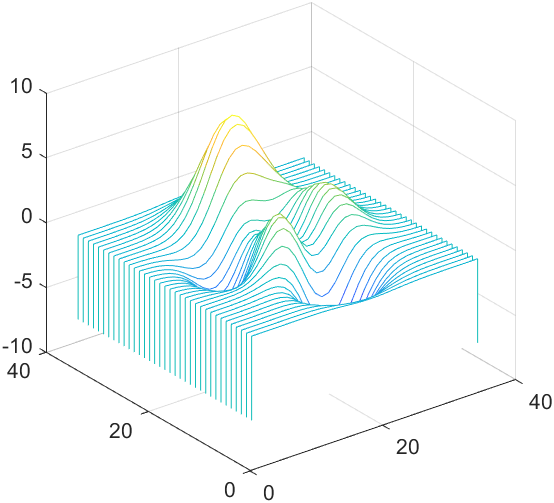
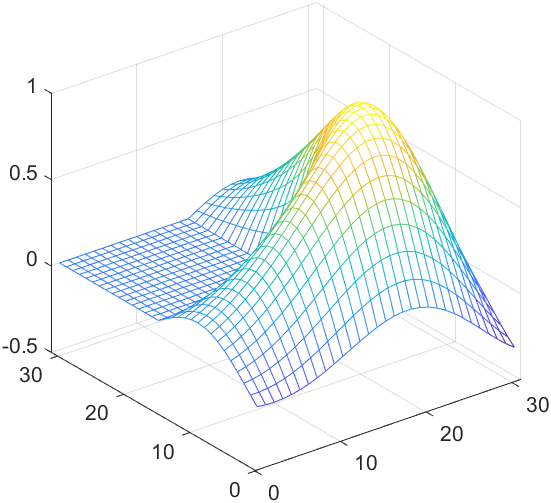

# 网络科学基础第五次上级报告

## 一、上机题目

Matlab 图形界面GUI编程以及小世界网络模型的生成。

## 二、上机目的

上机目的：通过本次实验，掌握Matlab图形界面（GUI）编程方法，能够利用`guide`设计并实现图形界面的控件、菜单等功能；学习并实现小世界网络模型的生成，掌握如何根据特定的模型参数（如节点数、邻居数、重连概率等）构造网络并进行可视化展示；通过编程实现Pajek格式的网络数据输出，为后续的网络分析和研究提供基础。

## 三、上机程序

### Matlab GUI编程

首先使用guide设计窗口UI，利用`guide`指令打开工具并设计。


补充代码

```matlab
function varargout = GUIPlot(varargin)
% GUIPLOT MATLAB code for GUIPlot.fig
%      GUIPLOT, by itself, creates a new GUIPLOT or raises the existing
%      singleton*.
%
%      H = GUIPLOT returns the handle to a new GUIPLOT or the handle to
%      the existing singleton*.
%
%      GUIPLOT('CALLBACK',hObject,eventData,handles,...) calls the local
%      function named CALLBACK in GUIPLOT.M with the given input arguments.
%
%      GUIPLOT('Property','Value',...) creates a new GUIPLOT or raises the
%      existing singleton*.  Starting from the left, property value pairs are
%      applied to the GUI before GUIPlot_OpeningFcn gets called.  An
%      unrecognized property name or invalid value makes property application
%      stop.  All inputs are passed to GUIPlot_OpeningFcn via varargin.
%
%      *See GUI Options on GUIDE's Tools menu.  Choose "GUI allows only one
%      instance to run (singleton)".
%
% See also: GUIDE, GUIDATA, GUIHANDLES

% Edit the above text to modify the response to help GUIPlot

% Last Modified by GUIDE v2.5 01-Dec-2024 14:51:03

% Begin initialization code - DO NOT EDIT
gui_Singleton = 1;
gui_State = struct('gui_Name',       mfilename, ...
                   'gui_Singleton',  gui_Singleton, ...
                   'gui_OpeningFcn', @GUIPlot_OpeningFcn, ...
                   'gui_OutputFcn',  @GUIPlot_OutputFcn, ...
                   'gui_LayoutFcn',  [] , ...
                   'gui_Callback',   []);
if nargin && ischar(varargin{1})
    gui_State.gui_Callback = str2func(varargin{1});
end

if nargout
    [varargout{1:nargout}] = gui_mainfcn(gui_State, varargin{:});
else
    gui_mainfcn(gui_State, varargin{:});
end
% End initialization code - DO NOT EDIT


% --- Executes just before GUIPlot is made visible.
function GUIPlot_OpeningFcn(hObject, ~, handles, varargin)

handles.peaks = peaks(35);              % Peaks
handles.membrance = membrane();         % Membrance
[x, y] = meshgrid(-8: .5: 8);
r = sqrt(x.^2 + y.^2) + eps;
handles.sinc = sin(r) ./ r;             % Sinc
handles.current_data = handles.peaks;
contour(handles.current_data);
handles.output = hObject;
guidata(hObject, handles);


% --- Outputs from this function are returned to the command line.
function varargout = GUIPlot_OutputFcn(~, ~, handles) 
% varargout  cell array for returning output args (see VARARGOUT);
% hObject    handle to figure
% eventdata  reserved - to be defined in a future version of MATLAB
% handles    structure with handles and user data (see GUIDATA)

% Get default command line output from handles structure
varargout{1} = handles.output;


% --- Executes on selection change in peaks_popupmenu.
function peaks_popupmenu_Callback(hObject, ~, handles)
% hObject    handle to peaks_popupmenu (see GCBO)
% eventdata  reserved - to be defined in a future version of MATLAB
% handles    structure with handles and user data (see GUIDATA)

% Hints: contents = cellstr(get(hObject,'String')) returns peaks_popupmenu contents as cell array
%        contents{get(hObject,'Value')} returns selected item from peaks_popupmenu
str = get(hObject, 'String');
val = get(hObject, 'Value');
% Set current data to the selected data set
switch str{val};
    case 'Peaks'
        handles.current_data = handles.peaks;
    case 'Membrance'
        handles.current_data = handles.membrance;
    case 'Sinc'
        handles.current_data = handles.sinc;
end

guidata(hObject, handles)


% --- Executes during object creation, after setting all properties.
function peaks_popupmenu_CreateFcn(hObject, ~, ~)
    % hObject    handle to peaks_popupmenu (see GCBO)
    % eventdata  reserved - to be defined in a future version of MATLAB
    % handles    empty - handles not created until after all CreateFcns called

    % Hint: popupmenu controls usually have a white background on Windows.
    %       See ISPC and COMPUTER.
if ispc && isequal(get(hObject, 'BackgroundColor'), get(0, 'defaultUicontrolBackgroundColor'))
    set(hObject, 'BackgroundColor', 'white');
end

set(hObject, 'String', {'Peaks', 'Membrance', 'Sinc'});


% --- Executes on button press in contour_pushbutton.
function contour_pushbutton_Callback(~, ~, handles)
% hObject    handle to contour_pushbutton (see GCBO)
% eventdata  reserved - to be defined in a future version of MATLAB
% handles    structure with handles and user data (see GUIDATA)
contour(handles.current_data);

% --- Executes on button press in surf_button.
function surf_button_Callback(~, ~, handles)
% hObject    handle to surf_button (see GCBO)
% eventdata  reserved - to be defined in a future version of MATLAB
% handles    structure with handles and user data (see GUIDATA)
surf(handles.current_data);


% --- Executes on button press in mesh_pushbutton.
function mesh_pushbutton_Callback(~, ~, handles)
% hObject    handle to mesh_pushbutton (see GCBO)
% eventdata  reserved - to be defined in a future version of MATLAB
% handles    structure with handles and user data (see GUIDATA)
mesh(handles.current_data);

% --- Executes on button press in waterfall_pushbutton.
function waterfall_pushbutton_Callback(~, ~, handles)
% hObject    handle to waterfall_pushbutton (see GCBO)
% eventdata  reserved - to be defined in a future version of MATLAB
% handles    structure with handles and user data (see GUIDATA)

waterfall(handles.current_data);
```

运行代码，得到以下图片

<div style="display: flex; flex-wrap: wrap; justify-content: space-around;">
  
  
  
  
  
  
  
  
  
</div>


### 小世界网络模型

首先编写一个转换成Pajek网络文件的函数

```matlab
function matlab_to_pajek(A)
    % 打开文件保存数据
    fid = fopen('network.net', 'w');
    
    % 写入Pajek格式的头部
    fprintf(fid, '*Vertices %d\n', size(A, 1));
    for i = 1:size(A, 1)
        fprintf(fid, '%d "%d"\n', i, i);
    end
    
    % 写入边信息
    fprintf(fid, '*Edges\n');
    for i = 1:size(A, 1) - 1
        for j = i + 1:size(A, 1)
            if A(i, j) == 1
                fprintf(fid, '%d %d\n', i, j);
            end
        end
    end
    fclose(fid);
end

```

WS小世界模型

```matlab
clc;
clear;

% 初始化参数
N = 20;  % 网络节点总数
K = 4;   % 邻域节点个数
p = 0.2; % 重连概率

hold on;

% 生成节点坐标
t = 0:2 * pi / N:2 * pi - 2 * pi / N;
x = 100 * sin(t);
y = 100 * cos(t);

% 绘制节点
plot(x, y, 'ro', 'MarkerEdgeColor', 'g', 'MarkerFaceColor', 'r', 'MarkerSize', 6);

% 邻接矩阵初始化
A = zeros(N);

% 构造邻接矩阵
for i = 1:N
    for j = i+1:i+K/2
        jj = (j <= N) * j + (j > N) * mod(j, N); 
        A(i, jj) = 1;
        A(jj, i) = 1;
    end
end

% 随机重连
for i = 1:N
    for j = i+1:i+K/2
        jj = (j <= N) * j + (j > N) * mod(j, N);
        ChangeV = randi([1, N]); % 生成随机整数

        % 判断是否重连
        if rand <= p && A(i, ChangeV) == 0 && i ~= ChangeV
            A(i, jj) = 0;
            A(jj, i) = 0;
            A(i, ChangeV) = 1;
            A(ChangeV, i) = 1;
        end
    end
end

% 绘制边
for i = 1:N-1
    for j = i+1:N
        if A(i, j) ~= 0
            plot([x(i), x(j)], [y(i), y(j)], 'LineWidth', 1.2);
        end
    end
end

% 转换为 Pajek 格式
matlab_to_pajek(A);
```


NW小世界模型

```matlab
clc;
clear;
clf;
% 初始化参数
N = 20;  % 网络节点总数
K = 4;   % 每个节点的邻居节点个数（即局部连边的数量）
p = 0.1; % 随机加边的概率（减小此值可以降低密度）

hold on;

% 生成节点坐标
t = 0:2 * pi / N:2 * pi - 2 * pi / N;
x = 100 * sin(t);
y = 100 * cos(t);

% 绘制节点
plot(x, y, 'ro', 'MarkerEdgeColor', 'g', 'MarkerFaceColor', 'r', 'MarkerSize', 6);

% 邻接矩阵初始化
A = zeros(N);

% 构造环状邻接矩阵（规则网络）
for i = 1:N
    for j = 1:K/2
        % 与i的邻居节点相连，i与j的编号需要循环回绕
        neighbor = mod(i + j - 1, N) + 1;
        A(i, neighbor) = 1;
        A(neighbor, i) = 1;
    end
end

% 控制加边概率，调整密度
edges_to_add = 0;  % 记录已经添加的边的数量
max_edges = floor(N * (N - 1) / 2 * p); % 根据给定概率 p 计算最大可添加的边数

% 随机加边
for i = 1:N
    for j = i+1:N  % 遍历所有未连接的节点对 (i, j)
        if A(i, j) == 0 && rand() <= p && edges_to_add < max_edges  % 仅对未连接的节点对添加边
            A(i, j) = 1;  % 添加边
            A(j, i) = 1;  % 无向图，保证对称
            edges_to_add = edges_to_add + 1;  % 增加边计数
        end
    end
end

% 打印生成的边数和密度
disp(['Total edges added: ', num2str(edges_to_add)]);
density = sum(A(:)) / (N * (N - 1));
disp(['Network density: ', num2str(density)]);

% 绘制网络边
for i = 1:N-1
    for j = i+1:N
        if A(i, j) ~= 0
            plot([x(i), x(j)], [y(i), y(j)], 'LineWidth', 1.2);
        end
    end
end

% 转换为 Pajek 格式
matlab_to_pajek(A);

```


## 四、上机感悟

上机感悟：通过本次实验，我对Matlab图形界面（GUI）的设计和编程有了更深入的理解。使用`guide`工具设计窗口UI，虽然界面简单，但能够直观地看到不同按钮和菜单的交互效果，非常有助于提升用户体验。在小世界网络模型部分，成功地实现了通过参数生成小世界网络并进行可视化展示，深入理解了小世界网络的特性，如节点重连、连接概率对网络结构的影响等。在实践中，我学会了如何在Matlab中实现复杂的数学模型，并通过图形化的方式将结果展示出来，这不仅提升了我的编程技能，也加深了我对网络科学和Matlab的应用能力的理解。同时，通过生成Pajek格式的文件，我也了解到了如何将网络数据保存为标准格式，以便进行进一步分析。
