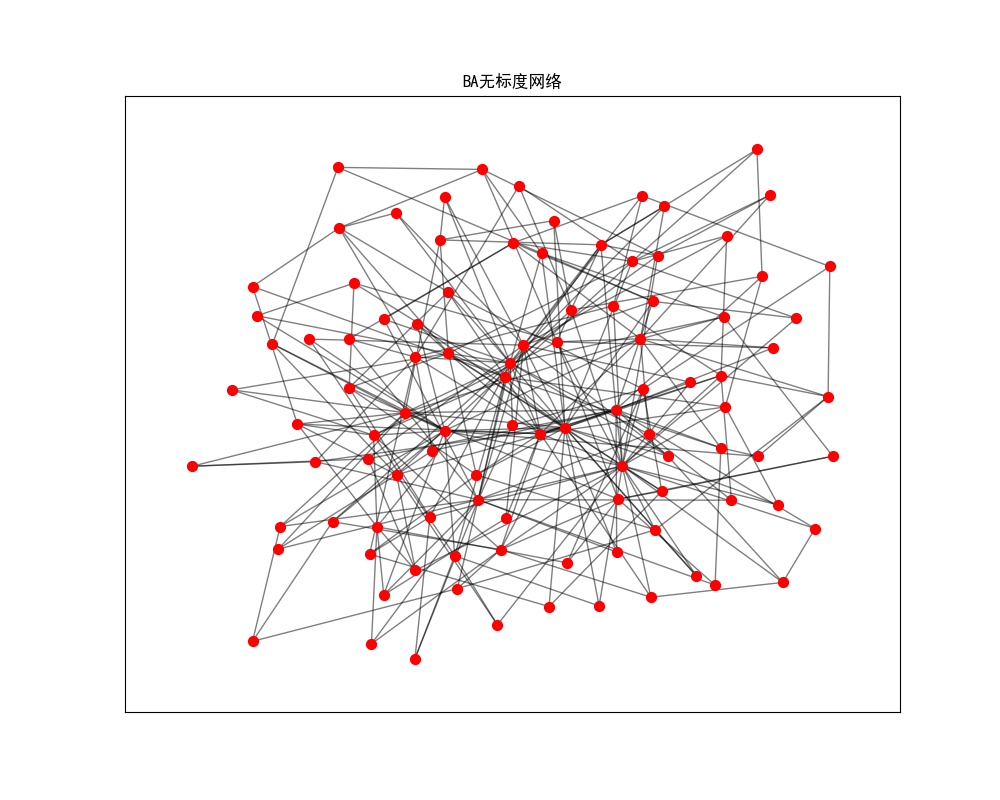
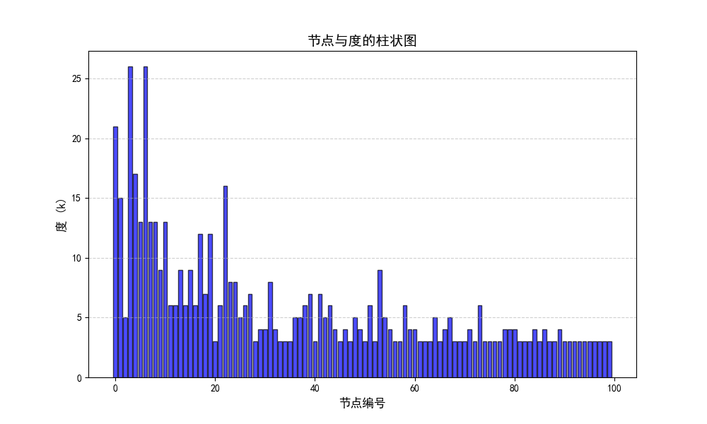
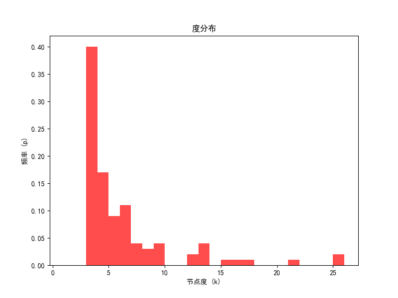

<center><h1>网络科学基础第六次上级报告</h1></center>

班级：物联网2303	姓名：盛子涵	学号：3230611081
上机日期：2024.12.07，第十四周周五下午七八节课
2024秋 - 网络科学基础（物联网2303）- 第六次上机报告

## 一、上机题目

完成BA网络的生成和GUI编程


## 二、上机目的

1. 掌握复杂网络生成的基本原理与编程方法，特别是BA无标度网络的生成过程。
2. 学习和应用Python的网络分析工具（如NetworkX），理解如何通过编程实现网络的可视化与统计特性分析。
3. 深入理解PageRank算法的核心思想与实现细节，通过交互式界面（GUI）开发，提升算法的实际应用能力。
4. 熟悉图形用户界面（GUI）的设计与开发，利用Python工具如Tkinter和Matplotlib，实现网络模型生成与算法交互的直观展示。
5. 强化理论与实践的结合能力，进一步巩固复杂网络与算法在实际场景中的应用技巧。


## 三、上机程序

### 生成BA无标度网络

BA无标度网络是一种常见的复杂网络模型，关键特性是节点度分布遵循幂律分布，即极少两节点具有极高的连接数（陈伟枢纽节点），而大多数节点的连接数较少。

幂律分布的概率密度函数为：$$P(k) ~ k^{-\gamma}$$ 其中 $$k$$ 表示节点的度，$$\gamma$$ 比是幂律指数，通常在BA模型中 $$\gamma \approx 2.9$$。这种分布意味着网络中有少数”超级枢纽“节点，承担了大量连接。大部分节点的度较小。

BA模型的生成过程，初始网络由 $$m_0$$ 个节点组成，可以是孤立点，完全图或者稀疏图。每次新增一个节点，生成 $$m$$ 条新边，新边的连接目标节点按照现有节点的度分布概率选择。

```python
"""
BA_network.py
date: 2024-12-10
"""

import numpy as np
import networkx as nx
import matplotlib.pyplot as plt

plt.rcParams["font.sans-serif"] = ["SimHei"]
plt.rcParams["axes.unicode_minus"] = False

m0 = int(input("请输入未增长前的网络节点个数 m0: "))
m = int(input("请输入每次引入新节点时新生成的边数 m: "))
N = int(input("请输入增长后的网络节点总数 N: "))
se = int(input("请选择初始网络情况 1（孤立点）, 2（完全图）, 或 3（随机稀疏图）: "))

if m > m0:
    print("输入参数 m 不合法")
    exit()

# 构造初始网络
if se == 1:
    G = nx.empty_graph(m0)  # 孤立点
elif se == 2:
    G = nx.complete_graph(m0)  # 完全图
elif se == 3:
    G = nx.gnp_random_graph(m0, 0.1)  # 按概率0.1生成随机稀疏图
else:
    print("无效选择")
    exit()

# BA网络生成
new_node = m0
while new_node < N:
    # 获取现有节点的度
    degrees = np.array([G.degree(n) for n in G.nodes()])
    degree_sum = np.sum(degrees)

    # 计算连接概率
    probabilities = (degrees + 1) / (degree_sum + len(degrees))  # 防止度为零
    chosen_nodes = np.random.choice(
        G.nodes(), size=m, replace=False, p=probabilities
    )  # 根据概率选择节点

    # 添加新节点并连接
    G.add_node(new_node)
    G.add_edges_from((new_node, target) for target in chosen_nodes)

    new_node += 1

# 绘图
pos = nx.spring_layout(G)  # 使用弹簧布局绘图
plt.figure(figsize=(10, 8))
nx.draw_networkx_nodes(G, pos, node_color="r", node_size=50)
nx.draw_networkx_edges(G, pos, alpha=0.5)
plt.title("BA无标度网络")
plt.show()

# 计算节点度
degrees = dict(G.degree())  # 返回节点及其对应的度

# 绘制柱状图
plt.figure(figsize=(10, 6))
plt.bar(degrees.keys(), degrees.values(), color="blue", alpha=0.7, edgecolor="black")
plt.title("节点与度的柱状图", fontsize=14)
plt.xlabel("节点编号", fontsize=12)
plt.ylabel("度 (k)", fontsize=12)
plt.grid(axis="y", linestyle="--", alpha=0.6)
plt.show()

# 计算并绘制度分布
degrees = [d for _, d in G.degree()]
plt.figure(figsize=(8, 6))
plt.hist(degrees, bins=range(1, max(degrees) + 1), density=True, color="r", alpha=0.7)
plt.title("度分布")
plt.xlabel("节点度 (k)")
plt.ylabel("频率 (p)")
#plt.grid(True)
plt.show()

# 打印网络平均度
average_degree = 2 * G.number_of_edges() / G.number_of_nodes()
print(f"网络平均度: {average_degree:.2f}")
```

编程中通过节点度计算连接概率，通常使用归一化度分布。计算概率时对度加1，避免度为0得到节点无法被选择，防止孤立节点。每次新增节点时实时更新网络结构和度分布。

上级程序生成的BA无标度网络可以观察到以下现象，网络中少数节点具有极高的度，绘制度分布直方图时，度的频率分布接近幂律分布。通过网络的边数和节点数计算网络平均度，可以验证网络的基本特性。








### GUI程序

该GUI程序的功能包括：

1. **网络生成**：支持随机网络和小世界网络的生成，用户可通过输入节点数、概率或重连率等参数自定义网络特性。
2. **PageRank计算**：支持基于用户指定的随机跳转概率计算网络中节点的重要性，并通过弹窗展示结果。
3. **网络可视化**：使用Matplotlib绘制生成的网络拓扑结构，直观展示节点和边的分布。

**调用NetworkX的`pagerank`函数**

```python
pr = nx.pagerank(self.graph, alpha=alpha)
```

- **`self.graph`**: 传入的图对象，包含节点和边的信息。
- **`alpha`**: 用户输入的随机跳转概率 α\alphaα。
- **默认迭代法**: `pagerank` 使用幂迭代法（Power Iteration）计算 PageRank，反复更新每个节点的值直到收敛。


**图的创建**，通过python networkx方法来生成ER随机网络和WS小世界网络

```python
nx.erdos_renyi_graph(N, p) # ER随机图
nx.watts_strogatz_graph(N, k, p) # WS小世界
```

**网络生成**
根据用户选择的网络类型，调用NetworkX的生成函数：

- **随机网络**：使用ER随机网络模型生成。

- **小世界网络**：基于WS小世界网络模型生成。

  其中，WS小世界网络总边数为 $$M = \frac{N k}{2}$$ 重联概率为p，那么可以的得出重连边数的期望E为
  $$
  E = M \cdot p = \frac{N k}{2} \cdot p
  $$

**PageRank计算**

其中函数参数`alpha`是随机跳转概率，也称为阻尼系数，默认为0.85，原公式和networkx的方法如下
$$
PR_i(k) = s \sum_{j = 1}^{N} \bar{a}_{ji} PR_j(k - 1) + \frac{1 - s}{N}
$$

```python
pr = nx.pagerank(self.graph, alpha=alpha)
pr_values = "\n".join([f"节点 {node}: {value:.4f}" for node, value in pr.items()])
```

**完整程序**

```python
import tkinter as tk
from tkinter import ttk
import networkx as nx
import matplotlib.pyplot as plt
from matplotlib.backends.backend_tkagg import FigureCanvasTkAgg

class NetworkGUI:
    def __init__(self, root):
        self.root = root
        self.root.title("网络模型与PageRank计算")
        self.root.geometry("800x600")

        self.create_widgets()

    def create_widgets(self):
        # Panel
        frame_controls = tk.Frame(self.root)
        frame_controls.pack(side=tk.LEFT, fill=tk.Y, padx=10, pady=10)

        tk.Label(frame_controls, text="选择网络类型:").pack(pady=5)
        self.network_type = ttk.Combobox(frame_controls, values=["随机网络", "小世界网络"])
        self.network_type.pack(pady=5)
        self.network_type.current(0)

        tk.Label(frame_controls, text="参数:").pack(pady=5)
        tk.Label(frame_controls, text="节点数 (N):").pack()
        self.entry_N = tk.Entry(frame_controls)
        self.entry_N.pack()

        tk.Label(frame_controls, text="概率/重连率 (p):").pack()
        self.entry_p = tk.Entry(frame_controls)
        self.entry_p.pack()

        tk.Label(frame_controls, text="随机跳转概率 (alpha):").pack()
        self.entry_alpha = tk.Entry(frame_controls)
        self.entry_alpha.pack()

        tk.Button(frame_controls, text="生成网络", command=self.generate_network).pack(pady=10)

        self.frame_canvas = tk.Frame(self.root)
        self.frame_canvas.pack(side=tk.RIGHT, expand=True, fill=tk.BOTH)

    def generate_network(self):
        try:
            N = int(self.entry_N.get())
            p = float(self.entry_p.get())
            alpha = float(self.entry_alpha.get())
        except ValueError:
            self.show_error("请正确输入数值参数！")
            return

        # generate network
        net_type = self.network_type.get()
        if net_type == "随机网络":
            self.graph = nx.erdos_renyi_graph(N, p)
        elif net_type == "小世界网络":
            self.graph = nx.watts_strogatz_graph(N, k=int(p * N), p=0.1)
        else:
            self.show_error("请选择正确的网络类型！")
            return

        self.plot_network()

        self.calculate_pagerank(alpha)

    def calculate_pagerank(self, alpha):
        if not hasattr(self, "graph"):
            self.show_error("请先生成网络！")
            return

        # PageRank
        pr = nx.pagerank(self.graph, alpha=alpha)
        pr_values = "\n".join([f"节点 {node}: {value:.4f}" for node, value in pr.items()])

        self.show_message("PageRank 值", pr_values)
        print(pr_values)

    def plot_network(self):
        for widget in self.frame_canvas.winfo_children():
            widget.destroy()

        fig, ax = plt.subplots(figsize=(6, 5))
        pos = nx.spring_layout(self.graph)
        nx.draw(self.graph, pos, ax=ax, with_labels=True, node_color="skyblue", edge_color="gray", node_size=500, font_size=10)

        # Matplotlib figure
        canvas = FigureCanvasTkAgg(fig, master=self.frame_canvas)
        canvas.draw()
        canvas.get_tk_widget().pack(fill=tk.BOTH, expand=True)

    def show_error(self, message):
        tk.messagebox.showerror("错误", message)

    def show_message(self, title, message):
        tk.messagebox.showinfo(title, message)

if __name__ == "__main__":
    root = tk.Tk()
    app = NetworkGUI(root)
    root.mainloop()
```

**PageRank计算**
利用NetworkX的`pagerank`函数，基于网络的邻接矩阵和用户指定的α\alphaα计算PageRank值。


## 四、上机感悟

通过本次实验，深入了解了GUI开发、复杂网络生成以及PageRank算法的应用。将理论与编程实践相结合，不仅提升了对算法细节的理解，还强化了编程能力。

在开发过程中，GUI的布局与功能调试是一个挑战，通过不断调整控件位置与功能逻辑，最终实现了直观且交互友好的界面设计。此外，嵌入式绘图技术的学习，让网络拓扑的动态可视化更加直观。

本次实验让我认识到，将数学模型、算法与实际应用结合，能够更好地理解理论背后的意义，同时也增强了我解决问题的综合能力。