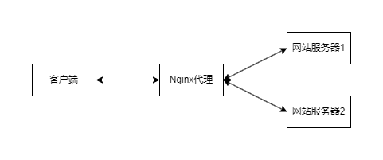
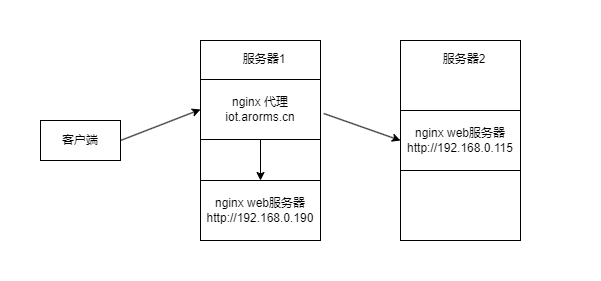
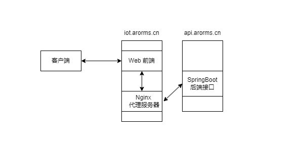

# Nginx Web 服务器的配置与管理

<center>
    姓名：盛子涵 学号：3230611081 日期：2024-12-03
</center>
<hr>

## 6.1 预备知识  

- 熟悉DNS、HTTP、HTTPS协议的工作原理  

在客户端首次访问域名时，首先会访问DNS解析域名，然后再访问服务器。

## 6.2 Nginx 的配置  

### 6.2.1 实验目的  

1. 了解Nginx的工作原理，掌握Nginx的安装与配置方法；
2. 掌握在一台nginx服务器上配置运行多个网站的方法；
3. 了解Nginx负载均衡的实现原理，能够利用Nginx进行负载均衡；
4. 了解Nginx访问控制的实现原理，能够利用Nginx进行访问控制。  

### 6.2.2 实验内容  

#### 1. 安装Nginx

首先安装Nginx

```bash
apt install nginx -y
```

```
cacc@purgatory-v:~$ sudo apt install nginx
[sudo] password for cacc:
Reading package lists... Done
Building dependency tree... Done
Reading state information... Done
The following additional packages will be installed:
  iproute2 libatm1 libbpf0 libcap2-bin libdeflate0 libelf1 libgd3 libjbig0 libmaxminddb0 libmnl0 libnginx-mod-http-geoip2
  libnginx-mod-http-image-filter libnginx-mod-http-xslt-filter libnginx-mod-mail libnginx-mod-stream
  libnginx-mod-stream-geoip2 libpam-cap libpam-runtime libtiff5 libwebp7 libx11-6 libx11-data libxau6 libxcb1 libxdmcp6
  libxpm4 libxslt1.1 libxtables12 nginx-common nginx-core
Suggested packages:
  iproute2-doc libgd-tools mmdb-bin fcgiwrap nginx-doc ssl-cert
The following NEW packages will be installed:
  iproute2 libatm1 libbpf0 libcap2-bin libdeflate0 libelf1 libgd3 libjbig0 libmaxminddb0 libmnl0 libnginx-mod-http-geoip2
  libnginx-mod-http-image-filter libnginx-mod-http-xslt-filter libnginx-mod-mail libnginx-mod-stream
  libnginx-mod-stream-geoip2 libpam-cap libpam-runtime libtiff5 libwebp7 libx11-6 libx11-data libxau6 libxcb1 libxdmcp6
  libxpm4 libxslt1.1 libxtables12 nginx nginx-common nginx-core
0 upgraded, 31 newly installed, 0 to remove and 1 not upgraded.
Need to get 3,800 kB of archives.
After this operation, 12.3 MB of additional disk space will be used.
```

尝试启动Nginx服务

```bash
sudo systemctl start nginx
sudo systemctl status nginx
```

```
cacc@purgatory-v:~$ sudo systemctl status nginx
○ nginx.service - A high performance web server and a reverse proxy server
     Loaded: loaded (/lib/systemd/system/nginx.service; disabled; vendor preset: enabled)
     Active: inactive (dead)
       Docs: man:nginx(8)
cacc@purgatory-v:~$ sudo systemctl start nginx
Job for nginx.service failed because the control process exited with error code.
See "systemctl status nginx.service" and "journalctl -xeu nginx.service" for details.
cacc@purgatory-v:~$ systemctl status nginx
× nginx.service - A high performance web server and a reverse proxy server
     Loaded: loaded (/lib/systemd/system/nginx.service; disabled; vendor preset: enabled)
     Active: failed (Result: exit-code) since Mon 2024-12-02 21:48:37 CST; 10s ago
       Docs: man:nginx(8)
    Process: 3330 ExecStartPre=/usr/sbin/nginx -t -q -g daemon on; master_process on; (code=exited, status=0/SUCCESS)
    Process: 3331 ExecStart=/usr/sbin/nginx -g daemon on; master_process on; (code=exited, status=1/FAILURE)
        CPU: 51ms

Dec 02 21:48:35 purgatory-v nginx[3331]: nginx: [emerg] bind() to 0.0.0.0:80 failed (98: Unknown error)
Dec 02 21:48:35 purgatory-v nginx[3331]: nginx: [emerg] bind() to [::]:80 failed (98: Unknown error)
Dec 02 21:48:36 purgatory-v nginx[3331]: nginx: [emerg] bind() to 0.0.0.0:80 failed (98: Unknown error)
Dec 02 21:48:36 purgatory-v nginx[3331]: nginx: [emerg] bind() to [::]:80 failed (98: Unknown error)
Dec 02 21:48:36 purgatory-v nginx[3331]: nginx: [emerg] bind() to 0.0.0.0:80 failed (98: Unknown error)
Dec 02 21:48:36 purgatory-v nginx[3331]: nginx: [emerg] bind() to [::]:80 failed (98: Unknown error)
Dec 02 21:48:37 purgatory-v nginx[3331]: nginx: [emerg] still could not bind()
Dec 02 21:48:37 purgatory-v systemd[1]: nginx.service: Control process exited, code=exited, status=1/FAILURE
Dec 02 21:48:37 purgatory-v systemd[1]: nginx.service: Failed with result 'exit-code'.
Dec 02 21:48:37 purgatory-v systemd[1]: Failed to start A high performance web server and a reverse proxy server.
```

发现无法启动，后来想起来我在这个服务器上的SpringBoot测试项目占用了80端口，关闭后尝试重启发现启动成功。

```

cacc@purgatory-v:~$ sudo systemctl stop demo
cacc@purgatory-v:~$ sudo systemctl restart nginx
cacc@purgatory-v:~$ systemctl status nginx
● nginx.service - A high performance web server and a reverse proxy server
     Loaded: loaded (/lib/systemd/system/nginx.service; disabled; vendor preset: enabled)
     Active: active (running) since Mon 2024-12-02 21:50:44 CST; 3s ago
       Docs: man:nginx(8)
    Process: 4117 ExecStartPre=/usr/sbin/nginx -t -q -g daemon on; master_process on; (code=exited, status=0/SUCCESS)
    Process: 4118 ExecStart=/usr/sbin/nginx -g daemon on; master_process on; (code=exited, status=0/SUCCESS)
   Main PID: 4119 (nginx)
      Tasks: 5 (limit: 9261)
     Memory: 4.8M
        CPU: 28ms
     CGroup: /system.slice/nginx.service
             ├─4119 "nginx: master process /usr/sbin/nginx -g daemon on; master_process on;"
             ├─4120 "nginx: worker process" "" "" "" "" "" "" "" "" "" "" "" "" >
             ├─4121 "nginx: worker process" "" "" "" "" "" "" "" "" "" "" "" "" >
             ├─4122 "nginx: worker process" "" "" "" "" "" "" "" "" "" "" "" "" >
             └─4123 "nginx: worker process" "" "" "" "" "" "" "" "" "" "" "" "" >

Dec 02 21:50:44 purgatory-v systemd[1]: Starting A high performance web server and a reverse proxy server...
Dec 02 21:50:44 purgatory-v systemd[1]: Started A high performance web server and a reverse proxy server.
cacc@purgatory-v:~$
```


<hr>

#### 2. 使用启用其他端口

更改nginx的网站设置，在`\etc\nginx\sites-avialable`

```bash
sudo cp default default-8080
sudo vim default-8080
```

```ini
server {
        listen 8080 default_server;
        listen [::]:8080 default_server;
        root /var/www/html;
        index index.html index.htm index.nginx-debian.html;
        server_name _;
        location / {
                try_files $uri $uri/ =404;
        }
}
```

设置好后，创建快捷方式到上级目录的启用文件夹的`sites-enbales`，这里是启用的配置文件，然后测试以下nginx配置文件语法是否正确。

```bash
sudo ln -s /etc/nginx/sites-available/default-8080 /etc/nginx/sites-enabled/
sudo nginx -t
```

```
cacc@purgatory-v:/etc/nginx $ sudo nginx -t
nginx: the configuration file /etc/nginx/nginx.conf syntax is ok
nginx: configuration file /etc/nginx/nginx.conf test is successful
```

随后重启Nginx服务，随即访问相应连接，测试成功。

```bash
sudo systemctl restart nginx
```


<hr>

#### 3. 均衡负载

通过Nginx实现均衡负载，首先需要两个作为网站服务器的主机，以及一个代理服务器。代理服务器作为与客户端的窗口，处理客户端的请求。首先客户端发送请求给代理，代理再根据相关算法，将请求接给后端服务器，例如轮询和最小连接数算法，将服务器的压力分散，实现均衡负载



首先在另一台设备中安装nginx并开启服务


在这里，192.168.0.115是另一台服务器。将本服务器设置好后无需再设置其他。回到192.168.0.190这个服务器，设置Nginx反向代理，实现均衡负载。

```bash
sudo vim sites-available/balance
sudo ln -s /etc/nginx/sites-available/balance /etc/nginx/sites-enabled/
```


在这里，首先设置后端服务器的列表，这里有两个后端服务器，一个是本身服务器，这里可以填写localhost，另一个则是刚刚建立的192.168.0.115。这里设置了域名分别，也就是通过域名`iot.arorms.cn`访问机器时（域名解析已经设置成192.168.0.190），就会访问到这个虚拟主机的服务端，并根据这个代理实现均衡负载访问服务器，而IP直接访问则是直接访问。

```ini
upstream backend {
    server localhost;
    server 192.168.0.115;
}

server {
    listen 80;
    server_name iot.arorms.cn;

    location / {
        proxy_pass http://backend;
        proxy_set_header Host $host;
        proxy_set_header X-Real-IP $remote_addr;
        proxy_set_header X-Forwarded-For $proxy_add_x_forwarded_for;
        proxy_set_header X-Forwarded-Proto $scheme;
    }
}
```

```bash
sudo nginx -t
sudo systemctl restart nginx
```

```bash
cacc@purgatory-v:nginx/sites-enabled $ systemctl restart nginx
==== AUTHENTICATING FOR org.freedesktop.systemd1.manage-units ====
Authentication is required to restart 'nginx.service'.
Authenticating as: Cacciatore (cacc)
Password:
==== AUTHENTICATION COMPLETE ====
```




访问代理设置的域名，即为`iot.arorms.cn`，访问成功。这里可以直接确定实现了均衡负载，因为在这个设置中，没有写网站的根目录，而代理直接转发给了之前设置的默认配置的网站，说明已经实现了转发。


还可以查看日志，验证是否成功

```bash
sudo tail -f /var/log/nginx/access.log
```

```bash
cacc@purgatory-v:nginx/sites-enabled $ sudo tail -f /var/log/nginx/access.log

192.168.0.158 - - [03/Dec/2024:15:11:59 +0800] "GET / HTTP/1.1" 304 0 "-" "Mozilla/5.0 (Windows NT 10.0; Win64; x64) AppleWebKit/537.36 (KHTML, like Gecko) Chrome/131.0.0.0 Safari/537.36"
192.168.0.190 - - [03/Dec/2024:15:11:59 +0800] "GET / HTTP/1.0" 304 0 "-" "Mozilla/5.0 (Windows NT 10.0; Win64; x64) AppleWebKit/537.36 (KHTML, like Gecko) Chrome/131.0.0.0 Safari/537.36"
192.168.0.158 - - [03/Dec/2024:15:11:59 +0800] "GET / HTTP/1.1" 304 0 "-" "Mozilla/5.0 (Windows NT 10.0; Win64; x64) AppleWebKit/537.36 (KHTML, like Gecko) Chrome/131.0.0.0 Safari/537.36"
192.168.0.190 - - [03/Dec/2024:15:11:59 +0800] "GET / HTTP/1.0" 304 0 "-" "Mozilla/5.0 (Windows NT 10.0; Win64; x64) AppleWebKit/537.36 (KHTML, like Gecko) Chrome/131.0.0.0 Safari/537.36"
192.168.0.158 - - [03/Dec/2024:15:11:59 +0800] "GET / HTTP/1.1" 304 0 "-" "Mozilla/5.0 (Windows NT 10.0; Win64; x64) AppleWebKit/537.36 (KHTML, like Gecko) Chrome/131.0.0.0 Safari/537.36"
192.168.0.190 - - [03/Dec/2024:15:11:59 +0800] "GET / HTTP/1.0" 304 0 "-" "Mozilla/5.0 (Windows NT 10.0; Win64; x64) AppleWebKit/537.36 (KHTML, like Gecko) Chrome/131.0.0.0 Safari/537.36"
192.168.0.158 - - [03/Dec/2024:15:11:59 +0800] "GET / HTTP/1.1" 304 0 "-" "Mozilla/5.0 (Windows NT 10.0; Win64; x64) AppleWebKit/537.36 (KHTML, like Gecko) Chrome/131.0.0.0 Safari/537.36"
192.168.0.158 - - [03/Dec/2024:15:11:59 +0800] "GET / HTTP/1.1" 304 0 "-" "Mozilla/5.0 (Windows NT 10.0; Win64; x64) AppleWebKit/537.36 (KHTML, like Gecko) Chrome/131.0.0.0 Safari/537.36"
192.168.0.190 - - [03/Dec/2024:15:11:59 +0800] "GET / HTTP/1.0" 304 0 "-" "Mozilla/5.0 (Windows NT 10.0; Win64; x64) AppleWebKit/537.36 (KHTML, like Gecko) Chrome/131.0.0.0 Safari/537.36"
192.168.0.158 - - [03/Dec/2024:15:11:59 +0800] "GET / HTTP/1.1" 304 0 "-" "Mozilla/5.0 (Windows NT 10.0; Win64; x64) AppleWebKit/537.36 (KHTML, like Gecko) Chrome/131.0.0.0 Safari/537.36"
```

这里日志显示交替两个IP返回客户端请求，说明这里Nginx使用的是默认的**轮询**方法，做到均衡负载。

在这里有可能会出现两个错误，需要注意。

1. `413` Request Header or Cookie too large

   这个可能是因为Nginx默认设置的请求头和Cookie限制，前往`/etc/nginx/nginx.conf`修改即可，在http块中添加如下两行。

   ```ini
   http {
       client_max_body_size 50M;			   	# 调整请求体大小（默认1M）
       large_client_header_buffers 4 16k;		# 调整请求头缓冲区大小
       ...
   }
   ```

2. `500` Internal Server Error

   这可能是因为设置的后端服务器列表中的服务器无法访问导致错误，需要查看是否可以连接。

   ```bash
   curl -I http://192.168.0.190
   curl -I http://192.168.0.115
   ```

   必须返回以下头部才说明服务器可访问。

   ```bash
   HTTP/1.1 200 OK
   Server: nginx/1.18.0 (Ubuntu)
   Date: Tue, 03 Dec 2024 07:03:58 GMT
   Content-Type: text/html
   Content-Length: 612
   Last-Modified: Tue, 15 Oct 2024 01:14:07 GMT
   Connection: keep-alive
   ETag: "670dc1df-264"
   Accept-Ranges: bytes
   
   HTTP/1.1 200 OK
   Server: nginx/1.22.1
   Date: Tue, 03 Dec 2024 07:03:59 GMT
   Content-Type: text/html
   Content-Length: 615
   Last-Modified: Tue, 03 Dec 2024 01:39:40 GMT
   Connection: keep-alive
   ETag: "674e615c-267"
   Accept-Ranges: bytes
   ```

   在第四个实验中，为了减少不必要的麻烦，暂时关闭代理。删除`sites-enabled`下的balance，这里只是删除了它的快捷方式，配置文件仍然在`sites-available`中，不过因为没有在enabled文件夹中创建快捷方式，所以这个设置没有被启动。

   ```bash
   cacc@purgatory-v:nginx/sites-enabled $ sudo rm balance
   cacc@purgatory-v:nginx/sites-enabled $ sudo systemctl restart nginx
   ```

**基于DNS解析的均衡负载**

在这里不难看出，即使已经将所有的业务分散给后端服务器，但是仍然需要通过访问代理服务器来进行访问。这个方案中，仍然需要利用代理服务器来确定连接，而且所有流量都会通过这个代理服务器。还有一种均衡负载的方法，就是通过DNS解析轮询不同服务器的IP，将所有业务均衡负载给这些服务器群，使其能够实现均衡负载。


在这里，已经设置域名解析的DNS记录，`abc.arorms.cn`设置了三个IP，查看DNS是否生效。下面这段Java代码使用网络地址方法`InetAddress.getAllByName()`，对域名获取所有解析出来的地址。

```java
package Network;

import java.io.*;
import java.net.*;

/**
 * This program demonstrates the InetAddress class. Supply a host name as command-line
 * argument, or run without command-line arguments to see the address of the local host.
 * @version 1.02 2012-06-05
 * @author Cay Horstmann
 */
public class InetAddressTest
{
   public static void main(String[] args) throws IOException
   {
      if (args.length > 0)
      {
         String host = args[0];
         InetAddress[] addresses = InetAddress.getAllByName(host);
         for (InetAddress a : addresses)
            System.out.println(a);
      }
      else
      {
         InetAddress localHostAddress = InetAddress.getLocalHost();
         System.out.println(localHostAddress);
      }
   }
}
```

执行后发现成功实现将同一域名访问分散到不同服务器以实现均衡负载。

```
D:\Environment\jdk-21\bin\java.exe "-javaagent:D:\Development\IntelliJ IDEA 2024.1.4\lib\idea_rt.jar=36143:D:\Development\IntelliJ IDEA 2024.1.4\bin" -Dfile.encoding=UTF-8 -Dsun.stdout.encoding=UTF-8 -Dsun.stderr.encoding=UTF-8 -classpath E:\LearningProjects\Java\out\production\CoreJavaVolume;C:\Users\Holme\.m2\repository\junit\junit\4.13.1\junit-4.13.1.jar;C:\Users\Holme\.m2\repository\org\hamcrest\hamcrest-core\1.3\hamcrest-core-1.3.jar Network.InetAddressTest abc.arorms.cn
abc.arorms.cn/192.168.0.4
abc.arorms.cn/192.168.0.2
abc.arorms.cn/192.168.0.3

Process finished with exit code 0
```

```
cacc@purgatory-v:~ $ dig abc.arorms.cn	# 利用dig命令验证

; <<>> DiG 9.18.28-0ubuntu0.22.04.1-Ubuntu <<>> abc.arorms.cn
;; global options: +cmd
;; Got answer:
;; ->>HEADER<<- opcode: QUERY, status: NOERROR, id: 45124
;; flags: qr rd ra; QUERY: 1, ANSWER: 3, AUTHORITY: 6, ADDITIONAL: 12

;; OPT PSEUDOSECTION:
; EDNS: version: 0, flags:; udp: 65494
;; QUESTION SECTION:
;abc.arorms.cn.                 IN      A

;; ANSWER SECTION:
abc.arorms.cn.          600     IN      A       192.168.0.3
abc.arorms.cn.          600     IN      A       192.168.0.4
abc.arorms.cn.          600     IN      A       192.168.0.2

;; AUTHORITY SECTION:
cn.                     44639   IN      NS      c.dns.cn.
cn.                     44639   IN      NS      a.dns.cn.
cn.                     44639   IN      NS      e.dns.cn.
cn.                     44639   IN      NS      d.dns.cn.
cn.                     44639   IN      NS      b.dns.cn.
cn.                     44639   IN      NS      ns.cernet.net.

;; ADDITIONAL SECTION:
a.dns.cn.               44639   IN      A       203.119.25.1
b.dns.cn.               44639   IN      A       203.119.26.1
c.dns.cn.               44639   IN      A       203.119.27.1
d.dns.cn.               44639   IN      A       203.119.28.1
e.dns.cn.               44639   IN      A       203.119.29.1
ns.cernet.net.          44639   IN      A       202.112.0.44
a.dns.cn.               44639   IN      AAAA    2001:dc7::1
b.dns.cn.               44639   IN      AAAA    2001:dc7:1::1
c.dns.cn.               44639   IN      AAAA    2001:dc7:2::1
d.dns.cn.               44639   IN      AAAA    2001:dc7:1000::1
e.dns.cn.               44639   IN      AAAA    2001:dc7:3::1

;; Query time: 96 msec
;; SERVER: 127.0.0.53#53(127.0.0.53) (UDP)
;; WHEN: Tue Dec 03 20:28:46 CST 2024
;; MSG SIZE  rcvd: 437
```


<hr>

#### 4. 访问控制

在服务器开启Nginx的访问控制，有很多方案。

- 基于IP地址的访问控制，用于限制从其他网络连接，比如限制外部IP，放行`192.168.0.0/24`。
- 基于User-Agent的访问控制，是请求头的一个属性，标识了用户身份，比如运行正常用户通过浏览器访问网站，但是不允许爬虫直接访问爬取网站资源。
- 基于Referer的访问控制，这个用来允许或者拒绝某些来源的请求。最简单的比如只允许站内跳转到本页面。
- 基于请求方法的控制，例如只允许`GET`和`POST`方法访问。
- 基于HTTP身份验证的访问控制，为网站设置用户名和密码
- 基于时间、地理位置的访问控制。
- . . . . . .

##### HTTP身份验证

首先安装`apache2-utils`工具，用于创建和管理用户密码文件。

```bash
sudo apt-get update
sudo apt-get install apache2-utils
```

然后创建密码文件，利用`htpasswd`命令创建一个包含用户密码的文件。新建一个密码文件，并设置用户名为`cacc`。

```bash
sudo htpasswd -c /etc/nginx/.htpasswd cacc
```

```bash
cacc@purgatory-v:nginx/sites-enabled $ sudo htpasswd -c /etc/nginx/.htpasswd cacc
New password:
Re-type new password:
Adding password for user cacc
```

可以查看密码，可以看出已经被单向算法加密

```bash
cacc@purgatory-v:nginx/sites-enabled $ cat /etc/nginx/.htpasswd
cacc:$apr1$oyMbSbhj$arjSai4uK4lEwUxibxSZ/.
```

创建完密码文件后，返回默认配置文件`/etc/nginx/sites-enabled/default`，进行更改。

```bash
sudo vim /etc/nginx/sites-enabled/default
```

```ini
server {
        listen 80 default_server;
        listen [::]:80 default_server;

        root /var/www/html;
        index index.html index.nginx-debian.html;
        server_name iot.arorms.cn;

        location / {
                auth_basic "Restricted Access";					# 提示信息
                auth_basic_user_file /etc/nginx/.htpasswd;		# 密码文件
                try_files $uri $uri/ =404;
        }
}
```

验证Nginx设置语法正确性然后重新启动Nginx服务，重新访问网站，就可以发现需要输入用户名密码才可以访问网站资源。


输入密码后访问成功


##### IP访问控制

注释掉刚刚身份验证控制的设置，并更换为如下设置。

```ini
server {
        listen 80 default_server;
        listen [::]:80 default_server;

        root /var/www/html;
        index index.html index.nginx-debian.html;
        server_name iot.arorms.cn;

        location / {
                allow 192.168.0.158;	# 允许192.168.0.158访问
                deny all;				# 拒绝其他所有连接
                #auth_basic "Restricted Access";
                #auth_basic_user_file /etc/nginx/.htpasswd;
                try_files $uri $uri/ =404;
        }
}
```

利用两台不同的机器测试，由于服务器没有安装图形化界面，直接通过`curl`调用接口的命令访问服务器。

`192.168.0.158 Windows`的访问结果，由于本IP被设置在白名单上，因此可以访问。

```powershell
Invoke-WebRequest iot.arorms.cn -UseBasicParsing | Select-Object -ExpandProperty Content
```

返回网站页面

```html
<!DOCTYPE html>
<html>
<head>
<title>Welcome to nginx!</title>
<style>
    body {
        width: 35em;
        margin: 0 auto;
        font-family: Tahoma, Verdana, Arial, sans-serif;
    }
</style>
</head>
<body>
<h1>Welcome to nginx!</h1>
<p>If you see this page, the nginx web server is successfully installed and
working. Further configuration is required.</p>

<p>For online documentation and support please refer to
<a href="http://nginx.org/">nginx.org</a>.<br/>
Commercial support is available at
<a href="http://nginx.com/">nginx.com</a>.</p>

<p><em>Thank you for using nginx.</em></p>
</body>
</html>
```

`192.168.0.190 Ubuntu`访问结果，不在白名单上，无法访问。

```bash
curl iot.arorms.cn
```

返回结果可以看到错误`403 Forbidden`无法访问。

```html
<html>
<head><title>403 Forbidden</title></head>
<body>
<center><h1>403 Forbidden</h1></center>
<hr><center>nginx/1.18.0 (Ubuntu)</center>
</body>
</html>
```

<hr>

## 6.3 思考与提高 

在B/S 的应用中，什么是跨域问题？一般跨域问题的解决思路有哪些？在Nginx 中能否解决跨域问题？如何能，如何配置实现？并实验验证它。

### URL结构

在跨域问题中，首先需要明确URL结构，一个URL通常如下，例如一个显示新闻的页面可能是这样的。

```url
http://iot.arorms.cn:8080/news?id=21#title
```

- http 协议
- iot.arorms.cn 服务器域名
- 8080 端口
- news 资源路径
- id=21 参数，这里是id为21
- #title 锚点，用于定位网页位置

当访问web内容时，需要通过URL进行定位，通常会返回一个资源对象，当不同对象的协议，主机（域名），端口相同时，则称它们有共同的源。

### 跨域问题

如果不同源，会限制以下内容：

- DOM 操作：不同源无法访问彼此的 DOM。

- AJAX 请求：浏览器会阻止跨源的异步请求。

- Cookie、LocalStorage 和 SessionStorage：限制不同源访问存储数据。

浏览器的同源策略是一个重要的安全策略，它用于限制一个源的文档或者它加载的脚本如何能与另一个源的资源进行交互。它能够帮助阻隔恶意文档，避免跨网站脚本攻击，例如攻击者通过注入恶意脚本，窃取用户的Cookie或者敏感数据，限制注入的脚本与目标节点交互，可以减少攻击媒介。其次攻击者伪装成受信用户向服务器发送而已请求，同源策略能够限制第三方站点直接操作用户的敏感数据。

在我之前的项目中，用户需要注册登录网站。在此时会生成一份PHPSESSION，作为身份验证。而通过XSS注入，可以通过脚本将用户的PHPSESSION发送到攻击者的服务器中记录。而攻击者的服务器肯定与被攻击者的网站不同源，因此限制同源访问可以解决一些攻击手段。不过同源策略无法低于明显的跳转式SESSION劫持。

在前后端不分离时，通常不存在跨域问题，因为资源基本上都在同一个服务器。而前后端分离后，由于前端需要调用后端API，由于前后端分离，服务器不同，会导致跨域问题。


### Nginx解决方案

#### 设置反向代理

在Nginx的设置文件中如下

```ini
server {
    listen 80;
    server_name iot.arorms.cn;

    location /api/ {
        proxy_pass http://api.arorms.cn; # 目标跨域服务
        proxy_set_header Host $host;
        proxy_set_header X-Real-IP $remote_addr;
        proxy_set_header X-Forwarded-For $proxy_add_x_forwarded_for;
    }
}
```

客户端访问http://iot.arorms.cn/api时，通过反向代理调用http://api.arorms.cn服务器的api，而客户端仍然认为时iot.arorms.cn返回的资源。

#### 验证

首先先看一下以下典型场景是否会引发跨域问题。

1. 重定向，不会引发跨域问题

   - html标签`href`跳转，如下连接将用户页面重定向到主页，可以访问

     ```html
     <href a="http://iot.arorms.cn">访问主页</href>
     ```

     - Spring方法`redirect`重定向网页，不会出现跨域问题

2. 跨域获取资源

   - JavaScript的`fetch`，`XMLHttpRequest`，`AJAX`方法获取资源

     在这里跨域获取资源是不被允许的

在前面的实验中，出现了SpringBoot占用80端口导致Nginx无法启动的失误。在服务器上我利用Java SpringBoot写了一些后端API可以调用，可以用SpringBoot项目中的API做验证。

首先，后端的调用接口如下，此处是获取镇江（city=321100）天气的接口。

```
http://api.arorms.cn/weather/getByCity?city=321100
```

利用SpringBoot框架所创建的天气查询功能中，所对应的`Controller`类代码如下

```java
package cn.arorms.demo.controller;

import cn.arorms.demo.entity.WeatherInfo;
import cn.arorms.demo.service.WeatherService;
import org.springframework.beans.factory.annotation.Autowired;
import org.springframework.web.bind.annotation.GetMapping;
import org.springframework.web.bind.annotation.RequestMapping;
import org.springframework.web.bind.annotation.RequestParam;
import org.springframework.web.bind.annotation.RestController;

import java.util.List;

/**
 * WeatherController
 * @version 1.0 2024-11-06
 * @author Cacc
 */
@RestController
@RequestMapping("/weather")
public class WeatherController {
    @Autowired
    WeatherService weatherService;

    @GetMapping("/getByCity")
    public List<WeatherInfo> getByCity(@RequestParam("city") String city) {
        return weatherService.getWeatherForcastsByCity(city);
    }
}
```

首先，通过直接调用端口API，可以发现能够直接获取数据

```bash
curl http://api.arorms.cn/weather/getByCity\?city\=321100
```

返回数据，返回了天气信息对象，这里已经将json数据美化。

```json
[
    {
        "city": "镇江市",
        "date": "2024-12-03",
        "weekNumber": "2",
        "dayTemp": "15",
        "nightTemp": "6",
        "dayWeather": "多云",
        "nightWeather": "阴"
    },
    
    // 还有还有后面三天预测省略
]
```

在另一台服务器上，启动前端页面，前端代码如下

```html
<!DOCTYPE html>
<html lang="cn">
<head>
    <meta charset="UTF-8">
    <meta name="viewport" content="width=device-width, initial-scale=1.0">
    <title>天气预报</title>
    <link href="/css/bootstrap.min.css" rel="stylesheet">
    <!-- 此处省略css代码 -->
</head>
<body>
<div class="container">
    <div class="row justify-content-center">
        <div class="col-md-5">
            <div class="weather-container">
                <h2>镇江天气预报</h2>
                <div id="forecastContainer"></div>
                <button class="btn btn-primary mt-4" onclick="fetchWeather()">获取天气</button>
                <div id="errorMessage" class="error-message" style="display: none;"></div>
            </div>
        </div>
    </div>
</div>

<script src="/js/bootstrap.bundle.min.js"></script>
<script>
    function fetchWeather() {
        const cityId = '321100';
        const apiUrl = `http://api.arorms.cn/weather/getByCity?city=${cityId}`;

        document.getElementById('errorMessage').style.display = 'none';

        fetch(apiUrl)
            .then(response => response.json())
            .then(data => {
                if (data && Array.isArray(data)) {
                    const forecastContainer = document.getElementById('forecastContainer');
                    forecastContainer.innerHTML = '';

                    data.forEach(weather => {
                        const forecastDay = document.createElement('div');
                        forecastDay.classList.add('forecast-day');

                        const date = weather.date;
                        const dayTemp = `${weather.dayTemp}°C`;
                        const nightTemp = `${weather.nightTemp}°C`;
                        const dayWeather = `白天: ${weather.dayWeather}`;
                        const nightWeather = `夜间: ${weather.nightWeather}`;

                        forecastDay.innerHTML = `
                            <h4>${formatDate(weather.date)}</h4>
                            <div>${dayWeather} | ${dayTemp}</div>
                            <div>${nightWeather} | ${nightTemp}</div>
                        `;

                        forecastContainer.appendChild(forecastDay);
                    });
                } else {
                    showError('无法获取天气数据，请稍后再试');
                }
            })
            .catch(error => {
                console.error('获取天气数据时发生错误:', error);
                showError('发生错误，请检查网络连接');
            });
    }

    function formatDate(dateString) {
        const date = new Date(dateString);
        const month = date.getMonth() + 1;
        const day = date.getDate();

        return `${month}月${day}日`;
    }


    function showError(message) {
        const errorMessageDiv = document.getElementById('errorMessage');
        errorMessageDiv.style.display = 'block';
        errorMessageDiv.innerText = message;
    }

    window.onload = function() {
        fetchWeather();
    };
</script>
</body>
</html>
```

这里利用JavaScript的fetch，将调用api获取的对象显示到前端。而此处发现无法直接访问，因为这里触发了同源策略中主机不同的问题，导致无法执行脚本返回数据。也就是直接调用后端API会导致无法获取资源。

```javascript
const apiUrl = `http://api.arorms.cn/weather/getByCity?city=${cityId}`;
```

直接访问http://iot.arorms.cn，发现无法调用接口。


这时，在服务器iot.arorms.cn上设置Nginx反向代理，解决跨域问题。

```ini
server {
    listen 80;
    server_name iot.arorms.cn;

    location / {
        root /var/www/demo;
        index index.html;
    }

    location /api/ {
        proxy_pass http://api.arorms.cn/weather/;
        proxy_set_header Host api.arorms.cn;
        proxy_set_header X-Real-IP $remote_addr;
        proxy_set_header X-Forwarded-For $proxy_add_x_forwarded_for;
        proxy_set_header X-Forwarded-Proto $scheme;
    }
}
```



通过这样的设置，可以看出，由于数据是根据服务器的反向代理获取的，因此解决了不同源的问题，使得数据可以返回到前端显示给用户。

完成设置后测试Nginx语法并重启Nginx。将weather.html放入demo文件夹根目录后，访问`iot.arorms.cn`直接进入天气查询页面。在天气查询的代码中，更改apiUrl为代理的url。

```javascript
const apiUrl = `http://iot.arorms.cn/api/getByCity?city=${cityId}`;
```

重新访问http://iot.arorms.cn并查询天气，查询成功，也验证了Nginx反向代理方法可以解决跨域问题。


### 思考与感悟

