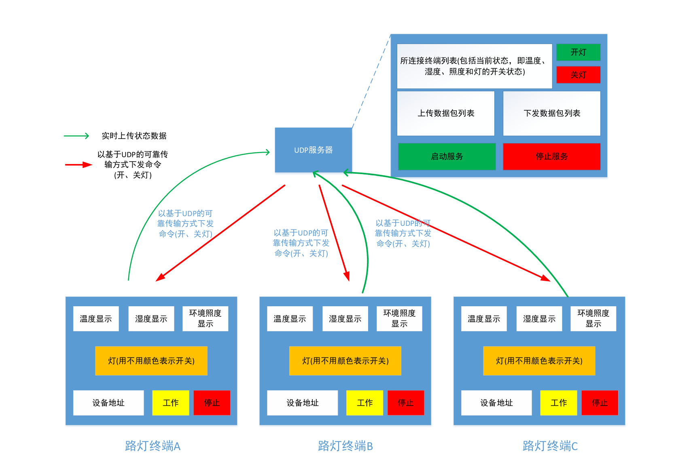

# 虚拟路灯控制系统

## 作业要求

一般一个典型的物联网系统包括感控层（传感器），网络层和应用层组成，而网络层主要用于实现感控对象与应用层的服务对象之间的通信。本次作业就以 TCP/IP 协议栈中传输 层协议的应用开发为目标，以UDP 方式实现一种感控对象与服务对象之间的通信机制，其体系结构如图1所示。其中感控对象为一个虚拟路灯对象，在实现过程中用随机数模拟其温 度、湿度和环境照度等感知数据，灯作为被控对象，可以通过服务器对其进行打开、关闭控 制，且用不同颜色表示其开关状态。每个虚拟路灯都将有一个标识，以示区别。而服务对象 可以同时与若干个虚拟路灯对象通信，每个虚拟路灯会定期向服务对象发送其当前状态，服务对象可以对任一个虚拟路灯进行开关控制。

1. 虚拟路灯状态上传数据直接基于UDP实现传输，不考虑可靠性，而服务对象发送给各虚拟路灯的开关命令要利用握手机制实现可靠传输。
2. 基于UDP自定义上传、下发数据包格式和传输方式。并实现通信协议的定义、封 装和解析。
3. 虚拟路灯界面主要显示当前状态，包括当前温度、湿度和照度，这些都可以用随机数产生，以及灯的开关状态；每个虚拟路灯皆有一个唯一设备ID，并可以在界面上显示。
4. 服务器上可以保存各虚拟路灯的历史状态数据，并且可以显示当前各虚拟路灯的相应状态，包括灯的开关状态、温度、湿度和照度。各灯的历史数据可以按指定时段查询。
5. 不限定编程语言。
6. 完成后提交电子版报告（PDF 格式），包括：项目名称、项目目标、设计与实现、 测试结果、总结与展望、源代码等内容。




## 内容

### 总体设计

本项目主要包括两个核心组件：**客户端**和**服务器**。两者通过不同的协议进行通信：

1. **客户端**：
   - **功能**：客户端模拟每个路灯设备，负责定期通过 UDP 协议发送设备状态信息（如温度、湿度、照度等）到服务器。同时，它通过 TCP 协议接收来自服务器的控制命令，并执行相应的操作（例如：开关灯、查看状态等）。
2. **服务器**：
   - **功能**：服务器负责接收来自多个客户端的 UDP 数据包，解析并存储设备的状态信息。同时，服务器也提供一个 TCP 接口，通过命令行接受来自用户的指令（例如：打开/关闭指定的路灯），并将这些控制命令发送到相应的客户端。
   - 通信协议

本项目主要包含的许多关键组件，包含**UDP与TCP**相关模块。其次由于客户端和服务器都需要同时执行多个任务，例如监听客户端连接和发送控制命令，因此需要使用**多线程编程**。使用**日志框架**，SLF4J和logback记录程序运行状态。使用数据库框架**MyBatis**执行数据操作，连接服务器的**MySQL**数据库执行操作，包括上传和查询数据。最后用户控制通过**控制台命令行**来实现，程序添加**异常处理**，以避免不合法的操作导致的错误。


### 项目文件

项目地址：https://github.com/HolmesAmzish/VirtualLampSystem

**版本控制分支**

```
master		# 主分支，最终版本
dev01		# 本地开发分支
dev02		# 服务器测试开发分支，主要涉及数据库操作和测试
```

**文件结构**

```
│  .gitignore
│  pom.xml										# 总项目设置
│
├─.idea
├─client										# 客户端模块
│  │  pom.xml									# maven 项目设置
│  │
│  └─src
│      ├─main
│      │  ├─java
│      │  │      Client.java					# 客户端主程序
│      │  │      LampEntity.java				# 路灯数据实体
│      │  │      TCPClient.java					# 处理与服务器的 TCP 连接
│      │  │      UDPSender.java					# UDP 数据包发送
│      │  │
│      │  └─resources
│      └─test
│          └─java
├─doc
│      database.md								# 项目数据库配置文档
│
└─server										# 服务器模块
    │  pom.xml									# maven 项目设置
    │
    └─src
        ├─main
        │  ├─java
        │  │      LampStatus.java				# 数据对象
        │  │      LampStatusMapper.java			# 数据操作映射
        │  │      LampStatusService.java		# 数据操作实现类
        │  │      MyBatisUtils.java				# MyBatis 工具类
        │  │      Server.java					# 服务器主程序
        │  │      TCPHandler.java				# 处理与客户端的TCP连接
        │  │      UDPReceiver.java				# UDP 数据包接收
        │  │
        │  └─resources
        │          logback.xml					# 日志记录器设置
        │          mybatis-config.xml			# MyBatis 框架设置
        │
        └─test
            └─java
                    MySQLConnectionTest.java	# 测试 MySQL 连接状态
```


### 项目模块

1. **客户端模块**：
   - **UDP 发送模块**：客户端定期发送设备状态（如温度、湿度、照度等）给服务器。
   - **TCP 客户端模块**：客户端与服务器建立 TCP 连接，接收来自服务器的控制命令（如开灯、关灯等）。
   - **设备状态管理**：每个客户端维护一个 `LampEntity` 实例，表示当前路灯的状态，包含设备的 ID、状态（开/关）、温度、湿度、照度等信息。
   - **命令行交互**：客户端通过命令行接收用户输入的命令，控制路灯的开关状态。
2. **服务器模块**：
   - **UDP 接收模块**：服务器接收来自各个客户端发送的设备状态信息，并进行解析和存储。
   - **TCP 服务器模块**：服务器监听来自客户端的 TCP 连接，接收并处理控制命令，向客户端发送指令。
   - **命令处理模块**：服务器通过命令行接受用户输入的命令（如开关灯、查看历史数据等），并通过 TCP 向指定客户端发送控制指令。
   - **历史记录存储模块**：服务器保存设备的历史状态数据（例如设备的温度、湿度、照度等），并能够查询设备的历史数据。


### 项目中的关键组件

1. **Java 编程语言**：本项目使用 Java 编程语言实现客户端和服务器的所有功能。Java 提供了强大的网络通信库（如 `java.net`）和多线程处理能力，适合处理复杂的网络通信任务。
2. **TCP 和 UDP 协议**：
   - **TCP**：通过 `Socket` 和 `ServerSocket` 类实现客户端和服务器之间的可靠的连接，确保数据的顺序和完整性。TCP 用于实时的指令交互（如开关灯）。
   - **UDP**：通过 `DatagramSocket` 和 `DatagramPacket` 类实现无连接的数据传输，适合周期性地传输设备的状态信息。UDP 用于将设备状态定期发送到服务器。
3. **多线程处理**：由于客户端和服务器需要同时处理多个任务（如接收数据、发送指令、处理用户输入等），因此在客户端和服务器中都使用了多线程：
   - **客户端**：使用线程定期发送 UDP 数据，并监听服务器通过 TCP 发来的指令。
   - **服务器**：使用线程池管理客户端的 TCP 连接，并异步处理来自各个客户端的请求。
4. **日志框架**：使用 **SLF4J** 和 **Logback** 来记录系统运行时的日志。通过日志可以追踪客户端和服务器的连接状态，记录发生的错误，帮助开发和调试。
5. **MyBatis**：用于与数据库进行交互，存储和查询路灯设备的历史状态信息。通过 **MyBatis** 框架简化了数据库操作的复杂性，提高了开发效率。
6. **数据库**：
   - 使用 **MySQL** 数据库存储路灯设备的历史数据（如温度、湿度、照度等）。数据库结构设计包括设备表和设备状态表，记录设备的状态变化及对应的时间戳。
   - **MyBatis** 配置与数据库进行交互，提供数据的增删改查（CRUD）操作。
7. **命令行交互**：通过命令行界面，用户可以通过简单的命令控制服务器（如 `switch on`、`switch off`）来控制客户端的路灯状态。服务器将解析命令并通过 TCP 协议向客户端发送控制指令。
8. **异常处理与重连机制**：在客户端和服务器中都实现了异常处理，确保网络连接出现问题时能够自动重连并恢复正常操作。


## 服务器设计

### 数据库

#### 数据库表结构

本系统设计的数据库用于存储虚拟路灯的状态信息。下表是数据库表 `lamp_status` 的设计：

| 名称     | 说明                                                         |
| -------- | ------------------------------------------------------------ |
| ID       | 自增主键                                                     |
| 设备     | 路灯ID，字符串类型，如 `lamp_xx`                             |
| 时间     | 时间戳，格式为 `yyyy-MM-dd-HH-mm-ss`，对应 `LocalDateTime` 类型 |
| 温度     | 温度，单位为摄氏度，数据类型为浮点型                         |
| 湿度     | 湿度值，取值范围为 0 到 100，数据类型为整数                  |
| 照度     | 照度值，取值范围为 0 到 100000，数据类型为整数               |
| 开关状态 | 路灯开关状态，字符串类型，通常为 `on` 或 `off`               |

#### MySQL 创建表脚本

```java
CREATE TABLE lamp_status (
    id INT NOT NULL AUTO_INCREMENT PRIMARY KEY,    -- 自增主键
    lamp_id VARCHAR(50) NOT NULL,                  -- 路灯ID
    timestamp DATETIME NOT NULL,                   -- 时间戳
    temperature FLOAT NOT NULL,                    -- 温度
    humidity INT NOT NULL,                         -- 湿度
    illuminance INT NOT NULL,                      -- 照度
    status VARCHAR(20) NOT NULL                    -- 路灯状态
);
```


### 实体类与数据映射

#### 实体类

在服务器端，我们首先需要创建一个实体类来表示路灯状态记录。以下是 `LampStatus` 类的定义：

```java
public class LampStatus {

    private String lampId;        // 路灯ID
    private LocalDateTime timestamp; // 时间戳
    private float temperature;    // 温度（摄氏度）
    private int humidity;         // 湿度（0-100）
    private int illuminance;      // 照度（0-100000）
    private String status;        // 开关状态（on/off）

    // 构造函数、Getter 和 Setter 方法
    // ToString 方法用于输出该类的字符串表示
}
```

#### 数据库映射接口

接下来，我们定义一个 MyBatis 的映射接口 `LampStatusMapper` 来执行数据库操作。接口中包含插入和查询方法。

```java
public interface LampStatusMapper {
    
    @Insert("INSERT INTO lamp_status (lamp_id, timestamp, temperature, humidity, illuminance, status) " +
            "VALUES (#{lampId}, #{timestamp}, #{temperature}, #{humidity}, #{illuminance}, #{status})")
    void insertLampStatus(LampStatus lampStatus);

    @Select("SELECT lamp_id, timestamp, temperature, humidity, illuminance, status FROM lamp_status WHERE lamp_id = #{lampId} ORDER BY timestamp DESC LIMIT 10")
    @Results({
            @Result(property = "lampId", column = "lamp_id"),
            @Result(property = "timestamp", column = "timestamp", javaType = LocalDateTime.class),
            @Result(property = "temperature", column = "temperature"),
            @Result(property = "humidity", column = "humidity"),
            @Result(property = "illuminance", column = "illuminance"),
            @Result(property = "status", column = "status")
    })
    List<LampStatus> getLampStatusHistory(String lampId);
}
```

#### 数据操作实现

我们通过服务层来操作数据库，并与前端应用程序进行交互。以下是 `LampStatusService` 类的实现，它包含了插入新数据和查询历史记录的方法。

在这里，数据库操作可能出现连接失败等各种错误，不仅要预测捕捉错误，还要利用日志来对程序的状态进行判断。这里使用了`logback` 框架作为日志记录工具。

```java
import org.slf4j.Logger;
import org.slf4j.LoggerFactory;

public class ClassName {
    Logger logger = LoggerFactory.getLogger(ClassName.class);
    logger.info("Log infomation...");
}
```

同时在resource文件夹中的logback.xml文件中更改日志等级，

```xml
<root level="INFO">
```

这里利用MySQL来记录和查询状态，MyBatis框架简化了Java应用程序与数据库之间的交互，将在MySQL中进行的增删查改操作映射到Java对象。在上面的Mapper中已经设置，这里生成对象后通过函数调用。

```java
import org.apache.ibatis.session.SqlSession;
import org.apache.ibatis.session.SqlSessionFactory;
import org.slf4j.Logger;
import org.slf4j.LoggerFactory;

import java.util.List;

/**
 * LampStatusService
 * Service layer for accessing and manipulating lamp status data in the database.
 * @version 1.0 2024-11-27
 */
public class LampStatusService {

    private final SqlSessionFactory sqlSessionFactory;
    private final static Logger logger = LoggerFactory.getLogger(LampStatusService.class);

    // Constructor to initialize SqlSessionFactory
    public LampStatusService(SqlSessionFactory sqlSessionFactory) {
        this.sqlSessionFactory = sqlSessionFactory;
    }

    /**
     * Insert a new lamp status record into the database.
     * @param lampStatus The lamp status object to be inserted.
     */
    public void insertLampStatus(LampStatus lampStatus) {
        try (SqlSession session = sqlSessionFactory.openSession()) {
            LampStatusMapper mapper = session.getMapper(LampStatusMapper.class);
            mapper.insertLampStatus(lampStatus);
            session.commit();
        } catch (Exception e) {
            logger.warn("Failed to insert new record: " + e.getMessage());
        }
    }

    /**
     * Fetch the history of a specific lamp by its ID.
     * @param lampId The ID of the lamp whose history is to be fetched.
     * @return A list of LampStatus objects representing the history of the lamp.
     */
    public List<LampStatus> getHistory(String lampId) {
        try (SqlSession session = sqlSessionFactory.openSession()) {
            LampStatusMapper mapper = session.getMapper(LampStatusMapper.class);
            return mapper.getLampStatusHistory(lampId);
        } catch (Exception e) {
            logger.warn("Failed to query history status: " + e.getMessage());
            return null;
        }
    }
}
```


### 服务器主程序设计

#### 服务器类

开启TCP监听和UDP收取数据属于阻塞进程，因此需要另外开启一个新的线程，以便程序继续处理其他功能，比如处理指令并作出反应。这里示例了一个开启TCP监听并开启新线程。

```java
ServerSocket serverSocket = new ServerSocket(TCP_PORT);
new Thread(() -> listenForTCPConnections(serverSocket)).start();
```

服务器端程序启动后，它会监听来自客户端的请求，包括 TCP 和 UDP 请求。主要功能包括处理命令行输入，控制路灯开关、查询路灯历史记录以及与客户端的交互。

```java
import . . .
/**
 * Server
 * Main program running on the server to handle requests from clients.
 * @version 1.1 2024-11-28
 */
public class Server {
    private static final int TCP_PORT = 7777; // The TCP port for the server

    private static final Logger logger = LoggerFactory.getLogger(Server.class);

    private static final ExecutorService tcpExecutor = Executors.newCachedThreadPool();
    private static final LampStatusService lampService = new LampStatusService(MyBatisUtils.getSqlSessionFactory());

    public static void main(String[] args) {
        try {
            System.out.println("Starting Virtual Lamp System Control Server...");

            // Start a separate thread to listen for UDP packets
            new Thread(new UDPReceiver()).start();

            // Start the TCP server
            ServerSocket serverSocket = new ServerSocket(TCP_PORT);
            logger.info("TCP server is listening on port: {}", TCP_PORT);
            new Thread(() -> listenForTCPConnections(serverSocket)).start();

            // Command input from the console
            Scanner scanner = new Scanner(System.in);
            while (true) {
                String command = scanner.nextLine();
                handleCommand(command);
            }
        } catch (IOException e) {
            e.printStackTrace();
        }
    }

    /**
     * Listen for incoming TCP connections.
     * @param serverSocket The server socket listening for connections.
     */
    private static void listenForTCPConnections(ServerSocket serverSocket) {
        try {
            while (true) {
                Socket clientSocket = serverSocket.accept();
                tcpExecutor.execute(new TCPHandler(clientSocket)); // Handle TCP connections
            }
        } catch (IOException e) {
            e.printStackTrace();
        }
    }

    /**
     * Handle commands input from the server's console.
     * @param command The user-entered command.
     */
    private static void handleCommand(String command) {
        String[] cmdParts = command.split(" ");
        try {
            switch (cmdParts[0]) {
                case "help":
                    // Display available commands
                    System.out.print("""
                            help                    # Show all commands
                            switch on/off <device>  # Turn on/off target device
                            history <device>        # Show history of device
                            disconnect <device>     # Disconnect from target device
                            exit                    # Shutdown the server
                            """);
                    break;

                case "switch":
                    if (cmdParts.length < 3) throw new IllegalArgumentException("Missing argument(s)");
                    switchLamp(cmdParts[1], cmdParts[2]);
                    break;

                case "history":
                    if (cmdParts.length < 2) throw new IllegalArgumentException("Device ID required");
                    historyLampStatus(cmdParts[1]);
                    break;

                case "disconnect":
                    if (cmdParts.length < 2) throw new IllegalArgumentException("Device ID required");
                    disconnectLamp(cmdParts[1]);
                    break;

                case "exit":
                    System.out.println("Shutting down...");
                    System.exit(0);
                    break;

                default:
                    System.out.println("Unknown command: " + cmdParts[0]);
            }
        } catch (Exception e) {
            System.out.println("Invalid command: " + e.getMessage());
        }
    }

    /**
     * Send a switch command to the target lamp.
     * @param action The action to be performed (on/off).
     * @param lampId The ID of the lamp.
     */
    private static void switchLamp(String action, String lampId) {
        System.out.println("Sending command to " + lampId + " " + action);
        // TCPHandler
        TCPHandler.sendCommand(lampId, "switch " + action);
    }

    /**
     * Fetch and display the history of a specific lamp.
     * @param lampId The ID of the lamp.
     */
    private static void historyLampStatus(String lampId) {
        System.out.println("Querying " + lampId + " status...");
        var history = lampService.getHistory(lampId);
        if (history.isEmpty()) {
            System.out.println("No record for " + lampId);
        } else {
            System.out.printf("|%-20s|%-8s|%-12s|%-9s|%-12s|%-7s|\n", "Date time", "Lamp ID", "Temperature", "Humidity", "Illuminance", "Status");
            for (var status : history) {
                System.out.printf(status.toLine());
            }
        }
    }

    /**
     * Disconnect from the specified lamp.
     * @param lampId The ID of the lamp to disconnect from.
     */
    private static void disconnectLamp(String lampId) {
        System.out.println("Disconnecting from " + lampId + "...");
        TCPHandler.disconnect(lampId);
    }
}
```

#### TCP 连接处理

在处理TCP连接时，需要管理连接的客户端。创建一个字典来管理已经连接的客户端。首先客户端在连接服务器时，需要对设备ID进行注册，注册后更加方便管理，防止重复和打乱数据。

```java
Map<String, Socket> connections = new ConcurrentHashMap<>();
```

TCPHandler实现了客户端设备的连接，消息接收以及断开连接。首先有对I/O流的使用。通过`InputStreamReader`和`OutputStreamWriter`包装`clientSocket`的输入流和输出流，方便读取和发送字符数据。`BufferedReader.readLine()`逐行读取客户端发送的信息，`BufferedWriter.write()`用于向客户端发送消息。

同时设置异常处理，捕获输入输出异常，例如客户端断开连接和网络故障等。并利用`logger.warn()`记录异常方便排查问题。


```java
import . . .
/**
 * TCPHandler
 * Handles individual TCP connections and provides utilities for managing client connections
 * @version 1.0 2024-11-27
 * @author Holmes
 */
public class TCPHandler implements Runnable {
    private static final Logger logger = LoggerFactory.getLogger(TCPHandler.class);
    private static final Map<String, Socket> connections = new ConcurrentHashMap<>();
    private final Socket clientSocket;

    public TCPHandler(Socket clientSocket) {
        this.clientSocket = clientSocket;
    }

    @Override
    public void run() {
        try (BufferedReader reader = new BufferedReader(new InputStreamReader(clientSocket.getInputStream()));
             BufferedWriter writer = new BufferedWriter(new OutputStreamWriter(clientSocket.getOutputStream()))) {

            // Register device
            String deviceId = registerDevice(reader, writer);
            if (deviceId == null) {
                return;
            }

            logger.info("Device connected: {}", deviceId);

            String message;
            while ((message = reader.readLine()) != null) {
                System.out.println("Message from \"" + deviceId + "\" : " + message);
            }

        } catch (IOException e) {
            logger.warn("Error on connecting device: " + e.getMessage());
        } finally {
            disconnectDevice();
        }
    }

    /**
     * Register device with socket
     */
    private String registerDevice(BufferedReader reader, BufferedWriter writer) throws IOException {
        writer.write("Receive device id:\n");
        writer.flush();
        String deviceId = reader.readLine();

        if (deviceId == null || deviceId.isEmpty()) {
            System.out.println("Register failed, missing ID");
            writer.write("Register failed, device ID required\n");
            writer.flush();
            return null;
        }

        // Check existed device
        if (connections.containsKey(deviceId)) {
            System.out.println("Device ID " + deviceId + " already existed, connection refused");
            writer.write("Register failed, device id already existed\n");
            writer.flush();
            return null;
        }

        // Register device
        connections.put(deviceId, clientSocket);
        writer.write("Register success: device " + deviceId + "\n");
        writer.flush();
        return deviceId;
    }

    /**
     * Disconnect from device
     */
    private void disconnectDevice() {
        try {
            String deviceId = connections.entrySet().stream()
                    .filter(entry -> entry.getValue().equals(clientSocket))
                    .map(Map.Entry::getKey)
                    .findFirst()
                    .orElse(null);

            if (deviceId != null) {
                connections.remove(deviceId);
                logger.info("Disconnect from: {}", deviceId);
            }
            clientSocket.close();
        } catch (IOException e) {
            System.out.println("Error occurred in disconnection: " + e.getMessage());
        }
    }

    /**
     * Send command to local device to perform
     * @param deviceId target device id
     * @param command
     */
    public static void sendCommand(String deviceId, String command) {
        Socket socket = connections.get(deviceId);
        if (socket == null) {
            System.out.println("Lamp " + deviceId + " is not connected.");
            return;
        }

        try (BufferedWriter writer = new BufferedWriter(new OutputStreamWriter(socket.getOutputStream()))) {
            writer.write(command + "\n");
            writer.flush();
            System.out.println("Command has been sent " + deviceId + ": " + command);
        } catch (IOException e) {
            logger.warn("Error occurred when sending command to " + deviceId + " " + e.getMessage());
        }
    }

    /**
     * Disconnect from target device
     * @param deviceId
     */
    public static void disconnect(String deviceId) {
        Socket socket = connections.remove(deviceId);
        if (socket == null) {
            System.out.println("Device " + deviceId + " is not connected.");
            return;
        }

        try {
            socket.close();
            logger.info("Disconnected from " + deviceId);
        } catch (IOException e) {
            System.out.println("Error occurred disconnecting from " + deviceId + " " + e.getMessage());
        }
    }
}
```


#### UDP 数据包处理

1. **UDP通信与数据接收**：`DatagramSocket` 用于接收UDP数据包，绑定到指定端口（`8888`）。在一个无限循环中，`socket.receive(packet)` 持续监听并接收来自客户端的数据包，将其存储在字节数组缓冲区中。接收到的数据通过 `parsePacket` 方法解析为业务实体对象 `LampStatus`。
2. **数据解析与验证**：`parsePacket` 方法解析接收到的字节数据，将其转换为字符串并以逗号分隔符分割字段。如果字段数目或格式不符合预期，则记录错误日志并返回 `null`。解析过程中还涉及日期字符串的格式化与转换、字段类型的校验与转换，确保数据格式正确。
3. **数据库存储与日志记录**：使用 `LampStatusService` 将解析后的 `LampStatus` 对象插入数据库，确保数据持久化。同时，利用日志工具（`Logger`）记录数据接收与处理的状态，包括成功接收和解析失败的信息，以便调试和监控系统运行状况。

```java
import . . .
/**
 * UDPReceiver
 * @version 1.1 2024-11-28
 * @author Holmes Amzish
 */
public class UDPReceiver implements Runnable {
    private static final int UDP_PORT = 8888;
    private static final LampStatusService lampService = new LampStatusService(MyBatisUtils.getSqlSessionFactory());

    private final Logger logger = LoggerFactory.getLogger(this.getClass());
    @Override
    public void run() {
        try (DatagramSocket socket = new DatagramSocket(UDP_PORT)) {
            byte[] buffer = new byte[1024];
            while (true) {
                DatagramPacket packet = new DatagramPacket(buffer, buffer.length);
                socket.receive(packet);

                LampStatus status = parsePacket(packet.getData());
                if (status != null) {
                    // Insert received status record
                    lampService.insertLampStatus(status);

                    // Record received UDP package
                    logger.info("Lamp status received: {}", status.getDeviceId());
                }
            }
        } catch (Exception e) {
            e.printStackTrace();
        }
    }

    private LampStatus parsePacket(byte[] data) {
        try {
            // Split with comma
            String packetData = new String(data, 0, data.length).trim();
            String[] fields = packetData.split(",");

            if (fields.length != 6) {
                logger.error("Invalid UDP package: " + packetData);
                return null;
            }

            logger.debug(fields.toString());
            String deviceId = fields[0];
            String timestampStr = fields[1];
            float temperature = Float.parseFloat(fields[2]);
            int humidity = Integer.parseInt(fields[3]);
            int illuminance = Integer.parseInt(fields[4]);
            boolean status = Boolean.parseBoolean(fields[5]); // Trim the status field to remove extra spaces
            String statusRecord = status ? "ON" : "OFF";

            // Convert time string to LocalDateTime object
            DateTimeFormatter formatter = DateTimeFormatter.ofPattern("yyyy-MM-dd-HH-mm-ss");
            LocalDateTime timestamp = LocalDateTime.parse(timestampStr, formatter);

            return new LampStatus(deviceId, timestamp, temperature, humidity, illuminance, statusRecord);
        } catch (Exception e) {
            System.out.println("Error while parsing UDP package: " + e.getMessage());
            return null;
        }
    }

}
```


## 客户端设计

### **实体类**

`LampEntity` 类代表虚拟路灯的状态信息。它包含了灯的ID、温度、湿度、照度和开关状态。初始化时，温度、湿度和照度值会随机生成，并且默认灯的状态为关闭。

```java
public class LampEntity {
    private String lampId;
    private double temperature;
    private int humidity;
    private int illuminance;
    private boolean status; // ON or OFF

    public LampEntity(String lampId) {
        this.lampId = lampId;
        this.temperature = Math.random() * 40; // Example temperature
        this.humidity = (int) (Math.random() * 100);
        this.illuminance = (int) (Math.random() * 1000);
        this.status = false;
    }

    // Getters and setters
    public String getLampId() {
        return lampId;
    }

    public double getTemperature() {
        return temperature;
    }

    public int getHumidity() {
        return humidity;
    }

    public int getIlluminance() {
        return illuminance;
    }

    public boolean getStatus() {
        return status;
    }

    public void setStatus(boolean status) {
        this.status = status;
    }

    public void printStatus() {
        System.out.print(String.format("Lamp ID: %s Status: %s\n", this.getLampId(), this.getStatus())
        + String.format("Temperature: %.2f, Humidity: %d, Illuminance: %d\n", this.getTemperature(), this.getHumidity(), this.getIlluminance()));
    }
}
```


### **TCP 连接**

`TCPClient` 类负责与服务器建立 TCP 连接，并通过该连接与服务器进行通信。客户端通过 TCP 向服务器注册设备ID，并通过服务器接收控制命令（例如开关灯）。该类还负责监听从服务器发来的命令，并在接收到开关指令时修改路灯的状态。

```java
public class TCPClient {

    private Socket socket;
    private BufferedReader in;
    private PrintWriter out;
    private LampEntity lampEntity;
    private final Logger logger = LoggerFactory.getLogger(TCPClient.class);

    public TCPClient(String host, int port, LampEntity lampEntity) {
        try {
            this.lampEntity = lampEntity;
            socket = new Socket(host, port);
            in = new BufferedReader(new InputStreamReader(socket.getInputStream()));
            out = new PrintWriter(socket.getOutputStream(), true);
            logger.info("Server connected: {}:{}", host, port);

            // Register device
            registerDevice(lampEntity.getLampId());

            // Start a thread to listen for commands
            new Thread(this::listenForCommands).start();
        } catch (IOException e) {
            e.printStackTrace();
            logger.error("Failed to connect to server");
        }
    }

    private void registerDevice(String deviceId) {
        try {
            out.println(deviceId); // Send device ID to server
            logger.info("Sent device ID: " + deviceId);
            String response = in.readLine(); // Wait for server response
            logger.info("Server response: " + response);
        } catch (IOException e) {
            e.printStackTrace();
            logger.error("Error registering device");
        }
    }

    private void listenForCommands() {
        try {
            String command;
            while ((command = in.readLine()) != null) {
                if (socket.isClosed()) {
                    logger.error("Socket is closed. Exiting command listener.");
                    break;
                }

                if (command.equalsIgnoreCase("switch on")) {
                    lampEntity.setStatus(true);
                    logger.info("Lamp set to ON.");
                } else if (command.equalsIgnoreCase("switch off")) {
                    lampEntity.setStatus(false);
                    logger.info("Lamp set to OFF.");
                } else {
                    logger.info("Server message: " + command);
                }
            }
        } catch (IOException e) {
            logger.error("IOException occurred while listening for commands: {}", e.getMessage());
        } finally {
            try {
                if (socket != null && !socket.isClosed()) {
                    socket.close(); // Ensure the socket is closed properly
                    logger.info("Socket closed.");
                }
            } catch (IOException e) {
                logger.error("Error closing socket: {}", e.getMessage());
            }
        }
    }
}
```


### **数据包发送**

发送UDP数据包，首先构造消息内容，用message存储字符串格式化的实体信息，然后将消息转换成字节数组。随后构造数据包packet，将数据发送到指定目标服务器和端口。

```java
DatagramPacket(byte[] buf, int length, InetAddress address, int port); // DatagramPacket 的构造函数
```

`UDPSender` 类负责通过 UDP 向服务器发送路灯的状态数据。客户端定期向服务器发送设备的状态信息（例如每10分钟发送一次）。`sendData` 方法会格式化消息并发送出去。

```java
public class UDPSender {

    final static int UDP_PORT = 8888;

    private final static Logger logger = LoggerFactory.getLogger(UDPSender.class);

    public static void sendData(String serverAddress, LampEntity lampEntity) {
        try (DatagramSocket socket = new DatagramSocket()) {
            String message = String.format("%s,%s,%.1f,%d,%d,%b",
                    lampEntity.getLampId(),
                    LocalDateTime.now().format(DateTimeFormatter.ofPattern("yyyy-MM-dd-HH-mm-ss")),
                    lampEntity.getTemperature(),
                    lampEntity.getHumidity(),
                    lampEntity.getIlluminance(),
                    lampEntity.getStatus());

            byte[] data = message.getBytes();
            DatagramPacket packet = new DatagramPacket(data, data.length, InetAddress.getByName(serverAddress), UDP_PORT);
            socket.send(packet);
            logger.info("Sent UDP message: " + message);
        } catch (Exception e) {
            e.printStackTrace();
        }
    }

    public static void startUDPThread(String serverAddress, LampEntity lampEntity) throws InterruptedException {
        while (true) {
            UDPSender.sendData(serverAddress, lampEntity);
            Thread.sleep(Duration.ofMinutes(10).toMillis()); // Wait 10 minutes before sending next update
        }
    }
}
```


### **客户端主程序**

`Client` 类是客户端的入口点。它接收用户的命令，允许用户开关路灯、查看状态或者主动更新路灯状态到服务器。它同时创建 TCP 客户端和 UDP 发送线程。

设计的启动方法如下，设备名称自定，服务器地址需要指定一个运行服务器程序的设备的IPv4地址，如果不填，那么将连接默认地址 `iot.arorms.cn` 。

```bash
java -jar client.jar <server_address> <device_name>
```

```java
import . . .
 /**
 * Client
 * The virtual lamp device
 * @version 1.1 2024-11-29
 * @author Holmes Amzish
 */
public class Client {
    private static final Logger logger = LoggerFactory.getLogger(Client.class);

    private static final int TCP_PORT = 7777;
    static String serverAddress = "iot.arorms.cn";
    static String deviceId = "unknown_device";
    private static LampEntity lampEntity;

    public static void main(String[] args) {
        if (args.length == 2) {
            serverAddress = args[0];
            deviceId = args[1];
        } else {
            logger.error("Usage: java Client <server address> <device id>");
            System.exit(1);
        }
        lampEntity = new LampEntity(deviceId);

        TCPClient tcpClient = new TCPClient(serverAddress, TCP_PORT, lampEntity);

        // Start UDP thread to send status updates periodically
        new Thread(() -> {
            try {
                UDPSender.startUDPThread(serverAddress, lampEntity);
            } catch (InterruptedException e) {
                throw new RuntimeException(e);
            }
        }).start();

        // Command listener to accept user input
        Scanner scanner = new Scanner(System.in);
        while (true) {
            String command = scanner.nextLine();
            handleCommand(command);
        }
    }

    private static void handleCommand(String command) {
        switch (command) {
            case "help":
                System.out.print("""
                        switch on/off       # Turn on/off the lamp
                        status              # Show status of lamp
                        update              # Update status to server actively
                        """);
                break;
            case "switch on":
                lampEntity.setStatus(true);
                logger.info("Lamp status set \"On\"");
                break;
            case "switch off":
                lampEntity.setStatus(false);
                logger.info("Lamp status set \"Off\"");
                break;
            case "status":
                lampEntity.printStatus();
                break;
            case "update":
                UDPSender.sendData(serverAddress, lampEntity);
                break;
            default:
                System.out.println("Unknown command: " + command);
        }
    }
}
```


## 结果测试

### 本地测试

使用IDEA设置参数


### 编译并打包程序

首先配置pom.xml，以下是服务器程序的信息。用于maven管理和编译设置。

```xml
<?xml version="1.0" encoding="UTF-8"?>
<project xmlns="http://maven.apache.org/POM/4.0.0"
         xmlns:xsi="http://www.w3.org/2001/XMLSchema-instance"
         xsi:schemaLocation="http://maven.apache.org/POM/4.0.0 http://maven.apache.org/xsd/maven-4.0.0.xsd">
    <modelVersion>4.0.0</modelVersion>

    <parent>
        <groupId>cn.arorms</groupId>
        <artifactId>VirtualLampSystem</artifactId>
        <version>1.0-SNAPSHOT</version>
    </parent>

    <artifactId>VirtualLampSystemServer</artifactId>

    <properties>
        <maven.compiler.source>21</maven.compiler.source>
        <maven.compiler.target>21</maven.compiler.target>
        <project.build.sourceEncoding>UTF-8</project.build.sourceEncoding>
    </properties>

    <dependencies>
        <dependency>
            <groupId>org.mybatis</groupId>
            <artifactId>mybatis</artifactId>
            <version>3.5.9</version>
        </dependency>

        <dependency>
            <groupId>mysql</groupId>
            <artifactId>mysql-connector-java</artifactId>
            <version>8.0.30</version>
        </dependency>
    </dependencies>

    <build>
        <plugins>
            <!-- Use the maven-jar-plugin to package your application -->
            <plugin>
                <groupId>org.apache.maven.plugins</groupId>
                <artifactId>maven-jar-plugin</artifactId>
                <version>3.4.2</version>
                <configuration>
                    <archive>
                        <manifestEntries>
                            <Main-Class>Server</Main-Class>
                        </manifestEntries>
                    </archive>
                </configuration>
            </plugin>
        </plugins>
    </build>
</project>
```

然后在每个模块下打包子项目

```bash
mvn clean package
```


生成`jar`包后，即可在发送到客户端和服务进行测试。


## 总结

本项目“虚拟路灯控制系统”作为计算机网络课程的大作业，模拟了一个典型的物联网应用，涉及客户端与服务器之间的通信、数据存储和多线程处理的多个技术领域。以下是对项目中关键技术点的进一步阐述：

### **TCP与UDP协议**
- **TCP协议**：服务器与客户端之间的控制命令通信采用TCP协议，确保了数据传输的可靠性和顺序性。这对于执行开关灯等控制命令至关重要，因为这些命令需要被准确无误地送达和执行。
- **UDP协议**：客户端定期向服务器上传数据和主动上传数据给服务器，服务器接收并解析数据包，并自动将数据插入数据库。这种无连接的协议适用于此类状态上报的场景，因为它减少了通信开销，允许快速传输大量数据。
### **多线程编程**
- 客户端和服务器都需要同时处理多个任务，例如监听客户端连接和发送控制命令。多线程的使用提高了程序的并发处理能力，使得服务器能够同时处理多个客户端的请求，而客户端也能够在发送数据的同时接收控制命令。
### **数据库交互**

- 通过定义实体类`LampStatus`和MyBatis映射接口`LampStatusMapper`，实现了数据库操作的抽象化和模块化。这种设计使得代码更加清晰，易于维护和扩展。

- 使用MySQL数据库存储路灯设备的历史状态信息，通过MyBatis框架简化了数据库操作的复杂性。这种数据持久化机制使得系统能够记录和查询设备的历史状态，为系统的监控和维护提供了便利。
### **日志记录**
- 通过SLF4J和Logback框架记录日志，帮助追踪程序运行状态，记录错误，对开发和调试起到了重要作用。日志记录不仅帮助开发者快速定位问题，也是系统运行状况的重要参考。
### **异常处理**
- 在客户端和服务器中实现了异常处理，确保网络连接出现问题时能够自动重连并恢复正常操作。这种机制提高了系统的鲁棒性，确保了系统在面对网络波动时的稳定性。
### **命令行交互**
- 通过命令行界面，用户可以控制服务器，实现对客户端路灯状态的控制。这种交互方式简单直观，使得用户能够快速上手操作，提高了系统的易用性。

### **项目管理**
- 利用Git版本控制管理代码仓库，不同功能分支开发保证互不干扰。
- 使用Maven进行项目管理和依赖管理，通过`pom.xml`配置文件管理项目构建过程，简化了编译和打包流程。Maven的使用提高了项目的构建效率，使得开发者能够专注于代码开发。

通过本项目的实践，我深刻体会到了计算机网络技术在物联网领域的应用，以及多线程编程、数据库操作和日志记录等技术在实际项目中的重要性。这些技术和经验将为我未来的学习和工作提供宝贵的参考。同时，我也认识到了在系统设计时考虑扩展性和用户体验的重要性，这将指导我在未来的开发工作中，设计出更加健壮、易用和可维护的系统。
