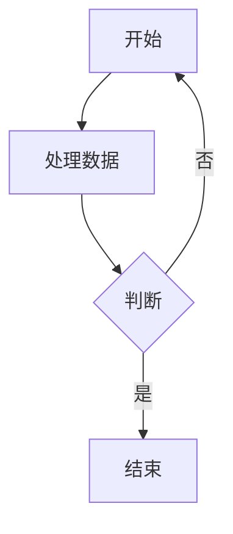
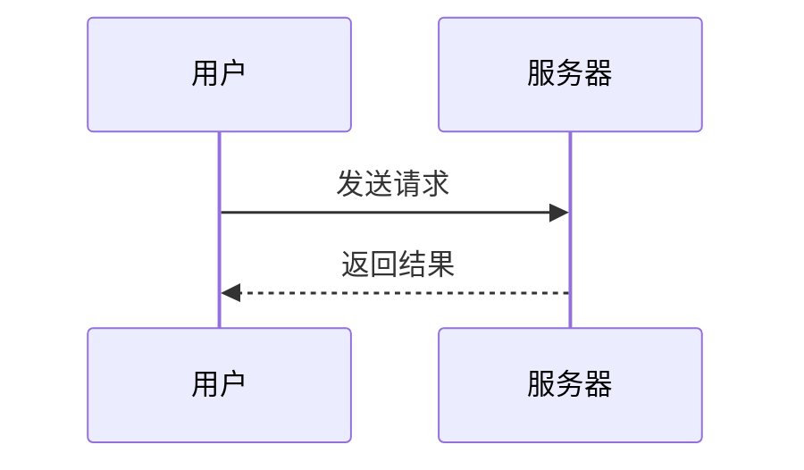
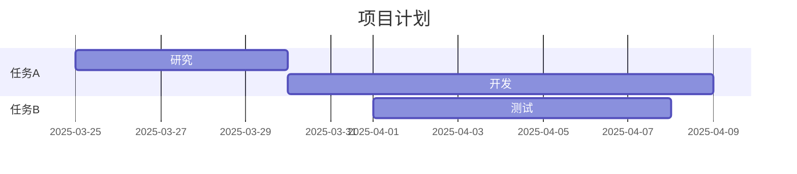

以下是一份简洁实用的关于在 Typora 中使用 Mermaid 制作图表的笔记，适合快速上手和参考：

---

# 在 Typora 中使用 Mermaid 笔记

## 1. 什么是 Mermaid？
Mermaid 是一个基于 JavaScript 的工具，用于通过文本代码生成图表（如流程图、时序图、甘特图等）。Typora 支持 Mermaid，允许用户在 Markdown 中直接编写代码生成动态图表，无需额外插件。

## 2. 启用 Mermaid
- Typora 默认支持 Mermaid，无需手动安装。
- 确保 Typora 版本较新（推荐 1.0 或以上），以获得最佳兼容性。
- 在 Typora 中，Mermaid 图表通过代码块（```）编写，语言标识为 `mermaid`。

## 3. 基本语法

### 示例 1：流程图

- `graph TD` 表示从上到下（Top-Down）的流程图。
- `A --> B` 表示 A 指向 B。
- `{}` 表示决策节点，`|` 用于条件分支。

**渲染效果**：一个简单的循环流程图。

### 示例 2：时序图

- `participant` 定义参与者，可用 `as` 重命名。
- `->>` 表示实线箭头（请求），`-->>` 表示虚线箭头（响应）。

**渲染效果**：展示用户与服务器的交互过程。

### 示例 3：甘特图

- `title` 设置图表标题。
- `dateFormat` 定义日期格式。
- `section` 分组任务，`after` 表示依赖关系。

**渲染效果**：展示项目时间规划。

## 4. 常用图表类型
- **流程图**：`graph`（方向：TD、LR、BT、RL）
- **时序图**：`sequenceDiagram`
- **甘特图**：`gantt`
- **类图**：`classDiagram`
- **状态图**：`stateDiagram`

## 5. 样式调整
- Mermaid 支持基本样式自定义，例如：
  ```mermaid
  graph TD
      A[开始] --> B[结束]
      style A fill:#f9f,stroke:#333,stroke-width:2px
  ```
- `style` 用于设置节点的填充色（`fill`）、边框色（`stroke`）等。

## 6. 使用技巧
- **实时预览**：在 Typora 中输入代码后，图表会自动渲染。
- **编辑与调整**：直接修改代码，图表即时更新。
- **复杂图表**：建议先在 Mermaid 官方编辑器（https://mermaid.live/）调试，再粘贴到 Typora。
- **导出**：Typora 支持将包含 Mermaid 图表的 Markdown 导出为 PDF、HTML 等格式，图表会保留。

## 7. 注意事项
- 如果图表未渲染，检查代码块是否正确标记为 `mermaid`。
- 复杂图表可能因 Typora 渲染限制而显示不全，尝试简化代码。
- Mermaid 语法对缩进敏感，避免多余空格。

## 8. 学习资源
- 官方文档：https://mermaid-js.github.io/
- Typora 官网：https://typora.io/
