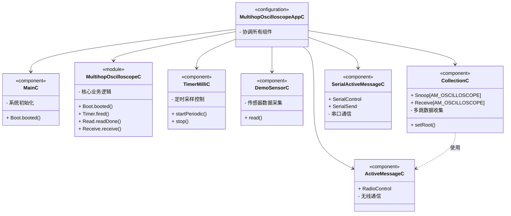
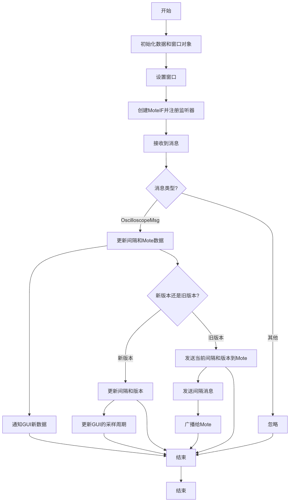

# TinyOS Oscilloscope 程序解释

## 总体概括

**MultihopOscilloscope** 是一个基于多跳网络的简单数据采集系统，设计用于演示如何在无线传感器网络中周期性地采集传感器数据并通过多跳网络进行传输。该程序通过多跳网络的方式将采集到的数据逐级转发，最终到达根节点并通过串口与 PC 端进行通信，展示采集的传感器数据。系统的初始采样频率为 1Hz，但可以在 Java 应用程序中进行调整，以满足不同应用场景的需求。

在嵌入式系统中，**MultihopOscilloscope** 项目展示了如何利用 TinyOS 构建一个多跳无线通信的传感器网络。系统中每个节点周期性地采集传感器数据，并通过无线通信模块将数据发送到邻近的节点，直到数据最终到达根节点。根节点负责将数据通过串口与计算机进行通信，供后续的可视化分析。这些读数可以通过 `./java` 子目录中的 Java 应用程序 “Oscilloscope” 显示出来。采样频率初始为 1Hz，但可以在 Java 应用程序中进行修改。

编译到特定传感器开发板：

```bash
SENSORBOARD=<sensorboard name> make <mote>
```

如果想要更改所使用的传感器，可以编辑 `MultihopOscilloscopeAppC.nc` 文件。


Java 应用程序会显示从运行 MultihopOscilloscope 演示程序的 mote 接收到的数据读数，它通过 **serial forwarder** 与 mote 通信。运行方法如下：

切换到 `./java` 子目录，并输入：

```bash
make
java net.tinyos.sf.SerialForwarder -comm serial@<serial port>:<mote>
# e.g., java net.tinyos.sf.SerialForwarder -comm serial@/dev/ttyUSB0:mica2
# or java net.tinyos.sf.SerialForwarder -comm serial@COM2:telosb
./run
```

该程序通过 Java 应用程序来实时显示采集到的传感器数据。Java 应用通过 **serial forwarder** 与传感器节点进行串口通信，实时接收从各个传感器节点传送的数据，并以波形图的形式展示在屏幕上，方便用户进行分析和查看。控制按钮提供了对图像的放大缩小、Y 轴范围的调整以及清除已接收数据的功能，从而使用户能够方便地查看不同数据范围和节点的表现。

在程序的设计上，根节点的选择是通过 TOS_NODE_ID 模 500 等于 0 来实现的。该设计方法确保了系统中根节点的唯一性，根节点在整个数据采集过程中起到了至关重要的作用，负责管理数据的接收和最终展示。

MultihopOscilloscope 会将 TOS_NODE_ID 模 500 等于 0 的 mote 配置为数据收集的根节点（collection root）。




<center>图 1 组件关系图</center>

## NesC 部分

程序根目录下除了 Java 代码部分，留有 Makefile、头文件和 Python 数据打印事例文件，以及 NesC 的实现代码。最主要的内容在于 `MultihopOscilloscopeC.nc` ，这是一个 NesC 组件实现文件，定义并实现了一个多跳数据收集节点的行为逻辑，将传感器读书通过多跳路由发送给根节点，再通过串口发送给 PC 端。组件声明和使用的接口有 `Boot`, `Send`, `Receive`, `Timer`, `Read`, `SerialSend` 等，并描述了所有事件处理函数和系统行为，如启动、采样、发送、接收与同步，以及串口消息队列与发送机制。

### 周期性采样与数据发送

```c
/* At each sample period:
- if local sample buffer is full, send accumulated samples
- read next sample
*/
event void Timer.fired() {
    if (reading == NREADINGS) {
        if (!sendbusy) {
			oscilloscope_t *o = (oscilloscope_t *)call Send.getPayload(&sendbuf, sizeof(oscilloscope_t));
			if (o == NULL) {
    			fatal_problem();
    		return;
			}
		memcpy(o, &local, sizeof(local));
		if (call Send.send(&sendbuf, sizeof(local)) == SUCCESS)
    		sendbusy = TRUE;
		else
    		report_problem();
	}
    reading = 0;
    /* Part 2 of cheap "time sync": increment our count if we didn't jump ahead. */
    if (!suppress_count_change)
    	local.count++;
    	suppress_count_change = FALSE;
  	}
  	if (call Read.read() != SUCCESS)
    	fatal_problem();
}
```

每当定时器触发一次（即到达一个采样周期），系统检查是否已收集了足够数量的传感器读数（`NREADINGS`）。如果是，就将这些数据封装进消息结构体中，并通过无线发送出去。如果无线发送正在进行（`sendbusy`），则暂不发送。随后，无论是否发送，开始一次新的传感器读取；如果上一轮的时间步未被“跳过”（用于简单的时间同步），则自增本地采样计数 `local.count`。


### 接收与转发机制

```c
//
// Only the root will receive messages from this interface; its job
// is to forward them to the serial uart for processing on the pc
// connected to the sensor network.
//
event message_t*
Receive.receive(message_t* msg, void *payload, uint8_t len) {
  	oscilloscope_t* in = (oscilloscope_t*)payload;
  	oscilloscope_t* out;
  	if (uartbusy == FALSE) {
    	out = (oscilloscope_t*)call SerialSend.getPayload(&uartbuf, sizeof(oscilloscope_t));
    if (len != sizeof(oscilloscope_t) || out == NULL) {
		return msg;
    } else {
		memcpy(out, in, sizeof(oscilloscope_t));
    }
    uartlen = sizeof(oscilloscope_t);
    post uartSendTask();
  	} else {
    	// The UART is busy; queue up messages and service them when the
    	// UART becomes free.
    	message_t *newmsg = call UARTMessagePool.get();
    	if (newmsg == NULL) {
      		// drop the message on the floor if we run out of queue space.
      		report_problem();
      		return msg;
    	}
    	//Serial port busy, so enqueue.
    	out = (oscilloscope_t*)call SerialSend.getPayload(newmsg, sizeof(oscilloscope_t));
    	if (out == NULL) {
			return msg;
    	}
    	memcpy(out, in, sizeof(oscilloscope_t));
    	if (call UARTQueue.enqueue(newmsg) != SUCCESS) {
      		// drop the message on the floor and hang if we run out of
      		// queue space without running out of queue space first (this
      		// should not occur).
      		call UARTMessagePool.put(newmsg);
      		fatal_problem();
      		return msg;
    	}
  	}
  	return msg;
}
```

这段代码是 TinyOS 根节点中的接收处理函数，它的作用是：**当根节点接收到其他传感器节点发来的数据时，尝试立即通过串口（UART）转发给连接的 PC；若串口忙，则将该数据排入发送队列，等待空闲时发送**。函数流程包括：将接收到的数据转换为结构体形式，判断串口是否空闲，若空闲则直接发送，否则从内存池中申请空间入队列。若内存不足或队列满，则报告问题或触发致命错误。这个机制保证了数据从无线网络可靠转发到串口输出。


```c
event void SerialSend.sendDone(message_t *msg, error_t error) {
  	uartbusy = FALSE;
  	if (call UARTQueue.empty() == FALSE) {
    	// We just finished a UART send, and the uart queue is
    	// non-empty.  Let's start a new one.
    	message_t *queuemsg = call UARTQueue.dequeue();
    	if (queuemsg == NULL) {
      		fatal_problem();
      		return;
    	}
    	memcpy(&uartbuf, queuemsg, sizeof(message_t));
    	if (call UARTMessagePool.put(queuemsg) != SUCCESS) {
      		fatal_problem();
      		return;
    	}
    	post uartSendTask();
  	}
}
```

串口（UART）发送完成后的回调函数 `SerialSend.sendDone`，其作用是：标记串口已空闲，并检查是否有排队等待发送的消息，如果有，就取出并发送下一条消息。将 `uartbusy` 设为 `FALSE`，表示串口发送已完成；如果 `UARTQueue` 不为空，说明还有消息待发送：

- 从队列中取出一条消息；
- 检查是否成功取出，失败则调用 `fatal_problem()` 报错；
- 将消息复制到全局串口缓冲区 `uartbuf`；
- 将已用的消息内存归还给内存池 `UARTMessagePool`；
- 通过 `post uartSendTask()` 启动下一个发送任务。


```c
//
// Overhearing other traffic in the network.
//
event message_t* 
Snoop.receive(message_t* msg, void* payload, uint8_t len) {
  	oscilloscope_t *omsg = payload;
  	report_received();
  	// If we receive a newer version, update our interval. 
  	if (omsg->version > local.version) {
    	local.version = omsg->version;
    	local.interval = omsg->interval;
    	startTimer();
  	}
  	// If we hear from a future count, jump ahead but suppress our own
  	// change.
  	if (omsg->count > local.count) {
    	local.count = omsg->count;
    	suppress_count_change = TRUE;
  	}
  	return msg;
}
```

节点通过监听网络中其他节点的消息来进行同步。如果接收到的消息版本号高于本地版本，则更新本地版本和采样间隔，并重新启动定时器；如果接收到的消息计数大于本地计数，则同步计数并设置标志，以避免本地计数重复增加，从而保持网络中各节点的时间同步和一致性。


## Java 程序部分

### ncg 提取 NesC 常量和消息处理的实现

示波器（Oscilloscope）掩饰应用程序中，每个节点定期报告一组传感器读数。程序有一个头文件 `Oscilloscope.h` 用于定义其消息和相关常量。

```c
#ifndef MULTIHOP_OSCILLOSCOPE_H
#define MULTIHOP_OSCILLOSCOPE_H

enum {
  /* Number of readings per message. If you increase this, you may have to
     increase the message_t size. */
  NREADINGS = 5,
  /* Default sampling period. */
  DEFAULT_INTERVAL = 1024,
  AM_OSCILLOSCOPE = 0x93
};

typedef nx_struct oscilloscope {
  nx_uint16_t version; /* Version of the interval. */
  nx_uint16_t interval; /* Samping period. */
  nx_uint16_t id; /* Mote id of sending mote. */
  nx_uint16_t count; /* The readings are samples count * NREADINGS onwards */
  nx_uint16_t readings[NREADINGS];
} oscilloscope_t;

#endif
```


示波器的 Java 图形用户界面会显示每个传感器节点的读数曲线图。要确定读数编号（即读数在 X 轴上的位置），需要同时获取计数字段的值和 NREADINGS 常量的值。因此使用机器生成的类解码接收到的 `oscilloscope_t` 消息，并通过 `ncg` 提取 `NREADINGS` 值：

```java
public class Constants {
    public static final byte NREADINGS = 10;
    ...
}
```


示波器的消息处理程序可以从接收到的消息中获取读数数组，并将其值存储在偏移量为 `count * NREADINGS` 的 Java 数据数组中：

```java
synchronized public void messageReceived(int dest_addr, Message msg) {
    if (msg instanceof OscilloscopeMsg) {
        OscilloscopeMsg omsg = (OscilloscopeMsg)msg;
    
        /* Update interval and mote data */
        periodUpdate(omsg.get_version(), omsg.get_interval());
        data.update(omsg.get_id(), omsg.get_count(), omsg.get_readings());
    
        /* Inform the GUI that new data showed up */
        window.newData();
    }
}
```


`ncg` 工具的实现依赖于特殊模式运行 nesC 编译器，因此它不仅能够提取简单常量的值，还能获取由表达式定义的枚举常量值以及 nesC 特有的 unique 和 uniqueCount 函数调用结果。然而这也导致 ncg 存在两个局限性：

无法提取 `#define` 定义的常量值，因为这些常量由 C 预处理器处理，对 ncg 不可见。

若传递给 ncg 的头文件或 nesC 程序存在编译错误，那么 ncg 也不会生成任何输出。


### **Java Mote 接口与数据转发机制**

`Oscilloscope` 类使用 **`MoteIF`** 与 Mote 进行通信，它通过 `registerListener` 方法注册监听器来接收来自 Mote 的消息。`messageReceived` 方法处理接收到的数据，并通过调用 `data.update()` 方法将数据传递给 `Data` 对象。通信机制包括使用 **Serial forwarder**，它使得 Java 程序通过 TCP/IP 与 Mote 通信，允许多个客户端同时与同一 Mote 进行交互。

```java
/* The data object has informed us that nodeId is a previously unknown
   mote. Update the GUI. */
void newNode(int nodeId) {
	window.newNode(nodeId);
}

synchronized public void messageReceived(int dest_addr, Message msg) {
	if (msg instanceof OscilloscopeMsg) {
    	OscilloscopeMsg omsg = (OscilloscopeMsg)msg;
    	/* Update interval and mote data */
    	periodUpdate(omsg.get_version(), omsg.get_interval());
    	data.update(omsg.get_id(), omsg.get_count(), omsg.get_readings());
    	/* Inform the GUI that new data showed up */
    	window.newData();
	}
}
```

```java
/* The user wants to set the interval to newPeriod. Refuse bogus values
   and return false, or accept the change, broadcast it, and return
   true */
synchronized boolean setInterval(int newPeriod) {
	if (newPeriod < 1 || newPeriod > 65535)
    	return false;
	interval = newPeriod;
	version++;
	sendInterval();
	return true;
}
```

Java Mote 接口通过抽象不同的通信方式，使用 **packet sources** 来与 Mote 进行通信，支持以下几种方式：

- 直接串口连接（`serial`）

- 远程串口连接（通过以太网）

- 与模拟 Mote 的连接

- 通过串口转发器（serial forwarders） 连接，允许多个程序同时与同一 Mote 通信

`MoteIF` 类是与 Mote 设备进行通信的接口，它的作用是提供与 Mote 通信的能力。通过 `mote` 对象，`Oscilloscope` 类能够发送和接收数据。总体来说，`Oscilloscope` 类通过 `MoteIF` 类（即 `mote` 对象）与 Mote 进行通信，处理接收到的数据并向 Mote 发送控制信息。

大多数 Java 程序通过 **环境变量**（通常为 `MOTECOM`）、**命令行参数** 或 **GUI 字段** 来指定 packet source。Packet source 的格式如下：

```css
connection@arguments
```

其中，`connection` 表示连接类型（如 `serial`、`sf` 等），`arguments` 是对应的连接参数（如串口设备名和波特率），可以执行以下命令来打印所有 packet sources 及其参数摘要：

```bash
java net.tinyos.packet.BuildSource
```

**Serial forwarder** 是一个 Java 程序，它连接到 Mote，并通过 **TCP/IP** 将数据包转发给多个客户端。使用 serial forwarder 具有以下好处：

- **远程访问**：使得 GUI 可以在远程位置访问传感器网络。
- **并行调试与运行**：允许常规应用程序和调试工具同时与同一 Mote 通信（例如使用 `net.tinyos.tools.Listen` 监听所有数据包）。
- **模块化开发**：将应用拆分为独立的接收和发送程序，各自通过 serial forwarder 进行通信。

`Oscilloscope` 类的设计展示了如何通过 Java 与无线传感器网络中的 Mote 设备进行通信，如何通过图形界面显示实时数据，并提供采样周期控制和数据清除等功能。`Serial forwarder` 在这其中充当了一个重要角色，使得多个程序能够并行访问同一 Mote，并且简化了网络通信过程。




<center>图 2 Oscilloscope.java 程序流程图</center>

## 总结

在 `MultihopOscilloscope` 程序中，我学到了如何实现一个基于多跳网络通信的传感器系统，这是一个典型的嵌入式系统应用，展示了如何在无线传感器网络中实现数据采集、传输和展示。具体来说，这个应用通过周期性地采集传感器的数据，并利用多跳网络技术将数据传输到系统的根节点，最终通过串口与 PC 端进行通信。这样的系统架构非常适合于资源受限和低功耗的应用场景，能够在不依赖于复杂基础设施的情况下实现实时数据传输和显示。

在这个项目中，首先需要了解和实现多跳路由。由于无线传感器网络中节点之间的通信距离通常有限，因此需要通过多个中继节点来转发数据，从而扩大通信范围。这一过程需要合理的路由算法来保证数据的高效传输，避免出现数据丢失和网络拥塞。在 `MultihopOscilloscope` 中，系统通过在多个传感器节点之间建立一个分布式的多跳网络，确保即使是远离根节点的传感器也能够顺利地将数据传输到根节点。

其次，周期性数据采集是该应用的核心之一。通过定时采集传感器数据，并将其传递到网络中，系统能够实时监控环境变化并提供及时的反馈。这一过程需要设计合理的时间同步机制，以确保各节点的采集时间一致，避免数据的不一致性。同时，低功耗的设计也是关键，特别是在电池供电的情况下，如何通过有效的休眠模式和低功耗传输协议，延长系统的工作时间是一个重要的设计挑战。

无线通信是这个项目中的另一个重要组成部分。TinyOS 提供了一个高效的无线通信协议栈，使得节点之间能够进行数据交换。通过合理的无线信道选择和数据传输协议，系统能够在不同的无线环境中保持稳定的通信质量。此外，系统还需要解决干扰和信号衰减的问题，保证数据传输的可靠性。

时间同步和数据传输的延迟问题也在项目中得到了体现。在分布式传感器网络中，节点之间的时间同步对于确保数据的准确性和一致性至关重要。特别是在多跳通信中，时间延迟和同步误差可能会影响数据的正确性。因此，需要采用高效的时间同步算法，以确保所有传感器节点能够在精确的时间间隔内进行数据采集并发送数据。


<center>图 3 系统启动流程</center>


最终，数据通过串口与 PC 端进行通信，并展示在 PC 端的界面上。PC 端通过接收传感器数据，并将其转换成图形化的波形图，方便用户直观地查看数据变化。通过这个应用，我不仅学会了如何在无线传感器网络中进行数据采集和传输，还掌握了如何将传感器数据通过不同的通信协议传递到 PC 端，并以友好的方式展示给用户。

总的来说，`MultihopOscilloscope` 项目让我深入理解了无线传感器网络、低功耗设计、多跳路由、时间同步等技术。在实践中，我学习如何平衡性能与功耗，如何通过精确的时间管理和网络调度来保证数据传输的效率和稳定性。这些经验为我后续开发更加复杂的嵌入式系统奠定了坚实的基础。