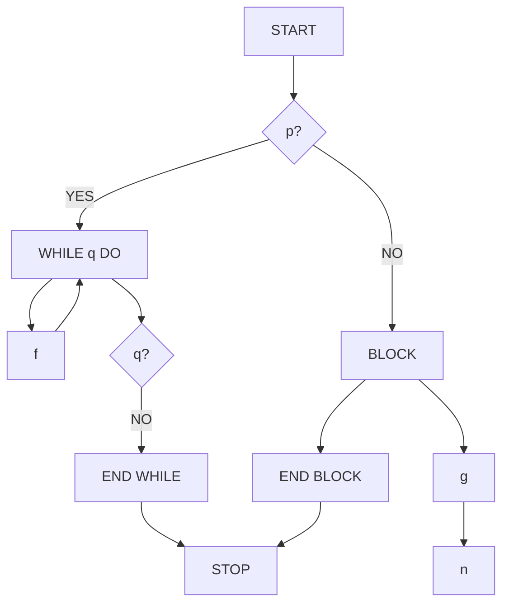
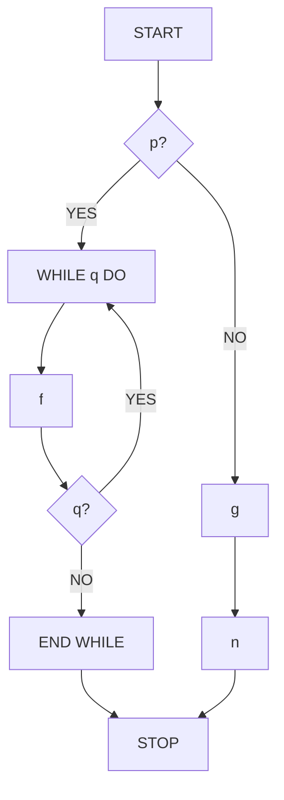
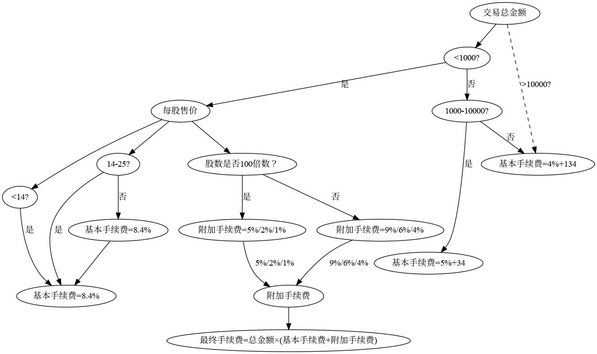
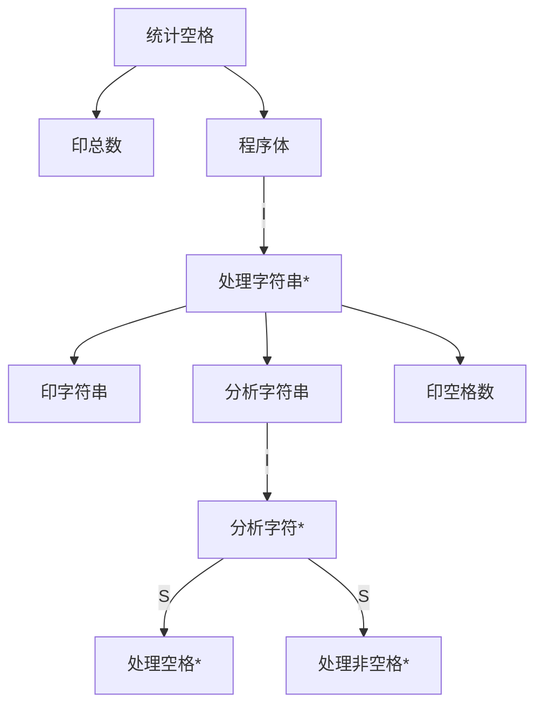
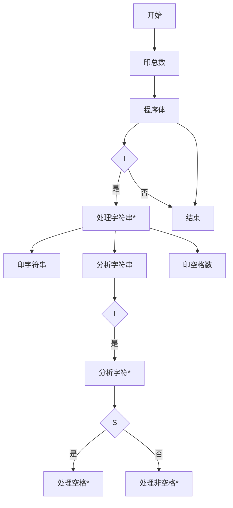
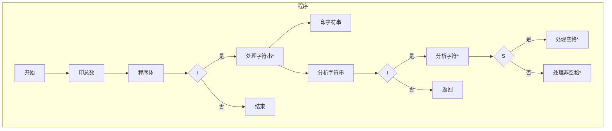

# 软件工程 第三次作业

## 习题五

### 第 3 题

用面向数据流的方法设计下列系统的软件结构

- 储蓄系统

  ```mermaid
  graph TD
      A[业务员输入] --> B{存款/取款?}
      B -->|存款| C[记录存款信息]
      C --> D[打印存单]
      B -->|取款| E[验证密码]
      E --> F[计算利息]
      F --> G[打印利息清单]
      
      subgraph 输入流
      A
      end
      
      subgraph 变换中心
      B
      E
      F
      end
      
      subgraph 输出流
      D
      G
      end
  ```

  

- 机票预定系统

  ```mermaid
  graph TD
      A[旅行社输入旅客信息] --> B[安排航班]
      B --> C[生成取票通知]
      B --> D[生成账单]
      C & D --> E[旅客交款]
      E --> F[校验信息]
      F --> G[打印机票]
      
      subgraph 输入流
      A
      end
      
      subgraph 变换中心
      B
      F
      end
      
      subgraph 输出流
      C
      D
      G
      end
  ```

  

- 患者监护系统

  ```mermaid
  graph TD
      A[生理信号采集] --> B[实时监测]
      B --> C{安全范围?}
      C -->|超出| D[触发警报]
      B --> E[生成患者日志]
      F[护士请求] --> G[生成病情报告]
      
      subgraph 输入流
      A
      F
      end
      
      subgraph 变换中心
      B
      C
      end
      
      subgraph 输出流
      D
      E
      G
      end
  ```

  

  

### 第 4 题

美国某大学共有 200 名教师,校方与教师工会刚刚签订一项协议。按照协议,所有年工资超过$ 26 000(含$26 000)的教师工资将保持不变,年工资少于$26 000 的教
师将增加工资,所增加的工资数按下述方法计算 :给每个由此教师所购养的人(包括教师
本人)每年补助 $ 100,此外,教师有一年工龄每年再多补助 $50,但是,增加后的年工资总
额不能多于$ 26 000 。

教师的工资档案储存在行政办公室的光盘上 ,档案中有目前的年工资.购养的人数、雇用日期等信息。需要写一个程序计算并印出每名教师的原有工资和调整后的新工资。
要求:

1. 画出此系统的数据流图。

   ```mermaid
   graph TD
       A[教师工资档案] --> B[读取数据]
       B --> C{工资 < $26,000?}
       C -->|是| D[计算新工资]
       C -->|否| E[保持原工资]
       D --> F[校验工资≤$26,000]
       F --> G[存储新工资]
       G --> H[生成对照表]
       E --> H
       H --> I[打印结果]
   
       subgraph 输入
       A
       end
   
       subgraph 处理
       B
       C
       D
       F
       end
   
       subgraph 输出
       I
       end
   
       subgraph 数据存储
       G
       end
   ```

   

2. 写出需求说明。

   功能需求：

   1. 输入：读取教师工资档案（含当前工资、赡养人数、雇用日期）
   2. 处理：
      - 筛选出年工资<$26,000的教师
      - 计算新工资：
        - 基础补助：赡养人数（含本人）× $100
        - 工龄补助：工龄（当前年份-雇用年份）× $50
        - 新工资 = 原工资 + 基础补助 + 工龄补助
      - 强制限制：新工资 ≤ $26,000
   3. 输出：生成新旧工资对照表（教师ID、原工资、新工资）

   非功能需求：

   - 数据完整性：确保计算后不丢失原始数据
   - 性能：200名教师需在合理时间内完成处理
   - 可审计性：保留工资调整记录

   

3. 设计上述的工资调整程序(要求用 HIPO 图描绘设计结果) ,设计时分别采用下
   述两种算法 ,并比较这两种算法的优缺点:

   搜索工资档案数据,找出年工资少于$ 26 000 的人,计算新工资 ,校核是否超过
   $ 26 000 ,储存新工资 ,印出新旧工资对照表，

   ```mermaid
   graph TD
       P1[工资调整程序] --> P1.1[读取档案]
       P1.1 --> P1.2[遍历所有记录]
       P1.2 --> P1.3{工资<$26,000?}
       P1.3 -->|是| P1.4[计算新工资]
       P1.4 --> P1.5[校验上限]
       P1.5 --> P1.6[更新记录]
       P1.3 -->|否| P1.7[保留原工资]
       P1.6 & P1.7 --> P1.8[生成对照表]
   ```

   | 模块 |     输入     |       处理逻辑       |     输出     |
   | :--: | :----------: | :------------------: | :----------: |
   | P1.1 |   光盘档案   |   读取所有教师数据   | 教师数据列表 |
   | P1.2 | 教师数据列表 |     遍历所有记录     |   当前记录   |
   | P1.3 |   当前记录   | 判断工资是否<$26,000 |   是否调整   |
   | P1.4 |   当前记录   |      计算新工资      |    新工资    |
   | P1.5 |    新工资    |   校验是否≤$26,000   |  校验后工资  |
   | P1.6 |  校验后工资  |       更新档案       | 更新后的记录 |
   | P1.7 |   当前记录   |      保留原工资      |    原记录    |
   | P1.8 | 所有教师数据 |  生成新旧工资对照表  |    对照表    |

   优点

   1. 实现简单直接
   2. 不需要预处理数据
   3. 适用于工资分布随机的情况

   缺点

   1. 需要遍历所有记录，即使大部分工资都≥$26,000
   2. 时间复杂度为O(n)

   把工资档案数据按工资从最低到最高的次序排序,当工资数额超过$26 000时即停止排序,计算新工资 ,校核是否超过限额 ,储存新工资,印出结果。

   ```mermaid
   graph TD
       P2[工资调整程序] --> P2.1[按工资升序排序]
       P2.1 --> P2.2[顺序处理]
       P2.2 --> P2.3{工资<$26,000?}
       P2.3 -->|是| P2.4[计算新工资]
       P2.4 --> P2.5[校验上限]
       P2.5 --> P2.6[更新记录]
       P2.3 -->|否| P2.7[终止处理]
       P2.6 & P2.7 --> P2.8[生成对照表]
   ```

   | 模块 |       输入       |       处理逻辑       |       输出       |
   | :--: | :--------------: | :------------------: | :--------------: |
   | P2.1 |     光盘档案     |    按工资升序排序    | 排序后的教师数据 |
   | P2.2 | 排序后的教师数据 |       顺序处理       |     当前记录     |
   | P2.3 |     当前记录     | 判断工资是否<$26,000 |     是否调整     |
   | P2.4 |     当前记录     |      计算新工资      |      新工资      |
   | P2.5 |      新工资      |   校验是否≤$26,000   |    校验后工资    |
   | P2.6 |    校验后工资    |       更新档案       |   更新后的记录   |
   | P2.7 |        -         |       终止处理       |        -         |
   | P2.8 |   所有教师数据   |  生成新旧工资对照表  |      对照表      |

   优点

   1. 当工资普遍较低时，可以提前终止处理
   2. 对于工资普遍较低的情况效率更高

   缺点

   1. 需要先对数据进行排序，增加O(n log n)时间复杂度
   2. 实现复杂度较高
   3. 如果工资普遍较高，排序反而降低效率

   

4. 所画出的数据流图适用于哪种算法?

   所绘制的数据流图更适用于**算法1（直接搜索法）**，原因如下：

   1. **线性处理流程**：DFD展示的是从输入到输出的线性处理流程，符合直接搜索法逐条记录处理的特点。
   2. **无预处理步骤**：DFD中没有显示排序等预处理步骤，直接进入条件判断和计算，这与直接搜索法的实现一致。
   3. **通用性**：虽然DFD本身是算法无关的，但其结构更贴近直接搜索法的处理逻辑。若要体现排序截断法，需在DFD中增加排序模块，并调整处理流程以反映排序后的顺序处理。
   4. **数据流方向**：DFD中的数据流是单向的从输入到输出，没有体现出排序算法中可能需要的反向处理或提前终止的特性。

   **改进建议**：

   - 若需明确区分两种算法，可以在DFD的"处理"部分添加注释或子图，分别表示两种算法的具体实现步骤。
   - 对于排序截断法，可以绘制扩展的DFD，增加排序模块，并调整处理流程以反映排序后的顺序处理。


## 习题六

### 第 3 题

画出伪代码程序的程序流程图和盒图

```
START
IF p THEN
	WHILE q DO
		f
	END DO
ELSE
	BLOCK
		g
		n
	END BLOCK
END IF
STOP
```






### 第 7 题

某交易所规定给经纪人的手续费计算方法如下 :总手续费等于基本手续费加上与交易中的每股价格和股数有关的附加手续费。如果交易总金额少于 1 000 元,则基本手续费为交易金额的 8.4% ;如果交易总金额在 1 000 元一10 000 元之间,则基本手续费为交易金额的 5% ,再加 34 元;如果交易总金额超过 10 000 元,则基本手续费为交易金额的4%加上 134元。当每股售价低于 14 元时,附加手续费为基本手续费的 5% ,除非买进、卖出的股数不是 100 的倍数,在这种情况下附加手续费为基本手续费的 9% 。当每股售价在 14 元到 25 元之间时,附加手续费为基本手续费的 2%% ,除非交易的股数不是 100 的倍数,在这种情况下附加手续费为基本手续费的 6% 。当每股售价超过 25 元时,如果交易的股数零散(即不是 100 的倍数) ,则附加手续费为基本手续费的 4外 ,否则附加手续费为基本手续费的1% 。

要求:

(1) 用判定表表示手续费的计算方法 。

|   **C1**   | **C2** | **C3** | **A1** | **A2** |        **计算公式**        |
| :--------: | :----: | :----: | :----: | :----: | :------------------------: |
|   <1000    |  <14   | 是/否  |  8.4%  | 5%/9%  |     总金额×(8.4% + A2)     |
|   <1000    | 14-25  | 是/否  |  8.4%  | 2%/6%  |     总金额×(8.4% + A2)     |
|   <1000    |  >25   | 是/否  |  8.4%  | 1%/4%  |     总金额×(8.4% + A2)     |
| 1000-10000 |  <14   | 是/否  | 5%+34  | 5%/9%  | (总金额×5% + 34)×(1 + A2)  |
| 1000-10000 | 14-25  | 是/否  | 5%+34  | 2%/6%  | (总金额×5% + 34)×(1 + A2)  |
| 1000-10000 |  >25   | 是/否  | 5%+34  | 1%/4%  | (总金额×5% + 34)×(1 + A2)  |
|   >10000   |  <14   | 是/否  | 4%+134 | 5%/9%  | (总金额×4% + 134)×(1 + A2) |
|   >10000   | 14-25  | 是/否  | 4%+134 | 2%/6%  | (总金额×4% + 134)×(1 + A2) |
|   >10000   |  >25   | 是/否  | 4%+134 | 1%/4%  | (总金额×4% + 134)×(1 + A2) |

(2) 用判定树表示手续费的计算方法 。



### 第 9 题

将统计空格程序的 Jackson 图改画为等价的程序流程图和盒图







