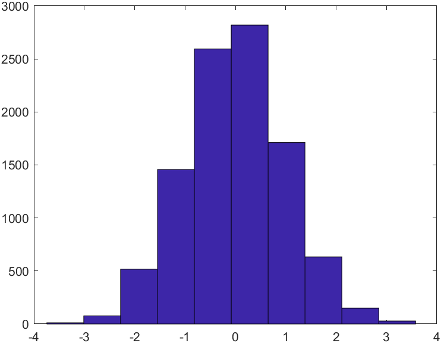

# 基本操作

## 命令行

### 窗口命令

| 控制命令 | 操作                                             |
| -------- | ------------------------------------------------ |
| clc      | 清除命令行中所有显示内容                         |
| clear    | 清除内存总所有变量                               |
| clf      | 清除Matlab当前图形窗口中所有图形                 |
| dir      | 列出指定目录下的文件                             |
| cd       | 改变当前目录                                     |
| disp     | 在运行中显示变量和文字内容                       |
| type     | 显示所有指定文件的全部内容                       |
| hold     | 控制当前图像窗口对象是否被刷新                   |
| home     | 发送光标复位命令，显示为清空屏幕而不删除任何文本 |

###  预定义变量

| 预定义变量名 | 含义               |
| ------------ | ------------------ |
| ans          | 运算结果默认变量名 |
| pi           | 圆周率             |
| eps          | 浮点数的精度       |
| nan/NAN      | 非数               |
| inf          | 无穷大             |
| i或j         | 虚数标志           |

## 文件

### 脚本与函数

脚本文件和函数文件都以扩展名`.m`保存，函数供脚本和命令行调用，函数文件内只能定义一个函数并且此函数需要和文件名称相同。脚本文件可以调用其他函数，也可以在脚本内部定义函数。

### 变量

退出Matlab后，工作区的变量不会保留，此时可以使用`save`来保存数据。使用`load`来加载数据。

```matlab
save filename

load filename
```


| 扩展名 | 文件类型   |
| ------ | ---------- |
| .m     | 脚本或函数 |
| .mat   | 保存的变量 |
| .fig   | 保存的图片 |

# 函数语法

## 运算

### 随机矩阵

```matlab
A = rand(3, 3)				% 3*3 随机矩阵，元素为(0, 1)浮点数
A = randi([1, 10], 3, 3)		% 3*3 随机矩阵，元素为[1, 10]整数
```


### 元素位置

`find()`

在给定出寻找符合条件的元素并返回索引

```matlab
A = [0 1 2 3 4 5 6 7 8]
find(A > 4)
```

```
ans =
	6 7 8 9
```

`findstr(s1, s2)`

在给定两个字符串中，在更长的字符串里寻找更短的字符串并返回位置。

```matlab
b = [10, 5, 8, 1];
findstr(5, b);
```

```
ans =
	2
```

`strfind(string, pattern)`

在给定字符串中寻找模式串并返回一个向量，表示所有找到的位置


### `size` 矩阵大小

```matlab
[r, c] = size(A);
% r和c是矩阵A的行和列数

s = size(A);
% s是一个向量，包含r和c

r = size(A, 1);
c = size(A, 2);
% 指定获取行或列
```

另外，`length()=max(size())`


### `sort` 排序

```matlab
A = randi([1, 10], 3, 3);
B = sort(A) % 将每一列排序
C = sort(A, 2) % 将每一行排序
```


## 绘图

### `hist`直方图

```matlab
y = randn(10000, 1);
hist(y);

hist(y, 20);
% 统计20个间隔
```




### `subplot` 子图

`subplot` 是 MATLAB 中用于在同一图形窗口中创建多个子图的函数。它允许你在同一图形窗口中分割多个区域，每个区域可以单独绘制不同的图形。这在需要比较多个数据集或不同图形时非常有用。

```
subplot(m, n, p)
```

- **m**: 指定子图的行数。
- **n**: 指定子图的列数。
- **p**: 指定当前要绘制的子图的位置，按从左到右、从上到下的顺序编号。
