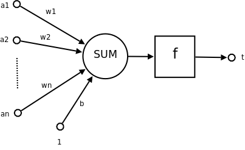

# 神经网络

**人工神经网络**（artificial nerual network, ANNs）又称类神经网络或神经网络（nerual network, NNs），在机器学习和认知学科领域，是一种模仿生物神经网络的结构和功能的数学模型或计算模型，用于对函数进行估计或近似。

## 构成

典型的人工神经网络具有以下三部分：

**结构**（Architecture）结构指定了网络中的变量和它们的拓扑关系。例如神经网络中的变量可以是神经元连接的权重（weights）和神经元的激励值（activities of the neruons）。

**激励函数**（Activation Rule）大部分神经网络模型具有一个短时间尺度动力学习规则，来定义神经网络如何根据其他神经元的活动来改变自己的激励值。一般激励函数依赖于网络中的权重。

**学习规则**（Learning Rule）学习规则指定了网络中权重如何随时间推进而调整。这一版被看作是一种长时间尺度的动力学习规则。一般情况下学习规则依赖于神经元的激励值。

### 神经元

- 输入向量 $$\vec{A} = (a_1, a_2, \cdots, a_n)$$，也是输入向量的各个分量
- 权向量 $$\vec{W} = (w_1, w_2, \cdots, w_n)$$，为神经元各个突触的权重值
- b 为偏置（bias）
- $$f$$ 为传递函数，通常为非线性函数。
- t 为神经元输出

数学表示 $$t = f(\vec{W'}\vec{A} + b)$$

