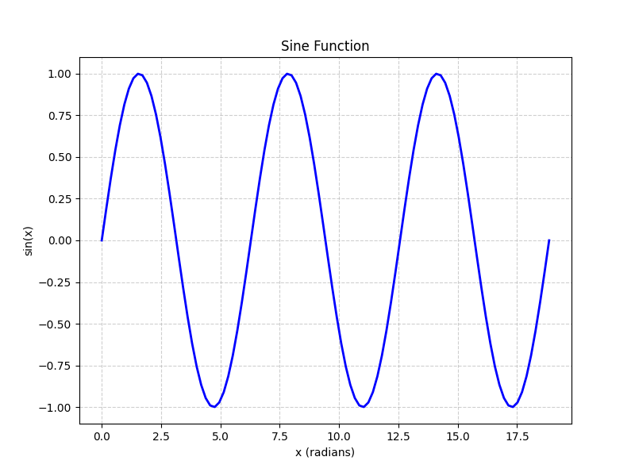

# 机械振动和电磁振荡

## 简谐振动

### 简谐振动特征及其表达式

如果物体所受合外力的大小总是与物体离开平衡位置的唯一大小成正比且方向相反，那么该物体的运动就是简谐振动。这种性质的力称为**线性回复力**。
$$
\frac{d^2x}{dt^2} = -\omega^2x \\
$$
该微分方程的通解为
$$
x = A \cos(\omega t + \phi_0) \\
\text{或 } x = A \sin(\omega t + \phi_0')
$$

其中A为振幅，\phi_0为相位。

作简谐振动的物体加速度大小总是与其位移大小成正比且方向相反，作为简谐振动的运动学特征。简谐振动表达式也可以用复指数形式表示，即
$$
x = Ae^{i(\omega t + \phi_0)}
$$

### 描述简谐振动的特征量

**振幅**，作简谐振动的物体离开平衡位置的最大位置的绝对值A叫做振幅。

**周期和频率**，完全一次全震动经理的事件称为周期，用T来表示
$$
x = A \cos(\omega(t + T) + \phi_0) = A \cos(\omega t + \phi_0)
$$
满足上述方程的T的最小值应该满足 $$\omega T = 2\pi$$
$$
T = \frac{2\pi}{\omega}
$$
单位时间内物体所作全振动的次数称为振动频率，用 $$\nu$$ 或 $$f$$ 表示，单位是Hz。
$$
\nu = \frac{1}{T} = \frac{\omega}{2 \pi} \\
\omega = 2 \pi \nu
$$
所以 $$\omega$$ 表示物体在 $$2\pi s$$ 时间内所作的全震动次数，称为振动的角频率，也称为原频率，单位是rad/s。对于弹簧振子，其角频率 $$\omega = \sqrt{\frac{k}{m}}$$ 所以得到
$$
T = 2 \pi \sqrt{\frac{m}{k}} \\
\nu = \frac{1}{2\pi}\sqrt{\frac{k}{m}}
$$

### 常见简谐振动

**单摆**

**复摆**

复摆在摆角很小时也在其平衡位置附近作简谐振动，其周期为
$$
T = \frac{2\pi}{\omega} = 2\pi\sqrt{\frac{J}{mgh}}
$$

## 阻尼振动

在阻尼振动中，振动系统具有的能量将在振动过程中不断减少。
$$
F_f = -\gamma v = -\gamma\frac{dx}{dt}
$$
其中 $$\gamma$$ 称为**阻尼系数**，大小由物体的形状、大小和流体性质来决定。这里设振动物体的质量为m，在弹性力和阻力作用下的运动方程为
$$
m \frac{d^2x}{dt^2} = -kx - \gamma\frac{dx}{dt}
$$
令 $$\frac{k}{m} = \omega^2_0$$ ，$$\frac{\gamma}{m} = 2\delta$$ ，这里 $$\omega_0$$ 称为无阻尼时振子的故又叫频率，$$\delta$$ 称为阻尼系数，代入上式后求出微分方程的通解得
$$
x = A_0 e^{-\delta t}\cos(\omega't + \phi'_0) \\
\text{式中 } \omega' = \sqrt{\omega_0^2 - \delta^2} = \sqrt{\frac{k}{m} - \frac{\gamma^2}{4m^2}}
$$
阻尼振动的周期T'
$$
T' = \frac{2\pi}{\omega'} = \frac{2\pi}{\sqrt{\omega_0^2 - \delta^2}}
$$
阻尼越大，振幅的减小越快，周期比无阻尼时大得越多。若阻尼作用$$\delta < \omega_0$$ 时，为正常的阻尼振动，当阻尼过大，即 $$\delta > \omega_0$$ ，物体以非周期运动得方式慢慢回到平衡位置，这种情况称为过阻尼，

## 电磁振荡

### LC振荡电路

电路中电压和电流得周期性变化为**电磁振荡**，产生电磁振荡得电路称为**振荡电路**。如果电路中没有任何能量损耗,这种电磁振荡就是无阻尼自由振荡。
$$
q = Q_0 \cos(\omega t + \phi_0)
$$
其中Q_0为级板上电荷量的最大值，称为**电荷量振幅**，\phi_0是振荡的初相位。Q_0和\phi_0的大小由初始条件决定，\omega 是振荡电路得到角频率，无阻尼自由振荡的频率和周期分别为
$$
\nu = \frac{\omega}{2 \pi} = \frac{1}{2 \pi \sqrt{LC}} \\
T = 2 \pi \sqrt{LC}
$$
对时间t求导数，可得电路中任一时刻电流为
$$
i = \frac{dq}{dt} = -\omega Q_0 \sin(\omega t + \phi_0)
$$
令\omega Q_0 = I_0 表示电流的最大值，称为电流振幅，则上式
$$
i = -I_0 \sin(\omega t + \phi_0) = I_0 \cos(\omega t + \phi_0 + \frac{\pi}{2})
$$
现在考虑LC电路中的能量，在任意时刻t，电容器电极板上的电荷量为q，相应的电场能量为
$$
W_e = \frac{1}{2}\frac{q^2}{C} = \frac{Q_0^2}{2C}\cos^2(\omega t + \phi_0)
$$
设此时电流为i，那么线圈的磁场能量为
$$
W_m = \frac{1}{2}L i^2 = \frac{L \omega^2 Q_0^2}{2} \sin^2(\omega t + \phi_0)
$$
得总能量为
$$
\begin{align}
W & = W_e + W_m \\
& = \frac{Q_0^2}{2C} \cos^2(\omega t + \phi_0) + \frac{Q_0^2}{2C} \sin^2(\omega t + \phi_0) \\
& = \frac{Q_0^2}{2C}
\end{align}
$$

### 力电对比

| 机械振动                       | 电磁振荡                               |
| ------------------------------ | -------------------------------------- |
| 位移 x                         | 电荷 q                                 |
| 速度 v                         | 电流 i                                 |
| 质量 m                         | 电感 L                                 |
| 劲度系数 k                     | 电容倒数 $$\frac{1}{C}$$               |
| 阻力系数 $$\gamma$$            | 电阻 R                                 |
| 驱动力 F                       | 电动势 E                               |
| 弾性势能 $$\frac{1}{2} k x^2$$ | 电场能量 $$\frac{1}{2} \frac{q^2}{C}$$ |
| 动能 $$\frac{1}{2} m v^2$$     | 磁场能量 $$\frac{1}{2} L i^2$$         |

# 机械波和电磁波

## 平面简谐波的波函数

$$
y(x, t) = A \cos[\omega (t - \frac{x}{u}+\phi_0)]
$$

## 平面波的波动方程

## 波的能量和强度

## 惠更斯原理与波的折射

## 多普勒效应和冲击波

# 光学

## 相干光

## 双缝干涉

## 光程与光程差

给定单色光的振动频率 $$\nu$$ 在不同介质中是相同的。在折射率为n的介质中，光速 \nu 是真空中光速 c 的 \frac{1}{n}。所以在此介质中，单色光的波长 \lambda' 将是真空中波长 \lambda 的 \frac{1}{n}
$$
\lambda' = \frac{v}{\nu} = \frac{c}{n \nu} = \frac{\lambda}{n}
$$
在折射率为n的某一介质中，如果广播通过的波程即几何路程为x，奕即其间的波数为 \frac{x}{\lambda}，那么同样波数的广播在真空中通过的几何路程是
$$
\frac{x}{\lambda'} \lambda =nx
$$
由此可见，光波再介质中的路程x相当于再真空中的路程nx，所以广播再某一介质中所经历光程等于它的集合路程x与此介质的折射率n的乘积，nx称为光程

## 薄膜干涉

# 相对论

## 狭义相对论的基本原理

- 光速不变原理，在所有惯性系中，真空中的光速都等于 $$c = \frac{1}{\sqrt{\mu_0\epsilon_0}}$$，分别是真空磁导率和真空介电常数，与光源运动无关。
- 效益相对论原理，在所有惯性系中，物理定律拥有相同的表达形式，这是力学相对性原理的推广。

## 洛伦兹坐标变换

当两个参考系 $$s$$ 与 $$s'$$ 在时刻 $$t = 0$$ 时重合，且 $$s'$$ 相对 $$s$$ 以速度 $$v$$ 沿 $$x$$ 轴正方向运动时，一个事件在 $$s$$ 系得坐标 $$(x, y, z, t)$$ 在 $$s'$$ 系的坐标 $$(x', y', z', t')$$ 满足以下关系。
$$
\begin{bmatrix}
x' \\ ct'
\end{bmatrix}
= \begin{bmatrix}
\gamma & -\beta \gamma \\
-\beta \gamma & \gamma
\end{bmatrix}
\begin{bmatrix}
x \\ ct
\end{bmatrix}
$$
其中，$$\gamma$$ 称为洛伦兹因子
$$
\beta = \frac{v}{c} \\
\gamma = \frac{1}{\sqrt{1 - \frac{v^2}{c^2}}}
$$

## 狭义相对论运动学与动力学

### 时间膨胀

$$
t = \frac{t_0}{\sqrt{1 - (\frac{v}{c})^2}}
$$

$$
动钟计时值 t' = 静钟计时值 t \times 洛伦兹因子 \gamma
$$

### 长度收缩

$$
L = L_0 \sqrt{1 - (\frac{v}{c})^2}
$$

### 相对论质量

$$
m = \frac{m_0}{\sqrt{1 - (\frac{v}{c})^2}}
$$

### 相对论能量

根据相对论质量公式，运动时物体质量增大，同时运动时将会有动能，质量与动能均随速度增大而增大。
$$
E_k = \int_{m_0}^m c^2 dm = mc^2 - m_0c^2
$$

$$
总能量 = 静止能量 + 动能 \\
E = mc^2
$$
**相对论动量与能量**
$$
E^2 = (pc)^2 + (m_0 c^2)^2 \\
$$
当速度接近光速时
$$
E = pc
$$

# 早期量子论和量子力学基础

## 热辐射和普朗克能量子假设

## 光电效应

### 实验规律

在研究光电效应的实验装置中，在光电管两级加上电势差U_{AK}，当某些单色光照射到阴极板K上时会释放电子，这种电子称为**光电子**，这些光电子在加速电场作用下，飞向阳极A，形成回路中的光电流。

**饱和电流**，以一定强度单色光照射电极K时，加速电势差U_{AK}越大，光电流i也越大。光电流有饱和值i_m。如果增加光的强度，在相同的加速电势差下，光电流的量值也较大，相应的i_m也增大。**单位时间内，受光照的金属板释放出来的电子书和入射光的强度成正比**。

**遏制电势差**
$$
\frac{1}{2}mv^2_m = eU_a
$$

### 光子理论

光在空间传播时，具有粒子性，光束可以想象成一束以光速c运动的粒子流，这些粒子称为**光量子**。简称**光子**，每一个光子的能量也是 $$\epsilon = hv$$，不同频率的光子具有不同的能量。按照光子理论，光电效应可以解释如下：当金属中的一个自由电子从入射光中吸取一个光子后，就获得能量 $$hv$$ 大于电子从金属表面逸出时所需的逸出功 A，这个电子就可以从金属中逸出。
$$
hv = \frac{1}{2}mv^2_m + A
$$
其中 $$\frac{1}{2}mv_m^2$$ 是光电子的最大初动能。

## 康普顿效应
