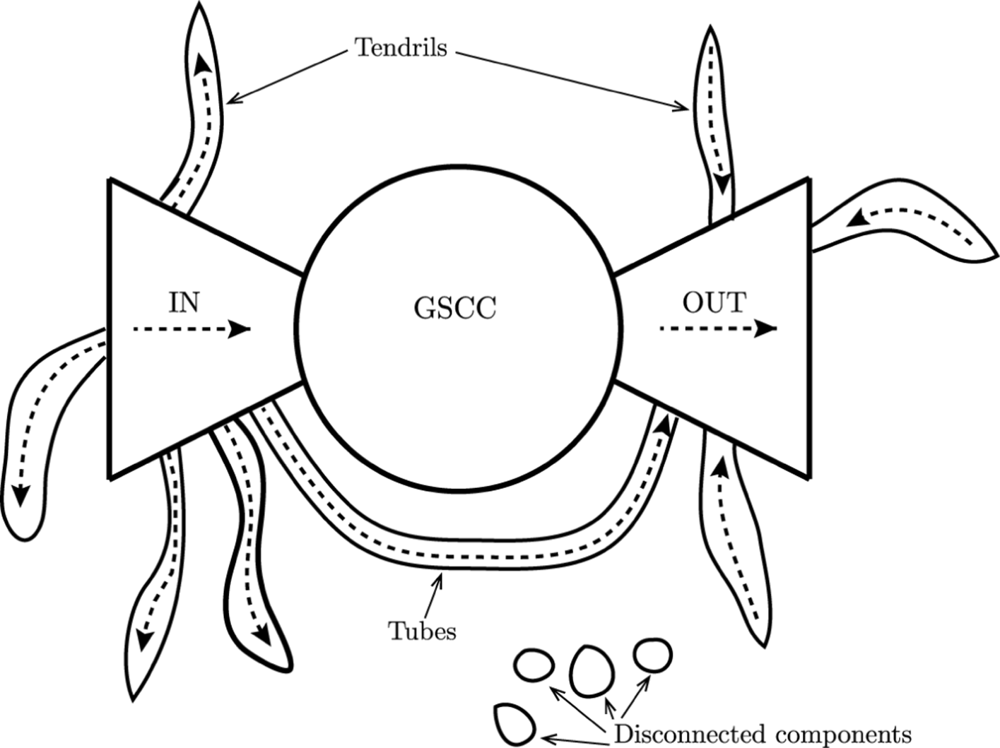
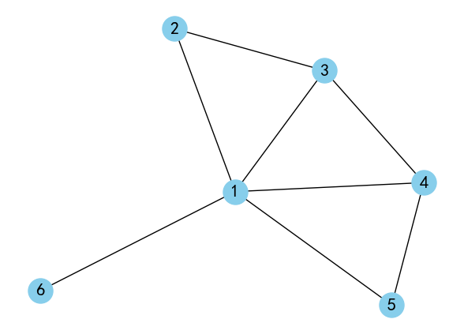
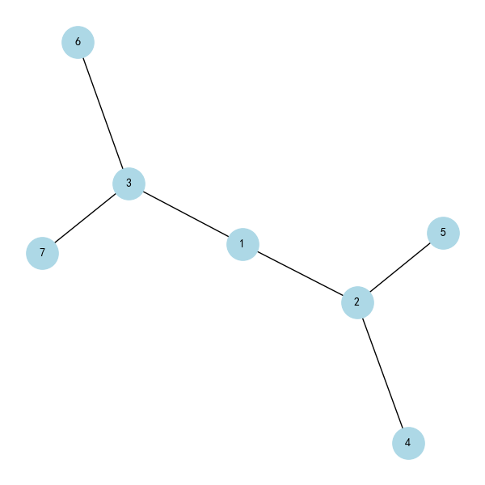
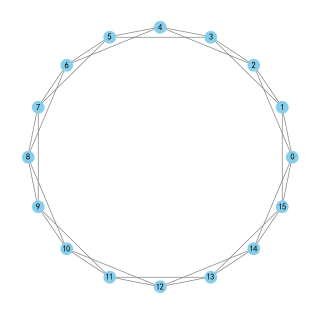

# 公式

**平均度**：网络中所有节点的度的平均值称为网络的的平均度记为 $$\langle k \rangle$$
$$
\langle k \rangle = \frac{2M}{N}
$$
**网络密度**：一个包括N个节点的网络密度定义为网络实际存在边数M与最大可能的边数之比
$$
\rho = \frac{M}{\frac{1}{2} N (N - 1)}
$$
**平均路径长度**：网络的平均路径长度定义为任意两个节点之间距离的平均值
$$
L = \frac{1}{\frac{1}{2}N(N - 1)}\
$$
**聚类系数**：

# 2. 网络与图

## 网络的图表示

### 简单图

假设图 $$G = (V, E)$$ 是一个定点数为N，边数为M得到简单无向图。由于任意两个顶点之间之多有一条边，则
$$
0 \le M \le \frac{N(N - 1)}{2}
$$
在相同情况的有向图，可能存在两条相反的的边，则
$$
0 \le M \le N(N - 1)
$$
简单图的极端情形有**空图**和**完全图**。

### 图的计算机表示

1. 邻接矩阵
2. 邻接表与三元组

## 路径与连通性

### 路径

回路、简单路径、圈

## 割集与Menger定理

设定点 s 和定点 t 为图 G 中两个不相邻的定点，则使定点 s 和定点 t 分别属于不同的连通片所需去除的定点的最少数目等于连接定点 s 和定点 t 的独立的简单路径最大数目。

## 最小生成树

### Prim算法

初始化选定边集 $$TE = \varnothing$$ 。在所有边集中，重复选择权值最小的边 $$(u, v)$$​ 加入选定边集 TE，同时将定点加入点集 U。重复操作直到点集 U 包括了图 G 中所有节点。

时间复杂度为 $$O(M + N \log N)$$ ，适合计算边稠密的网络最小生成树

### Kruskal算法

初始时 U = V， TE = \varnothing 。将图G中的边按权值从小到大的顺序依次选取，若选取的边使生成树不生成圈，则将它加入TE中，若选取的边生成圈则舍弃，如此进行下去直到TE中包含N - 1条边为止。

时间复杂度为 $$O(M \log M)$$ ，因此适合计算边稀疏的网络最小生成树。

### Djskra算法

## 二分图与匹配问题

# 3. 网络基本拓扑性质

## 复杂网络的连通性

### 无向网络中的巨片

### 有向网络中的蝴蝶结结构*

实际大规模有向网络中往往你不是强连通也不是弱连通的，但是许多有向网络往往有一个包含了网络中相当部分节点的很大的若连同片，称为**弱连通巨片**（Giant weakly connected component）。这一弱连通巨片具有一种包含四个部分的**蝴蝶结结构**。包含强连通核，入部，出部和管子。

## 节点的度与网络稀疏性

### 度与平均度

无向网络中节点i的度 $$k_i$$ 定义为与节点直接相连的边的数目。所有节点的度的平均值称为网络的平均度，记作`<k>`。

给定网络G的邻接矩阵 $$A = (a_{ij})_{N \times N}$$，则有
$$
k_i = \sum_{j = 1}^Na_{ij} = \sum_{j = 1}^Na_{ji} \\
\langle k \rangle = \frac{1}{N}\sum_{i=1}^Nk_i = \frac{1}{N}\sum_{i,j=1}^Na_{ij}
$$
网络节点的度与网络边数M之间有如下关系，即度数 = 边数的两倍
$$
2M = N\langle k \rangle = \sum_{i = 1}^Nk_i = \sum_{i, j = 1}^Na_{ij}
$$
亦有
$$
M = \frac{1}{2}N \langle k\rangle = \frac{1}{2}\sum_{i = 1}^Nk_i = \frac{1}{2}\sum_{i,j = 1}^{N},\\
\langle k \rangle = \frac{2M}{N}
$$

### 出度与入度

节点的出度与入度可以表示为
$$
k_i^{out} = \sum_{j = 1}^N a_{ij} \\
k_i^{in} = \sum_{j = 1}^N a_{ji}
$$
平均出度，平均入度和边数M与节点个数N之间的关系
$$
\langle k^{out} \rangle = \langle k^{in} \rangle = \frac{M}{N}
$$

### 网络稀疏性与稠密化

**网络密度**：一个包含N个节点的网络密度定义为网络中实际存在的边数M与最大可能的边数之比。对于无向网络
$$
\rho = \frac{M}{\frac{1}{2}N(N - 1)} \rarr \text{分母为N个节点网络全连通图得到边数}
$$
对于有向网络去掉 $$\frac{1}{2}$$ 

## 平均路径长度与直径

### 无权无向网络情形

**平均路径长度**，网络中两个节点i和j的最短路径，也成为测地路径，指连接这两个节点边数最少的路径。节点i和j之间的**距离$$d_{ij}$$**定义为连接这两个节点的最短路径上的数目。

网络的平均路径长度（Average path length）L定义为任意两个节点之间的距离的平均值。其中N为网络节点数，网络的平均路径长度也称为网络的**特征路径长度**或**平均距离**。
$$
L = \frac{1}{\frac{1}{2}N(N - 1)}\sum_{i \ge j}d_{ij}
$$
 **网络直径**，网络中任意两个节点之间的距离最大值为网络的**直径**，即
$$
D = \underset{i,j}{max}d_{ij}
$$

### 加权有向图网络情形

求解加权有向网络上两点之间最短路径的经典算法时Dijkstra算法。该算法可以计算从一个源节点s到网络中所有其他节点的最短路径，其基本思想时为每个节点v保留到目前为止所找到的从节点s到节点v的最短路径。

*以节点s为起点，利用贪心算法不断扩大最小距离节点集合。*

## 聚类系数*

一个**网络的聚类系数**C定义为网络中所有节点的聚类系数的**平均值**。

### 局部聚类系数

聚类系数描述了紧密连接成都，是形成簇的指标。假设网络中节点i的度为 $$k_i$$ ，即它有 $$k_i$$ 个直接有边相连的邻居节点。网络中一个度为 $$k_i$$ 的节点i的聚类系数 $$C_i$$ 定义为
$$
C_i = \frac{E_i}{(k_i(k_i - 1))/2} = \frac{2E_i}{k_i(k_i - 1)}
$$
其中 $$E_i$$ 是节点i的 $$k_i$$​ 个邻接点之间实际存在的边数。
$$
C_i = \frac{包含节点i的三角形的数目}{以节点i为中心的联通三元组的数目}
$$

### 全局聚类系数

$$
C = \frac{3 \times 网络中三角形的数目}{网络中联通三元组的数目}
$$

假设存在图

邻接矩阵为
$$
\begin{matrix}
0 & 1 & 1 & 1 & 1 & 1 \\
1 & 0 & 1 & 0 & 0 & 0 \\
1 & 1 & 0 & 1 & 0 & 0 \\
1 & 0 & 1 & 0 & 1 & 0 \\
1 & 0 & 0 & 1 & 0 & 0 \\
1 & 0 & 0 & 0 & 0 & 0
\end{matrix}
$$
可以求出
$$
C_1 = \frac{3}{\text C_5^2} = \frac{3}{10}
$$
网络的聚类系数为
$$
C = \frac{1}{6}\sum_{i = 1}^N C_i = \frac{109}{180}
$$

## 度分布

### 度分布的概念

网络中随机选择的节点为k的概率，也就是度为k得到节点在所有节点所占的比例。

| k    | P(k) |
| ---- | ---- |
| 1    | 4/7  |
| 2    | 1/7  |
| 3    | 2/7  |

从概率统计的角度看，$$p_k$$​ 可以视为网络中一个随机选择的节点的度的概率。而有向网络的**出度分布**和**入度分布**。
$$
\langle k^{out} \rangle = \langle k^{in} \rangle = \frac{M}{N}
$$

### 从钟形曲线到长尾分布*

标度分布，如正态分布和泊松分布。无标度分布例如长尾分布和幂律分布。

泊松分布满足
$$
P(k) = \frac{\lambda^k e^{-\lambda}}{k!}
$$
其中参数 $$\lambda > 0$$。泊松分布的均值和方差都是 $$\lambda$$，且随着其增大，分布的形状迅速接近正态曲线。

与钟形分布存在一个明显的特征不同，长尾分布往往各节点之间的链接状况具有严重的不均匀分布性，不存在单一的特征标度，因此也称为**无标度分布（Scale-free distribution）**。

长尾分布
$$
P(k) \propto k^{-\alpha}
$$

## 幂律分布

### 累计度分布

累积度分布表示的是度不小于k的节点在整个网络中所占的比例，也就是网络中随机选取的一个节点得到度不小于k的概率，即 $$P_k = \sum_{k' = k}^{\infty} P(k')$$。

想要判断一个网络的度分布 P(k) 是否为幂律分布，利用双对数坐标系，采用最小二乘直线拟合法判断。双对数坐标系中的直线：
$$
\ln P(k) = \ln C - \gamma\ln k
$$
当度分布为幂律度分布时，累积度分布函数近似符合幂指数为 \gamma - 1 的幂律分布
$$
P_k = \frac{C}{\gamma - 1}k^{-(\gamma - 1)}
$$
当度分布为指数分布时，累积度分布函数也具有指数型，且具有相同指数
$$
P_k = \sum_{k' = k}^{\infty} e^{-\frac{k'}{k}} \sim e^{-\frac{k'}{k}} \\
k > 0, \text{为常数}
$$

### 无标度性质

定理：考虑一个概率分布函数 $$f(x)$$ ，假设 $$f(1)f'(1) \ne 0$$ 。如果对任意给定常数 a ，存在常数 b 使得函数 f(x) 满足如下无标度条件：
$$
f(ax) = bf(x)
$$
那么必有
$$
f(x) = f(1)x^{-\gamma}, \gamma = -f'(1)/f(1)
$$
也就是说，幂律分布函数是唯一满足无标度条件的概率分布函数。

### 无标度性质的推导*

**证明** 在 $$f(ax) = bf(x)$$ 中取 x = 1，有 $$f(a) = bf(1)$$，从而有 $$b = f(a)/f(1)$$，有
$$
f(ax) = \frac{f(a)f(x)}{f(1)}
$$
由于上述方程对任意a都成立，两边对a求导可得
$$
x\frac{df(ax)}{d(ax)} = \frac{f(x)}{f(1)}\frac{df(a)}{da}
$$
若取 a = 1，则有
$$
x\frac{df(x)}{d(x)} = \frac{f'(1)}{f(1)}f(x)
$$
微分方程的解为
$$
\ln f(x) = \frac{f'(1)}{f(1)} \ln x + \ln f(1)
$$
取指数得
$$
f(x) = f(1)x^{-\gamma}
$$

### 幂律度分布极其检验

幂律分布的形式
$$
P(k) \sim k^{- \gamma}
$$

# 4. 度相关性与社团结构

## 度相关性与同配性

### 高阶度分布

1. 零阶度分布：平均度 $$\langle k \rangle = \frac{2M}{N}$$
2. 一阶度分布：度分布 $$P(k) = \frac{n(k)}{N}$$
3. 二阶度分布：联合概率分布

### 联合概率分布*

联合概率 $$P(j, k)$$ 定义为网络中随机选取的一条边的两个端点的度分别为j和k的概率，即为网络中度为j的节点和度为k的节点之间的边数占网络总边数的比例
$$
P(j, k) = \frac{m(j, k) \mu(j, k)}{2M}
$$
其中 $$m(j, k)$$ 是度为j的节点和度为k的节点之间的连边数，
$$
\mu(j, k) = \begin{cases}
1, j \ne k \\
2, j = k
\end{cases}
$$
联合概率分布具有如下性质：

1. 对称性，即
   $$
   P(j, k) = P(k, j), \quad\forall j, k
   $$

2. 归一化，即
   $$
   \sum^{k_{max}}_{j, k = k_{min}} P(j, k) = 1
   $$

3. 余度分布
   $$
   P_n(k) = \sum_{j = k_{min}}^{k_{max}}P(j, k)
   $$

其中 $$k_{min}$$ 和 $$k_{max}$$ 分别为网络节点的度的最小值和最大值。**$$P_n(k)$$ 表示网络中随机选取的一个节点随机选取的一个邻居节点的度为k的概率**。也就是说，在网络中随机选取一个节点，然后再从该节点触发随机地沿着一条脸变到达一个邻居节点，该邻居节点的度为k得到概率即为 $$P_n(k)$$。一般而言 $$P_n(k)$$ 与度分布P(k) 是不相同的。

余度分布，类似于边缘概率密度。
$$
P_n(k) = \sum_{j = k_{min}}^{k_{max}} P(j, k)
$$
其中 $$k_{min}$$ 和 $$k_{max}$$ 分别是网络中节点的度的最大值和最小值。

### 余平均度

条件概率 $$P_c(j | k)$$ 定义为网络中随机选取的一个度为k的节点的一个邻居节点度为j的概率，它与联合概率 P(j, k)之间具有如下关系
$$
P_c(j | k) P_n(k) = P(j, k) \\
P_c(j | k) = \frac{P(j, k)}{P_n(k)}
$$
计算度为k的节点的邻居节点的平均度，也成为度为k的节点的余平均度，记为 $$\langle k_{nn} \rangle$$
$$
\langle k_{nn}\rangle_i = \frac{1}{k_i}\sum_{i = 1}^{k_i} k_{i_j}
$$

# 5. 节点重要性与相似性

## 无向网络节点重要性指标

### 度中心性

在社会网络分析中，常用**中心性**来表示节点在网络中的位置。一个节点的度越大就意味着这个节点越重要。一个包含N个节点的网络中，节点最大可能的度值为N - 1，通常为便于比较而对中心性指标做**归一化处理**，度为 k_i 的节点的归一化的度中心性值定义为
$$
{DC}_i = \frac{k_i}{N - 1}
$$

### 介数中心性

以经过某个节点的最短路径的树木来刻画节点重要性的指标就成为**介数中心性**，简称**介数**（BC）。具体的，节点i的介数定义为
$$
BC_i = \sum_{s \ne i, i \ne t} \frac{n^i_{st}}{g_{st}}
$$
其中，$$g_{st}$$ 为从节点s到节点t的最短路径的数目，$$n^i_{st}$$ 为从节点s到节点t的g_{st}条最短路径中经过节点i的最短路径的数目。

### 接近中心性

对于网络中的每一个节点i，可以计算该节点到网络中所有节点的距离的平均值，记为d_i
$$
d_i = \frac{1}{N} \sum_{j = 1}^N d_{ij}
$$
其中d_{ij}是节点i到节点j的距离，这样就得到网络平均路径长度的另一种计算公式
$$
L = \frac{1}{N} \sum_{i = 1}^N d_i
$$
d_i值的大小也在某种程度上反映了节点i在网络中的相对重要性，我们把d_i的倒数定义为节点i的**接近中心性**，简称**接近数**，用记号CC_i来表示
$$
CC_i = \frac{1}{d_i} = \frac{N}{\sum_{j = 1}^N d_{ij}}
$$

### 特征向量中心性

一个节点的重要性即取决于其邻居节点的数量，也取决于其邻居节点的重要性，记x_i为节点i的重要性度量值，那么应该有
$$
x_i = c\sum_{j = 1}^N a_{ij} x_j
$$
其中c为一比例常数，$$A = (a_{ij})$$仍然是网络的邻接矩阵，记 $$x = \begin{bmatrix}x_1 & x_2 & ... & x_N\end{bmatrix}^T$$，则可以得到下式，意味着 $$\mathbf{x}$$ 是矩阵 $$\mathbf{A}$$ 与特征值 $$c^{-1}$$ 对应的的特征向量，故此称为特征向量中心性，计算向量$$\mathbf{x}$$ 的一个基本方法就是给定初值 $$\mathbf{x}(0)$$，然后采用迭代算法
$$
\mathbf{x} = c\mathbf{A}\mathbf{x}
$$

## 权威值和枢纽值HITS算法

### HITS算法描述

记 $$A = {(a_{ij})}_{N \times N}$$ 为有向网络对应的邻接矩阵。

初始：设定网络中所有节点的**权威值**和**枢纽值**的初始值

迭代过程：在第k步进行如下三种操作

1. 权威值校正规则：每一个节点的权威值校正为指向它的节点的枢纽值之和
   $$
   x'i(k) = \sum_{j = 1}^N a_{ij} y_j (k - 1)
   $$

2. 枢纽值校正规则：每一个节点的枢纽值校正为它所指向的所有节点的权威值之和
   $$
   y'_i(k) = \sum_{j = 1}^N a_{ij} x'_j(k)
   $$

3. 归一化
   $$
   x_i(k) = \frac{x'_i(k)}{\Vert x'(k)\Vert} \\
   y_i(k) = \frac{y'_i(k)}{\Vert y'(k)\Vert}
   $$
   

## PageRank算法*

### 基本算法

PageRank算法的基本想法是：WWW上一个页面的重要性取决于指向它的其他页面的**数量**与**质量**。

首先给定所有结点的初始PageRank值，$$PR_i(0)$$，i为节点序号，并且满足 $$\sum_{i = 1}^N PR_i(0) = 1$$，然后把每个节点的PR值平均封给它所指向的节点。也就是说下一轮的PR值由指向他的节点加权所决定，式中 $$a_{ji}$$ 代表两个节点是否连接，存在连接则为1，不存在为0。
$$
PR_i(k) = \sum_{j = 1}^N a_{ji} \frac{PR_j(k - 1)}{k_j^{out}}
$$

校正的PageRank算法，其中s为随机跳转率

在有向网络的邻接矩阵 $$A = (a_{ij})_{N \times N}$$ 基础上定义基本Google矩阵 $$\overline{A} = (\overline{a}_{ij})_{N \times N}$$ 如下
$$
\bar{a}_{ij}=
\begin{cases}
1/k_i^{out}, &\text{如果有从节点i指向j的边} \\
0, &\text{否则}
\end{cases}
$$
那么基本的 PageRank 校正规则可以写为如下**矩阵形式**
$$
PR(k) = \bar{A}^T PR(k - 1)
$$
上式就是求解矩阵 $$\bar A$$ 与模最大的特征值对应的主特征向量的幂法，并且有 $$\left \Vert PR(k) \right \Vert_1 = 1, \forall k \geq0$$。

### PageRank算法

修正的PageRank算法，我们假设：这类页面链接到集合中所有的网页（不管它们是否相关），使得这类网页的PR值将被所有网页均分。对于这种残差概率，我们引入阻尼系数 d，并声明 $$d=0.85$$，其意义是：任意时刻，用户访问到某页面后继续访问下一个页面的概率，相对应的 $$1−d=0.15$$ 则是用户停止点击，随机浏览新网页的概率。d 的大小由一般上网者使用浏览器书签功能的频率的平均值估算得到。
$$
PR_i(k) = s \sum_{j = 1}^{N} \bar{a}_{ji} PR_j(k - 1) + \frac{1 - s}{N}
$$

PageRank 校正算法的矩阵形式如下
$$
PR(k) = \tilde{A}^TPR(k - 1) = (\tilde{A}^T)^kPR(0) \\
其中 \quad \tilde{A} = s\bar{A} + \frac{1 - s}{N}ee^T
$$

# 6. 随机网络模型

## 规则网络

### 常见规则网络

**全局耦合网络**，如果一个网络中任意两个节点之间都有边直接相连，那么称该网络为一个全局耦合网络。

**最近耦合网络**，如果一个网络中，每一个节点只和它周围的邻居节点相连，那么就称该网络为最近耦合网络。

图中最近耦合网络的K = 4。K必须是偶数。

### 基本拓扑性质*

**全局耦合网络**具有最多的边数，最大的聚类系数 $$C_{gc} = 1$$ 和最小的平均路径长度 $$L_{gc} = 1$$。

**最近耦合网络**的聚类系数为
$$
\begin{aligned}
C_{nc} & = \frac{3 \times (网络中三角形的数目)}{网络中连通三元组的数目} \\
& = \frac{3(K - 2)}{4(K - 1)}
\end{aligned}
$$
网络中一个节点能在一步到达的最远的节点与该节点的格子间距为K/2。两个格子间距为m的节点之间的距离为[2m/K]，即不小于2m/K的最小整数，该网络的**平均路径长度**为
$$
L_{nc} \approx \frac{1}{N/2}\sum_{m = 1}^{N/2}[2m/K] = \frac{N}{2K}
$$

### 推导过程*

由于反方向的边的最大的跨度为 K/2，从一点出发的三角形数量就等于从 K/2 个节点中选取 2 个节点的组合数，即为
$$
\begin{pmatrix}K/2 \\ 2\end{pmatrix} = \frac{1}{4}K\left(\frac{1}{2}K - 1\right)
$$
另一方面，网络中以任意一个节点为中心的联通三元组的数目为
$$
\begin{pmatrix}K \\ 2\end{pmatrix} = \frac{1}{2}K(K - 1)
$$
预示最近邻耦合网络的聚类系数为
$$
\begin{align}
C_{nc} & = \frac{3 \times (网络中三角形的数目)}{网络中连通三元组的数目} \\
&= \frac{3 \times N \times \begin{pmatrix}K/2 \\ 2\end{pmatrix}}{N \times \begin{pmatrix}K \\ 2\end{pmatrix}}\\
&= \frac{3 \times N \times \frac{1}{4}K\left(\frac{1}{2}K - 1\right)}{N \times \frac{1}{2}K(K - 1)} \\
&= \frac{3(K - 2)}{4(K - 1)}
\end{align}
$$

## 随机图

### ER模型描述

**固定边数的ER随机图G(N, M)**，在N条节点中存在M条边。

**固定连边概率的ER随机图G(N, p)**，在N条节点中，每条边存在的可能性为p，可以通过概率和节点数得出ER随机图的期望边数。

### ER随机图的拓扑性质*

设随机图的节点数为N，生成M条边，连边概率为p。**边数分布**，给定网络节点数N和连边概率p，生成的随机图恰好具有M条边的概率为标准的二项分布

生成的随机图恰好M条边的概率：
$$
P(M) = C^m_{C^2_n}p^m(1 - p)^{C^2_n - m}
$$
ER随机图的期望边数（边数分布平均值）：$$p \cdot C_n^2$$，即
$$
\langle M \rangle = \frac{pN(N - 1)}{2}
$$
边数分布的方差
$$
\sigma_M^2 = \langle M^2 \rangle - {\langle M \rangle}^2 = p(1 - p)\frac{N(N - 1)}{2}
$$
边数分布的变异系数
$$
c_v = \frac{\sigma_M}{\langle M \rangle} = \sqrt{\frac{1 - p}{p}\frac{2}{N(N - 1)}} \approx \frac{1}{N}
$$

网络中任一给定节点的度为k的概率同样服从二项分布。

**度分布**：$$P(k) = C_{N - 1}^k p^k (1 - p)^{N - 1 - k}$$​

度分布的均值：$$\langle k \rangle = p(N - 1)$$​

ER随机图的**聚类系数**为
$$
C = p = \frac{\langle k \rangle}{N - 1}
$$
**平均路径长度**
$$
L_{ER} = \frac{\ln N}{\ln K}
$$

### 巨片的涌现

包含大量节点的联通子图称为**巨片**，当 N \rarr \infty 时ER随机图的巨片的相对规模 S \ [0, 1] 定义为剧片中所包含的节点数占整个网络节点的比例，亦即为网络中一个随机选择的节点属于巨片的概率。网络的平均度 $$\langle k \rangle = np > 1$$​ 时，巨片几乎确定存在。

故一个ER随机图G(N, p)中，$$N \rarr \infty$$，此时ER随机图的平均度是 $$\langle k \rangle = p(N - 1) \approx pN$$，得到p的临界值
$$
p_{critical} = \frac{{\langle k \rangle}_{critical}}{N - 1} \approx \frac{1}{N}
$$

当 $$p > p_{critical}$$ 时，几乎每一个随机图都存在巨片

# 7. 小世界模型

## 网络模型

### 模型构造

#### WS小世界模型构造

在一个含有N个节点的环状最近邻耦合网络，其中每个节点都与他左右相邻的K/2个节点相连，K是偶数。**随机化重连**，以概率p随机重新连接网络中原有的每条边，其中规定不得有重边和自环。WS小世界参数为 G(n, k, p)

在WS小世界中，每条边是否被重连是一次独立的伯努利试验，成功概率为p，则随机重连的边的期望为
$$
E = M \cdot p = \frac{N k}{2} \cdot p
$$

#### NW小世界模型构造

从规则图开始，给定一个含有N个节点的环状最近邻耦合网络，其中每个节点都与她左右相邻的各K/2各节点相连，K是偶数，**随机化加边**，以概率p在随机选取的NK/2对节点之间添加边，其中规定不得有重边和自环。

### 拓扑性质

#### 聚类系数*

*WS小世界中，重联概率为0时，K个邻居节点之间的边数是 $$M_0 = 3K(K - 2)/8$$ ，三个节点之间的三条边保持不变的概率为 $$(1 - p)^3$$ ，发生边的重连和补回的概率为 $$1/(N - 1)$$ 。邻居节点之间的连边的平均数为 $$M_0(1 - p)^3 + O(1/N)$$ ，因此WS小世界的聚类系数为
$$
\begin{align}
C_{WS} &= \frac{3K(K - 2)/8}{K(K - 1)/2}(1 - p)^3 + O(1/N) \\
&= C_{nc}(1 - p)^3 + O(1/N)
\end{align}
$$
NW小世界中，重联概率为0时，最近耦合网络中的三角形数目是：$$N \times C_{K/2}^2 = \frac{1}{4}NK(\frac{1}{2}K - 1)$$ ，则联通三元组的数目可以求出，而每一对节点之间的长程边相连的概率约等于 $$\frac{K_p}{N}$$ ，当网络规模N趋于无穷时，这一常数与最近邻耦合网络的三角形数量O(N)想必是可以忽略不计的，同样包含两条或三条长程边的三角形数量也可以忽略不计，因此对于 $$0 \le p \ll 1$$ ，NW模型中的三角形数量可以求得为 $$\frac{1}{4}(\frac{1}{2}K - 1)$$。

NW小世界的聚类系数为
$$
C_{NW} = \frac{3 \times \frac{1}{4}NK(\frac{1}{2}K - 1)}{\frac{1}{2}NK(K - 1) + NK^2p + \frac{1}{2}NK^2p^2}
$$

# 8. 无标度网络模型

## BA无标度网络模型

**实际网络的两个重要特性**

1. 增长特性：网络规模是不断扩大的
2. 优先连接：新的节点更倾向于与那些具有较高连接的hub节点相连接

### 模型描述

**增长**，从一个具有 $$m_0$$ 个节点的联通网络开始，每次引入一个新的节点并且连到 $$m$$ 个已存在的节点上，这里 $$m \le m_0$$。**优先连接**，一个新的节点与一个已存在的节点 i 相连接的概率 $$\Pi_i$$ 与节点i的度 $$k_i$$ 之间满足如下关系
$$
\Pi_i = \frac{k_i}{\Sigma_j k_i}
$$

### 轮盘赌算法*

1. 度分布计算：首先计算网络中每个节点的度（即与该节点相连的边数）。度越高的节点在轮盘赌中获得更高的概率。

2. 归一化概率：将每个节点的度除以网络中所有节点度的总和，得到每个节点被选择的概率。这样所有节点的选择概率之和为1。

3. 轮盘赌选择：

   生成一个[0, 1]区间内的随机数

   按节点顺序累加归一化的连接概率，直到累加值首次超过随机数

   选择对应的节点作为新节点的连接对象

4. 添加边：将新节点与通过轮盘赌算法选择的节点之间建立连接。

5. 重复步骤：对每个新加入的节点重复上述步骤。

### *更高效的优先连接方法*

1. 累积优先级列表： 事先计算并维护⼀个累积概率列表。每次添加新节点或更新某个节点的度时，只更新受影响的部分。 选择节点时，可以直接⽤⼆分查找确定随机数对应的节点，⼤⼤减少选择时间。 
2. 局部更新： 只在有新节点加⼊或节点度发⽣变化时更新相关节点的优先级，避免全⽹遍历。 
3. 优化数据结构： 使⽤适合快速插⼊、删除和访问的数据结构来存储节点和其度，例如平衡树、堆或哈希表

### 幂律度分布

BA模型具有幂律度分布且与参数m和网络规模N无关。
$$
P(k) = \frac{\partial P(k_i(t) < t)}{\partial k} = 2m^2 \frac{t}{m_0 + t}\frac{1}{k^3}
$$

