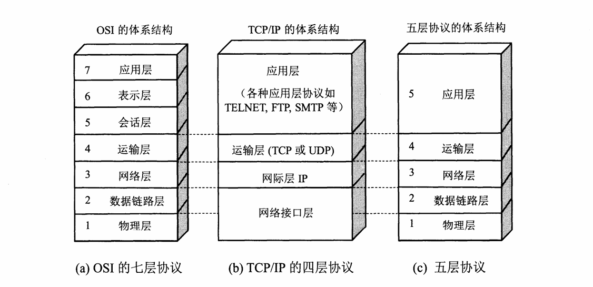
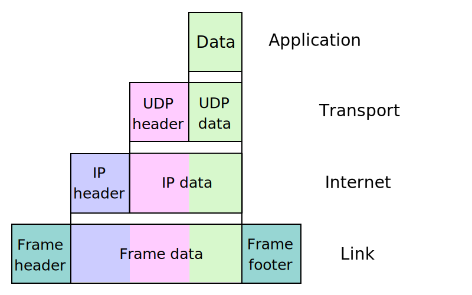

# 概述

## 计算机网络的类别

### 不同类别的计算机网络

**按照网络作用范围进行分类**

1. 广域网 WAN（wide Area Network）
2. 城域网 MAN（Metropolitan Area Network）
3. 局域网 LAN（Local Area Network）
4. 个人区域网 pan（Personal Area Network）

**按照网络使用者进行分类**

1. 公用网络（public network）
2. 专用网络（private network）

## 计算机网络的性能

### 计算机网络的性能指标

#### 速率

比特（bit）源于 binary digit，意思是二进制数字，因此一个比特就是一个二进制数字。比特也是信息论中使用的**信息量的单位**。网络技术中的速率指的是数据的传输速率，也称为数据率（data rate）或者比特率（bit rate）。速率的单位是 bit/s。当数据较高时，加上倍数，例如 k(kilo)，M(Mega)，G(Giga)，T(Tera)，P(Peta)，E(Exa)，Z(Zeta)。网络速率往往指的是**额定速率**或**标称速率**，并非网络实际上运行的速率。

1 Byte/s = 8 bit/s

#### 带宽

带宽本来指某个信号具有的频带宽度，这种意义下带宽的单位是赫兹（Hz）

在计算机网络中，带宽用来表示网络中某通道传送数据的能力，因此网络带宽表示在单位时间内网络中某信道所能通过的**最高数据率**。这种意义的带宽的单位就是数据率的单位 bit/s，即比特每秒。

#### 吞吐量

吞吐量（throughout）表示在单位时间内通过某个网络（或信道，端口）的实际数据量

#### 时延

**1. 发送时延**（transmission delay）是主机或路由器发送数据帧所需要的时间
$$
发送时延 = \frac{\text{数据帧长度（bit）}}{\text{信道带宽（bit/s）}}
$$
发送时延是**主机或路由器**发送数据所需要的时间，也就是从发送数据的**第一个比特**算起，到发送完该数据的**最后一个比特**为止所需的时间。

**2. 传播时延**（propagation delay）是电磁波在信道中传播一定的距离需要花费的时间
$$
传播时延 = \frac{\text{信道长度（m）}}{\text{电磁波在信道上的传播速率（m/s）}}
$$
传播时延是电磁波在信道中传播一定的距离需要花费的时间。电磁波在自由空间的传播速率是 3.0ⅹ10^5km/s，在铜线电缆中的传播速率约为 $$2.3 \times 10^5km/s$$，在光纤中的传播速率约为 $$2.\times 10^5km/s$$​

**3. 处理时延**，主机或路由器在收到分组时要花费一定的时间进行处理，例如分析分组的首部、从分组中提取数据部分、进行差错检验或查找适当的路由等，这就产生了处理时延。

**4. 排队时延**，分组在经过网络传输时，要经过许多路由器。但分组在进入路由器后要先在输入队列中排队等待处理。在路由器确定了转发接口后，还要在输出队列中排队等待转发。这就产生了排队时延。排队时延的长短往往取决于网络当时的通信量。当网络的通信量很大时会发生队列溢出，使分组丢失，这相当于排队时延为无穷大。

这样，数据在网络中经历的**总时延**就是以上四中时延之和
$$
总时延 = 发送时延 + 传播时延 + 处理时延 + 排队时延
$$

#### 往返时间RTT

在计算机网络中，往返时间RTT（Round-Trip Time）也是一个重要的性能指标。互联网上的信息不仅仅单方向传输而是双向交互的。因此需要知道双向交互一次所需要的时间，例如A向B发送数据，如果数据长度是 100MB，发送速率是 100Mbit/s，那么
$$
发送时间 = \frac{数据长度}{发送速率} = \frac{100 \times 2^{20} \times 8}{100 \times 10^6} \approx 8.39\text s
$$
如果B正确收完100MB数据后，立即向A发送确认。再假定A只有在收到B的确认信息后，才能继续向B发送数据。这需要等待一个往返时间RTT。如果RTT \approx 2 \text{s}，那么可以算出 A 向 B  发送数据的有效数据率
$$
有效数据率 = \frac{数据长度}{发送时间 + \text{RTT}} = \frac{100 \times 2^{20} \times 8}{8.39 + 2}
\approx 80.7 \times 10^6 \text{bit/s} \approx 80.7 \text{Mbit/s}
$$
比原来的数据率 100Mbit/s小不少，在互联网中，往返时间还包括各种中间节点的处理时延、排队时延以及转发数据时的发送时延。当使用卫星通信时，往返时间RTT相对较长，是很重要的一个性能指标。

### 计算机网络的非性能特征

## 计算机网络体系结构

### 计算机网络体系结构的形成

### 协议与划分层次

### 五层协议的体系结构



### TCP/IP 的体系结构


## 网络分层



应用层，传输层，网络层，数据链路层，物理层。

# 物理层

## 数据通信基础

### 信道基本概念

单向通信（单工通信）：只有一个方向的通信而没有反方向的交互，一条线路一个信道。

双向交替通信（半双工通信）：通信的双方都可以发送信息，但是不能双方同时发送消息。一条线路两个信道。

双向同时通信（全双工通信）：通信双方可以同时发送和接收信息。两条线路两个信道。


### 信道的极限容量

码间串扰：具体的信道所能通过的频率范围总是有限的。信号中的许多高频分量往往不能通过信道。如果信号中的高频分量在传输时收到了衰减，那么在接收端收到的波形前沿和后沿就变得不那么陡峭了，每一个码元所占的时间界限也不再是很明确。

#### 信噪比

实际信道都是有噪声的，但噪声的影响是相对的，如果信号相对较强，那么噪声的影响相对较小。信噪比就是信号的平均功率和噪声的平均功率之比，常记为S/N。若以分贝（dB）为单位，则信噪比 $$(dB) = 10 \log_{10}(S/N)(dB)$$。例如当 $$S/N = 1000$$ 时，信噪比为30dB。

香农极限指在信道上进行无差错传输的理论最大传输速率，是香农定理在有限频宽的频道上的理论。换句话说，当信号传输速率尚未达到香农极限时，可以找到零错误率的编码方法。**信道的极限信息传输速率C**公式为
$$
C = W \log_2 \left(1 + \frac{S}{N} \right)\quad\text{(bit/s)}
$$

- C 是频道容量，单位位元速率（bps）
- W 是频宽，单位赫兹（Hz）
- S/N 是讯号杂讯比，此公式需要使用S/N的比值来计算，而不是用分贝（dB）

香农公式表明，信道的带宽或信道中的信噪比越大，信息的极限传输速率就越高。香农公式指出了信息传输速率的上限。香农公式的意义在于：只要信息传输速率低于信道的


## 信道复用技术

## 数字传输技术

## 宽带接入技术

### ADSL 技术


# 数据链路层

## 点对点信道的数据链路层

### 数据链路和帧


## 点对点协议PPP

高级数据链路控制HDLC（High-level Data Link Control）是在通信路线质量较差的年代比较流行的数据链路层协议。但在现在HDLC已经很少使用，点对点的链路，点对点协议PPP（Point-to-Point Protocol）则是现在广泛使用的数据链路层协议。

### PPP协议的特点

PPP协议就是用户计算机和ISP进行通信时所使用的数据链路层协议。

### PPP协议的工作状态

当用户拨号接入ISP后，就建立了一条从用户个人电脑到ISP的物理连接。这时，用户个人电脑向ISP发送一系列的链路控制协议LCP分组，以便建立LCP连接。这些分组机器影响选择了将要使用的一些PPP参数，接着还要进行网络层配置，网络控制协议NCP给新接入得到用户个人电脑分配了一个临时的IP地址，这样用户个人电脑就成为互联网上一个有IP地址的主机了。

## 使用广播信道的数据链路层

### 载波侦听多路访问/碰撞检测（CSMA/CD）

载波侦听多路访问（Carrier Sense Multiple Access）是一种介质访问控制（MAC）的协议，载波监听指任何连接到介质的设备在预发送帧前，必须对介质进行侦听，当确认其空闲时才可以发送。对路访问指多个设备可以同时访问介质，一个设备发送的帧也可以被多个设备接收

载波侦听多路访问/碰撞检测（Carrier Sense Multiple Access with Collision Detection），此方案要求设备在发送帧的同时要对信道进行侦听，以确定是否发生碰撞，若在发送数据过程中检测到碰撞，则进行碰撞处理操作。

https://zh.wikipedia.org/wiki/%E8%BD%BD%E6%B3%A2%E4%BE%A6%E5%90%AC%E5%A4%9A%E8%B7%AF%E8%AE%BF%E9%97%AE#%E8%BD%BD%E6%B3%A2%E4%BE%A6%E5%90%AC%E5%A4%9A%E8%B7%AF%E8%AE%BF%E9%97%AE%EF%BC%8F%E7%A2%B0%E6%92%9E%E6%A3%80%E6%B5%8B%EF%BC%88CSMA/CD%EF%BC%89

### 以太网的 MAC 层

## 扩展的以太网

# 网络层


## 网际协议IP（互联网协议）

### 分类的IP地址

### 地址解析协议ARP

## 划分子网和构造超网


https://zh.wikipedia.org/wiki/%E7%BD%91%E9%99%85%E5%8D%8F%E8%AE%AE

## 互联网控制消息协议ICMP

### ICMP 报文的种类

### ICMP 的应用举例


https://zh.wikipedia.org/zh-hans/%E4%BA%92%E8%81%94%E7%BD%91%E6%8E%A7%E5%88%B6%E6%B6%88%E6%81%AF%E5%8D%8F%E8%AE%AE

# 传输层


## 用户数据报文协议UDP

### UDP 概述

### UDP 首部格式

https://zh.wikipedia.org/wiki/%E7%94%A8%E6%88%B7%E6%95%B0%E6%8D%AE%E6%8A%A5%E5%8D%8F%E8%AE%AE

## 传输控制协议TCP

### TCP 主要特点

### TCP 连接

https://zh.wikipedia.org/wiki/%E4%BC%A0%E8%BE%93%E6%8E%A7%E5%88%B6%E5%8D%8F%E8%AE%AE

## 可靠传输的工作原理

自动重传请求（Automatic Repeat-reQuest，ARQ）是OSI模型中资料连接层和传输层一种错误更正协议。此协议通过使用确认和超时这两种机制，在不可靠的服务基础上实现做出可靠的的讯息传输。

### 定制等待协议

定制并等待协议的工作原理如下：

1. 发送点对接收点发送数据包，然后等待接收点返回ACK并且开始计时。
2. 在等待过程中，发送点停止发送新的数据包。
3. 当数据包没有成功被接收点接收时，接收点不会发送ACK，这样发送点在等待一定时间后，重新发送数据包。
4. 反复上述步骤直到收到接收点发送的ACK。

发送点的等待时间应当至少大于传输点数据包的发送时间（数据包容量除以发送点的传输速度），接收点ACK接收时间，数据在连接上的传送时间，接收点检验接收数据是否正确的时间之和。在实际应用当中，等待时间是这个和的两到三倍。

### 连续ARQ协议

ARQ的优点是简单，缺点是信道利用率太低。

RTT是往返时间，为了提高效率，发送方采用流水线传输，连续发送多个分组，接收方使用累计确认。接收方会返回确认序号和窗口字段，表示从确认序号开始到确认序号加窗口字段，还可以发送多少字节的数据。

## TCP 流量控制*

### 利用滑动窗口实现流量控制

### TCP 的传输效率

## TCP 的运输连接管理

### TCP的连接建立

### TCP 的连接释放


# 应用层

## 域名系统 DNS

### 互联网的域名结构

### 域名服务器

## 文件传输协议

### FTP 基本工作原理

### 简单文件传输协议 TFTP

## 远程终端协议 TELNET

## 万维网 WWW

### 统一资源定位符 URL

### 超文本传输协议 HTTP

## 电子邮件

### 简单邮件发送协议 SMTP

### 邮件读取协议 POP3 和 IMAP

### 通用互联网邮件扩充 MIME

## 动态主机配置协议 DHCP

## 简单网络管理协议 SNMP

### 管理信息结构 SMI

### 管理信息库 MIB

## P2P 应用

# 网络安全

## 两类密码体制

### 对称密钥密码体制

### 公钥密码体制

## 数字签名

## 密钥分配

### 对称密钥的分配

### 公钥的分配

## 互联网安全协议

### 网络层安全协议

### 传输层安全协议

### 应用层安全协议

# 互联网上的音频/视频服务

# 无线网络和移动网络

## 无线局域网 WLAN

## 无线个人局域网 WPAN

## 无线城域网 WMAN

## 蜂窝移动通信网

### 移动 IP

### GSM 中的切换


```
CRC校验码
DHCP客户机申请过程
SNMP管理体系结构
gobackn协议
私有地址
```

