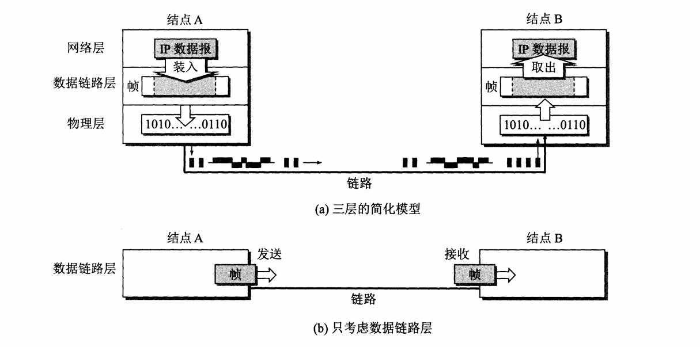
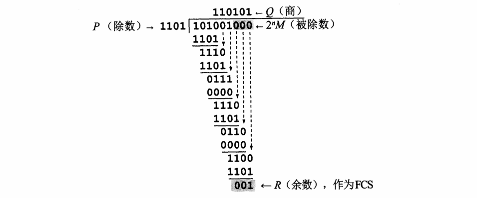
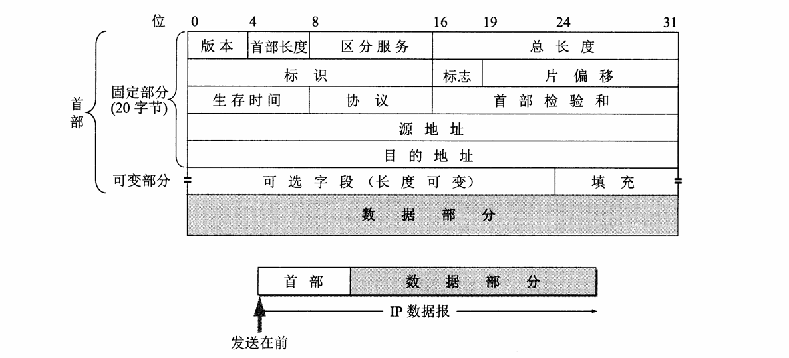
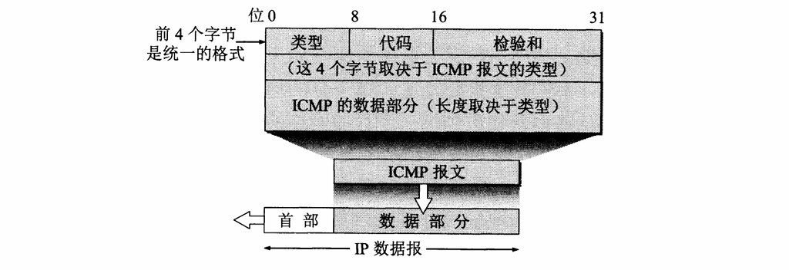
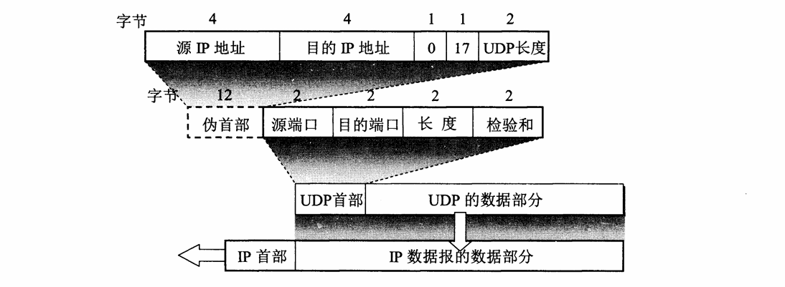
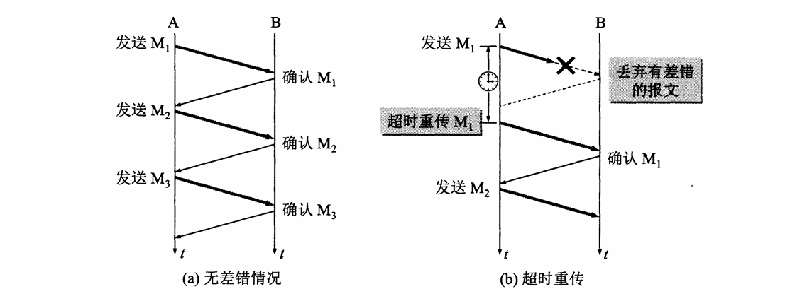
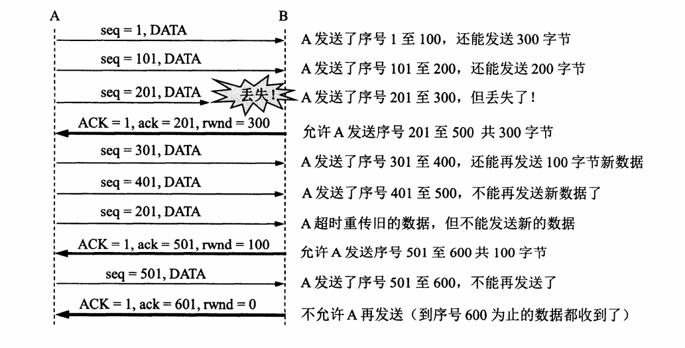
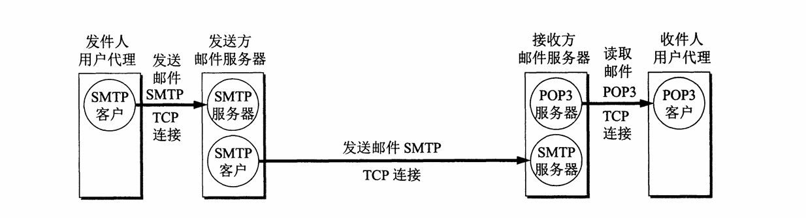

# 概述

## 计算机网络的类别

### 不同类别的计算机网络

**按照网络作用范围进行分类**

1. 广域网 WAN（wide Area Network）
2. 城域网 MAN（Metropolitan Area Network）
3. 局域网 LAN（Local Area Network）
4. 个人区域网 pan（Personal Area Network）

**按照网络使用者进行分类**

1. 公用网络（public network）
2. 专用网络（private network）

## 计算机网络的性能

### 计算机网络的性能指标

#### 速率

比特（bit）源于 binary digit，意思是二进制数字，因此一个比特就是一个二进制数字。比特也是信息论中使用的**信息量的单位**。网络技术中的速率指的是数据的传输速率，也称为数据率（data rate）或者比特率（bit rate）。速率的单位是 bit/s。当数据较高时，加上倍数，例如 k(kilo)，M(Mega)，G(Giga)，T(Tera)，P(Peta)，E(Exa)，Z(Zeta)。网络速率往往指的是**额定速率**或**标称速率**，并非网络实际上运行的速率。

1 Byte/s = 8 bit/s

#### 带宽

带宽本来指某个信号具有的频带宽度，这种意义下带宽的单位是赫兹（Hz）

在计算机网络中，带宽用来表示网络中某通道传送数据的能力，因此网络带宽表示在单位时间内网络中某信道所能通过的**最高数据率**。这种意义的带宽的单位就是数据率的单位 bit/s，即比特每秒。

#### 吞吐量

吞吐量（throughout）表示在单位时间内通过某个网络（或信道，端口）的实际数据量

#### 时延

**1. 发送时延**（transmission delay）是主机或路由器发送数据帧所需要的时间
$$
发送时延 = \frac{\text{数据帧长度（bit）}}{\text{信道带宽（bit/s）}}
$$
发送时延是**主机或路由器**发送数据所需要的时间，也就是从发送数据的**第一个比特**算起，到发送完该数据的**最后一个比特**为止所需的时间。

**2. 传播时延**（propagation delay）是电磁波在信道中传播一定的距离需要花费的时间
$$
传播时延 = \frac{\text{信道长度（m）}}{\text{电磁波在信道上的传播速率（m/s）}}
$$
传播时延是电磁波在信道中传播一定的距离需要花费的时间。电磁波在自由空间的传播速率是 3.0ⅹ10^5km/s，在铜线电缆中的传播速率约为 $$2.3 \times 10^5km/s$$，在光纤中的传播速率约为 $$2.\times 10^5km/s$$​

**3. 处理时延**，主机或路由器在收到分组时要花费一定的时间进行处理，例如分析分组的首部、从分组中提取数据部分、进行差错检验或查找适当的路由等，这就产生了处理时延。

**4. 排队时延**，分组在经过网络传输时，要经过许多路由器。但分组在进入路由器后要先在输入队列中排队等待处理。在路由器确定了转发接口后，还要在输出队列中排队等待转发。这就产生了排队时延。排队时延的长短往往取决于网络当时的通信量。当网络的通信量很大时会发生队列溢出，使分组丢失，这相当于排队时延为无穷大。

这样，数据在网络中经历的**总时延**就是以上四中时延之和
$$
总时延 = 发送时延 + 传播时延 + 处理时延 + 排队时延
$$

#### 往返时间RTT

在计算机网络中，往返时间RTT（Round-Trip Time）也是一个重要的性能指标。互联网上的信息不仅仅单方向传输而是双向交互的。因此需要知道双向交互一次所需要的时间，例如A向B发送数据，如果数据长度是 100MB，发送速率是 100Mbit/s，那么
$$
发送时间 = \frac{数据长度}{发送速率} = \frac{100 \times 2^{20} \times 8}{100 \times 10^6} \approx 8.39\text s
$$
如果B正确收完100MB数据后，立即向A发送确认。再假定A只有在收到B的确认信息后，才能继续向B发送数据。这需要等待一个往返时间RTT。如果RTT \approx 2 \text{s}，那么可以算出 A 向 B  发送数据的有效数据率
$$
有效数据率 = \frac{数据长度}{发送时间 + \text{RTT}} = \frac{100 \times 2^{20} \times 8}{8.39 + 2}
\approx 80.7 \times 10^6 \text{bit/s} \approx 80.7 \text{Mbit/s}
$$
比原来的数据率 100Mbit/s小不少，在互联网中，往返时间还包括各种中间节点的处理时延、排队时延以及转发数据时的发送时延。当使用卫星通信时，往返时间RTT相对较长，是很重要的一个性能指标。

RTT的更新使用**加权移动平均**。
$$
RTT_{new} = (1 - \alpha) \times RTT_{sample} + \alpha \times RTT_{current}
$$


### 计算机网络的非性能特征

## 计算机网络体系结构

### 计算机网络体系结构的形成

### 协议与划分层次

### 五层协议的体系结构


### TCP/IP 的体系结构


## 网络分层


应用层，传输层，网络层，数据链路层，物理层。

# 物理层

## 数据通信基础

### 信道基本概念

单向通信（单工通信）：只有一个方向的通信而没有反方向的交互，一条线路一个信道。

双向交替通信（半双工通信）：通信的双方都可以发送信息，但是不能双方同时发送消息。一条线路两个信道。

双向同时通信（全双工通信）：通信双方可以同时发送和接收信息。两条线路两个信道。


多径效应最严重的情况是经过两条路径传输的电磁波到达接收端时相位差 $$180\degree$$，如果电磁波的频率 f 是 1GHz，两条路径相差多少距离才会造成这一情况？

当两条路径距离相差0.5个波长时，两个电磁波的相位差相差 $$180\degree$$，已知频率，根据频率求出波长 $$\lambda$$​：


$$
\lambda = \frac{c}{f} = \frac{3 \times 10^8}{10^9} = 0.3\text{m}
$$

带宽为4000Hz的无噪声信道，采用振幅键控调制技术，信号幅度为16级，求数据传输速率。

根据奈奎斯特准则，数据传输速率公式：


$$
RS = 2 \times BM \times \log_2{n}
$$
根据题意 BW = 4000Hz，n = 16

数据传输速率 $$RS = 2 \times BW  \times log_2{n} = 2 \times 4000 \times \log_2{16} \approx 39.869\text{kbps}$$

### 信道的极限容量

码间串扰：具体的信道所能通过的频率范围总是有限的。信号中的许多高频分量往往不能通过信道。如果信号中的高频分量在传输时收到了衰减，那么在接收端收到的波形前沿和后沿就变得不那么陡峭了，每一个码元所占的时间界限也不再是很明确。

#### 信噪比

实际信道都是有噪声的，但噪声的影响是相对的，如果信号相对较强，那么噪声的影响相对较小。信噪比就是信号的平均功率和噪声的平均功率之比，常记为S/N。若以分贝（dB）为单位，则信噪比 $$(dB) = 10 \log_{10}(S/N)(dB)$$。例如当 $$S/N = 1000$$ 时，信噪比为30dB。

香农极限指在信道上进行无差错传输的理论最大传输速率，是香农定理在有限频宽的频道上的理论。换句话说，当信号传输速率尚未达到香农极限时，可以找到零错误率的编码方法。**信道的极限信息传输速率C**公式为
$$
C = W \log_2 \left(1 + \frac{S}{N} \right)\quad\text{(bit/s)}
$$

- C 是频道容量，单位位元速率（bps）
- W 是频宽，单位赫兹（Hz）
- S/N 是讯号杂讯比，此公式需要使用S/N的比值来计算，而不是用分贝（dB）

香农公式表明，信道的带宽或信道中的信噪比越大，信息的极限传输速率就越高。香农公式指出了信息传输速率的上限。香农公式的意义在于：只要信息传输速率低于信道的

带宽为4000Hz的噪声信道，信噪比为1000（或为30dB），采用振幅键控调制技术，信号幅度为16级，求信道容量。根据香农定理，信道容量公式：

$$
C = W \times \log_2(1 + S/N)
$$
根据题意 W = 4000Hz，S/N = 1000，信道容量 = 最大传输速率 = $$W \times \log_2(1 + S/N) = 4000 \times \log_2(1 + 1000)$$。


## 信道复用技术

## 数字传输技术

编码，简单来说，就是将数据转换为特定格式的信号的过程在通信中，编码主要用于将数字或模拟数据转换为数字信号。数字数据编码为数字信号的过程，常见的编码方式包括归零编码（RZ）、非归零编码（NRZ）、曼彻斯特编码以及差分曼彻斯特编码等。每种编码方式都有其特定的优点和适用场景。例如，曼彻斯特编码和差分曼彻斯特编码常用于局域网，它们具有**自同步和抗干扰性好**的特点。

通过改变载波信号的相位值来表示数字信号 1 和 0 的方法叫做 **PSK**，即 **相位键控**（Phase Shift Keying）。

## 宽带接入技术

用户要连接到互联网，必须先连接到某个ISP，以便获得上网所需要的IP地址。在互联网初期

### ADSL 技术

**ADSL**（Asymmetric Digital Subscriber Line，**非对称数字用户线路**）是一种宽带接入技术，通过普通的电话线（铜线）提供高速互联网连接。

传统电话线（PSTN，公共交换电话网）最初设计用于传输语音信号，带宽非常有限（通常为**0-4 kHz**）。这种带宽对于现代数据通信需求（如网页浏览、视频流媒体和文件下载）远远不够。

**ADSL的核心目标**是**在不影响电话通话的前提下，充分利用现有铜线线路，实现宽带数据通信**，提供比拨号上网更快、更稳定的互联网接入方式。


# 数据链路层

## 点对点信道的数据链路层

### 数据链路和帧

链路（link）就是从一个节点到相邻节点的一段物理路线，而中间没有任何其他的交换节点。在进行数据通信时，两台计算机之间的通信路径需要经过许多段这样的链路，链路是一条路径的组成部分。

数据链路（data link）则是另一个概念。在一条线路上传输数据时，除了必须有一条物理路线外，还需要有一些必要的通信协议来控制这些数据的传输。最常用的方法就是使用网络适配器来实现这些协议。一般的适配器都包括了数据链路层和物理层这两层功能。

点对点信道的数据链路层的协议数据单元是**帧**。数据链路层把网络层交下来的数据构成帧发送到链路上，以及把接收到的帧中的数据取出并上交给网络层。在互联网中，网络层协议数据单元就是IP数据报（简称数据报、分组或包）。




### 封装成帧和透明传输

封装成帧（framing）就是在一段数据的前后分别添加首部和尾部（用于校验的FCS），这样就构成了一个帧，其中以太网帧头部位14字节，尾部为4字节。接收端在收到物理层上交的比特流后，就能根据首部和尾部的标记，识别帧的开始和结束。

由于帧的开始和技术的标记使用专门指明的控制字符，因此，所传输的数据中的任何8比特的组合一定不允许和用作帧定界的控制字符的比特编码一样，否则就会出现帧定界的错误。

### 循环冗余检验*

比特在传输过程中可能会产生差错，二进制数的差错就是比特差错。传输错的比特所占传输比特总数的比率称为误码率BER（Bit Error Rate）。目前在数据链路层广泛使用了**循环冗余检验CRC**（Cyclic Redundancy Check）。

在发送端，先把数据划分为组，假定每组k个比特。现假定带传送的数据 M = 101001（k = 6）。CRC运算就是在数据M的后面添加供差错检验用的n位冗余码，然后构成一个帧发送出去，一共发送 （k + n）位。在所要发送的数据后面增加n位冗余码，虽然增大了数据传输的开销，但却可以进行差错检测。

n位冗余码可以用以下方法得出。用二进制的模2运算进行 $$2^n \times M$$ 的运算，这相当于在M后面添加n个0。得到（k + n）位的数除以说法双方事先商定的长度为（n + 1）位的除数P，得出商是Q而余数是R（n位，比P少一位）。

M = 101001（k = 6），假定P = 1101（n = 3）。经模二除法运算后的结果是：商Q = 110101，余数R = 001。这个余数R就作为冗余码拼接在数据M后面发送出去，这种为了进行检错而添加的冗余码称为**帧检验序列FCS**（Frame Check Sequence）。因此加上FCS后发送的帧是101001001（即 $$2^n M + \text{FCS}$$），共有（k + n）位。



在接收端把接收到的数据以帧为单位进行CRC检验，把收到的每一帧都除以同样的除数P（模二运算），然后检查的到余数R。若余数R = 0，则判定没有差错接受（accept），若余数 $$R \ne 0$$$，则判断有有错丢弃。

一种较方便的方法是用多项式来表示循环冗余检验过程。用多项式 P(X) = X^3 + X^2 + 1 来表示除数 P = 1101。多项式 P(X) 称为**生成多项式**。有广泛使用的生成多项式P(X)。**校验码长度等于生成多项式最高次数**。
$$
\text{CRC-16} = X^{16} + X^{15} + X^2 + 1 \\
\text{CRC-CCITT} = X^{16} + X^{12} + X^5 + 1
$$


## 点对点协议PPP

高级数据链路控制HDLC（High-level Data Link Control）是在通信路线质量较差的年代比较流行的数据链路层协议。但在现在HDLC已经很少使用，点对点的链路，点对点协议PPP（Point-to-Point Protocol）则是现在广泛使用的数据链路层协议。

### PPP协议的特点

PPP协议就是用户计算机和ISP进行通信时所使用的数据链路层协议。

### PPP协议的工作状态

当用户拨号接入ISP后，就建立了一条从用户个人电脑到ISP的物理连接。这时，用户个人电脑向ISP发送一系列的链路控制协议LCP分组，以便建立LCP连接。这些分组机器影响选择了将要使用的一些PPP参数，接着还要进行网络层配置，网络控制协议NCP给新接入得到用户个人电脑分配了一个临时的IP地址，这样用户个人电脑就成为互联网上一个有IP地址的主机了。

## 使用广播信道的数据链路层

### 载波侦听多路访问/碰撞检测（CSMA/CD）

载波侦听多路访问（Carrier Sense Multiple Access）是一种介质访问控制（MAC）的协议，载波监听指任何连接到介质的设备在预发送帧前，必须对介质进行侦听，当确认其空闲时才可以发送。对路访问指多个设备可以同时访问介质，一个设备发送的帧也可以被多个设备接收

载波侦听多路访问/碰撞检测（Carrier Sense Multiple Access with Collision Detection），此方案要求设备在发送帧的同时要对信道进行侦听，以确定是否发生碰撞，若在发送数据过程中检测到碰撞，则进行碰撞处理操作。

https://zh.wikipedia.org/wiki/%E8%BD%BD%E6%B3%A2%E4%BE%A6%E5%90%AC%E5%A4%9A%E8%B7%AF%E8%AE%BF%E9%97%AE#%E8%BD%BD%E6%B3%A2%E4%BE%A6%E5%90%AC%E5%A4%9A%E8%B7%AF%E8%AE%BF%E9%97%AE%EF%BC%8F%E7%A2%B0%E6%92%9E%E6%A3%80%E6%B5%8B%EF%BC%88CSMA/CD%EF%BC%89

### 使用集线器的星型拓扑

传统以太网最初是使用粗同轴电缆，后来演进到使用比较便宜的细同轴电缆，最后发展为使用更便宜和更灵活的双绞线。这种以太网采用星型拓扑，在星型的中心增加了一种可靠性非常高的设备，叫做**集线器**（hub）。1990年IEEE制定出星型以太网 10BASE-T 的标准，10代表 10Mbit/s 的数据率，BASE 表示连接线上的信号是基带信号，T表示双绞线。但10BASE-T以太网的通信距离较短，每个站到集线器的距离不超过 100m。

### 以太网的 MAC 层

在局域网中，硬件地址又称为物理地址或MAC地址

## 扩展的以太网

# 网络层

## 网络层提供的两种服务

网络层向上只提供简单灵活的、无连接的】尽最大努力交付的数据报服务。数据报（或者IP数据报）就是分组。

## 网际协议IP（互联网协议）

与IP协议配套使用的还有三个协议：

- 地址解析协议ARP（Address Resolution Protocol）
- 网际控制报文协议ICMP（Internet Control Message Protocol）
- 网际组管理协议IGMP（Internet Group Management Protocol）

### 虚拟互联网络

将网络互相连接起来需要使用一些中间设备。根据中间设备所在层次，可以有一下四中不同的中间设备：

1. 物理层使用的中间设备**转发器**（repeater）
2. 数据链路层使用的中间设备**网桥**或**桥接器**（bridge）
3. 网络层使用的中间设备**路由器**（router）
4. 在网络层以上使用的中间设备**网关**（gateway）

### 分类的IP地址

```
IP地址 ::= {<网络号>, <主机号>}
```


### 地址解析协议ARP

**地址解析协议**（Address Resolution Protocol）是一个通过解析[网络层](https://zh.wikipedia.org/wiki/网络层)地址来找寻[数据链路层](https://zh.wikipedia.org/wiki/数据链路层)地址的[网络传输协议](https://zh.wikipedia.org/wiki/网络传输协议)，它在[IPv4](https://zh.wikipedia.org/wiki/IPv4)中极其重要。

每一台主机都设有一个ARP高速缓存（ARP cache），里面有本局域网上的各主机和路由器的IP地址到硬件地址的映射表。

https://zh.wikipedia.org/wiki/%E5%9C%B0%E5%9D%80%E8%A7%A3%E6%9E%90%E5%8D%8F%E8%AE%AE


### IP数据报的格式

首部20字节。



## 划分子网和构造超网

### 划分子网

一个拥有许多物理网络的单位，可将所属物理网络划分为若干个**子网**（subnet）。这个单位对外仍然表现为一个网络。

划分子网的方法是从网络的主机号借用若干位作为子网号（subnet-id），IP地址在本单位内部就变成了三级IP地址。

```
IP地址 ::= {<网络号>, <子网号>, <主机号>}
```


### 使用子网时分组的转发

子网划分后，路由表必须包含以下三项内容：目的网络地址、子网掩码和下一条地址。

### 无分类编址 CIDR（构造超网）

CIDR把32位IP地址划分为前后两部分，前部分为网络前缀（network-profix），后面部分用来指名主机。

```
IP地址 ::= {<网络前缀>, <主机号>}
```

CIDR把网络前缀都相同的连续IP地址组成一个 CIDR 地址块。


## 网际控制报文协议ICMP

网际控制报文协议ICMP（Internet Control Message Protocol）。ICMP允许主机或路由器报告差错情况和提供有关异常情况的报告。ICMP是互联网的边准协议，但ICMP不是高层协议，因为ICMP 报文是装在IP数据报中，作为其中的数据部分，是IP层的协议。ICMP报文作为IP层数据报得到数据，加上数据报的首部组成IP数据报发送出去。



### ICMP 报文的种类

ICMP 报文的种类有两种，即ICMP差错报告报文和ICMP询问报文。

ICMP报文的前四个字节是统一格式，攻有三个字段：类型、代码和校验和。接着4个字节的内容与ICMP的类型有关。最后是数据字段，长度取决于ICMP的类型。

| ICMP 报文种类 | 类型的值 | ICMP 报文的类型  |
| ------------- | -------- | ---------------- |
| 差错报告报文  |          | 终点不可达       |
|               |          | 时间超时         |
|               |          | 参数问题         |
|               |          | 改变路由         |
| 询问报文      |          | 回送请求或回答   |
|               |          | 时间错请求或回答 |

1. 终点不可达，当路由器或主机不能交付数据报时就向源点发送终点不可达报文。
2. 时间超时，当路由器收到生存时间为零的数据报时，除丢弃该数据报外，还要向源点发送时间超过报文。

### ICMP 的应用举例

ICMP的一个重要应用就是分组网间探测 PING（Packet InterNet Groper），用来测试主机之间的连通性。PING使用ICMP回送请求与回送回答报文。PING是应用层直接使用网络层ICMP的一个例子，它没有通过传输层的TCP或UDP。


https://zh.wikipedia.org/zh-hans/%E4%BA%92%E8%81%94%E7%BD%91%E6%8E%A7%E5%88%B6%E6%B6%88%E6%81%AF%E5%8D%8F%E8%AE%AE

# 传输层


## 用户数据报文协议UDP

### UDP 概述

用户数据报协议UDP只在IP的数据报服务上增加了很少的一点功能，这就是复用和分用功能以及差错检测的功能。UDP具有以下特点

1. UDP是无连接的，即发送数据之前不需要建立连接，发送数据结束时也没有连接可释放，因此减少了开销和发送数据之前的时延。
2. UDP使用尽最大努力交付，即不保证可靠交付，因此主机不需要维持复杂的连接状态表。
3. UDP是面向报文的。发送方的UDP对应用程序交下来的报文，即不并合也不拆分，而是保留这些报文的边界。
4. UDP没有拥塞控制，因此网络出现的拥塞不会使源主机的发送速率降低。
5. UDP支持一对一、一对多、多对一和多对多的交互通信。
6. UDP首部开销很小，只有8个字节，比TCP的20个字节首部要断。

### UDP 首部格式

用户数据报UDP有两个字段：数据字段和首部字段。首部字段很简单，只有8个字节，由四个字段组成，每个字段的长度都是两个字节。

1. 源端口
2. 目的端口
3. 长度，UDP用户数据报的长度，最小值是8（仅有首部）。
4. 校验和，检测UDP用户数据报在传输中是否有错，有错就丢弃。




https://zh.wikipedia.org/wiki/%E7%94%A8%E6%88%B7%E6%95%B0%E6%8D%AE%E6%8A%A5%E5%8D%8F%E8%AE%AE


## 传输控制协议TCP

### TCP 主要特点

1. TCP是面向连接的传输层协议。应用程序在使用TCP协议之前，必须先建立TCP连接。在传送数据完毕后，必须释放已经建立的TCP连接。
2. 每一条TCP连接只能有两个端点，只能是点对点的。
3. TCP提供可交付的服务
4. TCP提供全双工通信。
5. 面向字节流。TCP中的流（stream）指的是流入到进程或从进程流出的字节序列。应用程序和TCP的交换是一次一个数据块，但TCP把应用程序交下来的数据仅仅看成是一连串的无结构的字节流。

### TCP 连接

TCP把连接作为最基本的抽象，TCP许多特性都与TCP是面向连接的基本特性有关。TCP连接的端点叫做套接字（socket）或插口。端口号并接到（concatenated with）IP地址即构成了套接字。因此，套接字的表示方法是在点分十进制的IP地址后面写上端口，中间用冒号或者逗号隔开。

```java
Socket socket = new Socket(serverAddress, port)
```

每一条TCP连接唯一地址被通信两端的两个端点（即套接字）所确定：

```
TCP 连接 ::= {socket_1, socket_2} = {(IP_1: port_1), (IP_2: port_2)}
```

https://zh.wikipedia.org/wiki/%E4%BC%A0%E8%BE%93%E6%8E%A7%E5%88%B6%E5%8D%8F%E8%AE%AE


## 可靠传输的工作原理

自动重传请求（Automatic Repeat-reQuest，ARQ）是OSI模型中资料连接层和传输层一种错误更正协议。此协议通过使用确认和超时这两种机制，在不可靠的服务基础上实现做出可靠的的讯息传输。

### 定制等待协议

定制并等待协议的工作原理如下：

1. 发送点对接收点发送数据包，然后等待接收点返回ACK并且开始计时。
2. 在等待过程中，发送点停止发送新的数据包。
3. 当数据包没有成功被接收点接收时，接收点不会发送ACK，这样发送点在等待一定时间后，重新发送数据包。
4. 反复上述步骤直到收到接收点发送的ACK。

发送点的等待时间应当至少大于传输点数据包的发送时间（数据包容量除以发送点的传输速度），接收点ACK接收时间，数据在连接上的传送时间，接收点检验接收数据是否正确的时间之和。在实际应用当中，等待时间是这个和的两到三倍。



**信道利用率**

停止等待协议的信道利用率较低，

### 连续ARQ协议

ARQ的优点是简单，缺点是信道利用率太低。

RTT是往返时间，为了提高效率，发送方采用流水线传输，连续发送多个分组，接收方使用累计确认。接收方会返回确认序号和窗口字段，表示从确认序号开始到确认序号加窗口字段，还可以发送多少字节的数据。

接收方采用累计确认方式，接收方不必对收到的分组逐个发送确认，而是在收到几个分组后，对按序到达的最后一个分组发送确认，这就表示这个分组为止的所有分组都已经正确收到了。


## TCP 流量控制*

### 利用滑动窗口实现流量控制

流量控制（flow control）就是让发送方的发送速度不要太快，让接收方来的及接收。利用滑动窗口机制可以很方便地在TCP连接上实现对发送方的流量控制。



在建立连接时，接收方会告诉发送方接收窗口rwnd（recevier windows），因此发送方的发送窗口不能超过接收方够吃的接收窗口数值。TCP的窗口单位是字节而不是报文段。ACK表示首部中的确认位ACK，小写ack表示确认字段的值。

如果接收者在发送零窗口报文段后接收缓存又有了一些存储空间，预示向发送端发送 rwnd = 400 的报文段，然而

### TCP 的传输效率


## TCP报文段的首部格式


## TCP可靠传输的实现


## TCP 的运输连接管理

### TCP的连接建立

### TCP 的连接释放


# 应用层

## 域名系统 DNS

### 域名系统概述

域名系统DNS（Domain Name System）是互联网使用的命名系统，用来把便于人们使用的机器名字转换成IP地址。

域名到 IP 地址的解析过程的要点如下：当某一个应用进程需要把主机名解析为 IP 地址时，该应用进程就调用解析程 序（resolver） ，并成为 DNS 的一个客户，把待解析的域名放在DNS 请求报文中，以 UDP 用户数据报方式发给本地域名服务器（使用 UDP 是为了减少开销）。本地域名服务器在查找域名后，把对应的 IP 地址放在回答报文中返回。应用进程获得目的主机的 IP 地址后即可进行通信。

### 互联网的域名结构

顶级域名共分为三大类

1. 国家顶级域名
2. 通用顶级域名
3. 基础结构域名，用于反向域名解析，称为反向域名

### 域名服务器

一个服务器所负责管辖的（或有权限的）范围叫做区（zone）。各单位根据具体情况来划分直接管辖范围的区。但在一个区中的所有节点必须是能够连通的。每一个区设置相应的权限域名服务器（authoritative name server），用来保存该区中所有主机的域名到IP地址的映射。

1. 根域名服务器（root name server）
2. 顶级域名服务器
3. 权限域名服务器
4. 本地域名服务器


## 文件传输协议

### FTP 概述

**文件传输协议**FTP（File Transfer Protocol）提供交互式的访问，允许客户指名文件的类型与格式，并允许文件具有存取权限。FTP屏蔽了各计算机系统的细节，适用于在异构网络中任意计算机之间传送文件。

### FTP 基本工作原理

FTP使用客户服务器方式。一个FTP服务器进程可同时为多个客户进程提供服务。FTP的服务器进程由两大部分组成，一个主进程，负责接收新的请求；另外有若干个从属进程，负责处理单个请求。

主进程的工作步骤如下：

1. 打开熟知端口（21）使客户进程能够连接上。
2. 等待客户进程发出连接请求
3. 启动从属进程处理客户端进程发来的请求。从属进程对客户端进程的请求处理完毕后即终止，但从属进程在运行期间根据需要还可能创建其他一些子进程。
4. 回到等待状态，继续接受其他客户进程发来的请求。主进程与从属进程的处理是并发进行的。

### 简单文件传输协议 TFTP


## 远程终端协议 TELNET

TELNET是一个简单的远程终端协议。用户用TELNET就可在其所在地通过TCP连接注册（即登陆）到远地的另一台主机上。TELNET能将用户得到击键传到远地主机，同时也能将远地主机的输出通过 TCP 连接返回到用户屏幕上。因此TELNET又称终端仿真协议。


## 万维网 WWW

万维网是一个分布式的超媒体（hypermedia）系统，它是超文本（hypertext）系统的扩充。所谓超文本是指包含指向其他文档的链接的文本（text）。也就是说，一个超文本由多个信息源链接成，而这些信息源可以分布在世界各地，并且数目也是不受限制的。利用一个链接可使用户找到远在异地的另一个文档，而这又可链接到其他的文档（依此类推）。这些文档可以位于世界上任何一个接在互联网上的超文本系统中。超文本是万维网的基础。

### 统一资源定位符 URL

URL由以下组成

```
<协议>://<主机>:<端口>/<路径>
```


### 超文本传输协议 HTTP

#### HTTP 操作过程

**HTTP/1.0** 每次请求一个文档，首先建立TCP连接花费一个RTT，然后发送HTTP报文请求并接收话费一个RTT。如果主页上有很多个链接的对象需要依次进行链接，那么每一次链接下载都导致 2 \times RTT 的开销。其次客户端与服务器每一次建立新的TCP连接都要分配缓存和变量，特别是万维网服务器同时服务于大量客户的请求，所以这种非持续连接会使服务器负担很重。

**HTTP/1.1** 使用持续连接，服务器在发送响应后仍然在一段时间内保持这条链接，使同一个用户和服务器可以秩序在这条连接上传送后续的HTTP请求报文和响应报文。这个并不局限于传送同一个页面上链接的文档，而是只要这些文档都在同一个服务器上就行。

#### 代理服务器

**代理服务器**（proxy server）是一种网络实体，又称为万维网高速缓存（Web cache）。代理服务器吧最近的一些请求和响应暂存在本地磁盘中，当新请求到达时间，若代理服务器发现请求与暂时存放的请求相同，就返回暂存的响应。

#### HTTP 报文格式

请求报文

```http
GET /index.html HTTP/1.1  
Host: www.example.com  
User-Agent: Mozilla/5.0  
Accept: text/html  
```

响应报文

```http
HTTP/1.1 200 OK  
Content-Type: text/html  
Content-Length: 123  

<html>网页内容</html>
```


## 电子邮件

一个电子邮件系统由三个组成构件，这就是**用户代理**、**邮件服务器**，以及邮件发送协议和邮件读取协议。POP3 是**邮局协议**（Post Office Protocol）的版本3。




### 简单邮件发送协议 SMTP

### 邮件读取协议 POP3 和 IMAP

### 通用互联网邮件扩充 MIME

## 动态主机配置协议 DHCP

https://zh.wikipedia.org/wiki/%E5%8A%A8%E6%80%81%E4%B8%BB%E6%9C%BA%E8%AE%BE%E7%BD%AE%E5%8D%8F%E8%AE%AE

## 简单网络管理协议 SNMP

### 网络管理的基本概念

简单网络管理协议SNMP（Simple Network Management Protocol）中的管理程序和代理程序按客户服务器方式工作。管理程序运行SNMP客户程序，而代理程序运行SNMP服务器程序。在被管理对象上运行的SNMP服务器程序不停地监听来自管理站的SNMP客户程序的请求。一旦发现了就理解返回管理站所需的信息。

### 管理信息结构 SMI

### 管理信息库 MIB

https://zh.wikipedia.org/zh-hans/%E7%AE%80%E5%8D%95%E7%BD%91%E7%BB%9C%E7%AE%A1%E7%90%86%E5%8D%8F%E8%AE%AE

## P2P 应用

# 网络安全

## 两类密码体制

### 对称密钥密码体制

对称密钥密码体制，即加密密钥与解密密钥是使用相同的密码体制。

数据加密标准DES属于对称密钥密码体制。是一种分组加密。在加密前，先对整个明文进行分组。每一组分为64位长得到二进制数据，然后对每一个64位二进制数据进行加密处理，产生一组64位密文数据。最后将各组密文串接起来，得出整个密文。DES的保密性仅取决于对密钥的保密，而算法是公开的。

### 公钥密码体制

公钥密码体制使用不同的加密密钥与解密密钥。

在公钥密码体制中，加密密钥 PK（public key）是向公众公开的，而解密密钥 SK（secret key）则是需要保密的。加密算法 E 和解密算法 D 也都是公开的。

1. 密钥对产生器产生出接受者B的一对密钥，加密密钥PK_B 和解密密钥 SK_B。发送者A所用的加密密钥PK_B 就是接受者的B的公钥，公开，而B所用的解密密钥SK_B就是接受者B的私钥，保密。

2. 发送者A用B的公钥PK_B 通过E运算对明文X加密，得出密文Y，发送给B
   $$
   Y = E_{PK_B}(X)
   $$
   B用自己的私钥SK_B 通过D运算进行解密，恢复明文
   $$
   D_{SK_B}(Y) = D_{SK_B}(E_{PK_B}(X)) = X
   $$

3. 虽然在计算机上可以容易地产生成对的PK_B 和SK_B，但从已知的PK_B实际上不可能推导出 SK_B。

4. 公钥可以用来加密，但是却不能用来解密
   $$
   D_{PK_B}(E_{PK_B}(X)) \ne X
   $$

5. 先后对X进行D运算和E运算或进行E运算和D运算的结果都是一样的。


## 数字签名

## 鉴别

### 报文鉴别

#### 密码散列函数

#### MD5和SHA-1

#### 报文鉴别码

**报文摘要**（Message Digest）是对一段数据（如文本、文件、报文等）进行哈希处理后生成的一种固定长度的数字指纹或简短的表示。它是通过哈希算法（如MD5、SHA-1、SHA-256等）对数据进行计算得到的

## 密钥分配

密钥管理包括：密钥的产生、分配、注入、验证和使用。

### 对称密钥的分配

### 公钥的分配

## 互联网安全协议

### 网络层安全协议

### 传输层安全协议

### 应用层安全协议

# 互联网上的音频/视频服务

# 无线网络和移动网络

## 无线局域网 WLAN

## 无线个人局域网 WPAN

## 无线城域网 WMAN

## 蜂窝移动通信网

### 移动 IP

### GSM 中的切换


```
DHCP客户机申请过程
SNMP管理体系结构
gobackn协议
私有地址
```

