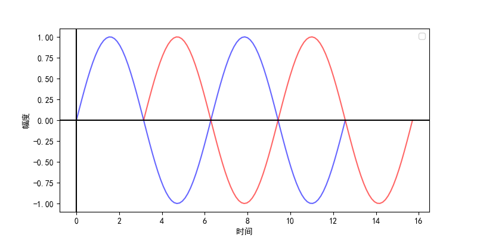

### 1. 求数据传输速率

带宽为4000Hz的无噪声信道，采用振幅键控调制技术，信号幅度为16级，求数据传输速率。

根据奈奎斯特准则，数据传输速率公式：
$$
RS = 2 \times BM \times \log_2{n}
$$
根据题意 BW = 4000Hz，n = 16

数据传输速率 $$RS = 2 \times BW  \times log_2{n} = 2 \times 4000 \times \log_2{16}$$

### 2. 求信道容量

带宽为4000Hz的噪声信道，信噪比为1000（或为30dB），采用振幅键控调制技术，信号幅度为16级，求信道容量。

根据香农定理，信道容量公式：
$$
RS = BW \times \log_2(1 + S/N)
$$
根据题意 BW = 4000Hz，S/N = 1000

信道容量 = 最大传输速率 = $$BW \times \log_2(1 + S/N) = 4000 \times \log_2(1 + 1000)$$

### 3. 计算最短帧长

假定10Mbps总线形以太网由单段电缆构成，电缆长度L为200m，电信号传播速度SR为 $$\frac{2}{3}c$$ ，求出对应最短帧长 $$L_{min}$$。

最短帧长 $$L_{min} = 2 \times T \times S$$，已知数据传输速率为S = 10Mbps，T为电信号两端之间的传播时间。
$$
T = \frac{L}{SR} = \frac{200}{2 \times 10^8} = 10^{-6}\text{s} \\
L_{min} = 2 \times T \times S = 2 \times 10^{-6} \times 10 \times 10^6 = 20\text{b}
$$

### 4. 

在一个采用CSMA/CD的网络中，传输介质是一根完整的电缆，数据**传输速率S**为1Gbps，电缆中的信号传播速度SR为\frac{2}{3}c（c的值3×10^8m/s），若最短帧长减少800b，则相距最远的两个站点之间的距离至少需要：

最短帧长 $$L_{min} = 2 \times T \times S$$，已知最短帧长差 $$\Delta L_{min} = 800b$$

求冲突域直径的时间差 $$\Delta T$$
$$
\begin{align}
\Delta T &= \frac{\Delta L_{min}}{2 \times S} \\
&= \frac{800}{2 \times 10^9} \\
&= 4 \times 10^{-7}s
\end{align}
$$
冲突域直径的距离差 = 冲突域直径的时间差 \Delta T \times 电信号传播速度

由于最短帧长是减少，因此冲突域直径应该是减少

### 5. 计算路径差

多径效应最严重的情况是经过两条路径传输的电磁波到达接收端时相位差 $$180\degree$$，如果电磁波的频率 f 是 1GHz，两条路径相差多少距离才会造成这一情况？

当两条路径距离相差0.5个波长时，两个电磁波的相位差相差 $$180\degree$$，已知频率，根据频率求出波长 $$\lambda$$​：

$$
\lambda = \frac{c}{f} = \frac{3 \times 10^8}{10^9} = 0.3\text{m}
$$

### 6. 求子网掩码

IP地址块`59.67.159.125/11`的子网掩码可写为`255.224.0.0`。

根据题意，32位IP的高11位为网络号，因此子网掩码的高11位位1：

32位子网掩码:  11111111   11100000   00000000   00000000
点分十进制:       255              224             0                   0

### 7. 聚合地址块

IP地址快`202.113.79.128/27`、`202.113.79.128/27`、`202.113.79.128/27`经居合后可用IP地址数为 $$2^6 - 2 + 2^5 - 2 = 92$$ 个。

将前两个聚合，少占用一个网络号和广播号。

### 8. 网络信息表

- IP地址：191.173.21.9
- 子网掩码：255.240.0.0
- 网络地址：**191.160.0.0**
- 直接广播地址：**191.175.255.255**
- 主机地址：**0.13.21.9**
- 最后一个可用IP地址：**191.175.255.254**

| 信息             | 二进制位                                |
| ---------------- | --------------------------------------- |
| IP地址           | 10111111_10101101_00010101_00001001     |
| 子网掩码         | 11111111_11110000_00000000_00000000     |
| 网络地址         | 10111111_1010**0000_00000000_00000000** |
| 直接广播地址地址 | 10111111_1010**1111_11111111_11111111** |
| 主机地址         | 00000000_000**1101_00010101_00001001**  |

### 10. 计算距离值

### 14. 发送窗口大小

### 15. 发送窗口达到通知窗口所需要的时间

### 16. 计算回复发送窗口所需要的时间

### 17. 基于滑动窗口的传输过程描述
